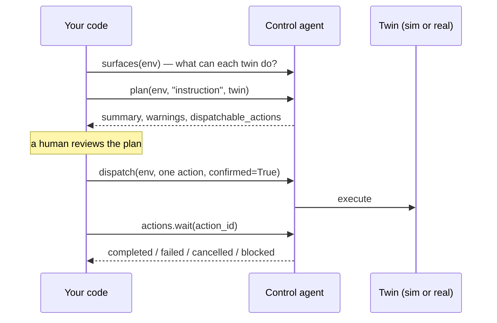

The **control agent** turns a request like *"move the Go2 to waypoint A"* or *"run the pick skill on the SO-101"* into concrete actions. It only proposes actions the twin can actually perform: each twin exposes **control surfaces**, derived from its metadata, that list the controls it supports. Nothing moves until a person approves one action.

**Use it from:**
- **The dashboard:** in **Simulate → Agent**, describe the task and any limit, then select **Plan**. Check the robot, controller and limits before you execute. Cancelling stops only that run.
- **Python:** `cw.agents.control`, shown step by step below.
- **Your own AI tools:** the MCP server exposes the same calls to Claude Code, Cursor and any MCP client (see [below](#from-your-ai-tools-mcp)).

The agent plans in the cloud. The action runs wherever the twin runs: in simulation, or on the real robot through its edge device.




## The four calls

| Step | Call | Returns |
|---|---|---|
| Inspect | `cw.agents.control.surfaces(env_uuid, mode=...)` | One entry per twin with its `controls` |
| Plan | `cw.agents.control.plan(env_uuid, message, twin_uuid=..., mode=...)` | A plan dict. Nothing is executed. |
| Dispatch | `cw.control.dispatch(env_uuid, action, confirmed=True, mode=...)` | The dispatch result, with an `action_id` to track |
| Wait | `cw.actions.wait(action_id, twin_uuid=..., timeout=...)` | The final status dict |

`cw.control` is an alias for `cw.agents.control`. All four calls wrap REST endpoints. Failures raise `CyberwaveAPIError` with a `Failed to ...` prefix.

## Walk through it

<Steps>
  <Step title="Get the environment and twin IDs">
    Every call takes the environment UUID. Get it from a twin you already have:

    ```python
    from cyberwave import Cyberwave

    cw = Cyberwave()
    robot = cw.twins.get("acme/twins/go2-yard")   # your twin's slug or UUID
    env_uuid = str(robot.environment_id)
    twin_uuid = str(robot.uuid)
    ```
  </Step>
  <Step title="See what the twins can do">
    ```python
    for surface in cw.agents.control.surfaces(env_uuid, mode="simulation"):
        available = [c.get("label") or c.get("kind")
                     for c in surface.get("controls", []) if c.get("available")]
        print(surface.get("twin_name"), surface.get("twin_uuid"), available)
    ```
    Surfaces are derived from each twin's metadata. If a twin shows no available controls, the agent has nothing to plan with. Fix the twin's controller setup first. When you omit `mode`, surfaces are evaluated as `live`.
  </Step>
  <Step title="Ask for a plan">
    ```python
    plan = cw.agents.control.plan(
        env_uuid,
        "Move the Go2 to waypoint A",
        twin_uuid=twin_uuid,
        mode="simulation",
    )

    print(plan.get("summary"))
    print("readiness:", plan.get("readiness"))
    print("requires confirmation:", plan.get("requires_confirmation"))
    for warning in plan.get("warnings", []):
        print("warning:", warning)
    for missing in plan.get("missing_requirements", []):
        print("missing:", missing)
    ```
    `plan()` never executes anything. Read `warnings` and `missing_requirements` before you go on. `dispatchable_actions` holds the actions you can send. Each one is a dict with a `kind`, a `target_twin_uuid` and a `payload`.
  </Step>
  <Step title="Have a human approve one action">
    ```python
    actions = plan.get("dispatchable_actions") or []
    if not actions:
        raise SystemExit("Nothing to dispatch. Check missing_requirements.")

    action = actions[0]
    print(action)
    if input("Dispatch this action? [y/N] ").strip().lower() != "y":
        raise SystemExit("Not dispatched.")
    ```
  </Step>
  <Step title="Dispatch it and wait">
    ```python
    result = cw.control.dispatch(env_uuid, action, confirmed=True, mode="simulation")

    if result.get("action_id"):
        final = cw.actions.wait(result["action_id"], twin_uuid=twin_uuid, timeout=60)
        print(final.get("status"), final.get("message"))
    ```
    Dispatch **one** action at a time. Check its result, and the twin's measured state, before you send the next one. `wait()` needs the twin UUID because the status endpoint is scoped to the twin.
  </Step>
</Steps>

## Modes

Pass the same `mode` to `surfaces`, `plan` and `dispatch`. A plan made for simulation is not a plan for hardware: plan again when you switch.

| Mode | Targets | Default for |
|---|---|---|
| `"preview"` | The lightweight kinematic runtime. The SDK maps `playground` to this mode. | `cw.agents.workflow.plan(...)`, `preview(...)` |
| `"simulation"` | The environment's simulation. Pass `simulation_backend=` to pick the backend. | `plan(...)`, `dispatch(...)`, `resolve_route(...)` |
| `"live"` | The real robot, through its paired edge device | `surfaces(...)` when `mode` is omitted |


<Note>
A MuJoCo simulation is a billable cloud instance, about 0.6 credits per hour. Start one with `sim = cw.environments.simulations.start(env_uuid, backend="mujoco", duration=300)` and call `sim.stop()` when you are done. See [credits](/billing/credits).
</Note>

## Safety rules

<Warning>
Planning never authorizes motion. `confirmed` defaults to `False` on `dispatch()`. Set it to `True` only after a person (or a check you trust) has approved that specific action.
</Warning>

- **One bounded action per dispatch.** One pose, one joint target, one navigation goal, or one stop.
- **Simulation first.** Run the same instruction in simulation, check the result, then plan again in `live`.
- **Before a live dispatch**, make sure that: the request really is for physical execution, exactly one physical twin is targeted, the twin's edge device and telemetry are current, and a stop is available.
- **Don't retry blindly.** If `dispatch()` or `wait()` times out or returns an unclear status, don't resend the motion. Read the twin's state, send a stop if it is safe, and ask the operator.
- **Keep a human controller one click away.** See [safety and takeover](/feature-reference/environment-editor/teleoperation).

`cw.actions.wait()` returns when the action reaches `completed`, `failed`, `cancelled` or `blocked`. With the default `raise_on_failure=True`, any status other than `completed` raises `RuntimeError`. If no terminal status arrives within `timeout` seconds, it raises `TimeoutError`. A single failed status poll does not end the wait.

## Choosing the model and the controller

`plan()` accepts optional arguments to steer the agent:

| Argument | Use |
|---|---|
| `llm_model_uuid` / `llm_model_name` | Pick the LLM that writes the plan |
| `mlmodel_uuid` | Pick a model record from your catalog for the agent |
| `controller_policy_uuid` | Plan a run of a specific controller policy, for example a trained VLA or RL policy |
| `simulation_backend` | Choose the simulation backend in `simulation` mode |


## Skip the LLM: resolve a route directly

When you already know which control you want, skip the language step. `options()` lists the environment's control routes and action specs. `resolve_route()` turns one route and its inputs into a plan, without executing it. Dispatch its `dispatchable_actions` exactly as above.

```python
options = cw.control.options(env_uuid)
print(options)   # control routes, action specs and helper options

# route_id and route_inputs come from the options above
plan = cw.control.resolve_route(
    env_uuid, route_id, twin_uuid, route_inputs, mode="simulation"
)
```

If the resolved plan reports missing setup, fill in only the fields it asks for, then resolve again.


## Automate it instead

For standing behavior, such as *"inspect every pallet and alert me if one is damaged"*, use the [workflow assistant](/ai/workflow-assistant). It drafts a workflow that runs on its own instead of a single action.

## From your AI tools (MCP)

The same flow is available to Claude Code, Cursor and any MCP client, with no code:

| SDK | MCP tool |
|---|---|
| `cw.agents.control.surfaces` | `cw_list_control_surfaces` |
| `cw.agents.control.plan` | `cw_plan_control_action` |
| `cw.control.resolve_route` | `cw_resolve_control_route` |
| `cw.control.dispatch` | `cw_dispatch_control_action` |

`cw_plan_control_action` only plans. The assistant must call `cw_dispatch_control_action` with one explicit action. If the environment's control-plane access is set to workflows only, the MCP server refuses direct dispatch with `CONTROL_PLANE_POLICY_DENIED`. The [Claude skill](/overview/tools/claude-skill) applies the safety rules above before any live dispatch. Set it up with the [MCP server](/overview/tools/mcp-server) guide.

**Want your own LLM in the loop instead?** The [natural-language SO-101 agent](/tutorials/so101-natural-language-agent) calls Claude directly with a camera frame, gets a JSON motion plan, and runs it with the SDK.

## Common errors

| Message | Cause | Fix |
|---|---|---|
| `ValueError: environment_uuid is required` | Empty environment ID | Pass `str(twin.environment_id)` |
| `ValueError: message is required` | Blank instruction | Pass a non-empty instruction |
| `ValueError: twin_uuid is required by the action status endpoint` | `actions.wait()` without `twin_uuid` | Pass the twin the action targets |
| `CyberwaveAPIError: Failed to plan control action: ...` | The planning request failed | Read the wrapped message. For auth and workspace errors, see [Troubleshooting](/support/troubleshooting). |
| `CyberwaveAPIError: Failed to dispatch control action: ...` | The backend rejected the action | Plan again. Don't edit and resend an old action. |

## Next steps

<CardGroup cols={2}>
  <Card title="AI agents" icon="comments" href="/ai/agents">
    The environment assistant, the control agent and the workflow assistant.
  </Card>
  <Card title="Ways to control a robot" icon="gamepad" href="/ai/control">
    Where the agent fits next to manual input, skills, workflows and learned policies.
  </Card>
  <Card title="Workflow assistant" icon="diagram-project" href="/ai/workflow-assistant">
    Turn a recurring task into a workflow from one sentence.
  </Card>
  <Card title="MCP server" icon="plug" href="/overview/tools/mcp-server">
    Give Claude Code or Cursor the same planning and dispatch tools.
  </Card>
</CardGroup>
