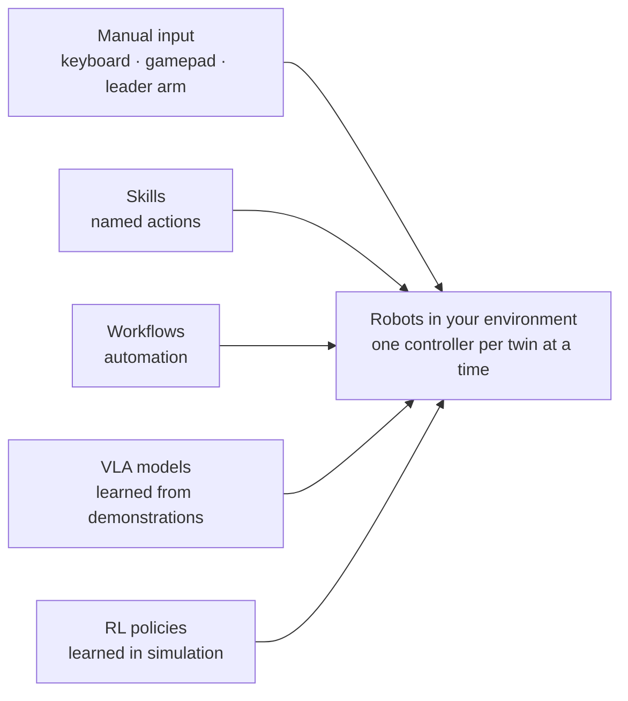

Cyberwave gives you five ways to control the robots in an environment. They are alternatives, not steps: pick the one that fits the task, and switch whenever you like. Each drives the same twins, in simulation or on hardware, and exactly one **controller** drives a given twin at any moment. Switching between them doesn't stop telemetry or recording, so a session can start manual, hand over to a model, and fall back to a person if something goes wrong.

| Way to control | Who decides the next action | Use it for | Start here |
| --- | --- | --- | --- |
| **Manual input** | A person, with keyboard, gamepad or a leader arm | Demos, recovery, recording demonstrations | [Teleoperation](/feature-reference/environment-editor/teleoperation) |
| **Skills** | A named action the robot already knows: a saved pose, a standard command, a trained skill | "Go home", "open gripper", "pick", called by a person, a workflow or an agent | [Standard arm commands](/feature-reference/arm-commands) |
| **Workflows** | Rules you draw: trigger → model → decision → command | Repeatable automation, alerts, inspections | [Workflows](/feature-reference/workflows) |
| **VLA models** | A vision-language-action model, from camera frames and an instruction | Manipulation learned from demonstrations | [Fine-tune SmolVLA](/feature-reference/ml-models/smolvla-training) |
| **RL policies** | A policy trained by reward in simulation | Locomotion and dynamic control | [RL tasks](/feature-reference/rl-tasks) |

## Assign a controller

- **In the dashboard:** select the twin and use **Assign Controller**. A person can take over from the same panel at any time.
- **From Python:** `twin.policy.list()` shows the controllers available to a twin, `twin.policy.assign(policy)` hands it over, and `twin.policy.ensure_attached()` lets your script drive it.
- **From an agent:** the [control agent](/ai/control-agent) plans an action or a skill run, and you approve it before it executes.

How controllers are routed, where each type runs, and how code controllers and RL checkpoints run on a controller host: [Controllers and handover](/feature-reference/online-controllers).

## Where the models come from

Manual sessions, skills and workflows all produce recordings. Recordings become datasets, and datasets train VLA models and RL policies. See [Data for training](/feature-reference/datasets/import).

## Next steps

<CardGroup cols={2}>
  <Card title="Your first AI loop" icon="wand-magic-sparkles" href="/overview/first-ai-loop">
    A camera, a model and an SO-101 twin that picks and sorts.
  </Card>
  <Card title="Train a VLA on the SO-101" icon="brain" href="/tutorials/train-vla-cyberwave">
    Record demonstrations, fine-tune, deploy the model as the controller.
  </Card>
  <Card title="Build a workflow" icon="diagram-project" href="/feature-reference/workflows">
    Triggers, models and robot commands on a canvas.
  </Card>
  <Card title="AI agents" icon="comments" href="/ai/agents">
    Let an assistant plan the action, then approve it.
  </Card>
</CardGroup>
