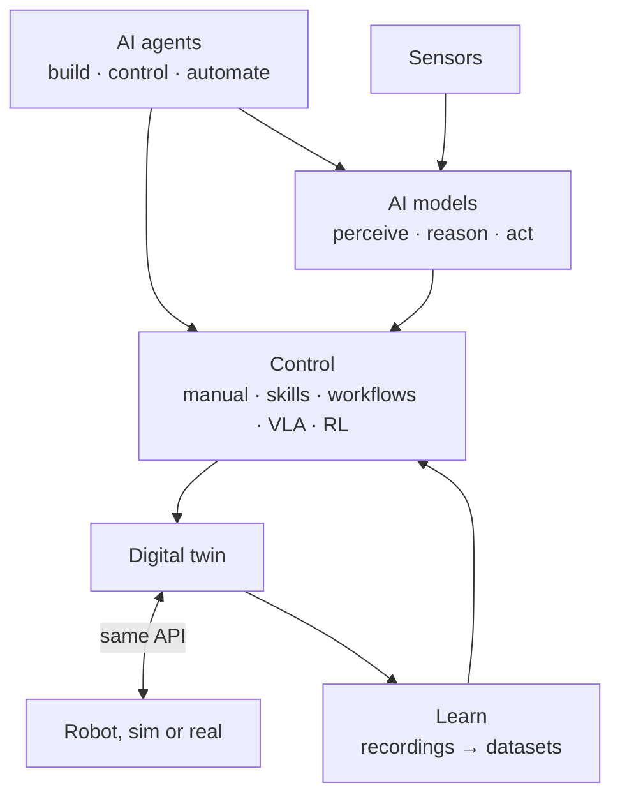

Cyberwave sits between AI models and physical machines. AI agents sit on top: they build the environment, plan the actions and write the workflows. Below them, models perceive through a twin's sensors, a controller turns decisions into motion, and every run becomes data for the next model. The twin is the same object whether the robot is simulated or real, so what you test in simulation runs on hardware without code changes.

## The four parts

<CardGroup cols={2}>
  <Card title="AI agents" icon="comments" href="/ai/agents">
    Assistants that build the environment, control the robot and write workflows from a plain-language request. You approve every plan.
  </Card>
  <Card title="AI models" icon="brain" href="/ai/models">
    Models that perceive (*a cup at x = 212 px*, *"stop"*), reason (plan steps from a goal) or act (VLA and RL policies that drive the robot). Any task, any modality, on the edge or in the cloud.
  </Card>
  <Card title="Control" icon="gamepad" href="/ai/control">
    Choose who drives the robot, from a person with a gamepad to a policy that learned the task: manual input, skills, workflows, VLA models, RL policies.
  </Card>
  <Card title="Learn" icon="database" href="/feature-reference/datasets/import">
    Every run can be recorded. Recordings become datasets, datasets train the next VLA or RL policy, and the policy deploys back to the same twin.
  </Card>
</CardGroup>

## Where to start

| You want to | Start with | Needs |
| --- | --- | --- |
| See a model drive a robot, end to end | [Your first AI loop: see, pick, sort](/overview/first-ai-loop) | Laptop webcam |
| Automate a task without code | [Workflows](/feature-reference/workflows) | Browser |
| Tell a robot what to do in plain language | [Control agent](/ai/control-agent) | Python or browser |
| Teach a manipulation task from demonstrations | [Train a VLA on the SO-101](/tutorials/train-vla-cyberwave) | SO-101 arm |
| Train a policy in simulation | [Train an RL policy](/tutorials/train-rl-policy) | Browser |

## Where it runs

| | Browser (Playground) | Cloud | Edge (Pi, Jetson, x86) |
| --- | --- | --- | --- |
| **Good for** | Trying things, demos, kinematic checks | Heavy models, planning, VLA inference, MuJoCo, training | Low latency, privacy, poor connectivity |
| **Cost** | Free | Credits ([billing](/billing/credits)) | Your hardware |
| **Switch with** | `cw.affect("playground")` | `cw.affect("simulation")`, cloud nodes | `cyberwave pair`, [edge workers](/feature-reference/workflows/workers/overview) |

<Warning>
Models can move real hardware. Keep a person one click away from taking control, approve agent plans before they run, and test in simulation first.
</Warning>

## Next steps

<CardGroup cols={2}>
  <Card title="Ways to control a robot" icon="gamepad" href="/ai/control">
    The five kinds of controller and when to use each.
  </Card>
  <Card title="How hardware works" icon="cubes" href="/robots/overview">
    One twin model for arms, quadrupeds, drones and cameras.
  </Card>
</CardGroup>
