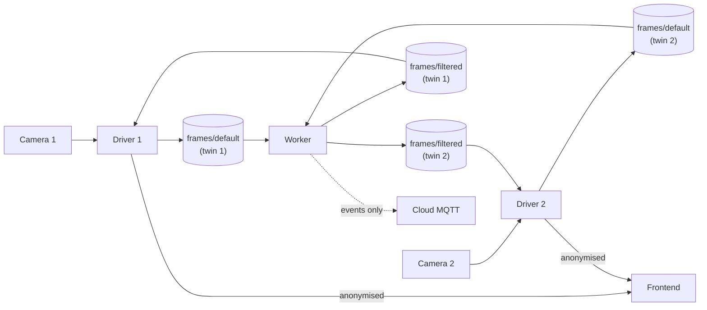

<Warning>
**STUB DOCUMENT:** This page is intentionally minimal and will be expanded with deeper technical details in a future update.
</Warning>

A two-camera privacy-preserving worker. YOLOv8 detects each person, the worker pixelates their bbox, and the driver substitutes the anonymised frame into the WebRTC stream **before** the bytes leave the edge.



## Why pixelate?

Pixelation reads as "a person, doing something" to a human reviewer — unlike stick figures which vanish on occlusion, low light or unusual poses. It also doesn't need a pose model, cutting per-frame CPU cost by roughly 2× on edge devices. See the [Privacy caveat](#privacy-boundary) below — pixelation is visual obscuring, not cryptographic de-identification.

## Pieces

| Layer | Component | Notes |
|---|---|---|
| Model | `yolov8n` (catalog) | Plain detector; no pose head. Auto-downloaded on first `cw.models.load()`. |
| Anonymisation | `cyberwave.vision.anonymize_frame()` | Pixelates each person's bbox. Mode is configurable (`"pixelate"` / `"redact"` / `"blur"` / `"bbox"`). Skeleton overlay disabled. |
| Frame substitution | [Frame substitution](./frame-filters) | Driver consults `FILTERED_FRAME_CHANNEL` (`frames/filtered`) before WebRTC encoding when `CYBERWAVE_METADATA_FRAME_FILTER_ENABLED=true` on the twin. |
| Routing | `twin_uuid=ctx.twin_uuid` on `cw.data.publish()` | Same worker, two independent streams. See [Multi-Camera Detection Routing](./multi-camera-detection-routing). |

## Worker

```python
import os
import numpy as np
from cyberwave.data import FILTERED_FRAME_CHANNEL
from cyberwave.vision import anonymize_frame

CAMERA_1 = os.environ["CAMERA_1_TWIN"]
CAMERA_2 = os.environ["CAMERA_2_TWIN"]

model = cw.models.load("yolov8n")

def _anonymise(frame, ctx):
    result = model.predict(frame, classes=["person"], confidence=0.4)
    # Privacy fail-closed: ``anonymize_frame`` only obscures bbox
    # regions for matching detections. On a frame where the model
    # missed everyone (sub-threshold, occluded, partial body) it
    # would otherwise return the raw frame unchanged and the driver
    # would substitute that into WebRTC. Publish a black frame
    # instead — matches the driver's fail-closed behaviour for
    # stale and shape-mismatched filtered frames.
    if any(d.label == "person" for d in result.detections):
        out = anonymize_frame(
            frame,
            result.detections,
            mode="pixelate",
            draw_skeleton=False,
        )
    else:
        out = np.zeros_like(frame)
    cw.data.publish(FILTERED_FRAME_CHANNEL, out, twin_uuid=ctx.twin_uuid)
    for det in result.detections:
        if det.area_ratio > 0.3:
            cw.publish_event(ctx.twin_uuid, "person_too_close", {
                "area_ratio": round(det.area_ratio, 3),
                "frame_ts": ctx.timestamp,
            })

@cw.on_frame(CAMERA_1, sensor="default")
def on_camera_1_frame(frame, ctx): _anonymise(frame, ctx)

@cw.on_frame(CAMERA_2, sensor="default")
def on_camera_2_frame(frame, ctx): _anonymise(frame, ctx)
```

<Note>
The same gate is applied automatically to workers generated from an
[`anonymize`](../../use-cyberwave/workflows/anonymize-image) workflow
node, so workflows authored in the visual editor get the same
privacy fail-closed behaviour without any code changes.
</Note>

## Driver configuration

Enable the frame filter per camera twin (each generic-camera driver container):

```bash
CYBERWAVE_METADATA_FRAME_FILTER_ENABLED=true
# Optional: widen the freshness window for CPU-only workers
# (default 200 ms is tuned for >= 5 Hz GPU workers).
CYBERWAVE_METADATA_FRAME_FILTER_FRESHNESS_MS=400
```

The channel name (`frames/filtered`) and fail-closed blank fallback are hard-coded in the driver. Freshness is tunable per driver via `CYBERWAVE_METADATA_FRAME_FILTER_FRESHNESS_MS` — raise it (e.g. `400`–`500`) for CPU-bound workers, at the cost of keeping visibly-stale anonymised frames on screen longer. `0` is a valid "force blank" fail-close test mode. To see the raw camera feed for debugging, set `CYBERWAVE_METADATA_FRAME_FILTER_ENABLED=false` and restart the driver.

<Warning>
When `CYBERWAVE_DETECTION_OVERLAYS` is left at its default (`true`), bounding boxes and labels are drawn **on top** of the anonymised frame and reveal each person's position — which defeats the anonymisation contract for location-sensitive deployments. Set `CYBERWAVE_DETECTION_OVERLAYS=false` alongside the filter flag if that matters.
</Warning>

## Privacy boundary

The Zenoh→MQTT bridge does **not** forward `frames/*` channels by default. Only events (`person_too_close`, ...) and detections cross the WAN. The raw and anonymised frames stay on-device.

<Warning>
Pixelation is reversible by public depixelation models. It is *deliberate visual obscuring*, not GDPR-grade de-identification. For legal de-identification, combine pixelate with `"redact"` masking or drop frames entirely and publish only events.
</Warning>

## Per-zone alerting with Spatial Filter + Timed Condition

For deployments where the pixelation is just the privacy scaffold and
the *actual* alert is "person loitering inside a restricted polygon",
combine this driver setup with a workflow that wires
[`spatial_filter`](/use-cyberwave/workflows/spatial-filter) and
[`timed_condition`](/use-cyberwave/workflows/timed-condition) downstream of
`call_model` + `anonymize`. The polygon also renders as a read-only
overlay on the twin's WebRTC stream so operators can see which zones
are armed without opening every workflow.

See the
[Zone-based intrusion detection tutorial](/tutorials/intrusion-detection)
for the full end-to-end recipe.

## Reference implementation

* Worker: [`cyberwave-sdks/cyberwave-python/examples/security_pipeline/`](https://github.com/cyberwave-os/cyberwave-python/tree/main/examples/security_pipeline)
* End-to-end test: `cyberwave-edge-nodes/test_security_pipeline.sh`
