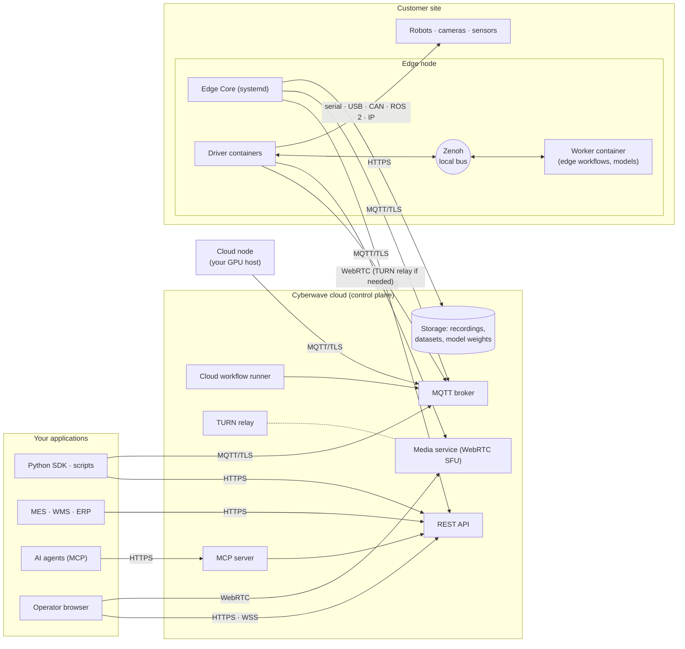

This section is for solutions architects at system integrators and for the customer's IT and security teams. It covers what runs where, which connections each component opens, and what exists today. Where something is not available or not documented yet, the page says so.

## Architecture

Cyberwave has three parts. The **cloud control plane** is operated by Cyberwave. **Edge nodes** are Linux hosts that you run next to the robots. **Your applications** can run anywhere. The edge opens every connection outbound, so the site network generally needs no inbound firewall rules.

## What runs where

| Component | Runs on | Operated by | What it does |
|---|---|---|---|
| Web app, REST API, MQTT broker, cloud workflow runner | Cyberwave cloud | Cyberwave | Twins, environments, workflows, alerts, users, tokens. The broker carries commands, telemetry and WebRTC signaling. |
| Media service (SFU) and TURN relay | Cyberwave cloud | Cyberwave | Receives live video from edges and fans it out to browsers and SDK consumers. |
| Hosted MCP server | Cyberwave cloud (`mcp.cyberwave.com`) | Cyberwave | Exposes platform operations as tools for AI agents. It can also be self-hosted. |
| **Edge Core** | Your Linux host at the site. macOS is also supported (launch agent). | You | A systemd service (`cyberwave-edge-core`). It registers the device, starts driver and worker containers, downloads model weights, and runs the watchdogs. |
| **Drivers** | Docker containers on the edge node | You (images from Cyberwave or your own) | Translate the device's native interface into Cyberwave MQTT topics. Edge Core starts a driver for each linked twin. Multi-container drivers are supported. |
| **Worker container** | Docker container on the edge node | You | Runs edge workflows and AI models next to the camera. |
| **Cloud nodes** | Any machine you run, usually with a GPU | You | Take inference, training and simulation workloads from the platform over outbound MQTT. See [Cloud node](/overview/tools/cloud-node). |
| Your applications | Anywhere | You | SDK, REST or MQTT clients, MCP agents, and business systems. |

### Where workflow triggers run

Workflows mix cloud and edge nodes in one graph ([node reference](/overview/features/workflow-nodes)). The trigger decides where a run starts:

| Trigger | Runs on |
|---|---|
| `webhook`, `schedule`, `event`, `email`, `mission` | Cloud |
| `mqtt` | Cloud. On the edge when the workflow is edge-targeted ([details](/feature-reference/workflows/mqtt-trigger)). |
| `manual` | Cloud. On the edge when the workflow is marked to run on the edge. |
| `camera_frame`, `audio_track`, `zenoh` | Edge only. Raw frames and audio are processed locally and never sent to the cloud. |
| `alert` | Edge, according to the node reference. |

{/* TODO(docs): the node reference lists the `alert` trigger as Edge, while /feature-reference/workflows lists alert triggers among cloud-dispatched triggers. Confirm and state both paths if both exist. */}

## Data flows

| Flow | Path | Transport | Leaves the site? |
|---|---|---|---|
| **Control** (joint targets, navigation goals, controller commands) | App, workflow or controller → MQTT broker → driver | MQTT over TLS. Some REST calls are relayed to the edge by the backend over MQTT. | Yes. Commands to a twin pass through the cloud broker. |
| **Telemetry** (joint states, position, events, edge health) | Driver → broker → backend and browsers | MQTT over TLS. Edge health heartbeat about every 5 s. Host facts over REST about every 30 s. | Yes |
| **Live video** | Driver → media service (SFU) → browser or SDK consumer | WebRTC. Signaling over MQTT. TURN relay over TLS on 443 by default. | Yes, while someone is viewing |
| **Edge inference** | Camera → worker on the same node, over the local Zenoh bus | Local only | Only detections, events and alerts leave |
| **Recordings** | Edge buffers locally, then uploads to Cyberwave storage. Playback uses signed URLs. | HTTPS | Yes |
| **Model weights** | Cyberwave storage (signed URL) → upstream URL from the catalog entry → runtime-managed download, tried in that order. The result is cached in `~/.cyberwave/models/`. | HTTPS | Inbound only. Pre-staging from USB is supported ([model cache](/feature-reference/workflows/workers/model-cache)). |
| **Container images** | Docker Hub (`cyberwaveos/*`) → edge node | HTTPS | Inbound only |

<Warning>
Recording is on by default for every twin, according to [Replay and historical data](/overview/features/replay-and-historical-data). This includes camera video. Check this against the customer's data-handling requirements before you connect cameras.
</Warning>

{/* TODO(docs): /feature-reference/architecture/architecture says video takes "the most direct path" peer-to-peer between edge and browser. The SDK and /overview/tools/custom-webrtc-consumer describe an SFU. Align the architecture page. */}
{/* TODO(docs): document what happens to commands, telemetry, running controllers and edge workflows when the WAN link drops (offline behaviour). */}
{/* TODO(docs): hosting region(s), storage provider/region for recordings and weights, retention and deletion policy. */}
{/* TODO(docs): measured latency budgets per path (teleop, MQTT command round trip, edge inference). */}

## Deployment options

| Option | Status today | Notes |
|---|---|---|
| **SaaS** (multi-tenant, `cyberwave.com`) | Available | Everything else in these docs assumes SaaS. |
| **Self-hosted** | A package exists. Contact Cyberwave. | See below. |
| **Dedicated / single-tenant managed cloud** | Not documented | Ask Cyberwave. |
| **Air-gapped** | Not available as a packaged option | Some parts work offline, such as pre-staged model weights and snapshot import. Container images still come from Docker Hub, and no offline image bundle is documented. |

{/* TODO(docs): confirm self-hosted commercial availability and which plan includes it; confirm whether a dedicated/single-tenant managed option is offered. */}

### Self-hosted: what exists

Cyberwave has a self-hosted package, referred to as Cyberwave Enterprise. It is a Docker Compose stack for a single Ubuntu Server 24.04 host with Docker 24+. Today it works like this:

- **Images.** Pulled from a private Docker Hub repository, with a read-only pull token issued by Cyberwave.
- **Catalog.** Either synced from the production catalog, which needs internet access and a separate token from Cyberwave, or imported from a snapshot bundle that Cyberwave provides.
- **Updates.** Pull newer images and restart the stack. An export command snapshots the database and media first.
- **Pointing clients at it.** SDK, CLI, Edge Core and cloud nodes read `CYBERWAVE_BASE_URL` and `CYBERWAVE_MQTT_HOST`, so they can target the self-hosted server instead of `api.cyberwave.com` and `mqtt.cyberwave.com`.

<Warning>
The self-hosted package is not production-hardened as documented. The reference setup serves the UI, API and MQTT without TLS. It does not document admin bootstrap or how to restrict sign-up. It has no HA, sizing, backup/restore or rollback procedure beyond the snapshot export. Plan TLS termination and access control with Cyberwave before you expose it on a customer network. Contact [info@cyberwave.com](mailto:info@cyberwave.com).
</Warning>

{/* TODO(docs): publish a TLS-first self-hosted install page (reverse proxy, DNS plan, admin bootstrap, sign-up lockdown, SMTP, backup/restore, upgrade/rollback, sizing per N robots/cameras). */}

### Not available or not documented yet

Customers' IT teams often ask about the items below. Each one was checked against the docs and the public repositories. Don't promise anything here without written confirmation from Cyberwave.

| Topic | Status |
|---|---|
| SSO (SAML, OIDC) | Not documented. Authentication is by account login and [API tokens](/feature-reference/api-tokens). |
| Compliance certifications (SOC 2, ISO 27001, others) | Not documented |
| Data residency and hosting region | Not documented |
| SLA and support tiers | Not documented. A public status page exists at [status.cyberwave.com](https://status.cyberwave.com). |
| Built-in OPC UA, Modbus or VDA5050 drivers | Not available. See [PLC, MES and WMS](/enterprise/integration-surfaces#plc-mes-and-wms). |
| HTTP(S) proxy support for edge nodes | Not documented. See [Network and firewall](/enterprise/network-and-firewall). |
| Audit log | Not documented. Revoked tokens stay listed for audit ([API tokens](/feature-reference/api-tokens)). |

{/* TODO(docs): link a Security & compliance page and a Data handling page once they exist. */}

## Evaluation checklist

Work through this list with the customer's IT and OT teams before you commit to a design.

<Steps>
  <Step title="Map the network">
    Get the egress allowlist approved for each component: edge, operator browser, cloud node, and developer machines. Check that TCP 8883 and TLS on 443 are allowed from the cell network. [Network and firewall requirements](/enterprise/network-and-firewall)
  </Step>
  <Step title="Decide the tenancy model">
    Choose one workspace per customer or per site, and decide who owns the service tokens. [API tokens](/feature-reference/api-tokens) · [Access control](/feature-reference/access-control) · [Slugs](/feature-reference/concepts/slug-system)
  </Step>
  <Step title="Confirm hardware support">
    For each robot model, confirm whether an official driver exists or you will write one. [Custom hardware](/overview/connecting-hardware/custom-hardware) · [Writing compatible drivers](/feature-reference/edge/drivers/writing-compatible-drivers)
  </Step>
  <Step title="Plan provisioning and updates">
    Run a scripted install on one golden device. Pin the Edge Core version and decide how updates roll out. [Fleet provisioning](/enterprise/fleet-provisioning)
  </Step>
  <Step title="Plan integration with business systems">
    Pick the surface for each system: REST, MQTT, workflow webhooks, MCP, or a custom driver. [Integration surfaces](/enterprise/integration-surfaces)
  </Step>
  <Step title="Agree monitoring and escalation">
    Decide who watches alerts and edge status, and how alerts reach the on-call team. [Alerts](/feature-reference/edge/drivers/alerts)
  </Step>
  <Step title="Close the gaps in writing">
    Get written answers from Cyberwave for every item in "Not available or not documented yet" that the customer requires.
  </Step>
</Steps>

## Next steps

<CardGroup cols={2}>
  <Card title="Network and firewall" icon="network-wired" href="/enterprise/network-and-firewall">
    Every host, port and protocol, per component.
  </Card>
  <Card title="Fleet provisioning" icon="server" href="/enterprise/fleet-provisioning">
    Install edge nodes headlessly, then name, monitor and update them.
  </Card>
  <Card title="Integration surfaces" icon="plug" href="/enterprise/integration-surfaces">
    REST, MQTT, webhooks, MCP, ROS 2 and more, with auth for each.
  </Card>
  <Card title="Architecture" icon="sitemap" href="/feature-reference/architecture/architecture">
    The general platform architecture and its local data bus.
  </Card>
</CardGroup>
