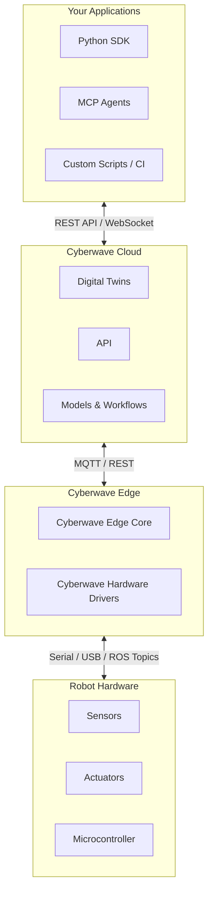

## Overview

Cyberwave is a **platform infrastructure for physical AI**. 

It connects robots, sensors, and actuators to their digital twins and provides a **unified API and SDK** to standardise integration across different hardware. It enables a digital-first workflow for building, testing, and deploying physical AI systems, streamlining delivery from cloud to edge and cutting the path from prototype to production.

## System Architecture

| Layer | Description |
|-------|-------------|
| **Your Applications** | Your Python scripts, SDK integrations, MCP agents, and custom automation code. **Runs anywhere**: local laptop, cloud server, or even on the edge device itself. Communicates with Cyberwave Cloud via the REST API and Python SDK. |
| **Cyberwave Cloud** | Digital twins, API, workflow orchestration, model training and deployment, observability dashboard |
| **Cyberwave Edge** | The Cyberwave runtime stack installed on your edge compute (Raspberry Pi, Jetson, any Linux machine). Contains the Edge Core and hardware-specific drivers that bridge Cyberwave to the physical robot. |
| **Robot Hardware** | Sensors, actuators, motor controllers, microcontrollers, and power systems |

## System Components

### Your Applications

This is where **your code** lives. Whether it's a Python script on your laptop, an MCP-powered AI agent in your IDE, a backend service in the cloud, or automation in a CI pipeline, your application connects to Cyberwave Cloud via the REST API and Python SDK.

<AccordionGroup>
  <Accordion title="Python SDK" icon="code">
    The primary programmatic interface. Create twins, control joints, capture frames, trigger workflows, and manage infrastructure. Runs on any machine with Python 3.10+: your laptop, a cloud VM, a Jupyter notebook, or even the edge device itself.
  </Accordion>

  <Accordion title="MCP Agents" icon="plug">
    AI agents (Claude, GPT, Gemini, Cursor) that discover and call Cyberwave tools autonomously through the Model Context Protocol. They connect to the hosted MCP server or a self-hosted instance.
  </Accordion>

  <Accordion title="Custom Scripts and Integrations" icon="terminal">
    Direct REST API calls, webhook handlers, CI/CD pipelines, or any custom code that interacts with the Cyberwave API. No SDK required; any language that can make HTTP requests works.
  </Accordion>
</AccordionGroup>

<Info>
Your application code is **location-independent**. It does not need to run on the same device as the edge runtime or the robot. The SDK communicates with Cyberwave Cloud over HTTPS, so it works from anywhere with internet access.
</Info>

### Cyberwave Cloud

The cloud layer is the central control plane of the Cyberwave platform. It provides the backend services and compute infrastructure required to manage robots, digital twins, simulations, and AI models at scale. Your applications and the edge runtime both connect to the cloud.

<AccordionGroup>
  <Accordion title="Control Plane" icon="server">
    The core cloud service layer, handling identity and access management, policy enforcement, orchestration, digital twin registry, and developer interfaces for visualization, workflow management, and administrative control.
  </Accordion>

  <Accordion title="Simulation Services" icon="flask">
    Cloud-scale simulation infrastructure including physics-based simulation and log replay. These services support reproducible testing and sim-to-real continuity.
  </Accordion>

  <Accordion title="Learning Services" icon="brain">
    Model lifecycle pipelines covering training, evaluation, validation, governance, and publishing of deployable learning artifacts. Models trained here can be deployed directly to edge nodes.
  </Accordion>
</AccordionGroup>

### Cyberwave Edge

An **edge node** is a physical compute unit deployed at the **periphery of the Cyberwave platform** (e.g., industrial PC, embedded computer, Raspberry Pi, or similar hardware), typically co-located with one or more robots or connected devices. Edge nodes operate under strict latency, bandwidth, reliability, safety, and security constraints and are designed to function even under degraded or intermittent connectivity.

For clarity: **edge node** refers to the physical host, and **edge runtime** refers to the software system executing on it.

The edge runtime is a hybrid system:

- **Edge Core**: a central host-level service running on the node OS. It handles identity, authentication, device registration, and coordination with the cloud backend.
- **Runtime Services**: a set of isolated Docker containers running modular, replaceable, and vendor-isolated services (e.g., hardware drivers, inference engines, data pipelines).

This separation ensures a stable, trusted control plane while enabling flexible, swappable runtime services.

### Robot Hardware

The physical layer consists of the robot's hardware components:

- **Sensors**: cameras, LiDAR, IMUs, encoders, and other perception devices that stream data to the edge runtime.
- **Actuators**: motors, servos, grippers, and other effectors that receive commands from the edge runtime.
- **Microcontroller**: the low-level controller (e.g., Arduino, STM32) that interfaces directly with sensors and actuators over serial, I2C, SPI, or CAN bus.

## Communication Protocols

### Applications ↔ Cyberwave Cloud: REST API / WebSocket

Your application code communicates with the Cyberwave cloud over **HTTPS REST APIs** for all CRUD operations (twins, environments, workflows, assets, alerts) and **WebSocket** connections for real-time features (video streaming, live state updates). The Python SDK and MCP server both use these protocols under the hood.

### Cyberwave Cloud ↔ Edge: MQTT / REST

The edge runtime maintains a persistent connection to the Cyberwave cloud via **MQTT** for real-time bidirectional messaging (telemetry, commands, state sync) and **REST APIs** for request-response operations (registration, pairing, config). This hybrid approach ensures low-latency streaming alongside reliable transactional operations.

### Edge ↔ Robot Hardware: Serial / USB / ROS Topics

The edge runtime communicates with the physical robot over local interfaces: **Serial** (UART), **USB**, or **ROS Topics**, depending on the robot's hardware architecture. The **Cyberwave hardware driver** abstracts these transport differences, exposing a unified interface to the rest of the edge stack.

---

## Next Steps

<CardGroup cols={2}>
  <Card
    title="Key Concepts"
    icon="lightbulb"
    href="/get-started/key-concepts"
  >
    Learn the core platform concepts
  </Card>
  
  <Card
    title="Data Model"
    icon="sitemap"
    href="/get-started/core-data-hierarchy"
  >
    Understand the organisational hierarchy
  </Card>
</CardGroup>
