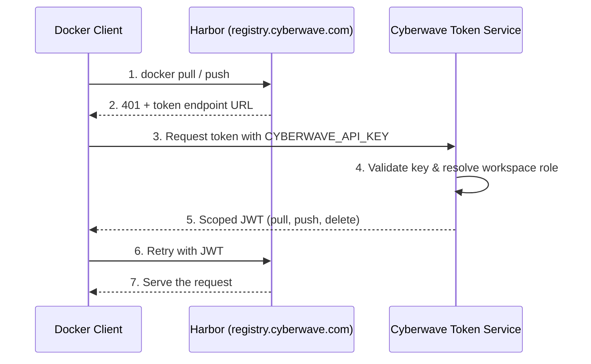

## Overview

<Note>
The Docker Registry is available on **Cyberwave Enterprise** plans. Contact us at [info@cyberwave.com](mailto:info@cyberwave.com) to enable it for your organization.
</Note>

Cyberwave hosts a private Docker registry at `registry.cyberwave.com`. You use it to store and distribute the container images that run on your robots and cloud nodes — drivers, ML models, custom ROS packages, and anything else your edge devices need.

Authentication uses the same `CYBERWAVE_API_KEY` you already use for the REST API and MQTT. Your workspace role determines what you can do:

| Workspace role | Registry access |
|----------------|-----------------|
| READER | Pull images |
| WRITER | Pull and push images |
| ADMIN | Pull, push, and delete images |
| OWNER | Full access |

<Info>
There are no separate registry passwords. The same API key and workspace membership that govern REST and MQTT access also govern registry access.
</Info>

---

## Setup

<Steps>
  <Step title="Install the Cyberwave CLI">
    If you haven't already, install the CLI. It includes the Docker credential helper.

    ```bash
    pip install cyberwave-cli
    ```
  </Step>

  <Step title="Set your API key">
    Use the same environment variable the SDK and CLI already read:

    ```bash
    export CYBERWAVE_API_KEY="cw_your_token_here"
    ```
  </Step>

  <Step title="Configure Docker (automatic)">
    The CLI configures Docker to use the Cyberwave credential helper for `registry.cyberwave.com`:

    ```bash
    cyberwave auth configure-docker
    ```

    This adds the following to `~/.docker/config.json`:

    ```json
    {
      "credHelpers": {
        "registry.cyberwave.com": "cyberwave"
      }
    }
    ```

    After this, `docker pull` and `docker push` authenticate transparently whenever the image name starts with `registry.cyberwave.com`.
  </Step>
</Steps>

<Accordion title="Alternative: manual docker login">
  If you prefer not to install the credential helper, you can log in explicitly:

  ```bash
  echo "$CYBERWAVE_API_KEY" | docker login registry.cyberwave.com \
    -u you@example.com --password-stdin
  ```

  `docker login <server>` targets that specific registry, not Docker Hub. Credentials are cached locally until they expire or you run `docker logout registry.cyberwave.com`.
</Accordion>

---

## Pulling images

### Public images

Public images (e.g. Cyberwave-maintained drivers) require no authentication:

```bash
docker pull registry.cyberwave.com/public-drivers/ugv-driver:v1.2.3
```

For production, pin by digest instead of tag:

```bash
docker pull registry.cyberwave.com/public-drivers/ugv-driver@sha256:<digest>
```

### Private images

Private images require authentication. Your workspace role must grant at least READER access:

```bash
docker pull registry.cyberwave.com/my-workspace/navigation-driver:v2.0.0
```

If you have access, the pull succeeds. If not, it fails with `403` — the same behavior as trying to access a REST endpoint or MQTT topic without the right role.

---

## Pushing images

To push, your workspace role must grant at least WRITER access.

<Steps>
  <Step title="Build your image">
    Tag it with the full registry path. The path includes your workspace or project namespace:

    ```bash
    docker build -t registry.cyberwave.com/my-workspace/my-driver:v0.1.0 .
    ```
  </Step>

  <Step title="Push">
    ```bash
    docker push registry.cyberwave.com/my-workspace/my-driver:v0.1.0
    ```

    If the credential helper is configured, no separate login step is needed. The Cyberwave Token Service validates your API key, checks your workspace role, and authorizes the push.
  </Step>
</Steps>

<Warning>
Version tags (e.g. `v1.2.3`) are immutable — once pushed, they cannot be overwritten. Use mutable tags like `dev` or `latest` during development.
</Warning>

---

## Using registry images on edge devices

Reference registry images in your `cyberwave.yml` driver configuration:

```yaml
driver:
  docker_image: registry.cyberwave.com/public-drivers/ugv-driver:v1.2.3
```

Edge Core pulls the image automatically when the twin connects. If the image is private, the edge device authenticates using the API key configured during device setup.

---

## Tagging conventions

| Tag pattern | Meaning | Mutable? |
|-------------|---------|----------|
| `v1.2.3` | Release version | No (immutable) |
| `latest` | Most recent release | Yes |
| `dev` | Development build | Yes |
| `<branch>-<sha>` | CI build | Yes |

---

## CI/CD integration

In GitHub Actions or other CI systems, authenticate using a Cyberwave service API key:

```yaml
- name: Login to Cyberwave registry
  run: |
    echo "${{ secrets.CYBERWAVE_CI_API_KEY }}" | docker login registry.cyberwave.com \
      -u ci@cyberwave.com --password-stdin

- name: Build and push
  run: |
    docker build -t registry.cyberwave.com/my-workspace/my-driver:${{ github.sha }} .
    docker push registry.cyberwave.com/my-workspace/my-driver:${{ github.sha }}
```

The CI API key is a normal Cyberwave API key whose workspace membership grants WRITER access to the target project.

---

## Architecture

The registry uses [Harbor](https://goharbor.io/) with a Cyberwave-managed token service. When Docker needs to authenticate, the flow is:



The token service is a standard Docker Registry v2 token endpoint backed by the Cyberwave auth and ACL system. Harbor handles image storage, vulnerability scanning, replication, and retention policies.
