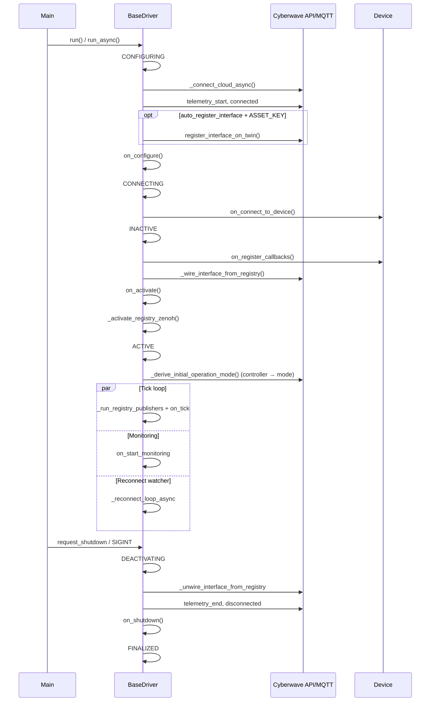

<Warning>
**STUB DOCUMENT:** Expanded technical reference aligned with `cyberwave-python`; a human editor may tighten prose before publish.
</Warning>

## What `BaseDriver` is

`BaseDriver` (`cyberwave.driver`) is the **template-method lifecycle shell** for Python edge drivers. You declare the platform contract once in **`define_interface()`**; the SDK compiles it to `metadata["mqtt"]` (and optional `metadata["zenoh"]`), wires MQTT at runtime, and runs a fixed async lifecycle.

| Concern | Who owns it |
| ------- | ----------- |
| Cyberwave API + MQTT connect, twin binding | **SDK** (`_connect_cloud_async`) |
| Session markers (`telemetry_start`, `connected`, …) | **SDK** |
| Interface registry → subscribe/publish | **SDK** (`_wire_interface_from_registry`) |
| Default management commands (`stop`, teleop modes, …) | **SDK** (`define_interface_defaults`) |
| Debounced `driver_info` on `twin/telemetry` | **SDK** (`BaseTelemetry`) |
| Lifecycle + active alerts (local + twin UI) | **SDK** (`_transition_to`, `AlertManager`) |
| Device I/O (serial, camera SDK, custom protocol) | **You** (`on_connect_to_device`, callbacks, …) |

<Warning>
Do **not** override `run_async()`. Override hooks and `define_interface()` instead.
</Warning>

For ROS 2 robots, use **[BaseROS2Driver](/feature-reference/edge/drivers/ros2-base-driver)** instead — it subclasses `BaseDriver` and adds rclpy lifecycle + `from_ros` forwarding.

---

## Construction

### Recommended (notebook, tests, explicit twin)

```python
from cyberwave import Cyberwave
from my_driver import MyDriver

cw = Cyberwave(api_key="...")
twin = cw.twin("acme-corp/my-arm", twin_id="...")

twin.driver.set_schema(MyDriver.get_manifest())  # before run — aligns twin.commands
MyDriver(twin).run()  # blocking; asyncio.run(run_async())
```

### Edge Core / Docker (env-driven)

Edge Core injects `CYBERWAVE_TWIN_UUID`, `CYBERWAVE_API_KEY`, MQTT settings, etc. The driver typically uses:

```python
class MyDriver(BaseDriver):
  @classmethod
  def create(cls) -> BaseDriver:
      return cls.from_env()  # or parse argv → Params

if __name__ == "__main__":
    MyDriver.create_and_run_async()  # asyncio entrypoint
```

`from_env()` calls `Params.from_env()` when your subclass defines `Params`; otherwise `cls(None)` and twin UUID comes from **`CYBERWAVE_TWIN_UUID`** during cloud connect.

### Constructor kwargs

| Argument | Effect |
| -------- | ------ |
| `params` | Opaque config object (your `Params` dataclass, CLI args, …) |
| `twin=` | Pre-bound twin — skips fetch; uses `twin.client` for MQTT |
| `client=` | Pre-bound `Cyberwave` client (rare; usually via `twin`) |
| `auto_register_interface=False` | Skips `register_interface_on_twin()` after connect (you called `set_schema` already) |

On `__init__`, the SDK always:

1. Creates `DriverInterfaceRegistry`, `AlertManager`, `BaseTelemetry`
2. Calls **`define_interface_defaults(iface)`** (built-in commands + telemetry publisher)
3. Calls **`define_interface(iface)`** (your declarations)

---

## Required vs optional (checklist)

### You must implement (abstract)

| Method | Cyberwave state when called | Purpose |
| ------ | --------------------------- | ------- |
| `on_configure()` | `CONFIGURING` (after MQTT + twin ready) | Load config, open files, build objects that do **not** need live hardware |
| `on_connect_to_device()` | `CONNECTING` | Open transport: serial, WebRTC, vendor SDK, ROS bridge client, … |
| `on_register_callbacks()` | `INACTIVE` (device already connected) | **Device-native** subscriptions only — camera frame callback, serial read loop, **not** MQTT registry |
| `on_activate()` | `INACTIVE` (after `_wire_interface_from_registry`) | Start streams/controllers; driver becomes operational before ACTIVE tick loop |
| `on_shutdown()` | `finally` of `run_async` (always) | Idempotent cleanup — close handles, stop threads |
| `create()` | N/A (classmethod) | Only if entrypoint is `create_and_run_async()` — parse env/CLI and return `cls(...)` |

Pure forward-only ROS drivers often leave the four async `on_*` hooks as no-ops on **`BaseROS2Driver`** (see ROS page); on plain **`BaseDriver`** they are still abstract and must exist (can `pass`).

### You usually implement

| Piece | Required? | Notes |
| ----- | --------- | ----- |
| `define_interface(iface)` | Yes for custom topics/commands | Empty body OK if defaults suffice (unusual) |
| Command callbacks | Per `add_listener` | Sync or async; registry dispatches on driver asyncio loop |
| Publisher callbacks | Per tick-based `add_publisher` | Return `dict` each tick at `PublisherArgs.rate_hz` |
| `ASSET_KEY` | Strongly recommended | Catalog key + manifest `asset_key`; enables auto `register_interface_on_twin` |

### Optional overrides (defaults are fine)

| Method / attribute | Default behavior |
| ---------------- | ---------------- |
| `on_tick()` | No-op; runs at `TICK_RATE_HZ` after registry publishers |
| `on_start_monitoring()` | Waits until shutdown (no extra task) |
| `on_reconnect()` | Returns `False` → no transport reconnect |
| `driver_info_extra()` | Extra fields merged into telemetry snapshots |
| Cloud connect | `Cyberwave(source_type="edge")` — uses `CyberwaveConfig` / `CYBERWAVE_*` env (same as CLI) |
| `TICK_RATE_HZ` | `10.0` Hz |
| `TELEMETRY_PUBLISH_RATE_HZ` | `2.0` Hz for built-in `twin/telemetry` publisher |
| `auto_register_interface` | `True` |
| `driver_family` | `"python"` |

---

## Full lifecycle (`run_async`)



### Step-by-step (what happens without your code)

1. **`CONFIGURING`** — Log `[STATE] unconfigured → configuring`. Raise lifecycle alert + twin notice *"Driver starting"*.
2. **`_connect_cloud_async()`** — `Cyberwave(source_type="edge")` (SDK defaults + `CYBERWAVE_*` env). Connect MQTT. Resolve twin: reuse `twin=` or fetch by `robot_uuid` / asset.
3. **`_start_driver_telemetry_session()`** — Publish `telemetry_start` + `connected` on MQTT; start debounced `driver_info` via `BaseTelemetry`.
4. **`register_interface_on_twin()`** — If `auto_register_interface` and class `ASSET_KEY` are set: `twin.driver.set_schema(self.manifest)` (failures are logged, driver continues).
5. **`on_configure()`** — Your hook.
6. **`CONNECTING`** — Twin notice *"Driver connecting to device"*. **`on_connect_to_device()`**.
7. **`INACTIVE`** — Notice *"Driver wiring interfaces"*. **`on_register_callbacks()`** then **`_wire_interface_from_registry()`**:
   - Subscribes MQTT listeners for `add_listener` entries (respecting `operation_modes`)
   - Schedules tick publishers for `add_publisher` entries with `PublisherArgs.rate_hz`
   - Does **not** subscribe ROS topics (use `BaseROS2Driver` + `from_ros`)
8. **`on_activate()`** then **`_activate_registry_zenoh()`** — Opens edge `DataBus` for dual/Zenoh specs.
9. **`ACTIVE`** — Notice *"Driver active"* + `DRIVER_ACTIVE` alert. Then **`_derive_initial_operation_mode()`** sets the starting mode from the twin's attached controller (see [Operation modes](#operation-modes-driveroperationmode)), and `asyncio.gather(_tick_loop_async, on_start_monitoring, _reconnect_loop_async)`.
10. **Shutdown** — `request_shutdown()` sets `_shutdown` event. Unwire MQTT, end telemetry session, `on_shutdown()`, flush `AlertManager`, **`FINALIZED`**.

On unhandled exceptions: state **`ERROR`**, then same `finally` teardown.

---

## Lifecycle states (`DriverLifecycleState`)

| State | Meaning | Twin notice (when twin bound) |
| ----- | ------- | ------------------------------ |
| `unconfigured` | Before `run()` | — |
| `configuring` | Cloud connect + `on_configure` | Driver starting |
| `connecting` | `on_connect_to_device` | Driver connecting to device |
| `inactive` | Registry wiring + `on_activate` | Driver wiring interfaces |
| `active` | Tick loop running | Driver active |
| `reconnecting` | MQTT reconnect attempts | Driver reconnecting (warning) |
| `deactivating` | Teardown started | Driver shutting down |
| `finalized` | Process exiting | Driver stopped |
| `error` | Failure before/during teardown | Driver error |

Each transition:

- Logs `INFO [STATE] from → to`
- Updates debounced **`driver_info`** (`lifecycle_state` field)
- Raises **`DRIVER_LIFECYCLE`** via `AlertManager` (resolved on next transition)
- On **`active`**: also raises **`DRIVER_ACTIVE`** (resolved on deactivate/finalize/error)
- Calls **`create_twin_alert`** for the UI when `_twin` is available (queued if twin not ready yet, flushed after connect)

Backend alert integration is **always enabled** after MQTT connect (not configurable).

---

## `define_interface` and the registry

### Call order at import/construction

```text
define_interface_defaults(iface)   # SDK — do not override unless you know why
define_interface(iface)            # your driver class body
```

### What `define_interface_defaults` registers

| Entry | MQTT topic | Role |
| ----- | ---------- | ---- |
| Command `stop` | `cyberwave/twin/{uuid}/command` | Stop motion / safe state |
| Command `teleoperate` | same | Enter local teleop mode |
| Command `remoteoperate` | same | Enter remote teleop mode |
| Command `controller-changed` | same | Controller identity updates |
| Publisher `twin/telemetry` | `cyberwave/twin/{uuid}/telemetry` | Debounced **`driver_info`** @ `TELEMETRY_PUBLISH_RATE_HZ` (default 2 Hz) |

Handlers are wired to internal methods (`_on_stop_cmd`, …) that update **`operation_mode`** and re-wire listeners when modes change.

### Declaring your own entries

```python
from cyberwave.driver import (
    CallbackGroup,
    CommandArgs,
    TopicSpec,
    PublisherArgs,
    DriverOperationMode,
)

def define_interface(self, iface):
    iface.add_listener(
        TopicSpec(topic_slug="cyberwave/twin/{twin_uuid}/command"),
        CallbackGroup(callback=self._on_rotate),
        command=CommandArgs(name="rotate", continuous=False),
        operation_modes=frozenset({DriverOperationMode.TELEOP_LOCAL, DriverOperationMode.TELEOP_REMOTE}),
    )
    iface.add_publisher(
        TopicSpec(namespace="twin", leaf="imu", payload_schema_ref="ImuPayload"),
        CallbackGroup(callback=self._sample_imu),
        publisher=PublisherArgs(rate_hz=50.0),
    )
```

| API | Direction | You supply |
| --- | --------- | ---------- |
| `add_listener` | Cyberwave → driver (MQTT in) | `CallbackGroup(callback=…)`, optional `CommandArgs` |
| `add_publisher` | Driver → Cyberwave (MQTT/Zenoh out) | `CallbackGroup` returning `dict` **or** empty group + tick `rate_hz` |
| `add_publisher(..., from_ros=…)` | — | **Only on `BaseROS2Driver`** — see ROS page |

<Warning>
**`on_register_callbacks` is not for MQTT.** Registry wiring happens in `_wire_interface_from_registry()` after your hook returns. Use `on_register_callbacks` for hardware/SDK subscriptions only.
</Warning>

<Warning>
**`twin/command` must stay MQTT.** Do not set `enable_zenoh=True` on command listeners.
</Warning>

### Operation modes (`DriverOperationMode`)

Orthogonal to lifecycle state — gates which `add_listener` / `add_publisher` entries are active. An entry is wired only when the driver's current mode is in its `operation_modes` set.

| Mode | Value | Typical use |
| ---- | ----- | ----------- |
| `NO_OP` | `no_op` | Safe / idle — no controller assigned; commands disabled |
| `TELEOP_LOCAL` | `teleop_local` | Operator at the robot (`localop` controller) |
| `TELEOP_REMOTE` | `teleop_remote` | Remote operator (any other controller type) |

**Initial mode is derived from the twin's attached controller**, not hard-coded. At the end of startup (just after `ACTIVE`), `run_async` calls `_derive_initial_operation_mode()`, which re-fetches the twin from the API (`refresh_driver_twin_from_api`) and reads its attached controller policy (`resolve_twin_attached_controller`):

| Twin controller at startup | Resulting mode |
| -------------------------- | -------------- |
| none assigned | `NO_OP` (the constructor default) |
| `controller_type == "localop"` | `TELEOP_LOCAL` |
| any other controller type | `TELEOP_REMOTE` |

When a controller is resolved, the driver calls **`on_controller_assigned(ctype, policy_uuid)`** (override to add driver-specific alerts/setup).

**Runtime switches** come through the default management commands (`controller-changed`, `teleoperate`, `remoteoperate`, `stop`). Each routes to `_set_operation_mode(mode)`, which — only when the mode actually changes — re-wires the interface registry (and ROS `from_ros` forwarders), then calls the matching enter hook and emits a `driver_info` update with the new `operation_mode`:

| Hook | Called when |
| ---- | ----------- |
| `on_enter_no_op()` | entering `NO_OP` |
| `on_enter_teleop_local()` | entering `TELEOP_LOCAL` |
| `on_enter_teleop_remote()` | entering `TELEOP_REMOTE` |
| `on_exit_operation()` | leaving any mode (before the new mode is applied) |
| `on_controller_assigned()` / `on_controller_removed()` | controller attached / detached |

Read the live mode via the **`operation_mode`** property. Because `_set_operation_mode` is a no-op when the mode is unchanged, a forward-only driver with no controller stays in its initial `NO_OP` and never fires an enter hook — declare such publishers with `operation_modes=frozenset(DriverOperationMode)` so they stream in every mode.

---

## Stream publish rate limiting

High-frequency sources (sensor topics, IMUs) can exceed 100–200 Hz; publishing every sample to MQTT/Zenoh overloads the broker. `BaseDriver` provides a per-stream monotonic throttle:

| API | Purpose |
| --- | ------- |
| `STREAM_PUBLISH_MAX_HZ` | Class attribute, default **50 Hz** — the cap applied to throttled streams |
| `stream_publish_max_hz(stream_key)` | Override to set a per-stream cap |
| `acquire_stream_publish_slot(stream_key, *, max_hz=None)` | Returns `True` when a publish on `stream_key` is due (latest-wins; drops samples that arrive faster than the cap) |

```python
def _on_sensor_sample(self, sample) -> None:
    if not self.acquire_stream_publish_slot("imu"):
        return  # too soon since last publish — drop this sample
    self._publish(sample)
```

Tick-based registry publishers are already paced by `PublisherArgs.rate_hz`; this throttle is for callback-driven streams you publish yourself. `BaseROS2Driver` adds a ROS-topic-aware wrapper — see the ROS page.

---

## Source-type convention {#source-type-convention}

Every state payload on the Cyberwave bus carries a **`source_type`** that says *who produced it*. This is how the platform keeps a driver's own feedback from being mistaken for a command (and vice versa). The basic contract for a driver is simple:

> **Publish your state as `edge` (or `sim`). Listen for teleop commands (`tele`, `edit`, `sim_tele`).**

| `source_type` | Produced by | A driver should |
| ------------- | ----------- | --------------- |
| `edge`, `edge_leader`, `edge_follower` | The driver itself — physical hardware feedback | **Publish** these; **never act on** them inbound |
| `sim` | A simulator standing in for hardware | **Publish** instead of `edge` when running in simulation |
| `tele` | Live teleoperation | **Listen** and actuate |
| `edit` | Manual pose editing in the UI | **Listen** (allowed command source) |
| `sim_tele` | Teleop targeting a simulated twin | **Listen** (allowed command source) |

### Publishing (outbound)

Tag outbound state with `edge` by default, or `sim` when the driver is driving a simulator rather than hardware. For `from_ros` publishers the SDK stamps `edge` for you (see the [ROS page](/feature-reference/edge/drivers/ros2-base-driver#source-type-convention)); for hand-built publisher callbacks, include `"source_type": SOURCE_TYPE_EDGE` in the returned dict.

### Listening (inbound)

Declare the command source types a listener accepts with `ProtocolArgs`:

```python
from cyberwave.constants import SOURCE_TYPE_EDGE
from cyberwave.driver import ProtocolArgs

iface.add_listener(
    MqttTopicSpec(namespace="joint", leaf="update", payload_schema_ref="JointUpdatePayload"),
    CallbackGroup(callback=self._on_joint_cmd),
    protocol=ProtocolArgs(source_types=["tele", "edit", "sim_tele"]),
    operation_modes=frozenset({DriverOperationMode.TELEOP_LOCAL, DriverOperationMode.TELEOP_REMOTE}),
)
```

The acceptance rule a listener should apply to each inbound message:

| Inbound `source_type` | Behavior |
| --------------------- | -------- |
| in the listener's allowed set (`tele` / `edit` / `sim_tele`) | **accept** |
| **absent / `None`** | **accept** — *relaxed*: not every producer stamps the field, so untagged messages are treated as commands |
| `edge`, `edge_leader`, `edge_follower` | **reject** — never actuate on your own feedback (this guard holds even for the relaxed/untagged case) |
| present but not in the allowed set | reject |

<Warning>
**The `edge*` self-echo guard is the one rule you cannot relax.** When the *same* topic is both an `edge` publisher and a `tele` listener — common for an arm's `joint/update` — accepting `edge` inbound would feed the driver its own joint feedback as a command and the arm would fight itself.
</Warning>

---

## What the tick loop does

During **ACTIVE**, `_tick_loop_async` runs at **`TICK_RATE_HZ`** (class attribute, default **10 Hz**):

1. **`_run_registry_publishers()`** — For each publisher with `PublisherArgs.rate_hz`, if the tick counter matches the rate, invoke callback and publish to MQTT and/or Zenoh (when `enable_zenoh=True`).
2. **`on_tick()`** — Your extra periodic work.

`from_ros` publishers **do not** use this loop — ROS message rate drives publishing (ROS driver only).

---

## Identity: twin, asset, environment

| Property | Source |
| -------- | ------ |
| `robot_uuid` | `twin.uuid`, or `CYBERWAVE_TWIN_UUID` |
| `asset_key` | Class **`ASSET_KEY`** on your driver subclass (required) |
| `env_uuid` | Twin’s environment (after connect) |
| `client` / `twin` | After `_connect_cloud_async` — raises if accessed early |

---

## Manifest export (no `run()`)

| API | Returns | Use |
| --- | ------- | --- |
| `MyDriver.get_manifest()` | Compiled `metadata["mqtt"]` bundle | `twin.driver.set_schema(...)` |
| `MyDriver.get_manifest_bundles()` | `{mqtt, zenoh?}` | Dual-transport twins |
| `MyDriver.get_manifest(path="cw-driver.yml")` | Same + writes YAML | Docker `COPY`, asset seeding |
| `MyDriver.get_manifest(compiled=False)` | Raw `cw-driver.yml` dict | Inspection |
| `driver.manifest` | Instance shortcut | Same as `get_manifest()` on running driver |
| `driver.register_interface_on_twin()` | — | `set_schema` on bound twin |

Compiled bundles include top-level **`asset_key`** from `ASSET_KEY`.

Probe instances use `_manifest_probe()` — no MQTT, no lifecycle.

---

## Environment variables (cloud shell)

Loaded by `CyberwaveConfig` when the driver calls `Cyberwave(source_type="edge")` (same as the rest of the SDK):

| Variable | Default / notes |
| -------- | ---------------- |
| `CYBERWAVE_API_KEY` | Required for connect (or pre-bound `twin.client`) |
| `CYBERWAVE_TWIN_UUID` | Twin when not passing `twin=` |
| `CYBERWAVE_BASE_URL` | `https://api.cyberwave.com` |
| `CYBERWAVE_MQTT_HOST` | `mqtt.cyberwave.com` |
| `CYBERWAVE_MQTT_PORT` | `8883` |
| `CYBERWAVE_MQTT_USE_TLS` | `true` when port is 8883 |
| `CYBERWAVE_MQTT_USERNAME` | Broker username |
Edge Core also sets twin JSON path, child twin UUIDs, restart tuning — see [Writing compatible drivers](/feature-reference/edge/drivers/writing-compatible-drivers#environment-variables).

---

## Alerts and operator visibility

| API | When to use |
| --- | ----------- |
| `create_twin_alert(name, …)` | Notices that must appear on the twin in the UI (lifecycle is automatic) |
| `raise_alert` / `raise_alert_async` | Structured alerts via `AlertManager` |
| `resolve_alert(component, code)` | Clear a prior alert |

`create_twin_alert` from the asyncio loop dispatches HTTP in a **background thread** so ticks are not blocked.

---

## MQTT reconnect

If **`RECONNECT_MAX_ATTEMPTS`** > 0 (default **5**) and you override **`on_reconnect()`** to return `True` when transport is restored, `_reconnect_loop_async` reacts to **`_connection_lost`** (set this from your device code on disconnect).

Default **`on_reconnect`** returns `False` — reconnect is effectively off; repeated failures can move to **`ERROR`**.

Set **`RECONNECT_MAX_ATTEMPTS=0`** to disable the watcher entirely.

---

## Zenoh (edge-colocated)

Opt in per publisher via `TopicSpec` fields:

```python
TopicSpec(
    topic_slug="cyberwave/twin/{twin_uuid}/imu",
    payload_schema_ref="ImuPayload",
    enable_zenoh=True,
    zenoh_channel="imu",
)
```

At **`on_activate`**, `_activate_registry_zenoh()` opens **`data_bus_for(twin_uuid)`** and publishes registry streams locally. High-rate binary (camera) often uses **`ZenohPublisherMixin`** instead of tick publishers.

---

## Class attributes reference

```python
class MyDriver(BaseDriver):
    ASSET_KEY = "acme-corp/my-device"      # manifest + auto register
    driver_family = "python"               # cw-driver metadata
    TICK_RATE_HZ = 50.0                    # on_tick + publisher scheduling base
    TELEMETRY_PUBLISH_RATE_HZ = 2.0        # built-in twin/telemetry publisher
    STREAM_PUBLISH_MAX_HZ = 50.0           # cap for acquire_stream_publish_slot()
    auto_register_interface = True         # False if set_schema before run()
    RECONNECT_MAX_ATTEMPTS = 5
    RECONNECT_BACKOFF_BASE = 2.0
    RECONNECT_BACKOFF_MAX = 60.0
```

---

## Anti-patterns

| Don't | Do instead |
| ----- | ---------- |
| Override `run_async()` | Override hooks |
| Subscribe `twin/command` manually | `add_listener` + `CommandArgs` |
| Call `mqtt.publish` for registry topics | Publisher callback or `from_ros` |
| Put ROS subscriptions in `on_register_callbacks` on ROS drivers | `from_ros=` or `register_callbacks()` on `BaseROS2Driver` |
| Skip `set_schema` when `auto_register_interface=False` | `twin.driver.set_schema(MyDriver.get_manifest())` before `run()` |
| Block for seconds inside `on_tick` | Offload to threads/tasks; keep tick fast |

---

## Related

<CardGroup cols={2}>
  <Card title="BaseROS2Driver" icon="robot" href="/feature-reference/edge/drivers/ros2-base-driver">
    rclpy lifecycle, `from_ros`, UR Sim lab.
  </Card>
  <Card title="Writing compatible drivers" icon="book" href="/feature-reference/edge/drivers/writing-compatible-drivers">
    Platform contract, `cw-driver.yml`, tutorials.
  </Card>
  <Card title="Driver alerts" icon="bell" href="/feature-reference/edge/drivers/alerts">
    Alert codes and operator surfaces.
  </Card>
</CardGroup>
