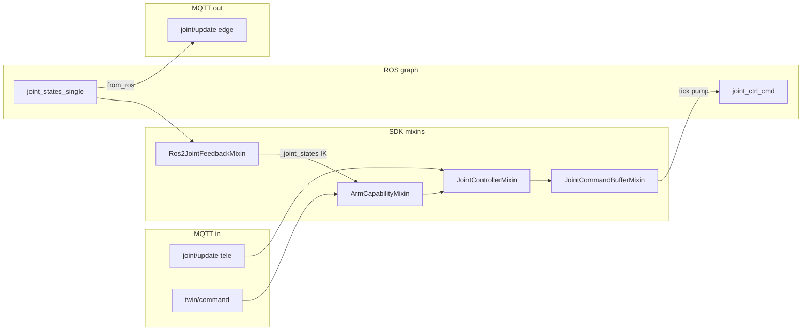

<Note>
**stub** — This page will be curated before publishing. Content reflects the current Python SDK (`cyberwave.driver`).
</Note>

## Overview

Edge drivers are built by **composing mixins** on [`BaseDriver`](/feature-reference/edge/drivers/base-driver-class) or [`BaseROS2Driver`](/feature-reference/edge/drivers/ros2-base-driver). Each mixin registers part of the MQTT catalog and supplies **seams** (methods you implement) for hardware-specific behavior.

Import the public surface from `cyberwave.driver`:

```python
from cyberwave.driver import (
    ArmCapabilityMixin,
    JointCommandBufferMixin,
    JointControllerMixin,
    TopicSpec,
)
from cyberwave.driver.ros2 import BaseROS2Driver, Ros2JointFeedbackMixin, Ros2TopicSpec
```

---

## Composition order (MRO)

**Method resolution order matters.** Put `JointControllerMixin` **before** `ArmCapabilityMixin` so joint targets from teleop and arm commands (`ee_move`, `grip`, …) both flow through `JointControllerMixin._apply_joint_targets`.

The Piper driver uses this exact stack:

```python
class PiperDriver(
    JointControllerMixin,
    ArmCapabilityMixin,
    Ros2JointFeedbackMixin,
    JointCommandBufferMixin,
    BaseROS2Driver,
):
    use_joint_controller = True
    use_joint_feedback = True
    use_base_commands = True
```

See [Reference pattern: Agilex Piper](#reference-pattern-ros-manipulator-arm-agilex-piper) for how `__init__`, `define_interface`, and `tick()` tie the mixins together at runtime.

---

## Mixin reference

| Mixin | Enable flag | You implement | SDK registers / provides |
| ----- | ----------- | ------------- | ------------------------ |
| **`JointControllerMixin`** | `use_joint_controller=True` | `joint_controller_config()`, `joint_controller_after_process()`; optional `joint_controller_motion()` | `joint/update` **listener** (`tele`, `edit`, `sim_tele`); shapes targets via `JointController.plan` |
| **`JointCommandBufferMixin`** | — (always compose for ROS arms) | `_init_joint_command_buffer()` in `__init__`, `_publish_joint_command()`, `_return_to_home()`, `tick()` → `pump_joint_commands()` | Thread-safe `CommandInbox`; teleop counters; optional `HOME_ON_TEARDOWN` |
| **`ArmCapabilityMixin`** | `use_base_commands=True` | `arm_config()` → `ArmKinematicsConfig` | `twin/command` listeners: `ee_move`, `ee_rotate_*`, `grip`, `release`, `home`, … |
| **`EECartesianPoseMixin`** | — | EE pose seams | Cartesian command extensions |
| **`DualArmMixin`** | — | `DualArmConfig` + per-arm routing | `left_*` / `right_*` commands on one twin |
| **`Ros2JointFeedbackMixin`** | `use_joint_feedback=True` | `joint_feedback_topic()`, `joint_name_map()`; optional `on_first_joint_feedback()` | ROS `JointState` subscription; `convert_joints_to_payload()` for `from_ros` |
| **`VideoStreamMixin`** | — | Frame publish hooks | WebRTC / video catalog |
| **`AudioStreamMixin`** | — | Audio stream hooks | Microphone catalog |
| **`ZenohPublisherMixin`** / **`ZenohSubscriberMixin`** | — | Channel callbacks | Zenoh catalog entries |

### Control types (no mixin — used by mixins)

| Type | Role |
| ---- | ---- |
| `JointController` | Plans waypoint streams from target dicts |
| `JointControllerConfig` | Joint list, `passthrough_joints`, limits |
| `trapezoidal_motion` | Default motion generator |
| `JointNameMap` | ROS ↔ platform joint renaming (e.g. `gripper` → `joint7`) |
| `MotionGenerator` | Plug-in profile (`motion=None` = passthrough) |

See [Joint motion shaping](/feature-reference/edge/drivers/joint-motion-shaping) for shaped vs passthrough motion.

---

## Bidirectional `joint/update`

The `cyberwave/joint/{uuid}/update` topic carries **both** teleop commands and edge feedback. Split responsibility:

| Direction | `source_type` | Who registers it |
| --------- | ------------- | ---------------- |
| **Feedback** (ROS → MQTT) | `edge` | **Your** `define_interface` → `add_publisher(..., from_ros=Ros2TopicSpec(...))` |
| **Teleop** (MQTT → ROS) | `tele`, `edit`, `sim_tele` | **`JointControllerMixin`** — do **not** add a second `joint/update` listener |

Teleop listeners **reject `edge*`** messages so the driver never re-ingests its own feedback.

---

## Reference pattern: ROS manipulator arm (Agilex Piper)

The **[Agilex Piper driver](https://github.com/cyberwave-os/cyberwave/blob/main/cyberwave-edge-nodes/piper/piper_driver.py)** (`PiperDriver`) is the canonical integration: five base classes, a handful of seams, and **one** `define_interface` publisher — no hand-written MQTT joint bridge.

### How the pieces connect

Mixins do not run in isolation. They wire together through **shared state** (`_joint_states`, `_tele_inbox`), **`super()` calls**, and the ROS **`tick()`** timer:



| Phase | What runs | Piper-specific |
| ----- | --------- | -------------- |
| **Class + flags** | MRO resolves mixin methods | `use_joint_controller`, `use_joint_feedback`, `use_base_commands`; `HOME_ON_TEARDOWN`, `EDGE_HEALTH_INTERVAL_S = 1` |
| **`__init__`** | Buffer + feedback init | `_init_joint_feedback()` then `_init_joint_command_buffer()` after `super().__init__` |
| **`configure()`** | ROS params, name map | `JointNameMap.from_arm_config(arm_config(), ros_to_platform={"gripper": "joint7"})` |
| **`define_interface`** | Catalog compile | `super().define_interface(iface)` registers mixin **listeners**; Piper adds **only** the `from_ros` **publisher** |
| **`register_callbacks`** | Extra ROS subs | Piper adds `arm_status` (vendor diagnostics — not part of mixin contract) |
| **`tick()`** | Executor timer | `pump_joint_commands()` drains inbox → `_publish_joint_command` |
| **Activate / teleop** | Operation mode | `on_enter_teleop_*` → enable service + CAN prime; **NO_OP** still streams edge feedback |

### Class declaration and flags

```python
class PiperDriver(
    JointControllerMixin,      # joint/update listener + planning seam
    ArmCapabilityMixin,        # twin/command (ee_move, grip, home, …)
    Ros2JointFeedbackMixin,    # ROS JointState → local _joint_states
    JointCommandBufferMixin,   # MQTT thread → ROS executor hand-off
    BaseROS2Driver,
):
    use_joint_controller = True
    use_joint_feedback = True
    use_base_commands = True
    HOME_ON_TEARDOWN = True
```

`JointControllerMixin` **must** precede `ArmCapabilityMixin` so IK-produced joint targets and MQTT teleop both enter `JointControllerMixin._apply_joint_targets`.

### `__init__` — wire mixin state

```python
def __init__(self, node_name: str, manifest_path: str | None = None, **kwargs):
    super().__init__(node_name, manifest_path, **kwargs)
    self._init_joint_feedback()       # Ros2JointFeedbackMixin
    self._init_joint_command_buffer() # JointCommandBufferMixin
```

Without these two calls the inbox, teleop counters, and `_joint_states` cache are never allocated.

### `define_interface` — feedback publisher only

`super().define_interface(iface)` lets mixins register `joint/update` **listener** and `twin/command` **listeners**. Piper adds the outbound path:

```python
def define_interface(self, iface) -> None:
    super().define_interface(iface)
    iface.add_publisher(
        TopicSpec(
            namespace="joint",
            leaf="update",
            payload_schema_ref="JointStatesPayload",
            rate_hz=30.0,  # JOINT_FEEDBACK_MQTT_RATE_HZ
            description="Edge joint feedback from joint_states_single",
        ),
        CallbackGroup(),
        operation_modes=frozenset(DriverOperationMode),
        protocol=ProtocolArgs(source_types=[SOURCE_TYPE_EDGE]),
        from_ros=Ros2TopicSpec(topic="joint_states_single"),
    )
```

At runtime `wire_ros_publishers()` subscribes on ROS, calls `convert_joints_to_payload` (uses `joint_name_map()`), throttles to `rate_hz`, and publishes with `source_type=edge`. **Do not** add a second `joint/update` listener — `JointControllerMixin` already owns teleop.

### Seam map — what Piper implements per mixin

| Mixin | Seam | Piper implementation |
| ----- | ---- | -------------------- |
| **`JointControllerMixin`** | `joint_controller_config()` | `joint1`–`joint7`; `passthrough_joints=("joint7",)` for gripper |
| | `joint_controller_motion()` | `return None` — Piper shapes velocity/effort in the ROS `JointState` cmd, not SDK trapezoidal |
| | `joint_controller_after_process()` | `lambda cmd: self.submit_joint_targets(cmd.positions)` → inbox |
| **`JointCommandBufferMixin`** | `tick()` | `self.pump_joint_commands()` |
| | `_publish_joint_command(positions)` | `ros_publish(cmd_topic, build_joint_command_msg(...))` with vendor vel/effort |
| **`ArmCapabilityMixin`** | `arm_config()` | `build_piper_arm_config(urdf_path=…)` for IK |
| **`Ros2JointFeedbackMixin`** | `joint_feedback_topic()` | `"joint_states_single"` (ROS param override in `configure`) |
| | `joint_name_map()` | `gripper` ↔ `joint7` via `JointNameMap` |

Command path end-to-end:

```text
twin.joints.set() / MQTT joint/update (tele)
  → JointControllerMixin._on_joint_target
  → JointController.plan (passthrough when motion=None)
  → joint_controller_after_process → submit_joint_targets
  → tick() → pump_joint_commands → _publish_joint_command
  → ros_publish("joint_ctrl_cmd", JointState)

twin.commands.ee_move() / grip / home
  → ArmCapabilityMixin IK
  → same JointController.plan path as above
```

Feedback path (two consumers, one ROS topic):

```text
ROS joint_states_single
  → Ros2JointFeedbackMixin._on_joint_feedback → _joint_states (IK, latch_gripper, prime)
  → from_ros forwarder → MQTT joint/update @ 30 Hz, source_type=edge
```

### Passthrough motion vs shaped

Piper returns `None` from `joint_controller_motion()` so targets pass straight through; velocity and effort limits come from ROS parameters (`joint_velocities`, `joint_efforts`, `gripper_effort`) inside `_build_joint_command_msg()`. Arms that need SDK-side smoothing return `trapezoidal_motion` instead — see [Joint motion shaping](/feature-reference/edge/drivers/joint-motion-shaping).

### Operation modes and edge health

- **`NO_OP`**: Piper resets the teleop inbox but keeps ROS lifecycle **Active** so `from_ros` feedback continues (`on_enter_no_op`).
- **Teleop**: `on_enter_teleop_local` / `remote` call vendor enable + CAN prime; commands flow only when hardware accepts them.
- **Liveness**: `_touch_edge_health()` on joint and arm-status callbacks; `edge_health` publishes at 1 Hz — no extra payload in `edge_health_extras`.

### What stays driver-specific (not mixin)

Piper still owns vendor glue that mixins do not cover: `managed_launch` (piper_ros), CAN setup, `/enable_srv`, `arm_status` subscription, and homing repeats on teardown (`HOME_ON_TEARDOWN`). Mixins handle the **Cyberwave contract**; the driver handles **hardware bring-up**.

### Client APIs vs driver plumbing

| API | Use |
| --- | --- |
| `define_interface` + `from_ros` | **Edge drivers** — ROS measured state → MQTT |
| `client.mqtt.update_joints_state(...)` | Scripts, sims, non-registry publishers |
| `twin.joints.set(...)` | **Application teleop** — commands only, not driver feedback |

End users call `twin.joints.set()` / `twin.joints.get()`; they do not implement `from_ros`.

---

## Related

<CardGroup cols={2}>
  <Card title="BaseROS2Driver" icon="robot" href="/feature-reference/edge/drivers/ros2-base-driver">
    Dual lifecycle, `from_ros`, `wire_ros_publishers`, manifest export.
  </Card>
  <Card title="Joint motion shaping" icon="wave-square" href="/feature-reference/edge/drivers/joint-motion-shaping">
    Trapezoidal vs passthrough `joint_controller_motion()`.
  </Card>
  <Card title="Writing compatible drivers" icon="book" href="/feature-reference/edge/drivers/writing-compatible-drivers">
    Platform contract, MQTT catalog, env vars.
  </Card>
  <Card title="Agilex Piper driver" icon="code-branch" href="https://github.com/cyberwave-os/cyberwave/blob/main/cyberwave-edge-nodes/piper/piper_driver.py">
    Production reference — mixin integration, passthrough motion, managed launch.
  </Card>
</CardGroup>
