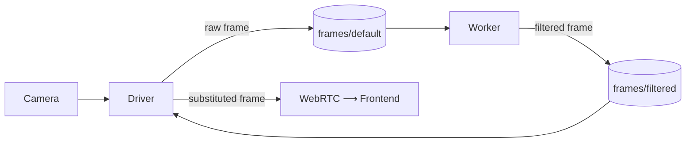

<Warning>
**STUB DOCUMENT:** This page is intentionally minimal and will be expanded with deeper technical details in a future update.
</Warning>

## Why

By default the camera driver streams **raw** frames over WebRTC. For privacy-sensitive deployments (security cameras, retail floors, hospitals) you usually want a worker to **transform every frame** — for example, replacing each person's silhouette with a stick figure — **before** the bytes leave the edge.

The frame filter contract lets a worker do that without owning the WebRTC stack.

<Note>
**Substitution vs. overlay.** The flow on this page covers _frame substitution_ — the driver swaps in worker-produced pixels — and is gated on the per-twin `frame_filter_enabled` privacy flag. It applies to the [`anonymize`](/feature-reference/workflows/anonymize-image) workflow node. The `annotate` node uses a separate, additive overlay channel that the driver subscribes to unconditionally, so it does not need this flag — see [Workflows](/feature-reference/workflows/overview) and _Annotation overlays_ below.
</Note>

## How it works



1. The driver publishes every captured frame to a local Zenoh channel (`frames/default`).
2. A worker subscribes, runs inference / anonymisation, and publishes the result to `cyberwave.data.FILTERED_FRAME_CHANNEL` (literal value `"frames/filtered"`).
3. Before encoding for WebRTC, the driver consults the latest filtered frame. If one is available, fresh (≤200 ms old) and matches the raw frame's `shape` and `dtype`, it is sent instead of the raw frame. Otherwise a black frame is emitted.

Per-twin isolation is automatic: the data bus injects the twin UUID into the Zenoh key (`cw/<twin_uuid>/data/frames/filtered`), so multiple cameras on the same edge box don't collide.

The driver owns the stream lifecycle. The worker owns the policy. Toggling the filter on or off at the driver level is a single per-twin metadata flag — no code changes to the worker.

## Privacy boundary

`frames/*` channels are **local-only**: the Zenoh-MQTT bridge does NOT forward them to the cloud by default. Only events, detections and overlays cross the WAN. See [Edge Workers](./edge-workers) for the hook contract.

## Configuration (driver side)

| Variable | Default | Purpose |
|---|---|---|
| `CYBERWAVE_METADATA_FRAME_FILTER_ENABLED` | `false` | Set `true` to subscribe the driver to `FILTERED_FRAME_CHANNEL` and substitute worker frames into the WebRTC stream. |
| `CYBERWAVE_METADATA_FRAME_FILTER_FRESHNESS_MS` | `200` | Maximum age (ms) of a worker-published frame before the driver treats it as stale and emits a blank fallback. Raise to `400`–`500` for CPU-only workers. |

<Note>
Toggling `frame_filter_enabled` from the **Sensor settings** dialog in the frontend writes it onto the twin's `metadata`. Edge Core's reconcile loop pulls that change into the local twin JSON file every ~15 seconds, and the driver picks it up on its next restart. No `edge-core` restart is required.
</Note>

<Note>
There is intentionally no "raw fallback" knob: when the worker is slow, missing, crashed, or publishing the wrong frame shape/dtype, the driver emits a black frame. To debug what the camera sees, disable the filter entirely.
</Note>

<Note>
**Worker-side privacy gate.** Workers generated from an [`anonymize`](/feature-reference/workflows/anonymize-image) workflow node go one step further: when the model returns zero detections matching the configured `target_classes`, the worker publishes `np.zeros_like(frame)` to `FILTERED_FRAME_CHANNEL` rather than the (untouched) raw frame `blank_persons` would otherwise pass through. This closes the case where a detector miss on a single frame would have leaked raw pixels through a fresh, well-formed publish — the driver-side fail-closed only catches stale and shape-mismatched frames.
</Note>

### Operational logging

Stale and shape-mismatch fall-throughs are accumulated into a 30-second rolling window and surfaced as a single summary log per window:

```
[FRAME_FILTER] 1.2% of 870 frames in last 30 s emitted blank fallback on
'frames/filtered' (reasons: stale=11). Worker may be slow or freshness
window too tight; consider raising
CYBERWAVE_METADATA_FRAME_FILTER_FRESHNESS_MS if pixelation occasionally
drops out.
```

The advice line switches to **"Worker likely down or not publishing on this channel"** when the blank rate exceeds 90% in a window, so a 1% jitter and a fully-missing worker are easy to tell apart in logs.

## Worker side

A worker uses any standard hook (`@cw.on_frame`, `@cw.on_depth`, ...) to receive frames, runs its model, and publishes the result back to the shared channel constant. The published frame **must match the raw camera frame's `shape` and `dtype`** — otherwise the driver drops it fail-closed.

```python
from cyberwave.data import FILTERED_FRAME_CHANNEL
from cyberwave.vision import anonymize_frame

model = cw.models.load("yolov8n-pose-onnx")
twin_uuid = cw.config.twin_uuid

@cw.on_frame(twin_uuid, sensor="front")
def anonymise(frame, ctx):
    detections = model.predict(frame, classes=["person"], confidence=0.4)
    out = anonymize_frame(frame, detections.detections)  # uint8 BGR, same shape
    cw.data.publish(FILTERED_FRAME_CHANNEL, out, twin_uuid=twin_uuid)
```

See the [security pipeline example](./edge-workers) for an end-to-end multi-camera setup.

## Annotation overlays

The `annotate` workflow node (see [Workflows](/feature-reference/workflows/overview)) takes a different path from the substitution flow above. Instead of rewriting pixels, it publishes a small JSON overlay spec — boxes, labels, and styling — to `cyberwave.data.FRAME_OVERLAY_CHANNEL` (literal value `"frames/overlay"`). The camera driver subscribes to this channel unconditionally and composites the boxes onto the frame just before WebRTC encoding.

Two consequences worth knowing:

- The per-twin `frame_filter_enabled` flag does **not** apply. Annotation overlays appear in the WebRTC stream regardless. (Pixel substitution still requires the flag — annotation just doesn't ride that path.)
- A failure in the annotate worker results in **missing boxes**, not a black frame. Substitution is fail-closed for privacy reasons; overlay is fail-open because losing boxes is not a privacy regression.

### Segmentation overlays

<Info>
Stub — a human will curate before publishing.
</Info>

When the upstream `call_model` node runs an instance-segmentation model (e.g. YOLO-seg), each detection in the overlay payload carries an optional `polygon` field (list of `[x, y]` vertices in original-frame coordinates). The driver composites a translucent fill (`style.mask_alpha`, default `0.35`) and an outline (`style.mask_outline`, default `true`) onto the WebRTC frame at encode time — additive to the standard box + caption. The v1 polygon encoding uses each instance's largest external contour and silently drops holes; downstream pipelines that need the raw mask should set the annotate node's `mask_format` to `"polygon+png"` and consume `mask_b64` cloud-side.
