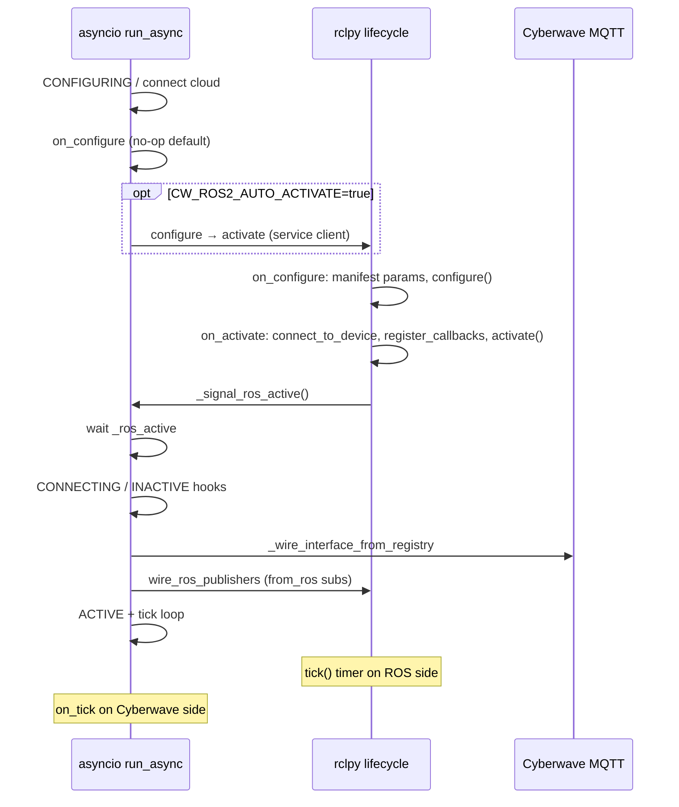

<Warning>
**STUB DOCUMENT:** Expanded technical reference aligned with `cyberwave-python`; replace the video placeholder when your walkthrough URL is ready.
</Warning>

## What `BaseROS2Driver` is

`BaseROS2Driver` (`cyberwave.driver.ros2`) combines:

- **`BaseDriver`** — Cyberwave API/MQTT, twin binding, interface registry, lifecycle alerts, `driver_info` telemetry
- **`rclpy.lifecycle.Node`** — standard ROS 2 lifecycle transitions

Import:

```python
from cyberwave.driver.ros2 import BaseROS2Driver, Ros2TopicSpec
```

**Typical goal:** stream ROS topics (joint states, odometry, custom msgs) into Cyberwave MQTT with **minimal driver code** — often **under 100 lines** for a forward-only bridge. Reference: [`ursim_driver.py`](https://github.com/cyberwave-os/cyberwave/blob/main/cyberwave-sdks/cyberwave-python/examples/ursim_driver.py).

<Info>
**Video walkthrough** — Add your hosted recording when available:  
`[UR Sim → Cyberwave: build a ROS 2 driver in minutes](VIDEO_URL_HERE)`
</Info>

---

## Process architecture (two event loops)

`BaseROS2Driver.run()` is **not** a plain `BaseDriver.run()`:

| Thread / loop | Role |
| ------------- | ---- |
| **Main thread** | `MultiThreadedExecutor.spin_once()` — rclpy lifecycle, ROS subscriptions, `tick()` timer |
| **Background daemon thread** | Dedicated **asyncio** loop running **`run_async()`** — Cyberwave connect, MQTT wire, `_tick_loop_async` |

ROS callbacks (e.g. `/joint_states`) run on the executor thread; they **`asyncio.run_coroutine_threadsafe`** into the driver loop to publish MQTT without blocking rclpy.

```text
main()
  ├─ _start_driver_loop()          # asyncio thread
  ├─ run_coroutine_threadsafe(run_async)
  └─ executor.spin_once() loop     # ROS lifecycle + subscriptions
```

---

## The ROS 2 lifecycle (managed) node

`BaseROS2Driver` is a **ROS 2 managed node** — it subclasses `rclpy.lifecycle.Node` (a *LifecycleNode*) rather than a plain `rclpy.node.Node`. A managed node does not start doing work the moment it is constructed; it advances through an explicit, tool-controllable state machine so an orchestrator (or, here, the Cyberwave lifecycle) can bring hardware up and down deterministically.

**The four primary states** (ROS 2 design REP-2007):

| State | Meaning | Cyberwave hook that runs entering it |
| ----- | ------- | ------------------------------------ |
| **Unconfigured** | Node exists; nothing allocated | — (just constructed) |
| **Inactive** | Configured but **not** processing — publishers exist but are deactivated, params declared | `configure()` (on the `configure` transition) |
| **Active** | Fully operational — callbacks fire, data flows | `connect_to_device()` → `register_callbacks()` → `activate()` (on the `activate` transition) |
| **Finalized** | Terminal; node is being destroyed | `shutdown()` |

**Transitions** (the verbs that move between states) are where your code runs. rclpy calls a `on_<transition>(state)` method for each; returning `SUCCESS` advances the state, `FAILURE`/`ERROR` does not:

```text
        configure                 activate
Unconfigured ───────▶ Inactive ───────────▶ Active
        ◀───────              ◀───────────
        cleanup                 deactivate
   (any state) ──── shutdown ────▶ Finalized
```

Key consequences for driver authors:

- **`create_publisher` on a LifecycleNode returns a *lifecycle* publisher** that only actually transmits while the node is **Active**. Publishing in `Inactive` is silently dropped — this is by design, not a bug.
- **rclpy owns the `on_configure(state)` / `on_activate(state)` / `on_deactivate(state)` / `on_shutdown(state)` methods.** You must not redefine them with a different signature — that is exactly why Cyberwave exposes the prefix-dropped `configure()` / `activate()` / … hooks (see *Why hook names drop the `on_` prefix* below).
- **Who triggers transitions?** Either an external lifecycle manager (`ros2 lifecycle set <node> configure`) or, more commonly here, the driver itself when **`CW_ROS2_AUTO_ACTIVATE=true`** (it calls its own `~/change_state` service after the cloud connect). Without auto-activate the node sits in *Unconfigured* until something activates it.
- **`on_cleanup` is treated as fatal** in this base — recovering an edge device in-process is unreliable, so the container is expected to restart to reconfigure (see the transition table below).

This managed-node machine is the **ROS half** of the picture. It runs in parallel with the **Cyberwave** lifecycle (`DriverLifecycleState`), and the two are coordinated — that coordination is the next section.

---

## Two lifecycles — who calls what

You maintain **two parallel state machines**. They are **ordered**: Cyberwave connect and `on_configure` run **before** the driver waits for ROS **ACTIVE**; MQTT + `from_ros` wiring runs **after** ROS activate signals ready.



### Cyberwave side (`run_async` — do not override)

| Step | `DriverLifecycleState` | Async hook (mixin) | Your ROS sync hook? |
| ---- | ---------------------- | ------------------ | ------------------- |
| Cloud connect | `CONFIGURING` | — | — |
| After MQTT | `CONFIGURING` | `on_configure` → `_run_after_cloud_connect` (default no-op) | Use **`configure()`** in rclpy `on_configure` |
| Auto-activate timer | — | `_begin_auto_activate` if env set | Triggers ROS configure→activate |
| Block | — | `_wait_for_ros_active` (up to 300s) | ROS **`on_activate`** must call `_signal_ros_active()` |
| Device phase | `CONNECTING` | `on_connect_to_device` → no-op | **`connect_to_device()`** already ran in ROS activate |
| Wire | `INACTIVE` | `on_register_callbacks` → no-op | **`register_callbacks()`** already ran |
| MQTT + ROS | `INACTIVE` | `_wire_interface_from_registry` + **`wire_ros_publishers()`** | — |
| Ready | `INACTIVE` | `on_activate` → no-op | **`activate()`** already ran |
| Run | `ACTIVE` | `_tick_loop_async`, monitoring, reconnect | ROS **`tick()`** timer separate |

### ROS side (rclpy — do not override `on_configure(state)`, etc.)

| rclpy callback | Calls (order) | Your override |
| -------------- | ------------- | ------------- |
| `on_configure(state)` | declare manifest params → **`configure()`** | **`configure()`** |
| `on_activate(state)` | base **`connect_to_device`** → yours → **`register_callbacks`** → **`activate`** → start ROS tick timer → **`_signal_ros_active`** | **`connect_to_device`**, **`register_callbacks`**, **`activate`** |
| `on_deactivate(state)` | stop tick timer → **`deactivate()`** | **`deactivate()`** |
| `on_shutdown(state)` | stop tick timer → **`shutdown()`** | **`shutdown()`** |
| `on_cleanup` | **FAILURE** — restart container to reconfigure | — |

---

## Why hook names drop the `on_` prefix

`rclpy.lifecycle.Node` already defines **`on_configure(state)`**, **`on_activate(state)`**, … with a **state argument**. A no-arg `def on_configure(self)` in your subclass would **break** ROS lifecycle.

| C++ / conceptual hook | Python method on your class |
| --------------------- | ---------------------------- |
| `on_configure()` | **`configure()`** |
| `on_connect_to_device()` | **`connect_to_device()`** |
| `on_register_callbacks()` | **`register_callbacks()`** |
| `on_activate()` | **`activate()`** |
| `on_deactivate()` | **`deactivate()`** (default no-op) |
| `on_tick()` | **`tick()`** (ROS timer, not Cyberwave `on_tick`) |
| `on_shutdown()` | **`shutdown()`** |

Cyberwave **`on_configure`**, **`on_connect_to_device`**, … still exist on the class for `BaseDriver`’s ABC, but **`BaseROS2Driver`** routes them through **`_BaseDriverAsyncHooks`** — you normally **do not** implement them for forward-only drivers.

Event hooks **keep** `on_` where there is no conflict: **`on_topic_name_changed(topic_entry, new_name)`**.

---

## Required vs optional (checklist)

### Minimum for ROS → Cyberwave streaming (UR Sim style)

| Item | Required? |
| ---- | --------- |
| Subclass **`BaseROS2Driver`** | Yes |
| **`ASSET_KEY`** matching catalog asset | Yes (manifest + auto-register) |
| **`define_interface`** with `add_publisher(..., from_ros=Ros2TopicSpec(...))` | Yes |
| **`CallbackGroup()`** with **no** callback for auto `JointState` serialize | Typical for joints |
| **`configure` / `connect_to_device` / `activate`** | May be empty `pass` / log only |
| **`CW_ROS2_AUTO_ACTIVATE=true`** | Strongly recommended in dev |
| **`CYBERWAVE_API_KEY`**, **`CYBERWAVE_TWIN_UUID`** | Yes at runtime |
| ROS graph publishing the topic (e.g. `/joint_states`) | Yes |

You do **not** need:

- Manual MQTT `publish` loops for `from_ros` entries
- Custom `JointState` → dict conversion (SDK default)
- Overriding rclpy **`on_activate(state)`**
- Implementing Cyberwave abstract **`on_configure`** async methods (mixin provides them)

### When you need more

| Need | Implement |
| ---- | --------- |
| Cyberwave command → ROS | `add_listener` + handler calling **`ros_publish(topic, msg)`** |
| Custom payload shape | `CallbackGroup(callback=fn)` **with** `from_ros` — `fn(msg) -> dict` |
| ROS params from YAML manifest | Ship **`manifest.yaml`** + `CW_DRIVER_MANIFEST` |
| Runtime topic remaps | Manifest topic params + **`add_managed_publisher`** / **`on_topic_name_changed`** |
| Periodic ROS work | **`tick()`** (uses ROS param **`tick_rate_hz`**, default 10 Hz) |
| Periodic Cyberwave work | Override async **`on_tick()`** on `BaseDriver` path (same ACTIVE phase) |
| Spawn a vendor `ros2 launch` | **`managed_launch`** in `define_node_manifest` |
| Throttle a high-rate ROS stream | **`acquire_ros_stream_publish_slot(topic)`** |
| Export ROS + MQTT manifest | **`write_manifest`** / `python main.py write-manifest` |
| Hardware enable on controller assign | **`on_enter_teleop_*`** / **`on_controller_assigned`** |

---

## `define_interface` and `from_ros`

### `add_publisher` with ROS source

```python
from cyberwave.driver import CallbackGroup, DriverOperationMode, TopicSpec
from cyberwave.driver.ros2 import Ros2TopicSpec

iface.add_publisher(
    TopicSpec(
        topic_slug="cyberwave/joint/{twin_uuid}/update",
        payload_schema_ref="JointStatesPayload",
        description="Forward /joint_states",
    ),
    CallbackGroup(),  # no Python callback — see serialization below
    from_ros=Ros2TopicSpec(
        topic="/joint_states",
        qos_depth=10,
        discovery_timeout_s=5.0,
        msg_type=None,  # resolve from graph unless set (tests)
    ),
    operation_modes=frozenset(DriverOperationMode),
)
```

| Rule | Detail |
| ---- | ------ |
| **`from_ros` only on `add_publisher`** | `add_listener` rejects `Ros2TopicSpec` |
| **No `PublisherArgs.rate_hz` with `from_ros`** | ROS message rate drives MQTT publishes |
| **`operation_modes`** | Forwarders often use **all** modes: `frozenset(DriverOperationMode)` |

### What `wire_ros_publishers()` does at runtime

1. Lists registry entries with `from_ros` for current **`operation_mode`**
2. **`resolve_ros_message_class`** — polls ROS graph (or uses `msg_type=` override)
3. Creates **`create_subscription`** on the ROS topic
4. On each message:
   - If **no user callback** and type is **`sensor_msgs/msg/JointState`** → **`ros_joint_state_to_transport_payload`**
   - Else if user callback → must return **`dict`**
   - Else → **`ros_message_to_transport_payload`** (generic field flattening + `timestamp`, `source_type`)
5. **`run_coroutine_threadsafe`** → publish to resolved MQTT slug (and Zenoh if dual spec)

Logs (throttled ~5s):

- `ROS forward: /joint_states (sensor_msgs/msg/JointState) -> Cyberwave MQTT`
- `ROS RX /joint_states: N message(s) — publishing to Cyberwave MQTT (6 joints)`

### Joint `/update` payload shape (default)

**Flat** keys for Vector / twin telemetry compatibility:

```json
{
  "source_type": "edge",
  "shoulder_pan_joint": 0.12,
  "shoulder_lift_joint": -1.04,
  "timestamp": 1717000000.0,
  "velocities": { "shoulder_pan_joint": 0.01 },
  "efforts": {}
}
```

Nested `positions: { name: value }` is available via **`ros_joint_state_to_transport_payload(..., aggregated=True)`** if you supply a custom callback.

### Source-type convention

Notice the `"source_type": "edge"` field above. This is the platform-wide convention every driver follows (full rules on the [BaseDriver page](/feature-reference/edge/drivers/base-driver-class#source-type-convention)):

- **`from_ros` publishers stamp `edge`** automatically (physical feedback). When the driver runs against a simulator instead of hardware, publish **`sim`** instead.
- **Command listeners** (`add_listener` + `ros_publish`) should accept teleop sources — **`tele`**, **`edit`**, **`sim_tele`** — and **must never act on `edge*`** messages, or the driver re-ingests its own joint feedback and fights itself. Declare the accepted set with `ProtocolArgs(source_types=[...])`.
- Inbound messages **without** a `source_type` are treated leniently (accepted as commands) — not every producer stamps the field — but the `edge*` self-echo guard always applies.

A topic registered as **both** a `from_ros` publisher (`edge`) and a command listener (`tele`/`edit`/`sim_tele`) — e.g. `joint/update` on an arm — is the canonical case where the `edge*` rejection matters.

---

## `CW_ROS2_AUTO_ACTIVATE`

| Value | Behavior |
| ----- | -------- |
| **`true`** | After Cyberwave connect, driver calls lifecycle **`configure` → `activate`** via `~/change_state` service |
| **unset / other** | Driver **blocks** in `_wait_for_ros_active` until something externally activates the node (or times out **300s**) |

UR Sim example sets default in `main()`:

```python
os.environ.setdefault("CW_ROS2_AUTO_ACTIVATE", "true")
```

Without auto-activate you must run a lifecycle manager (`ros2 lifecycle set …`) **while** the executor is spinning.

---

## Operation modes drive the ROS lifecycle

`BaseROS2Driver` ties Cyberwave [operation modes](/feature-reference/edge/drivers/base-driver-class#operation-modes-driveroperationmode) to ROS lifecycle transitions. When `_set_operation_mode` runs, the ROS enter-hooks request a `change_state` transition on this node:

| Mode entered | ROS hook | ROS transition |
| ------------ | -------- | -------------- |
| `NO_OP` | `on_enter_no_op()` | **DEACTIVATE** (node → inactive) |
| `TELEOP_LOCAL` | `on_enter_teleop_local()` | **ACTIVATE** (configures first if unconfigured) |
| `TELEOP_REMOTE` | `on_enter_teleop_remote()` | **ACTIVATE** |

So a twin with **no controller assigned starts in `NO_OP`**: control is idle, but the node stays warm. Because `_set_operation_mode` is a no-op when the mode is unchanged, a forward-only bridge (no controller) never deactivates — it remains in its initial `NO_OP` and keeps streaming.

<Info>
**Edge ROS→Cyberwave forwarders are independent of operation mode.** `wire_ros_publishers()` runs as soon as ROS reaches ACTIVE, so `from_ros` joint/telemetry streams flow even in `NO_OP`. Declare them with `operation_modes=frozenset(DriverOperationMode)`.
</Info>

Override the enter-hooks (or `on_controller_assigned` / `on_controller_removed`) to add hardware enable/disable on top of the lifecycle transition — e.g. powering an arm when a controller attaches.

---

## Managed vendor launch (`managed_launch`)

A driver can have the SDK **spawn and supervise a vendor `ros2 launch`** (e.g. a robot's stock bringup) as a child process, instead of you starting it separately. Declare it in `define_node_manifest()`:

```python
from cyberwave.driver.ros2.manifest import NodeManifest, ManifestManagedLaunch

@classmethod
def define_node_manifest(cls, node_name: str) -> NodeManifest:
    return NodeManifest(
        node_name=node_name,
        managed_launch=ManifestManagedLaunch(
            package="my_robot_bringup",
            launch_file="robot.launch.py",
            ros_setup="/opt/ros/humble/setup.bash",   # this driver's ROS distro
            ros_overlay="",                            # vendor workspace overlay (or env)
        ),
    )
```

At ROS `activate`, `ManagedRosLaunch` starts the child, waits for readiness, and stops it on shutdown. Setup scripts are sourced into the driver process so vendor message typesupport imports correctly.

<Warning>
The SDK is distro-agnostic: it **does not** default a ROS distro or guess a workspace path. Setup scripts come only from the manifest (`ros_setup` / `ros_overlay`) and the `ROS_SETUP` / `ROS_SETUP_OVERLAY` env vars. Declare the distro path in your driver's manifest (it is vendor-specific), not in the SDK.
</Warning>

---

## ROS stream → Cyberwave rate limiting

ROS sensor topics often exceed 100 Hz. The `from_ros` forwarder and any custom ROS callback can throttle outbound Cyberwave publishes with a per-topic cap (default **50 Hz**):

| API | Purpose |
| --- | ------- |
| `ROS_STREAM_PUBLISH_MAX_HZ` | Class attribute, default **50 Hz** |
| `ros_stream_publish_max_hz(ros_topic)` | Override per topic |
| `acquire_ros_stream_publish_slot(ros_topic, *, max_hz=None)` | `True` when a publish for that topic is due (latest-wins) |
| `ros_stream_key(ros_topic)` | Stable throttle key (`ros:<topic>`) |

```python
def _on_joint_states(self, msg) -> None:
    if not self.acquire_ros_stream_publish_slot("/joint_states_single"):
        return  # drop — arrived faster than the cap
    self.publish_to_cyberwave(msg)
```

This wraps `BaseDriver.acquire_stream_publish_slot` with a ROS-topic key. See [BaseDriver → Stream publish rate limiting](/feature-reference/edge/drivers/base-driver-class#stream-publish-rate-limiting).

---

## Combined manifest (ROS params + MQTT catalog)

`BaseROS2Driver` exports a **single `manifest.yaml`** that merges the ROS node manifest (params, topics, `managed_launch`) with the compiled-from-code MQTT `cw-driver` catalog:

| API | Returns |
| --- | ------- |
| `define_node_manifest(node_name)` | ROS node fields (override per driver) |
| `get_combined_manifest(compiled=False)` | Merged ROS + MQTT dict |
| `write_manifest(path=None)` | Writes `manifest.yaml` (defaults to `./manifest.yaml`) |

Export it without running the driver — typically a CLI subcommand and a Docker build step:

```bash
python main.py write-manifest          # writes ./manifest.yaml
python main.py write-manifest out.yaml # explicit path
```

Do not hand-edit the result: change Python (`define_node_manifest` + `define_interface`) and re-export. At runtime, point the driver at it with `CW_DRIVER_MANIFEST`.

---

## Construction and entrypoint

```python
driver = UrSimDriver(
    node_name="ursim_driver",      # or CW_ROS2_NODE_NAME
    manifest_path=None,            # or CW_DRIVER_MANIFEST
    twin=None,                     # optional pre-bound twin
    auto_register_interface=None,  # inherit class default True
)
driver.run()
```

| Method | Role |
| ------ | ---- |
| **`create()`** | `cls(CW_ROS2_NODE_NAME, CW_DRIVER_MANIFEST)` from env |
| **`run()`** | Start asyncio thread + spin executor until `run_async` completes |
| **`ros_publish(topic, msg)`** | Lazy `create_publisher` — call from **`tick()`** (executor thread); see the thread-affinity note under [Cyberwave → ROS](#cyberwave-ros-commands) |

Node name / namespace can be overridden via ROS env helpers (`node_name_from_env`, `node_namespace_from_env`).

---

## Environment variables

### Cyberwave (inherited from `BaseDriver`)

| Variable | Purpose |
| -------- | ------- |
| `CYBERWAVE_API_KEY` | API + MQTT auth |
| `CYBERWAVE_TWIN_UUID` | Twin UUID |
| `CYBERWAVE_BASE_URL` | API base |
| `CYBERWAVE_MQTT_*` | Broker connection |

Backend lifecycle alerts are **always** synced after connect (not env-configurable). Set **`ASSET_KEY`** on the driver class (not via env).

### ROS 2 driver specific

| Variable | Default | Purpose |
| -------- | ------- | ------- |
| **`CW_ROS2_AUTO_ACTIVATE`** | unset | `true` → auto configure/activate |
| **`CW_ROS2_NODE_NAME`** | `cyberwave_ros2_driver` | ROS node name |
| **`CW_DRIVER_MANIFEST`** | none | Path to `manifest.yaml` (params + topic name params) |
| **`ROS_DOMAIN_ID`** | `0` | Must match UR driver / sim |
| **`ROS_SETUP`** | none | ROS underlay `setup.bash` sourced for `managed_launch` (overrides manifest `ros_setup`) |
| **`ROS_SETUP_OVERLAY`** | none | Vendor workspace `setup.bash` overlay (overrides manifest `ros_overlay`) |
| **`CW_MANAGED_LAUNCH_LOG`** | temp file | Path for the managed vendor launch's stdout/stderr |

Manifest may declare **`tick_rate_hz`** ROS parameter (integer) — drives ROS-side **`tick()`** timer. Per-parameter overrides also follow the SDK `CW_ROS2_*` env convention.

<Note>
The SDK no longer defaults `ROS_SETUP` to a specific distro. For `managed_launch` drivers, set `ros_setup` in the manifest (recommended) or export `ROS_SETUP` / `ROS_SETUP_OVERLAY`.
</Note>

---

## ROS hooks — what to put in each

### `configure()`

- Parse non-hardware config, allocate buffers
- **Do not** open device connections (that is **`connect_to_device()`**)
- rclpy `on_configure` already declared manifest parameters

### `connect_to_device()`

- Open robot/sim connection if needed
- For UR Sim + `ur_robot_driver`, often **empty** — another node publishes `/joint_states`

### `register_callbacks()`

- Device-native ROS subscriptions **not** covered by `from_ros`
- Example: subscribe to a custom diagnostic topic with a Python callback

### `activate()`

- Create ROS publishers you control manually
- Start control loops
- **`from_ros` wiring happens after** this in `run_async` — do not rely on MQTT forwards during `activate()` itself

### `tick()`

- Fast periodic work on ROS timer
- Exceptions are logged; timer keeps running

### `shutdown()`

- Destroy publishers/subscriptions you created
- Complement ROS `on_shutdown` transition

---

## Cyberwave → ROS (commands)

```python
def define_interface(self, iface):
    iface.add_listener(
        TopicSpec(topic_slug="cyberwave/twin/{twin_uuid}/command"),
        CallbackGroup(callback=self._on_cmd),
        command=CommandArgs(name="my_cmd"),
    )

def _on_cmd(self, envelope: dict) -> None:
    from std_msgs.msg import String
    self.ros_publish("/my_ros_topic", String(data="..."))
```

`ros_publish` caches publishers per `(topic, msg_type)`.

<Warning>
**Thread affinity.** MQTT listener callbacks run on the **asyncio loop thread**, but rclpy node operations (`create_publisher`, `publish`, `create_subscription`, `get_clock`) belong on the **executor thread** ([two event loops](#process-architecture-two-event-loops)). Calling `ros_publish` directly from a listener works for one-shot, low-rate commands, but for **continuous teleop / high-rate command streams** — or any publisher on a lifecycle node — the safe pattern is to **queue in the listener and publish from `tick()`** (which runs on the executor thread):

```python
def define_interface(self, iface):
    iface.add_listener(MqttTopicSpec(...), CallbackGroup(self._inbox.append))

def _inbox_append(self, payload): ...        # asyncio thread — just enqueue, no rclpy

def tick(self):                              # executor thread — rclpy-safe
    for cmd in self._drain_inbox():
        self.ros_publish(self._cmd_topic, self._build_msg(cmd))
```

This keeps all rclpy calls on the thread that owns the node and avoids cross-thread access to the publisher cache.
</Warning>

---

## Reference driver: UR Sim (`ursim_driver.py`)

Full listing (~75 lines) in the monorepo. Structure:

```python
class UrSimDriver(BaseROS2Driver):
    ASSET_KEY = "universal_robots/UR7"

    def define_interface(self, iface):
        iface.add_publisher(
            TopicSpec(
                topic_slug="cyberwave/joint/{twin_uuid}/update",
                payload_schema_ref="JointStatesPayload",
            ),
            CallbackGroup(),
            from_ros=Ros2TopicSpec(topic="/joint_states"),
            operation_modes=frozenset(DriverOperationMode),
        )

    def configure(self): ...
    def connect_to_device(self): ...
    def activate(self): ...
```

**`main()`** sets logging, `CW_ROS2_AUTO_ACTIVATE`, reads optional manifest/node env, calls **`driver.run()`**.

---

## Lab setup (UR Sim)

End-to-end Docker, pendant program, `ur_robot_driver`, and running `ursim_driver.py`: **[UR Sim tutorial](/tutorials/ur-sim-cyberwave-driver)**.

Protocol layers (TCP, ROS DDS, MQTT): **[Custom integrations](/overview/connecting-hardware/custom-hardware)**.

---

## `from_ros` vs other patterns

| Pattern | Direction | When |
| ------- | --------- | ---- |
| **`from_ros=Ros2TopicSpec(...)`** | ROS → Cyberwave | Telemetry, joints, poses — preferred |
| **`CallbackGroup(fn)` + `from_ros`** | ROS → Cyberwave | Transform/filter before MQTT |
| **`add_publisher` + tick callback** | Cyberwave timer → MQTT | Synthetic sensors (no ROS source) |
| **`add_listener` + `ros_publish()`** | Cyberwave → ROS | Commands / teleop |
| Manual bridge node | Both | Avoid — duplicates registry and alerts |

---

## Troubleshooting

| Symptom | Likely cause |
| ------- | ------------- |
| Hangs at *Waiting for ROS lifecycle ACTIVE* | `CW_ROS2_AUTO_ACTIVATE` not `true` and no external activate |
| No `ROS forward` log | `define_interface` missing `from_ros`, or wrong `operation_mode` |
| Node won't activate / sits inactive | No controller assigned → `NO_OP`; assign a controller (or check `operation_modes`) |
| Vendor launch fails or msgs won't import | Read `CW_MANAGED_LAUNCH_LOG`; set `ros_setup`/`ros_overlay` (or `ROS_SETUP`/`ROS_SETUP_OVERLAY`) |
| `discovering type for /topic` then error | Topic not published on graph within `discovery_timeout_s` |
| MQTT connected but flat joints empty | `JointState.name` / `position` length mismatch — SDK returns `None`, skips publish |
| No twin UI alerts | Twin not bound yet, or connect failed before `_enable_backend_alerts` |
| `TimeoutError` after 300s | ROS never reached active — check executor spinning and lifecycle |

---

## Related

<CardGroup cols={2}>
  <Card title="BaseDriver" icon="code" href="/feature-reference/edge/drivers/base-driver-class">
    Cyberwave-only lifecycle, registry, manifests, alerts.
  </Card>
  <Card title="Writing compatible drivers" icon="book" href="/feature-reference/edge/drivers/writing-compatible-drivers">
    `cw-driver.yml`, env contract, fake-IMU tutorial.
  </Card>
  <Card title="Driver alerts" icon="bell" href="/feature-reference/edge/drivers/alerts">
    Alert types during connect and failures.
  </Card>
</CardGroup>
