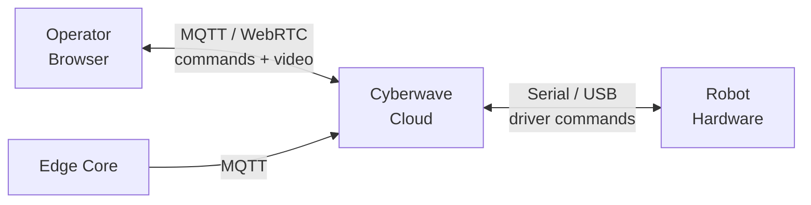

## What is Live Teleoperation?

Live Teleoperation lets you control a physical robot in real time through its [digital twin](/use-cyberwave/digital-twins) in the Cyberwave dashboard. Operator inputs — keyboard, gamepad, or SDK commands — are sent to the robot via Cyberwave's low-latency MQTT and WebRTC infrastructure, while live video and telemetry stream back to the browser.

<Info>
  Teleoperation requires a physical robot connected through [Cyberwave
  Edge](/edge/overview). The Edge Core bridges your hardware to the cloud in
  real time.
</Info>

---

## How It Works

<CardGroup cols={3}>
  <Card title="1. Operator Input" icon="keyboard">
    Send commands from the dashboard UI, a keyboard/gamepad controller, or the [Python SDK](/tools/python-sdk) using `cw.affect("live")`.
  </Card>

<Card title="2. Cloud Relay" icon="cloud">
  Cyberwave routes commands through MQTT to the Edge Core running on the robot's
  host machine.
</Card>

  <Card title="3. Robot Execution" icon="robot">
    The Edge Core translates commands into hardware-level actions and streams sensor data back.
  </Card>
</CardGroup>



---

## Supported Control Methods

| Method                  | Description                                                                                                                           |
| ----------------------- | ------------------------------------------------------------------------------------------------------------------------------------- |
| **Keyboard controller** | Assign a keyboard controller to a twin in the dashboard — move joints or navigate with key bindings                                   |
| **Gamepad**             | Use a USB or Bluetooth gamepad for more intuitive control of mobile robots and arms                                                   |
| **Leader arm**          | Teleoperate a follower arm using a physical leader arm (e.g. SO101 leader/follower setup)                                             |
| **Python SDK**          | Send commands programmatically with `cw.affect("live")` — see the [SDK docs](/tools/python-sdk#affect-simulation-vs-live-environment) |

---

## Create a map

{/* stub: content pending human curation before publishing */}

In **Live**, select one robot with semi-autonomous or fully autonomous navigation
(for example, a configured Go2), then open **Live Overview → Maps**. Choose the
sensor and map type, optionally enter a name, and click **Start mapping**.
Click **Stop mapping** to request that the robot save and upload the map.

## Keyboard (Driver)

{/* stub: content pending human curation before publishing */}

**Keyboard (Driver)** is the default keyboard controller for robots that ship a driver catalog. It does not hard-code a command list. Each twin shows the commands that twin actually declares (from the driver interface on that twin). Bind a key in the controller, then reuse the same saved controller on another twin of the same asset: only the **intersection** is usable — commands present in both the twin's catalog and the saved bindings. Extra bindings for commands this twin does not have are ignored; catalog commands with no binding stay unbound.

That is intentional. Subclass [`BaseDriver`](/feature-reference/edge/drivers/base-driver-class) (or declare the same commands in `cw-driver.yml`), run the driver, and the keyboard UI follows the manifest.

### Commands vs joints

{/* stub: content pending human curation before publishing */}

| Surface | Default | Hold a key | Tap a key |
| --- | --- | --- | --- |
| **Commands** | One-shot | Repeats only if the driver marks the command `continuous` (at that command's `rate_hz`, or 10 Hz) | Always one payload |
| **Joints** | Continuous stream while held | Keeps sending setpoint updates | One step |

A command like **capture photo** / **take photo** must stay one-shot. Locomotion and velocity commands are usually continuous. The driver manifest is the source of truth — the dashboard does not guess.

- **Rebind** a key by clicking its slot and pressing a new key — the previous owner of that key is replaced.
- **Radians / degrees** is a per-panel toggle: the controller panel and the controller card each convert their own joint readout.

### Which controller a new twin gets

{/* stub: content pending human curation before publishing */}

Each twin gets its own assigned controller. New twins start from the asset default — for catalog robots that is usually the public **Keyboard (Driver)** template.

When more than one keyboard controller matches that default:

1. A **Save as my copy** controller linked to the asset is chosen first (your bindings stay the default for new twins of that asset).
2. Other controllers in the same workspace.
3. The public template.

Picking a controller in the UI (or a specific slug/uuid in the SDK) always wins over this default. The public template is never overwritten; copies are yours.

## Driving Several Robots at Once

{/* stub: content pending human curation before publishing */}

Assign the same keyboard controller to more than one robot and a single keypress drives all of
them together. From an assigned controller, use **Assign this controller to other twins** to give
it to the environment's other robots in one step.

Every robot with a keyboard controller receives keyboard input — selecting one in the scene does
not stop the others from being driven. Each robot resolves the key against its own controller, so
a robot whose controller does not bind that key simply does nothing, and robots with different
controllers can still respond to the same key.

Each robot keeps its own commanded targets and its own panel, so two arms starting from different
poses stay independent: they receive the same *step*, not the same absolute position. Pick the robot
in the **Controllers** tab's twin list to read its panel; the others keep driving either way.

## Binding One Key to Several Joints

{/* stub: content pending human curation before publishing */}

A key can be bound to more than one joint. Press it and every joint bound to it steps together;
release it and all of them stop. In the key-bindings editor, assigning a key that another joint
already uses no longer replaces that binding — both are kept, and the row notes which other joints
the key drives.

This is for joints you want to move *independently but together*. Joints that are mechanically
coupled (a gripper's mirrored fingers, for example) already follow their driver automatically and
do not need their own binding.

---

## Where the Controller Panel Lives

{/* stub: content pending human curation before publishing */}

The keyboard controller panel lives in the **Controllers** tab of the bottom workbench, next to that
twin's key bindings. Select a twin in the tab's list to read its panel, or click the twin's keyboard
button in the control dock at the bottom of the 3D view to open the tab straight on that twin.

Keys keep driving the robot whether or not the panel is open — including with the workbench collapsed
and in fullscreen. The panel is a readout, not the input.

---

## Joint Targets Readout

{/* stub: content pending human curation before publishing */}

The keyboard controller panel shows, for each independently controllable joint:

| Column | Meaning |
| --- | --- |
| **target** | The position the controller last commanded |
| **position** | The position the robot (or simulator) reports |
| **Δ** | How far the joint still has to travel |
| **vel** / **effort** | Measured velocity and effort, when the driver publishes them |

It behaves the same in Simulation and Live mode. While you hold a key, the joint's current position and commanded target are also shown next to the key itself, as `position → target`.

Each key press moves the target by one fixed step from the **previous target**, so repeated presses add up predictably even while the robot is still moving toward the last one. A gap in the **Δ** column simply means the robot has not arrived yet; it turns amber if the robot is falling far enough behind that further presses are being held until it catches up.

A joint you have not driven yet shows no **target** at all, and driving one joint never gives the others a target: each key press commands only the joints it actually moves, and every other joint simply holds the last position it was commanded to.

The joint currently under a held key is highlighted. Mimic and fixed joints are not listed — they have no target of their own. Rotational joints are shown in degrees, linear joints in metres. A dash means the robot does not report that channel, and a dimmed position means the reading is stale.

If the connection to the robot drops, held keys are released and the commanded target is discarded rather than resumed. When the link comes back the target re-seeds from the position the robot actually reports, so the first press afterwards steps from where the arm really is.

---

## Shared Controller Templates

{/* stub — this section will be curated by a human before publishing */}

Some controllers in the catalog are shared, read-only templates (for example **Keyboard (Driver)**, which builds its key bindings from the robot's driver manifest). You can configure one without special permissions:

- Open the controller, set your key bindings as usual, then **Save as my copy** — your changes land in a new controller owned by your workspace and bound to that robot's asset. The shared template is left untouched. New twins of that asset then prefer this copy; see [which controller a new twin gets](#which-controller-a-new-twin-gets).
- If the template is already configured the way you want it, use **Assign as-is** to attach it to the twin without making a copy. The button hides if you change a binding, because that action assigns the saved template and would drop those edits.

---

## Switching Between Simulation and Live

The same [environment](/use-cyberwave/environment-editor) supports both modes. In **Simulation** mode, your actions affect the digital twin only. Switch to **Live** mode to drive the physical robot.

**From the dashboard:** use the mode toggle in the environment header.

**From the SDK:**

```python
from cyberwave import Cyberwave

cw = Cyberwave()

cw.affect("simulation")
robot = cw.twin("the-robot-studio/so101")
robot.joints.set("shoulder_pan", 45, degrees=True)  # moves the digital twin

cw.affect("live")
robot.joints.set("shoulder_pan", 45, degrees=True)  # moves the physical robot
```

---

## Live Video Streaming

During teleoperation, live camera feeds from the robot are streamed via WebRTC directly into the dashboard. You can view one or multiple camera feeds alongside the 3D digital twin view.

Supported camera types:

- **Standard cameras** (USB/CSI via OpenCV)
- **Intel RealSense** (RGB + depth)

The media service also exposes a twin-scoped MQTT command channel for media-control operations on active WebRTC streams. This lets edge drivers and teleoperation clients request media-service actions without changing the WebRTC signaling topics.

See the [Python SDK video streaming docs](/tools/python-sdk#video-streaming-webrtc) for details on setting up camera streams from edge devices.

---

## Prerequisites

<Steps>
  <Step title="Digital Twin configured">
    Create a [digital twin](/use-cyberwave/digital-twins) for your robot in an
    [environment](/use-cyberwave/environment-editor).
  </Step>
  <Step title="Edge Core installed">
    Install and configure [Cyberwave Edge](/edge/overview) on the machine
    connected to the robot hardware.
  </Step>
  <Step title="Hardware paired">
    Pair the physical robot with the digital twin via the CLI — see the [Edge
    overview](/feature-reference/edge/overview).
  </Step>
</Steps>

---

## Latency

A small delay between operator input and robot response is expected in any teleoperation system. The Cyberwave teleoperation stack uses WebRTC for video and MQTT for control commands, keeping end-to-end latency low enough for hands-on robot work.

---

## Video Walkthroughs

<CardGroup cols={2}>
  <Card
    title="Go2 Digital to Physical"
    icon="dog"
    href="/tutorials/go2-digital-to-physical"
  >
    End-to-end: catalog to physical robot deployment with a Unitree Go2
  </Card>
  <Card
    title="Rover AI Inspection"
    icon="robot"
    href="/tutorials/rover-ai-mission"
  >
    Autonomous rover mission with AI-driven analysis in simulation
  </Card>
</CardGroup>

---

## Next Steps

<CardGroup cols={3}>
  <Card title="Python SDK" icon="code" href="/tools/python-sdk">
    Full SDK reference for live robot control
  </Card>
  <Card title="Digital Twins" icon="clone" href="/use-cyberwave/digital-twins">
    Configure twin capabilities and sensors
  </Card>
  <Card
    title="Workflows"
    icon="diagram-project"
    href="/use-cyberwave/workflows"
  >
    Automate operations with visual workflows
  </Card>
</CardGroup>
