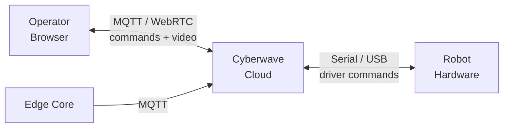

## What is Live Teleoperation?

Live Teleoperation lets you control a physical robot in real time through its [digital twin](/feature-reference/digital-twins) in the Cyberwave dashboard. Operator inputs — keyboard, gamepad, or SDK commands — are sent to the robot via Cyberwave's low-latency MQTT and WebRTC infrastructure, while live video and telemetry stream back to the browser.

<Info>
  Teleoperation requires a physical robot connected through [Cyberwave
  Edge](/feature-reference/edge/overview). The Edge Core bridges your hardware to the cloud in
  real time.
</Info>

---

## How It Works

<CardGroup cols={3}>
  <Card title="1. Operator Input" icon="keyboard">
    Send commands from the dashboard UI, a keyboard/gamepad controller, or the [Python SDK](/overview/tools/python-sdk) using `cw.affect("live")`.
  </Card>

<Card title="2. Cloud Relay" icon="cloud">
  Cyberwave routes commands through MQTT to the Edge Core running on the robot's
  host machine.
</Card>

  <Card title="3. Robot Execution" icon="robot">
    The Edge Core translates commands into hardware-level actions and streams sensor data back.
  </Card>
</CardGroup>


```mermaid
flowchart LR
    A["Operator\nBrowser"] <-->|"MQTT / WebRTC\ncommands + video"| B["Cyberwave\nCloud"]
    B <-->|"Serial / USB\ndriver commands"| C["Robot\nHardware"]
    D[Edge Core] -->|MQTT| B
```

---

## Supported Control Methods

| Method                  | Description                                                                                                                           |
| ----------------------- | ------------------------------------------------------------------------------------------------------------------------------------- |
| **Keyboard controller** | Assign a keyboard controller to a twin in the dashboard — move joints or navigate with key bindings                                   |
| **Gamepad**             | Use a USB or Bluetooth gamepad for more intuitive control of mobile robots and arms                                                   |
| **Leader arm**          | Teleoperate a follower arm using a physical leader arm (e.g. SO-101 leader/follower setup)                                             |
| **Python SDK**          | Send commands programmatically with `cw.affect("live")` — see the [SDK docs](/overview/tools/python-sdk#affect-simulation-vs-live-environment) |

---

## Monitoring and Controlling

{/* stub: content pending human curation before publishing */}

Editors enter Live and Simulate in **Controlling** by default. Choose **View →
Monitoring** to watch without sending robot commands; **Back to Controlling** in
the mode toolbar restores input. This personal choice is remembered per environment.
The right sidebar is labeled **Commands** while controlling; **Controllers** in
the workbench remains the place to configure control inputs and services.

Open simulation setup or hardware pairing from the active **Simulate** or **Live**
button at the top. A setup shortcut beside unavailable controls opens this same
menu. The Live menu always lists the environment’s hardware; selecting a twin
shows its own status and pairing shortcut in the sidebar.

Users without edit access remain in **Monitoring**. They can watch an active
simulation or connected hardware and switch between them when both are available.
Switching monitored sources does not start, stop, or reconfigure them. Editors
can still start and stop simulation while Monitoring; keyboard, gamepad, leader,
and control-agent commands remain disabled until they return to Controlling.

---

## Run a saved pose or movement

In **Controlling**, open **+ Pin** and choose the twin's **Saved poses and
movements**. The compact picker lists the poses and movements already saved for
that twin, its asset, or its environment. An icon identifies a pose or movement;
source labels appear only when names repeat. Select one to check it, then choose
**Run**. Live execution still requires confirmation and a connected runtime.
In **Edit**, select the twin, set its joints and save a pose, or create a movement
from saved poses. The existing authoring tools remain available. Switch to
**Simulate** or **Live**, then use **Commands → + Pin** to select the saved-motion
input. Edit preview and snap controls are separate from runtime execution.

A saved motion must target declared, independently controllable joints within
their limits. An unsupported joint in any step blocks the whole sequence. If a
driver declares that it cannot accept joint commands, the Live check explains
that restriction; simulation uses its own command transport. Fix the indicated
joint or driver configuration before retrying. Empty motion libraries are not
listed in **+ Pin**.

Monitoring keeps the control read-only. A stopped simulator leaves the selected
motion visible and explains why **Run** is unavailable. Simulation reports that
the command trajectory completed; verify measured joint feedback before treating
that as successful robot motion.

Both roles show the same **Executions** tab, with its **Runs** and **Gallery** views. Monitoring only withholds the controls that write: canceling a run and deleting captures.

---

## Create a map

{/* stub: content pending human curation before publishing */}

In **Live**, select a twin configured for mapping (for example, a configured Go2),
then open **Mapping** in the right panel. **Autonomy and logic** identifies the
service and its configured sensor inputs. Choose an available map type,
optionally enter a name, and click **Start mapping**.
Click **Stop mapping** to request that the robot save and upload the map.
In **Simulate**, wait for the simulation to finish starting before mapping.
The buttons show progress while a start or save request is pending.
Saved maps appear in the collapsible **Maps** group in the left scene list.
Select a map to see its preview and details in the right inspector. Use the eye
button to show it over the environment, or the three-dot menu for its other
actions. Docked twins remain in the robot's selection.
**Monitor** lets you inspect maps; switch to **Control** with edit access to start
or stop mapping. Older sensor-based setups retain their sensor selector.

In **Simulate** or **Live**, pin a supported map to **Control** to keep its view
beside your controls and cameras. This is separate from showing its layer in the
scene. A robot marker requires a compatible map reference and current position;
pinning does not select the robot's navigation map or start mapping.

## Organize the operator view

{/* stub: content pending human curation before publishing */}

In **Simulate** or **Live**, use **+ Pin** in **Control** to choose controls,
sensors and maps. Select a twin to customize its own view, or a map to inspect it.
**Deselect** returns to the environment's **Control** or **Monitor** panel.
Open the layout-name menu and choose **Arrange** to
reorder or unpin items, then **Save layout** to finish. Shared layouts require
permission to edit the environment. **Monitor** keeps the same views read-only.

## Choose a navigation destination

{/* stub: content pending human curation before publishing */}

Choose **Place target** to place a point or expand the coordinate fields.
**Go to point** appears once a point is set. **Stop navigation** appears while a
navigation command is active. A stopped simulation or unpaired live robot must
be made ready before commands can run.

**Destination set** means the destination configuration is valid. The navigation
service checks the route when you choose **Go to point**; this label does not
mean that a path is available or the robot has arrived. Follow the execution
status for the result.

## Keyboard (Driver)

{/* stub: content pending human curation before publishing */}

**Keyboard (Driver)** is the default keyboard controller for robots that ship a driver catalog. It does not hard-code a command list. Each twin shows the commands that twin actually declares (from the driver interface on that twin). Bind a key in the controller, then reuse the same saved controller on another twin of the same asset: only the **intersection** is usable — commands present in both the twin's catalog and the saved bindings. Extra bindings for commands this twin does not have are ignored; catalog commands with no binding stay unbound.

That is intentional. Subclass [`BaseDriver`](/feature-reference/edge/drivers/base-driver-class) (or declare the same commands in `cw-driver.yml`), run the driver, and the keyboard UI follows the manifest.

### Commands vs joints

{/* stub: content pending human curation before publishing */}

| Surface | Default | Hold a key | Tap a key |
| --- | --- | --- | --- |
| **Commands** | One-shot | Repeats only if the driver marks the command `continuous` (at that command's `rate_hz`, or 10 Hz) | Always one payload |
| **Joints** | Continuous stream while held | Keeps sending setpoint updates | One step |

A command like **capture photo** / **take photo** must stay one-shot. Locomotion and velocity commands are usually continuous. The driver manifest is the source of truth — the dashboard does not guess.

- **Rebind** a key by clicking its slot and pressing a new key — the previous owner of that key is replaced.
- **Radians / degrees** is a per-panel toggle: the controller panel and the controller card each convert their own joint readout.

### Which controller a new twin gets

{/* stub: content pending human curation before publishing */}

Each twin gets its own assigned controller. New twins start from the asset default — for catalog robots that is usually the public **Keyboard (Driver)** template.

When more than one keyboard controller matches that default:

1. A **Save as my copy** controller linked to the asset is chosen first (your bindings stay the default for new twins of that asset).
2. Other controllers in the same workspace.
3. The public template.

Picking a controller in the UI (or a specific slug/uuid in the SDK) always wins over this default. The public template is never overwritten; copies are yours.

## Driving Several Robots at Once

{/* stub: content pending human curation before publishing */}

Assign the same keyboard controller to more than one robot and a single keypress drives all of
them together. From an assigned controller, use **Assign this controller to other twins** to give
it to the environment's other robots in one step.

With the legacy input setup, every robot with a keyboard controller receives keyboard input — selecting one in the scene does
not stop the others from being driven. Each robot resolves the key against its own controller, so
a robot whose controller does not bind that key simply does nothing, and robots with different
controllers can still respond to the same key.

Each robot keeps its own commanded targets and its own panel, so two arms starting from different
poses stay independent: they receive the same *step*, not the same absolute position. Pick the robot
in the **Controllers** tab's twin list to read its panel; the others keep driving either way.

## Compose a keyboard by action

{/* stub: pending human curation; available with the new Control setup */}

In **Control**, use the same standard keyboard for Drive, Camera and Lights. Each
action stores its own keys and command values. No new controller copy is needed.
New twins adopt the asset's saved configuration; Workbench edits belong to that twin.
In **Map keys**, choose **Add key** to use the same command with a different
value: for example, G for Grip and R for Release, or separate light intensities.
Gamepads offer **Add input**. Set the parameters for each input before saving;
the overview and operating guide show the saved choices beside their keys.
Changing or removing one input preserves the others.
Leader mappings follow the same pattern: **Map joints** saves a mapping for the
asset, and **Use as default** selects its reusable input. Existing twins keep
their own mappings. Calibrate the physical leader on its twin before operating.
Standard inputs are offered only for commands the robot exposes. If its setup
changes, saved keys stay visible for review; **Needs robot setup** identifies the
missing interface without deleting your mappings.

In Workbench **Overview**, **Use saved mappings** checks and selects these keys for
one twin in this browser. It keeps the existing policy assignment and does not
start a policy or robot. Other keyboard presets in this browser are suspended.
If the simulator is stopped or still starting, pressing a mapped key explains why
the input is unavailable. The pinned guide highlights accepted keys, including
joint and gripper controls; this feedback does not confirm the robot reached its
target.
Changing mode pauses the selection; use the button again to resume. **Use previous
input setup** explicitly restores the legacy routing, including multi-twin control.

Saved edits take effect on the next selection. A pinned guide shows the selected
keys. Template changes, conflicting keys or an incompatible policy connection
must be reviewed first. Device/runtime availability and physical ownership checks
still apply; this browser selection is not an exclusive robot lease.

## Binding One Key to Several Joints

{/* stub: content pending human curation before publishing */}

A key can be bound to more than one joint. Press it and every joint bound to it steps together;
release it and all of them stop. In the key-bindings editor, assigning a key that another joint
already uses no longer replaces that binding — both are kept, and the row notes which other joints
the key drives.

This is for joints you want to move *independently but together*. Joints that are mechanically
coupled (a gripper's mirrored fingers, for example) already follow their driver automatically and
do not need their own binding.

---

## Where the Controller Panel Lives

{/* stub: content pending human curation before publishing */}

The keyboard controller panel lives in the **Controllers** tab of the bottom workbench, next to that
twin's key bindings. Select a twin in the tab's list to read its panel, or click the twin's keyboard
button in the control dock at the bottom of the 3D view to open the tab straight on that twin.

Keys keep driving the robot whether or not the panel is open — including with the workbench collapsed
and in fullscreen. The panel is a readout, not the input.

---

## Joint Targets Readout

{/* stub: content pending human curation before publishing */}

The keyboard controller panel shows, for each independently controllable joint:

| Column | Meaning |
| --- | --- |
| **target** | The position the controller last commanded |
| **position** | The position the robot (or simulator) reports |
| **Δ** | How far the joint still has to travel |
| **vel** / **effort** | Measured velocity and effort, when the driver publishes them |

It behaves the same in Simulation and Live mode. While you hold a key, the joint's current position and commanded target are also shown next to the key itself, as `position → target`.

Each key press moves the target by one fixed step from the **previous target**, so repeated presses add up predictably even while the robot is still moving toward the last one. A gap in the **Δ** column simply means the robot has not arrived yet; it turns amber if the robot is falling far enough behind that further presses are being held until it catches up.

A joint you have not driven yet shows no **target** at all, and driving one joint never gives the others a target: each key press commands only the joints it actually moves, and every other joint simply holds the last position it was commanded to.

The joint currently under a held key is highlighted. Mimic and fixed joints are not listed — they have no target of their own. Rotational joints are shown in degrees, linear joints in metres. A dash means the robot does not report that channel, and a dimmed position means the reading is stale.

If the connection to the robot drops, held keys are released and the commanded target is discarded rather than resumed. When the link comes back the target re-seeds from the position the robot actually reports, so the first press afterwards steps from where the arm really is.

---

## Shared Controller Templates

{/* stub — this section will be curated by a human before publishing */}

Use the same input template for multiple robots. In Workbench, **Edit mapping** saves supported keyboard and leader-arm mappings for that twin without changing the shared template. Composed keyboard inputs reuse one template across separate actions such as Drive, Camera direction and Lighting.

For a robot with joint control, open its joint action, add **Standard gamepad**, and choose a button or stick direction for each joint. Apply the mapping, then **Save**. Overview combines these mappings with the same gamepad’s other actions. In Workbench, select the device and hold its enable button to use it; release controls before enabling again.

Leader-arm settings can be reviewed offline; connect the device to capture calibration. If a save reports that the configuration changed, reopen it before editing again.

In Catalog and Workbench **Control**, Overview shows saved keys and leader-to-joint pairs. Open an action and choose **Configure inputs** to add an input or edit its mappings. In Monitor, **View input settings** opens the same setup read-only. Existing presets remain under **Other controls**; editing one does not connect a device or start movement.

Selecting saved keyboard or gamepad mappings pauses and disconnects the leader for that twin in this browser. Its assignment and saved calibration remain. Return to the previous input setup and choose **Connect** to use the leader again. Changing mode or losing Control access also releases the leader connection.

Older preset editors may still offer **Save as my copy**. This creates a separate reusable preset; it is not required for supported twin-local mapping edits. Custom presets remain supported.

---

## Switching Between Simulation and Live

The same [environment](/feature-reference/environment-editor/index) supports both modes. In **Simulation** mode, your actions affect the digital twin only. Switch to **Live** mode to drive the physical robot.

**From the dashboard:** use the mode toggle in the environment header.

Use **Capabilities → Joint-target availability** to declare **Simulation and
Live**, **Simulation only**, **Live only**, or **Not supported**. This also applies
to joint-based end-effector and motion actions. Unsupported actions are omitted
from Controllers and the action picker; their declaration remains in Capabilities.
Simulation-only actions stay visible but disabled in Live with a clear explanation.

A missing Live driver implementation disables Live separately; it does not remove
Simulation support. Without an explicit restriction, both runtimes are allowed
when the required structure, setup and runtime are ready. Edit keeps configuration
available for supported actions.

When a Live robot disconnects, its prepared control becomes disabled and explains
how to reconnect. Entered targets remain. Reconnecting checks the target again;
review and confirm the new Live plan before executing. Reconnection never runs
the previous command automatically.

**From the SDK:**

```python
from cyberwave import Cyberwave

cw = Cyberwave()

robot = cw.twin("the-robot-studio/so101")
cw.affect("playground")   # free; "simulation" starts a billable MuJoCo run
robot.joints.set("shoulder_pan", 45, degrees=True)  # moves the digital twin

cw.affect("live")
robot.joints.set("shoulder_pan", 45, degrees=True)  # moves the physical robot
```

---

## Live Video Streaming

During teleoperation, live camera feeds from the robot are streamed via WebRTC directly into the dashboard. You can view one or multiple camera feeds alongside the 3D digital twin view.

Supported camera types:

- **Standard cameras** (USB/CSI via OpenCV)
- **Intel RealSense** (RGB + depth)

The media service also exposes a twin-scoped MQTT command channel for media-control operations on active WebRTC streams. This lets edge drivers and teleoperation clients request media-service actions without changing the WebRTC signaling topics.

See the [Python SDK video streaming docs](/overview/tools/python-sdk#video-streaming-webrtc) for details on setting up camera streams from edge devices.

---

## Prerequisites

<Steps>
  <Step title="Digital Twin configured">
    Create a [digital twin](/feature-reference/digital-twins) for your robot in an
    [environment](/feature-reference/environment-editor/index).
  </Step>
  <Step title="Edge Core installed">
    Install and configure [Cyberwave Edge](/feature-reference/edge/overview) on the machine
    connected to the robot hardware.
  </Step>
  <Step title="Hardware paired">
    Pair the physical robot with the digital twin via the CLI — see the [Edge
    overview](/feature-reference/edge/overview).
  </Step>
</Steps>

---

## Latency

A small delay between operator input and robot response is expected in any teleoperation system. The Cyberwave teleoperation stack uses WebRTC for video and MQTT for control commands, keeping end-to-end latency low enough for hands-on robot work.

---

## Video Walkthroughs

<CardGroup cols={2}>
  <Card
    title="Go2 Digital to Physical"
    icon="dog"
    href="/tutorials/go2-digital-to-physical"
  >
    End-to-end: catalog to physical robot deployment with a Unitree Go2
  </Card>
  <Card
    title="Rover AI Inspection"
    icon="robot"
    href="/tutorials/rover-ai-mission"
  >
    Autonomous rover mission with AI-driven analysis in simulation
  </Card>
</CardGroup>

---

## Next Steps

<CardGroup cols={3}>
  <Card title="Python SDK" icon="code" href="/overview/tools/python-sdk">
    Full SDK reference for live robot control
  </Card>
  <Card title="Digital twins" icon="clone" href="/feature-reference/digital-twins">
    Configure twin capabilities and sensors
  </Card>
  <Card
    title="Workflows"
    icon="diagram-project"
    href="/feature-reference/workflows"
  >
    Automate operations with visual workflows
  </Card>
</CardGroup>


## Shared gamepad settings

{/* TODO(docs): pending editorial review */}

In **Control → Overview**, open **Input settings** beside a saved gamepad to
change its enable button and stick dead zone for all its action mappings.
New mappings reuse those settings. Catalog saves apply to asset defaults;
Workbench saves apply to that twin. An input already in use keeps its current
settings until you explicitly use the update.
