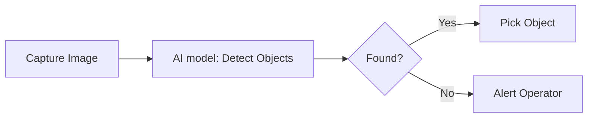

## What are AI models?

AI models registered in your Cyberwave workspace can process various inputs — video, images, audio, text, or robot actions. They integrate with workflows and can run in the cloud or on edge devices.

<Info>
  AI models define **what the model can do** (input types) and **where it runs**
  (provider). The actual inference happens through the model provider's API or
  on your edge device.
</Info>

---

## Browsing the model catalog

Search **AI models** by name or provider. Model cards use compact rectangular styling and short workspace/model identifiers; asset cards retain rounded image previews. Browse public models and a single row of your matching workspace models together. Empty personal sections are hidden; **All models / Yours / Public** changes the scope. The left sidebar filters input type, deployment, declared task, vendor, size and edge runtime. On small screens, **Filters** opens a scrollable sheet; **Show results** returns to the catalog. Search, filters, and scope stay in the URL, so returning from a model detail restores your selection. Models must support every selected input; vendor and task selections match any selected value. Selected filters can be removed above the results.

## Model Capabilities

Each AI model specifies what inputs it can process:

| Capability                 | Description           | Example Use Cases                    |
| -------------------------- | --------------------- | ------------------------------------ |
| `can_take_video_as_input`  | Process video streams | Surveillance, teleoperation          |
| `can_take_image_as_input`  | Process single images | Quality inspection, object detection |
| `can_take_audio_as_input`  | Process audio data    | Voice commands, anomaly detection    |
| `can_take_text_as_input`   | Process text prompts  | Natural language commands            |
| `can_take_action_as_input` | Process robot actions | Behavior cloning, RL policies        |

---

## Model Providers

Models can run through different providers:

<CardGroup cols={2}>
  <Card title="Local / Edge" icon="microchip">
    Run on your edge devices using ONNX, TensorRT, or custom inference
  </Card>
  <Card title="Cloud APIs" icon="cloud">
    Use OpenAI, Anthropic, or other cloud AI services
  </Card>
  <Card title="Hugging Face" icon="face-smile">
    Deploy models from Hugging Face Hub
  </Card>
  <Card title="Custom" icon="code">
    Your own inference servers and endpoints
  </Card>
</CardGroup>

---

## Registering a Model

<Tabs>
  <Tab title="Dashboard">
    <Steps>
      <Step title="Navigate">
        Go to **AI models** in your workspace.
      </Step>
      <Step title="Add model">
        Click **Add model**.
      </Step>
      <Step title="Configure">
        Fill in the model details: name, description, external ID (model identifier for the provider), provider name (e.g. `openai`, `local`, `huggingface`), and input capabilities.
      </Step>
      <Step title="Create">
        Click **Create**.
      </Step>
    </Steps>
  </Tab>
  <Tab title="Python SDK">
    ```python
    from cyberwave import Cyberwave

    cw = Cyberwave(api_key="your_api_key")

    model = cw.api.src_app_api_mlmodels_create_mlmodel(ml_model_create_schema={
        "name": "Object Detector",
        "description": "YOLOv8 model for detecting warehouse items",
        "model_external_id": "yolov8n",
        "model_provider_name": "local",
        "can_take_image_as_input": True,
        "can_take_video_as_input": True,
        "visibility": "private",
        "tags": ["vision", "detection", "warehouse"]
    })

    print(f"Model UUID: {model.uuid}")
    ```

  </Tab>
</Tabs>

---

## Model Visibility

| Visibility  | Who Can Access                |
| ----------- | ----------------------------- |
| `private`   | Only your workspace members   |
| `workspace` | All workspace members         |
| `public`    | Anyone (admin-only to create) |

---

## Using Models in Workflows

AI models integrate with workflow nodes for automated processing:



---

## Try it in the Playground

Every model detail page (`/{workspace-slug}/models/{model-slug}` or
`/models/{uuid}` for models without a slug) has an interactive
**Playground** tab. Gemini Robotics-ER renders detected points as an
overlay on your image, VLMs stream back text, `im2mesh` models preview
the generated GLB inline, and edge/VLA models surface the exact CLI +
SDK commands needed to run them locally. See [Model playground](/feature-reference/ml-models/playground).

---

## Running Inference

<Tabs>
  <Tab title="Cloud Models">
    For cloud-based models, Cyberwave routes requests to the provider:

    ```python
    response = cw.models.run(
        model.uuid,
        prompt="What objects do you see? How should the robot pick them up?",
        image_url="https://...",
    )
    ```

  </Tab>
  <Tab title="Edge Models">
    For local models, run inference on your edge device using your preferred framework (PyTorch, ONNX, TensorRT) and publish results back to Cyberwave via MQTT or the SDK.
  </Tab>
</Tabs>

---

## Listing Models

```python
from cyberwave import Cyberwave

cw = Cyberwave(api_key="your_api_key")

models = cw.models.list()

for model in models:
    print(f"{model.name} ({model.model_provider_name})")
    print(f"  Video: {model.can_take_video_as_input}")
    print(f"  Image: {model.can_take_image_as_input}")
    print(f"  Text: {model.can_take_text_as_input}")
```

---

## Vision-Language-Action (VLA) Models

{/* stub - to be expanded */}

VLA models combine vision, language understanding, and action generation for end-to-end robot control. Cyberwave provides infrastructure for running VLA model inference and training on Cloud Nodes.

### Supported VLA Models

| Model   | Description                              | Deployment |
| ------- | ---------------------------------------- | ---------- |
| SmolVLA | Lightweight VLA from HuggingFace LeRobot | Cloud Node |
| OpenVLA | Open-source VLA model                    | Cloud Node |

### Model Weights

VLA models store their weights in Cyberwave and expose them via the MLModel API:

```
GET /api/v1/mlmodels/{uuid}/weights
→ { "signed_url": "...", "expires_at": "..." }
```

This allows Cloud Nodes to fetch model weights on demand and cache them locally.

### Running VLA Inference

VLA inference runs on Cloud Nodes using the `CwProcessor` orchestrator:

1. **Weights Download** - Fetched from MLModel API via signed URLs
2. **Camera Binding** - Background threads continuously fetch camera frames
3. **Control Loop** - Observe → Predict → Execute cycle
4. **Action Publishing** - Predicted actions sent to robot via MQTT

<Card title="VLA Cloud Node Guide" icon="brain" href="/overview/tools/vla-cloud-node">
  Learn how to build and deploy VLA models on Cyberwave Cloud Nodes
</Card>
