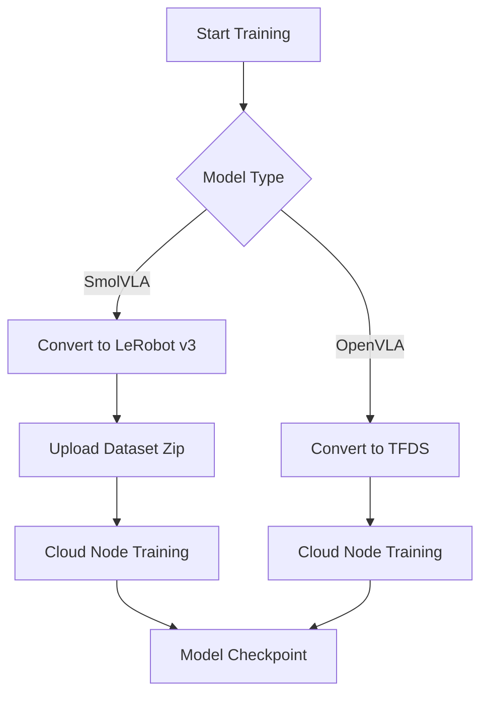

{/* stub — content pending human curation before publishing */}

## Overview

SmolVLA is a lightweight Vision-Language-Action model optimized for edge deployment. Cyberwave supports fine-tuning SmolVLA models on your custom datasets using the LeRobot v3 dataset format.

<Info>
SmolVLA models use the **LeRobot v3 dataset format** for training, which differs from the TFDS format used by OpenVLA models. The platform handles format conversion automatically.
</Info>

---

## Model Selection

When starting a new training:

1. Navigate to **AI → Training** in your environment
2. Select **SmolVLA** from the available model architectures
3. The platform will automatically use the LeRobot training pipeline

<Note>
Only models with `is_trainable: true` appear in the training model selection. SmolVLA is pre-configured as trainable.
</Note>

---

## Dataset Conversion

When you start training with a SmolVLA model, the platform:

1. Joins your episode parquet files into a single dataset
2. Converts the OpenVLA-format parquet to LeRobot v3 format
3. Handles camera role mapping (primary, wrist, secondary)
4. Encodes video frames using AV1 codec (configurable)

The conversion is cached — subsequent trainings with the same dataset and configuration skip the conversion step.

---

## Training Parameters

SmolVLA training supports:

| Parameter | Description | Default |
|-----------|-------------|---------|
| `fps` | Target frames per second | 30 |
| `use_videos` | Store frames as MP4 videos | true |
| `vcodec` | Video codec | libsvtav1 |
| `num_cameras` | Number of camera streams (1-3) | 1 |

---

## Camera Configuration

Camera roles are mapped to LeRobot conventions:

- `primary` → `observation.images.primary`
- `wrist` → `observation.images.wrist`
- `secondary` → `observation.images.secondary`

Configure camera roles in the training wizard or via the API.

---

## Training Workflow

---

## Deployment

After training completes:

1. Deploy the trained model as a controller policy
2. Assign the VLA controller to your robot twin
3. Use natural language prompts to control the robot

<Tip>
SmolVLA models are optimized for edge inference, making them suitable for real-time robot control with lower latency than larger VLA models.
</Tip>

---

## Related

- [Train VLA Models](/tutorials/train-vla-cyberwave) — Complete training tutorial
- [ML Models Overview](/use-cyberwave/ml-models) — Model capabilities and providers
- [Deploy Models](/use-cyberwave/ml-models/deploy) — Deployment options
