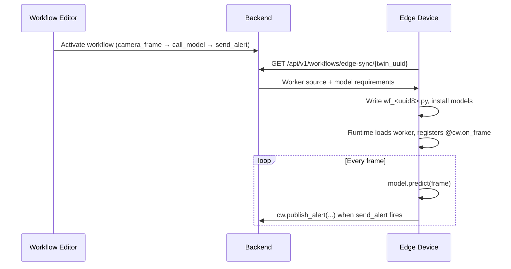
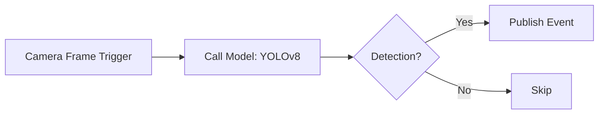

## What are Workflows?

Workflows in Cyberwave let you create automated sequences of robot operations. Connect nodes visually to build complex behaviors without writing procedural code.

Workflows can run **on the cloud** (Celery tasks) or **on the edge device** depending on the trigger type. Cloud triggers handle schedule, webhook, event, and manual execution. The `camera_frame` trigger runs ML inference directly on the edge — no video leaves the device.

---

## Workflow Components

### Nodes

Nodes are the building blocks of workflows. Each node performs a specific action.

> stub: Nodes are organised into a hybrid robotics + automation taxonomy. The same categories show up in the editor palette and on `GET /api/v1/workflows/config` (`node_categories`), so the docs, the API, and the UI all read from the same `WorkflowNodeCategory` enum (see `cyberwave-backend/src/lib/node_categories.py`). Categories with no nodes today (Perception) are reserved — they appear in the API response but are hidden in the palette until they ship.

<CardGroup cols={2}>
  <Card title="Triggers" icon="bolt">
    Start the workflow on an event, schedule, or incoming message: manual, schedule, webhook, event, MQTT, email, camera_frame, alert
  </Card>
  <Card title="Data Sources" icon="database">
    Pull snapshots and samples from sensors, cameras, and external systems on demand: `data_source`
  </Card>
  <Card title="Perception" icon="eye">
    Convert raw signals into reliable observations — reserved for object trackers, sensor fusion, IMU filtering, ASR (no nodes ship today)
  </Card>
  <Card title="Transform & Routing" icon="shuffle">
    Reshape, convert, route, multiplex, or fan out data: `json_parser`, `annotate`, `anonymize`
  </Card>
  <Card title="State & Memory" icon="database">
    Store and retrieve memory over time: `create_asset`, `edit_asset`, `create_attachment`, `update_attachment`, `video_tagger`
  </Card>
  <Card title="Intelligence" icon="brain">
    Use models for interpretation, reasoning, or prediction: `call_model` (cloud VLM/LLM and edge ML)
  </Card>
  <Card title="Decision & Control Flow" icon="code-branch">
    Choose what happens next: `conditional`, `loop`; FSM / Behavior Tree / Rule Engine on the roadmap
  </Card>
  <Card title="Actuation" icon="robot">
    Execute physical or twin-side actions: `twin_control` (Move Twin); future joint / gripper / navigation primitives
  </Card>
  <Card title="Integration" icon="plug">
    Talk to external systems and run user-supplied logic: `http_request`, `send_email`, `code` (edge-only)
  </Card>
  <Card title="Observability & Safety" icon="shield-halved">
    Guard, validate, observe, and alert: `send_alert`; validators, watchdogs, e-stop guards, and anomaly detectors are on the roadmap
  </Card>
</CardGroup>

### Connections

Connections define the execution flow between nodes:
- **Sequential**: Execute nodes one after another
- **Parallel**: Execute multiple nodes simultaneously
- **Conditional**: Branch based on conditions

<Info>
Connection validation prevents invalid graphs: trigger nodes cannot accept incoming connections, cycles are blocked, and `camera_frame` triggers can only connect to `call_model` nodes.
</Info>

---

## Trigger Types

| Trigger | Where it runs | How it fires |
|---------|--------------|-------------|
| **Manual** | Cloud (Celery) | User clicks "Run" in the UI or triggers via SDK/API |
| **Schedule** | Cloud (Celery) | Cron or interval timer |
| **Webhook** | Cloud (Celery) | HTTP POST to a webhook URL |
| **Event** | Cloud (Celery) | Business event matching conditions |
| **MQTT** | Cloud (Celery) | MQTT message on a topic |
| **Zenoh** | Edge/local data plane | Zenoh message on a key expression |
| **Email** | Cloud (Celery) | Incoming email |
| **Camera Frame** | **Edge device** | Every camera frame, locally — never sends video to the cloud |

---

## Creating a Workflow

<Tabs>
  <Tab title="Dashboard">
    <Steps>
      <Step title="Open Workflows">
        Navigate to **Workflows** in the dashboard.
      </Step>
      <Step title="Create">
        Click **Create Workflow**. Give it a name, optional slug (unique within the workspace), and visibility.
      </Step>
      <Step title="Build">
        Drag nodes from the palette to the canvas. Connect nodes by dragging from output to input ports.
      </Step>
      <Step title="Configure">
        Configure each node's parameters (twin UUID, model, confidence threshold, send-alert metadata, etc.).
      </Step>
      <Step title="Activate">
        Click **Activate**. For edge workflows, sync to the device with the CLI or wait for the next automatic sync.
      </Step>
    </Steps>
  </Tab>
  <Tab title="CLI">
    ```bash
    # List workflows
    cyberwave workflow list
    cyberwave workflow list --json

    # Create from template
    cyberwave workflow create --template motion-detection

    # Create with custom name
    cyberwave workflow create -n "My Workflow"

    # Show workflow details (interactive selection if UUID omitted)
    cyberwave workflow show
    cyberwave workflow show <uuid>

    # Activate / deactivate
    cyberwave workflow activate
    cyberwave workflow deactivate

    # Sync workflow to edge node(s)
    cyberwave workflow sync
    cyberwave workflow sync --edge-active                 # filter selector to active edge workflows
    cyberwave workflow sync <uuid> --base-url http://192.168.10.101:8000

    # Inspect what the edge compiler emitted (and why) for a workflow
    cyberwave workflow compile <uuid>
    cyberwave workflow compile <uuid> --json            # raw API response

    # Download the generated worker source
    cyberwave workflow compile-source <uuid>            # to stdout
    cyberwave workflow compile-source <uuid> -o ./wf.py # to a file

    # Delete
    cyberwave workflow delete --yes
    ```

    All subcommands accept `--base-url` / `-u` to override the API URL. When a UUID argument is omitted, an interactive arrow-key selector is shown.

    `compile` wraps `/api/v1/workflows/{uuid}/compile` and reports the artifact shape the unified edge compiler emitted (`perception` for camera-frame graphs, `navigation` for graphs with a Move Twin node), the auto-derived target twin, model requirements, and any compiler warnings — including the diagnostic from the backend's `diagnose_compilation_dispatch` helper when the workflow's graph shape isn't compilable. Reach for it when `cyberwave workflow sync` reports the cloud isn't shipping a workflow to your edge. `compile-source` is the companion download for the generated `wf_*.py`.
  </Tab>
  <Tab title="Python SDK">
    ```python
    from cyberwave import Cyberwave

    cw = Cyberwave(api_key="your_api_key")

    workflows = cw.workflows.list()

    run = cw.workflows.trigger("workflow-uuid", inputs={"speed": 0.5})
    run.wait(timeout=60)
    print(f"Workflow finished: {run.status}")
    ```
  </Tab>
</Tabs>

---

## Edge Workflows (Camera Frame)

The `camera_frame` trigger is designed for on-device ML inference. The backend generates a Python worker file that runs directly on the edge — raw video frames never leave the device.

### How it works



### Migrating from `emit_event`

Older workflows configured implicit alerts via an `emit_event` block on the `call_model` node (`event_type`, `severity`, `emit_mode`, `cooldown_seconds`). That path was removed: `emit_event` is no longer a schema field, the next save of any `call_model` node strips leftover `emit_event` values from `parameters` and `metadata.input_mappings` so the saved graph converges to the post-migration shape, and `call_model` no longer publishes alerts on its own. Pre-migration rows that haven't been re-saved yet still load — codegen also drops `emit_event` during compilation, so they ship a worker that runs inference but publishes nothing.

To raise alerts from detections, wire an explicit `send_alert` node downstream of `call_model`. The legacy fields map onto existing nodes:

| Legacy `emit_event` field | Replacement |
|---------------------------|-------------|
| `enabled: false` | Don't add a `send_alert` node |
| `event_type` / `severity` | `send_alert.parameters.alert_type` / `severity` |
| `emit_mode: on_enter` / `on_change` | Insert a `detection_event_gate` between `call_model` and `send_alert` |
| `cooldown_seconds` | Insert a `timed_condition` (`mode: debounce`, `cooldown_s: <seconds>`) before `send_alert` |
| Implicit `force=True` (no UI knob — the legacy path always passed it) | The emitter defaults `force=True` on a `send_alert` whose direct upstream is `call_model`, so the per-frame loop bypasses the backend's content-hash dedupe and identical consecutive detections still raise distinct alerts. Set `send_alert.parameters.force` to `false` to opt back into the dedupe. When a gate or `timed_condition` sits between `call_model` and `send_alert` the heuristic backs off and the long-standing `force=False` default applies, since the gate already debounces. |

A typical edge chain becomes:

```
camera_frame → call_model → detection_event_gate → timed_condition → send_alert
```

A `timed_condition` wired downstream of `call_model` *without* a trailing `send_alert` is now inert — the legacy implicit-alert path it used to gate is gone. The compiler surfaces a warning on the resulting compilation (the `/compile` API and `cyberwave workflow sync` preflight already render it) so the silent-skip case becomes visible instead of looking like a quietly broken alert chain.

Existing workflows continue to load and run inference, but **stop emitting alerts** until you add the explicit chain — the migration is intentionally a hard break so silent regressions are impossible.

### Syncing to the edge

After activating a workflow in the UI, push it to edge devices:

```bash
# Interactive: picks the workflow, discovers target twins, sends sync via MQTT
cyberwave workflow sync

# Explicit
cyberwave workflow sync <workflow-uuid>

# Or sync a specific twin directly
cyberwave edge sync-workflows --twin-uuid <twin-uuid>
```

The CLI sends a `sync_workflows` command via MQTT. Edge core receives it and immediately pulls the latest worker files from the backend — no need to wait for the periodic cycle.

> stub: You can also trigger the same `sync_workflows` MQTT command from the twin editor in the dashboard via the **Sync workflow** action (next to **Restart edge core**). The dashboard calls `POST /api/v1/twins/{uuid}/sync-workflows`, which publishes the same MQTT command as the CLI on `cyberwave/twin/{twin_uuid}/command`.

> stub: The CLI derives the MQTT topic prefix (`dev`, `staging`, empty for production) from `CYBERWAVE_ENVIRONMENT`/credentials and cross-checks it against the broker host before publishing. A mismatch (e.g. dev broker with production prefix) aborts with a clear error instead of silently shipping the command into a topic edge-core never subscribed to. Override with `CYBERWAVE_MQTT_TOPIC_PREFIX` if you really need to.

The edge device also syncs automatically on boot and periodically (default ~5 min, configurable via `CYBERWAVE_WORKER_SYNC_INTERVAL_LOOPS`).

---

## Execution Modes

Workflows can be triggered by:

| Trigger | Description |
|---|---|
| **Manual** | Run on demand from the dashboard or SDK |
| **Schedule** | Run at specific times (cron) |
| **Events** | Run when sensor data matches conditions |
| **API** | Trigger from external systems via REST or MCP |
| **Camera Frame** | Run on every camera frame at the edge device |

---

## Monitoring Executions

Track workflow execution status and results:

```python
runs = cw.workflow_runs.list(workflow_uuid="workflow-uuid")

for run in runs:
    print(f"Status: {run.status}, Started: {run.started_at}")
```

Each execution tracks status at both the workflow level and individual node level, including `started_at`, `finished_at`, and `error_message` fields.

### Check if a Workflow is Running

Use `is_running()` to quickly check if a workflow has any active execution without manually querying runs:

```python
wf = cw.workflows.get("workflow-uuid")
if wf.is_running():
    print("Workflow is currently executing")
```

This returns `True` when any run has status `running`, `waiting`, or `requested`.

In the dashboard, a **Running** indicator appears next to the Active badge in the workflow editor header whenever the workflow has an active execution. It refreshes automatically every 2 seconds.

---

## Example: Edge Detection Workflow

A camera_frame workflow that runs YOLO on the edge and emits alerts:



---

## Best Practices

- **Keep workflows focused** — create separate workflows for distinct operations rather than one large workflow. This makes debugging and maintenance easier.
- **Add error handling** — include condition nodes to handle failure cases gracefully. Consider what should happen if a joint can't reach its target.
- **Use meaningful names** — name nodes and workflows descriptively. "Alert on person in zone A" is better than "Node 1".
- **Use `on_enter` emit mode for alerts** — avoids flooding with repeated events while the same object stays in frame.
- **Set appropriate cooldowns** — balance between responsiveness and event volume. 5s is a safe default; lower for time-critical use cases.
- **Eject before customising** — never edit `wf_*.py` files directly. Copy them to a custom name and deactivate the originating workflow.

---

## Environment-bound workflows

A workflow can optionally be bound to an environment (set `environment_uuid` when creating it, or open the *Create Environment Workflow* dialog from an environment panel). Bound workflows are scoped to that environment in the editor, surface in the environment's workflow list, and ship to the environment's edges through `edge_sync_workflows` when combined with `run_on_edge: true`.

Compiler dispatch keys off the graph itself: a `twin_control` node renders through the navigation path and a `camera_frame` trigger renders through the perception path, regardless of how the workflow is bound. Run `cyberwave workflow compile <uuid>` to see exactly which path the unified compiler took, or the diagnostic explaining why it skipped the workflow.

---

## Code node (stub)

The **Code** action node runs a user-supplied Python function on the edge. It is only valid on workflows with `run_on_edge: true` — Cyberwave never executes user-authored code on its own infrastructure.

- **Runtime**: Python, on the edge worker container that already runs the compiled `wf_*.py` module.
- **I/O contract**: Every Code node must define a top-level `def run(input: dict) -> dict`. The return value is fed into the next Code node's `input` via an internal `_node_output` variable.
- **Validation**: The API parses the body with `ast.parse` on create/update and rejects syntax errors or missing `run` functions inline, before activation.
- **Activation guards**: Activating a workflow is blocked if it contains a Code node and either (a) `run_on_edge` is false, or (b) the workflow uses a `camera_frame` trigger (not yet supported by the perception path of the edge compiler).
- **Availability**: The node is always visible in the palette; it is disabled with an "Available only on run_on_edge workflows" tooltip when the workflow is not edge-bound.
