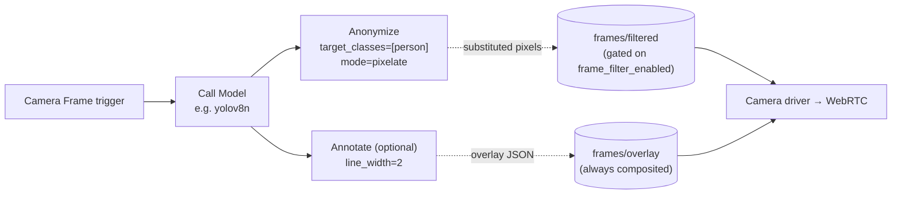

## Overview

`annotate` and `anonymize` are unified workflow nodes. When wired
downstream of a `Camera Frame` trigger + `Call Model` chain they are
compiled into the **edge worker** (not the cloud) and transform each
camera frame in place. They exist to let you build the same kind of
pipeline that previously required a hand-edited
`~/.cyberwave/workers/<name>.py` — pixelating people for privacy,
drawing detection overlays for a kiosk display, etc. — entirely from
the workflow editor in the UI.

<Note>
  **The two nodes ride different wire contracts.** `anonymize` rewrites pixels
  and publishes the resulting frame to `FILTERED_FRAME_CHANNEL`
  (`frames/filtered`); the camera driver substitutes that frame into the WebRTC
  stream — but only when the per-twin **Privacy Frame Filter**
  (`frame_filter_enabled`) is on, since the substitution is privacy-fail-closed.
  `annotate` instead publishes a small JSON overlay spec to
  `FRAME_OVERLAY_CHANNEL` (`frames/overlay`); the driver subscribes to that
  channel unconditionally and composites the boxes onto every frame, so
  **annotate works regardless of the privacy flag**. If you only have an
  annotate node, leave the flag off.
</Note>

<Note>
  These same node types also run in the cloud workflow runner when wired off a
  non-camera-frame trigger (e.g. a webhook feeding an `image_url`). The cloud
  variant is documented at
  [`anonymize`](/use-cyberwave/workflows/anonymize-image); both paths share the
  same pixelation / bbox-drawing algorithms.
</Note>

On a camera-frame chain, both nodes always run **after** a `Call Model` node and **before** the frame leaves the edge. `anonymize` publishes the rewritten pixels on `FILTERED_FRAME_CHANNEL` (driver substitutes into WebRTC, gated on the privacy flag); `annotate` publishes its styled overlay spec on `FRAME_OVERLAY_CHANNEL` (driver composites unconditionally).



## Node types

| Node        | Palette label | What it draws                                                                                                                                        |
| ----------- | ------------- | ---------------------------------------------------------------------------------------------------------------------------------------------------- |
| `anonymize` | **Anonymize** | Pixelates / blurs / redacts / boxes the bounding region of every detection in `target_classes`.                                                      |
| `annotate`  | **Annotate**  | Draws coloured bounding boxes and a `label · confidence` caption for every detection in `target_classes` (or all detections when the list is empty). |

You can chain them in either order: a workflow with both nodes
produces a frame where people are pixelated AND every other detection
has a labelled box. Wire order between `annotate` and `anonymize` no
longer affects the encoded stream — they ride independent channels —
so the workflow editor accepts both `annotate → anonymize` and
`anonymize → annotate`.

<Note>
  Fan-out (a single source on a camera-frame chain wired into more than one
  enabled `annotate` / `anonymize`) is rejected at codegen time with a clear
  error — the published frame and overlay are a single artefact per twin, so
  multiple branches would be silently collapsed. Cloud-only sub-graphs in the
  same workflow are not subject to this rule.
</Note>

### Anonymize parameters

| Parameter        | Type       | Default      | Notes                                                                                                                                                                                         |
| ---------------- | ---------- | ------------ | --------------------------------------------------------------------------------------------------------------------------------------------------------------------------------------------- |
| `target_classes` | `string[]` | `["person"]` | Class labels to anonymise. Empty list is a no-op.                                                                                                                                             |
| `mode`           | `string`   | `"pixelate"` | One of `pixelate`, `blur`, `redact`, `bbox`.                                                                                                                                                  |
| `pixel_size`     | `int?`     | adaptive     | Pixel block edge length in pixels. Omit to let the helper choose based on the bounding box size.                                                                                              |
| `fallback`       | `string`   | `"black"`    | Edge-only. What the worker publishes when no detection matches `target_classes`. One of `black`, `raw`, `hold_last`. See [On Empty Detections fallback](#on-empty-detections-fallback) below. |

Internally this maps onto `cyberwave.vision.blank_persons(frame, results.detections, labels=target_classes, mode=mode, pixel_size=pixel_size)`. We use `blank_persons` rather than `anonymize_frame` so pose-model keypoints don't get unexpectedly overlaid on top of the mosaic — the UI labels this node "Anonymize" and users don't expect skeleton lines to appear. If you want both anonymisation _and_ a skeleton overlay, call `anonymize_frame` from a hand-written worker.

#### On Empty Detections fallback

<Info>Stub — a human will curate the wording before publishing.</Info>

`blank_persons` only obscures bbox regions for detections in `target_classes`, so on a frame where the model returns _no_ matching detections (occluded subject, sub-threshold confidence, transient miss) the resulting `_frame` is byte-for-byte identical to the raw capture. Publishing that to `FILTERED_FRAME_CHANNEL` would silently leak un-anonymized pixels through the WebRTC stream, so the edge worker doesn't — instead, the per-node `fallback` parameter says what to publish on the empty-detection branch:

| Value             | What the worker publishes on misses                                                                                                                                                                  | Use when                                                                                                                                                                                          |
| ----------------- | ---------------------------------------------------------------------------------------------------------------------------------------------------------------------------------------------------- | ------------------------------------------------------------------------------------------------------------------------------------------------------------------------------------------------- |
| `black` (default) | A `np.zeros_like(frame)` black frame. **Privacy fail-closed.**                                                                                                                                       | The default. Pick this whenever the camera scene contains anything sensitive that a model miss would reveal.                                                                                      |
| `raw`             | The raw camera frame, un-anonymized. **Operator opt-in privacy regression.**                                                                                                                         | The camera scene is non-sensitive on its own and "always show the live scene" is a product requirement (e.g. a kiosk that pixelates passersby but should never go black when the lobby is empty). |
| `hold_last`       | Nothing — the worker skips the publish. The camera driver's freshness window (`frame_filter.py`) holds the last filtered frame until staleness, then falls back to its own black on the driver side. | You want a brief "stick" on the last anonymized frame across a transient miss without giving up the privacy contract on extended ones.                                                            |

When multiple anonymize nodes are chained on the same frame, the **most-restrictive `fallback` wins** (`black` > `hold_last` > `raw`) so a downstream `raw` can't silently weaken an upstream `black`. Resolution lives in `worker_codegen.py::_resolve_anonymize_fallback`.

### Annotate parameters

| Parameter        | Type       | Default | Notes                                                                                                                                                                          |
| ---------------- | ---------- | ------- | ------------------------------------------------------------------------------------------------------------------------------------------------------------------------------ |
| `target_classes` | `string[]` | `[]`    | Class labels to annotate. **Empty means "draw every detection"** (matches the SDK helper's `labels=None` default).                                                             |
| `line_width`     | `int`      | `2`     | Bounding box stroke width in pixels.                                                                                                                                           |
| `font_size`      | `int`      | `14`    | Caption font size in pixels (cloud convention). On the edge the codegen translates it into OpenCV's `font_scale` automatically (14 px → ~0.5 scale at `FONT_HERSHEY_SIMPLEX`). |

On the edge this maps onto `cyberwave.vision.build_overlay_payload(results.detections, labels=target_classes_or_None, line_width=..., font_size=...)`, which the worker publishes on `FRAME_OVERLAY_CHANNEL`. The driver reads the same `font_size` / `line_width` from the payload's `style` block and draws the boxes at WebRTC encode time. (The legacy `cyberwave.vision.annotate_detections` numpy helper is still exported for hand-written workers that draw on a frame buffer directly — the workflow node no longer uses it.)

## Wiring rules

On a camera-frame chain, an `annotate` / `anonymize` node MUST have a `Call Model` somewhere in its upstream lineage. The workflow editor enforces this in two places:

- **Connection-time:** dragging a `Camera Frame` trigger directly onto a non-`Call Model` target shows an "Invalid connection" toast and refuses the edge.
- **Graph-level:** any `annotate` / `anonymize` node on a camera-frame chain whose ancestors don't include a `Call Model` (e.g. because the upstream model was deleted later) is decorated with a yellow warning triangle in the canvas, and the worker codegen rejects the workflow with a `WorkerCodegenError`.

The cloud variant (e.g. `webhook → call_model → annotate`) does not require a `call_model` ancestor at all — any image-producing upstream is accepted because the cloud runner takes an explicit `image_url`.

## What gets generated

When the workflow contains a camera-frame edge filter chain, the backend's `worker_codegen` adds the imports it needs (`blank_persons` + `FILTERED_FRAME_CHANNEL` for anonymize, `build_overlay_payload` + `FRAME_OVERLAY_CHANNEL` for annotate) and emits one block per filter inside the per-trigger hook, after the `model.predict(...)` call:

```python
from cyberwave.vision import blank_persons, build_overlay_payload
from cyberwave.data import FILTERED_FRAME_CHANNEL, FRAME_OVERLAY_CHANNEL

@cw.on_frame(twin_uuid="...", sensor="front")
def _hook(frame, ctx):
    results = _model_yolov8n.predict(frame, confidence=0.4, twin_uuid="...")

    # anonymize: substitute pixels (gated on frame_filter_enabled)
    _frame = blank_persons(frame, results.detections,
                           labels=['person'], mode='pixelate')
    cw.data.publish(FILTERED_FRAME_CHANNEL, _frame, twin_uuid="...")

    # annotate: publish overlay metadata (always composited)
    cw.data.publish(
        FRAME_OVERLAY_CHANNEL,
        build_overlay_payload(results.detections,
                              line_width=2, font_size=14),
        twin_uuid="...",
    )
```

`anonymize` mutates `_frame` and publishes once on `FILTERED_FRAME_CHANNEL`. `annotate` does **not** touch `_frame` — it only publishes a JSON overlay spec on `FRAME_OVERLAY_CHANNEL`, which the camera driver composites onto every frame at WebRTC encode time, regardless of the privacy flag. If the chain has zero edge-filter nodes, neither the imports nor the publishes are emitted.

The vision helpers are imported lazily so workflows that don't use an edge-filter node don't pull in OpenCV.

## Frame-filter wire contract

The published frame ends up on the worker container's `cyberwave.data.FILTERED_FRAME_CHANNEL` (`"frames/filtered"`). The camera driver subscribes to this channel and substitutes the frame into the WebRTC stream it serves to the frontend, provided two preconditions hold:

1. The driver's `CYBERWAVE_METADATA_FRAME_FILTER_ENABLED` flag is `true` for the twin.
2. The published frame matches the raw frame's `shape` and `dtype` (the helpers preserve both by default — don't downscale or convert colour space).

If the worker stops publishing, or publishes a stale frame older than the driver's freshness window (~200 ms), the driver emits a black frame so privacy never silently regresses. The anonymize node's [`fallback` parameter](#on-empty-detections-fallback) decides what the worker emits _before_ the driver's freshness check kicks in (the worker-side gate fires every frame; the driver-side gate fires only when the worker stops publishing).

See the [Frame substitution driver page](/feature-reference/edge/drivers/frame-filters) for the substitution mechanics on the driver side, and the [Edge Workers overview](./overview) for the worker container lifecycle.

## Interaction with the driver-side detection overlay

The Python camera driver has a **separate, always-on detection-overlay path** that subscribes to `cw/<twin_uuid>/data/detections/**` and paints hardcoded green bounding boxes onto every frame _after_ any frame-filter substitution. See the [Camera detection overlays](/feature-reference/edge/drivers/camera-detection-overlays) page for that mechanism.

When an `annotate` node is configured, the driver prefers its styled overlay (from `FRAME_OVERLAY_CHANNEL`) over the raw-detections fallback, so you get the colours / line widths / font size you set in the workflow editor instead of the driver's default green boxes. The fallback path stays available for twins with no `annotate` node at all.

If you'd rather suppress the driver-side fallback entirely (e.g. you want clean unannotated frames whenever the workflow is paused):

```bash
# On the camera-driver host (or in the driver container env):
CYBERWAVE_DETECTION_OVERLAYS=false
```

The C++ OBSBOT driver always draws its own overlays and does not subscribe to `FILTERED_FRAME_CHANNEL` or `FRAME_OVERLAY_CHANNEL`, so the edge frame-filter chain is currently a Python-driver-only surface.

## Migration from hand-written workers

If you previously dropped a hand-written `~/.cyberwave/workers/my_anon_workflow.py` to do this, you can now:

1. Open the workflow editor in the UI.
2. Build `Camera Frame trigger → Call Model (your YOLO model) → Anonymize`.
3. Save and activate the workflow — the backend syncs the generated `wf_<uuid>.py` to the worker.
4. Delete the hand-written file.

The hotfix workarounds you may have inlined (`runtime='onnxruntime'`, custom `_pixelate_persons`, manual `_bus_for(twin_uuid)`) are no longer needed against a worker container built on top of the current SDK — the codegen output uses the helpers directly.
