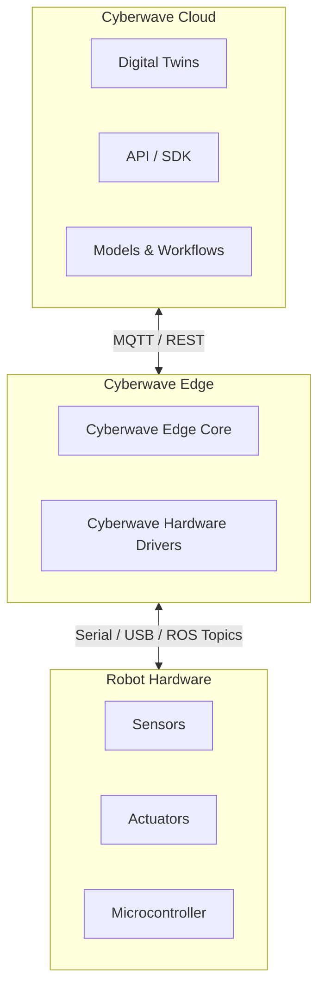

### Overview
Cyberwave is a platform infrastructure for physical AI. It connects robots, sensors, and actuators to their digital twins and provides a unified API and SDK to standardise integration across different hardware. It enables a digital-first workflow for building, testing, and deploying physical AI systems, streamlining delivery from cloud to edge and cutting the path from prototype to production.

### System Architecture

| Layer | Description |
|-------|-------------|
| **Layer 1: Cyberwave Cloud** | Digital twins, API / SDK, workflow orchestration, model training and deployment, observability dashboard |
| **Layer 2: Cyberwave Edge** | The Cyberwave stack installed on your edge compute (Raspberry Pi, Jetson, laptop). Contains the Edge Core (identity, security, device registration) and a hardware-specific driver (e.g., Cyberwave UGV Driver) that bridges Cyberwave to the physical robot. |
| **Layer 3: Robot Hardware** | Sensors, actuators, motor controllers, microcontrollers, and power systems |

### System Components

