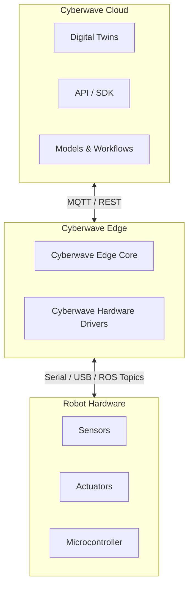

## Overview

Cyberwave is a **platform infrastructure for physical AI**. 

It connects robots, sensors, and actuators to their digital twins and provides a unified API and SDK to standardise integration across different hardware. It enables a digital-first workflow for building, testing, and deploying physical AI systems, streamlining delivery from cloud to edge and cutting the path from prototype to production.

## System Architecture

| Layer | Description |
|-------|-------------|
| **Layer 1: Cyberwave Cloud** | Digital twins, API / SDK, workflow orchestration, model training and deployment, observability dashboard |
| **Layer 2: Cyberwave Edge** | The Cyberwave stack installed on your edge compute (Raspberry Pi, Jetson, laptop). Contains the Edge Core (identity, security, device registration) and a hardware-specific driver (e.g., Cyberwave UGV Driver) that bridges Cyberwave to the physical robot. |
| **Layer 3: Robot Hardware** | Sensors, actuators, motor controllers, microcontrollers, and power systems |

## System Components

### Cyberwave Cloud

The cloud layer is the central control plane of the Cyberwave platform. It provides the interfaces, backend services, and compute infrastructure required to manage robots, digital twins, simulations, and AI models at scale.

<AccordionGroup>
  <Accordion title="Frontend" icon="browser">
    Operator and developer interfaces — including UIs for visualization, workflow management, and administrative control. This is where users interact with environments, digital twins, and deployments.
  </Accordion>

  <Accordion title="Cloud Backend" icon="server">
    The cloud control plane responsible for identity and access management, policy enforcement, orchestration, digital twin registry, and artifact/version management. It coordinates all platform-level operations.
  </Accordion>

  <Accordion title="Simulation Services" icon="flask">
    Cloud-scale simulation infrastructure — including physics-based simulation, scenario generation, and log replay. These services support reproducible testing and sim-to-real continuity.
  </Accordion>

  <Accordion title="Learning Services" icon="brain">
    Model lifecycle pipelines covering training, evaluation, validation, governance, and publishing of deployable learning artifacts. Models trained here can be deployed directly to edge nodes.
  </Accordion>
</AccordionGroup>

### Cyberwave Edge

An **edge node** is a physical compute unit deployed at the periphery of the Cyberwave platform (e.g., industrial PC, embedded computer, Raspberry Pi, or similar hardware), typically co-located with one or more robots or connected devices. Edge nodes operate under strict latency, bandwidth, reliability, safety, and security constraints and are designed to function even under degraded or intermittent connectivity.

For clarity: **edge node** refers to the physical host, and **edge runtime** refers to the software system executing on it.

The edge runtime is a hybrid system:

- **Edge Core** — a central host-level service running on the node OS. It handles identity, authentication, device registration, and coordination with the cloud backend.
- **Runtime Services** — a set of isolated Docker containers running modular, replaceable, and vendor-isolated services (e.g., hardware drivers, inference engines, data pipelines).

This separation ensures a stable, trusted control plane while enabling flexible, swappable runtime services.

### Robot Hardware

The physical layer consists of the robot's hardware components:

- **Sensors** — cameras, LiDAR, IMUs, encoders, and other perception devices that stream data to the edge runtime.
- **Actuators** — motors, servos, grippers, and other effectors that receive commands from the edge runtime.
- **Microcontroller** — the low-level controller (e.g., Arduino, STM32) that interfaces directly with sensors and actuators over serial, I2C, SPI, or CAN bus.

## Communication Protocols

### Cloud ↔ Edge: MQTT / REST

The edge runtime maintains a persistent connection to the Cyberwave cloud via **MQTT** for real-time bidirectional messaging (telemetry, commands, state sync) and **REST APIs** for request-response operations (configuration, artifact downloads, registration). This hybrid approach ensures low-latency streaming alongside reliable transactional operations.

### Edge ↔ Robot Hardware: Serial / USB / ROS Topics

The edge runtime communicates with the physical robot over local interfaces — **Serial** (UART), **USB**, or **ROS Topics** — depending on the robot's hardware architecture. The Cyberwave hardware driver abstracts these transport differences, exposing a unified interface to the rest of the edge stack.
