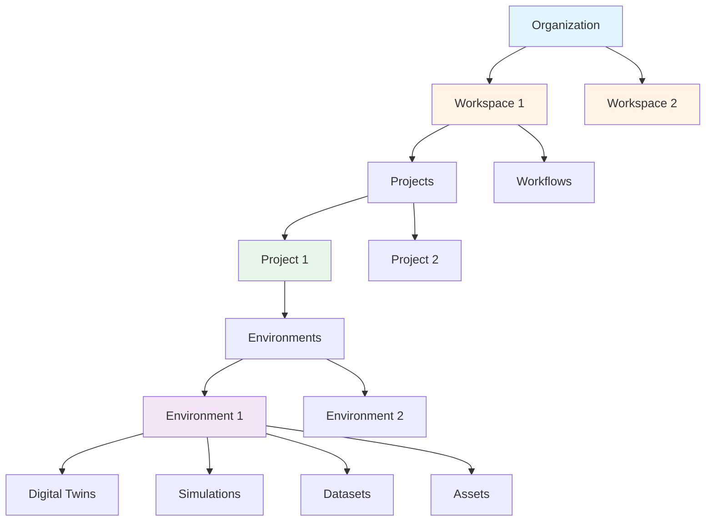

## Overview

Cyberwave uses a hierarchical data model that organizes your data from high-level organizational structure down to individual assets and simulations. Understanding this hierarchy is essential for effective team collaboration and project management.

---

## Data Hierarchy



---

## Hierarchy Levels

### 1. Organization

The **Organization** is the top-level entity representing your company or team.

**Purpose:**
- Central management of team members
- Billing and subscription management
- Organization-wide settings and policies

**Key Features:**
- Add and manage team members
- Control organization-level permissions

---

### 2. Workspaces

**Workspaces** are created within an Organization and serve as containers for related projects and workflows.

**Purpose:**
- Organize work by department, team, or use case
- Isolate resources and permissions
- Group related projects and workflows

**Key Features:**
- Multiple workspaces per organization
- Add existing organization members to the workspace
- Invite external users by email (they'll be added to both org and workspace)

<Tip>
Create separate workspaces for different teams (e.g., "Research", "Production", "QA") or deployment stages (e.g., "Development", "Staging", "Production").
</Tip>

**Workspace Contains:**

```
Workspace
├── Projects
│   ├── Project 1
│   ├── Project 2
│   └── Project N
└── Workflows
    ├── Workflow 1
    ├── Workflow 2
    └── Workflow N
```

---

### 3. Projects

**Projects** exist within workspaces and organize environments, digital twins, and simulations for specific initiatives or deployments.

**Purpose:**
- Group related data groups
- Manage environments and their assets
- Organize digital twins and simulations

**Key Features:**
- Multiple projects per workspace
- Project-level sharing and permissions
- Isolated environments and resources

**Project Contains:**
- **Environments:** 3D spaces where robots operate
- **Digital Twins:** Virtual representations of physical robots
- **Simulations:** Physics-based testing scenarios

---

### 4. Environments

**Environments** are created within projects and represent 3D spaces where your digital twins exist and interact.

**Purpose:**
- Define the physical or simulated space for robots
- Configure sensors, cameras, and objects
- Set up testing and operational scenarios

**Key Features:**
- Multiple environments per project
- **Edit Mode** for designing and configuring
- **Live Mode** for real-time operation

**Environment Contains:**
- **Digital Twins:** Virtual replicas of robots
- **Simulations:** Physics-enabled test scenarios
- **Datasets:** Recorded operations and telemetry
- **Assets:** 3D objects, sensors, cameras

---

### 5. Workflows

**Workflows** exist at the workspace level and can operate across multiple projects.

**Purpose:**
- Automate robot operations
- Create reusable sequences of actions
- Orchestrate complex multi-robot behaviors

**Key Features:**
- Visual node-based editor
- Trigger-based execution (manual, scheduled, events)
- Cross-project automation capabilities

<Info>
Unlike projects which contain environments and twins, workflows exist at the workspace level, allowing them to orchestrate operations across multiple projects and environments.
</Info>

---

## Example Scenario

### Research Team

```
Organization: RoboTech Industries
└── Workspace: Research & Development
    ├── Team: 5 researchers + 2 interns
    ├── Projects:
    │   ├── "Manipulation Research"
    │   │   └── Environments:
    │   │       ├── "Lab Setup A"
    │   │       └── "Lab Setup B"
    │   └── "Navigation Experiments"
    │       └── Environments:
    │           └── "Test Track"
    └── Workflows:
        ├── "Data Collection Pipeline"
        └── "Model Training Workflow"
```

## Next Steps

<CardGroup cols={3}>
  <Card
    title="Setup Guide"
    icon="wrench"
    href="/use-cyberwave/setup-cyberwave"
  >
    Configure your API credentials
  </Card>
  
  <Card
    title="Key Concepts"
    icon="lightbulb"
    href="/get-started/key-concepts"
  >
    Learn core platform concepts
  </Card>
  
  <Card
    title="Quick Start"
    icon="rocket"
    href="/get-started/quickstart"
  >
    Create your first project
  </Card>
</CardGroup>
