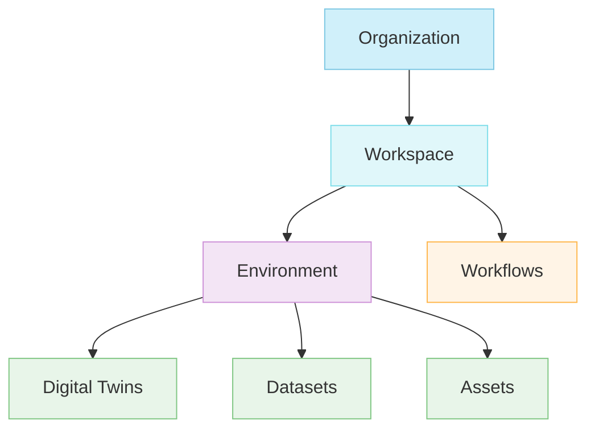

## Overview

Cyberwave organises resources in a simple top-down hierarchy: **Organization → Workspace → Environment**. Each level scopes access, permissions, and resource isolation so teams can collaborate without stepping on each other.

## Data Hierarchy

| Level | Contains | Description |
|-------|----------|-------------|
| **Organization** | Workspaces | Your company or team, the top-level account that owns all resources |
| **Workspace** | Environments, Workflows | A shared space for a team or department to collaborate |
| **Environment** | Digital Twins, Datasets, Assets | A 3D space that mirrors your real-world robot setup |



---

### Organization

The top-level entity representing your company or team. All users, workspaces, and billing are managed here.

- Centralised team and member management
- Billing, subscriptions, and usage tracking
- Organization-wide settings and policies

---

### Workspace

A workspace groups related environments and workflows under a shared context, typically scoped to a team, department, or deployment stage.

- Multiple workspaces per organization
- Workspace-level member access and permissions
- Invite external collaborators by email

<Tip>
Create separate workspaces for different teams (e.g., "Research", "Production", "QA") or stages (e.g., "Development", "Staging").
</Tip>

<Info>
Use **Folders** to organise related environments within a workspace. Folders are an optional grouping mechanism; they help keep things tidy as your workspace grows.
</Info>

---

### Environment

An environment is a 3D virtual space that mirrors your real-world robot setup. It's where your digital twins live, sensors stream data, and controllers send commands — all in real time.

- Multiple environments per workspace
- **Edit Mode** for designing and configuring the space
- **Live Mode** for real-time operation and data streaming

**An environment contains:**

<CardGroup cols={2}>
  <Card title="Digital Twins" icon="robot">
    Virtual replicas of physical robots — mirroring structure, joints, sensors, and behavior in real time.
  </Card>

  <Card title="Datasets" icon="database">
    Recorded operations and telemetry data collected during robot demonstrations.
  </Card>

  <Card title="Assets" icon="cube">
    3D objects, sensors, cameras, and other elements placed in the environment.
  </Card>

  <Card title="Simulations" icon="flask">
    Physics-enabled test scenarios for reproducible testing and validation.
  </Card>
</CardGroup>

---

### Workflows

Workflows exist at the workspace level and can orchestrate operations across multiple environments.

- Visual node-based editor for building automation sequences
- Trigger-based execution — manual, scheduled, or event-driven
- Cross-environment automation capabilities

---

## Example

```
Organization: RoboTech Industries
└── Workspace: Research & Development
    ├── Environments:
    │   ├── "Lab Setup A"
    │   ├── "Lab Setup B"
    │   └── "Test Track"
    └── Workflows:
        ├── "Data Collection Pipeline"
        └── "Model Training Workflow"
```

---

## Next Steps

<CardGroup cols={3}>
  <Card
    title="Architecture"
    icon="diagram-project"
    href="/get-started/architecture"
  >
    Understand the system architecture
  </Card>
  
  <Card
    title="Key Concepts"
    icon="lightbulb"
    href="/get-started/key-concepts"
  >
    Learn core platform concepts
  </Card>
  
  <Card
    title="Quick Start"
    icon="rocket"
    href="/get-started/quickstart"
  >
    Get started with your first environment
  </Card>
</CardGroup>
