## How to Use This Starter Kit

This is a recommended learning path from Cyberwave for all builders. We recommend everyone to go through the index below and identify what you already know and what you don't; that will help you plan your time accordingly.

**The best way to go through this document:**

1. Skim through the entire document first and note the topics you don't fully understand or haven't encountered before.
2. For those topics, use research papers, articles, or AI tools to go deeper after your initial skim here.
3. Use the sections as reference material throughout the program, and come back to them as you build.

<Warning>
**Mandatory action for all core builders:** Complete Step 5 (Designing Your Physical AI Agent) in this guide and submit your physical agent idea back to us so we can work on it together. Please share your idea with us on Discord.
</Warning>

---

## 1. Physical AI Agents: The Big Picture

The AI industry is moving through three distinct stages:

1. **General-Purpose Models (LLMs):** Large language models and foundation models that solve broad tasks across domains (GPT-4, LLaMA, etc.)
2. **Software AI Agents:** Specialised intelligent systems fine-tuned for domain-specific reasoning, automation, and decision support within a single industry
3. **Physical AI Agents:** Embodied systems that extend vertical intelligence into the physical world, combining perception, cognition, and actuation to interact with real environments

Understanding where physical AI agents fit in this progression helps you see why the systems you are building matter and what separates them from conventional software.

### 1.1 From Software to Vertical AI Agents

General-purpose AI models like GPT-4, LLaMA, and similar LLMs have demonstrated strong capability in natural language understanding, summarisation, code generation, and multi-domain task support. However, they consistently fall short when applied to highly specialised, complex domains that demand precision, real-time adaptability, and deep contextual awareness.

This limitation gave rise to **Vertical AI Agents** — specialised intelligent systems designed to solve domain-specific challenges. Unlike general-purpose AI, vertical agents are tailored to a single industry or operational context.

<Note>
**Definition:** A vertical AI agent is essentially an LLM that has been given a domain-specific brain, a memory, specialised skills, and the ability to use external tools. Instead of being a generalist that knows a little about everything, it goes deep into one domain — understanding the terminology, workflows, edge cases, and decision patterns that matter in that specific industry.
</Note>

**Core components of a Vertical AI Agent:**

| Component | Role |
|-----------|------|
| **LLM Module** | Foundational reasoning engine and the brain: understands context, reasons through problems, and makes decisions |
| **Memory Module** | Remembers past interactions, learned knowledge, and task history, so the agent improves over time |
| **Cognitive Skills Module** | Integrates specialised models for precision tasks |
| **Tools Module** | Connects to external data and APIs; search databases, pull live information, call third-party services |

**Where Vertical AI Agents excel:**

- **Supply chain management:** Forecasting demand, optimising logistics, predicting bottlenecks in real time, and dynamically adapting to supply disruptions
- **Healthcare:** Predictive diagnostics, personalised treatment planning, and improving operational workflows by integrating medical knowledge with patient data
- **Financial services:** Fraud detection, credit risk assessment, and compliance monitoring using domain-specific cognitive models and vast financial datasets

Vertical AI agents are powerful because they bring focused intelligence to a specific problem space. But they operate entirely in the digital world. They reason, plan, and recommend — but they do not physically interact with anything.

### 1.2 The Shift to Physical AI Agents

Many industries demand more than cognitive problem-solving. Manufacturing, logistics, healthcare, agriculture, and autonomous transport all require AI systems that can interact directly with the physical environment — navigating real-world dynamics, manipulating objects, and executing actions under uncertainty.

This is the defining shift: **moving intelligence from the screen into the physical world.**

**What changes with Physical AI Agents:**

| Digital AI Agent | Physical AI Agent |
|-----------------|-------------------|
| Processes text, images, and data | Processes sensor streams from the real world |
| Outputs recommendations or content | Outputs motor commands and physical actions |
| Operates in controlled digital environments | Operates in dynamic, unpredictable environments |
| Evaluated by accuracy or relevance | Evaluated by task completion in the real world |
| Latency is annoying but not dangerous | Latency can cause physical damage or safety failure |
| Stateless or session-based | Must maintain continuous physical state awareness |

### 1.3 Understanding Physical Dynamics

A defining capability that separates physical AI agents from their software counterparts is the ability to understand and reason about **physical dynamics** — forces like gravity, friction, inertia, material properties, and spatial geometry. This understanding enables physical agents to:

- Navigate complex terrain without tipping or stalling
- Handle objects of varying weight, shape, and fragility without dropping or crushing them
- Predict the consequences of their actions before executing (will this push knock the object off the table?)
- Adapt movements in real time when conditions change (heavier payload, slippery surface, uneven ground)

Physical dynamics understanding can be embedded through physics engines in simulation, learned from real-world training data, or encoded as constraints in the planning layer. In practice, most robust physical agents use a combination of all three.

---

## 2. Physical AI Agents 101

### 2.1 Definition

A physical AI agent is an embodied intelligent system designed to interact directly with the physical world. It is equipped with sensory capabilities for perception, cognitive intelligence for reasoning and planning, and actuation systems for executing precise physical actions in dynamic environments.

**This is not just a robot with software.**

A traditional robot follows programmed instructions. A physical AI agent perceives, reasons, plans, acts, and adapts in a continuous loop, informed by real-time feedback from the environment.

### 2.2 Core Components: Perceive, Reason, Act

Every physical AI agent is built around three core components that operate as a continuous cycle. These are the building blocks you will design, implement, and refine throughout the program.

#### Perceive (Perception Component)

The perception component is how the agent senses and interprets the physical world. It converts raw sensor signals into a structured understanding that the reasoning component can use.

<Tip>
**Key principle:** The agent cannot reason about what it cannot observe. Perception quality sets the ceiling for everything downstream. If perception is noisy, slow, or unreliable, no amount of reasoning sophistication will compensate.
</Tip>

#### Reason (Cognition Component)

The cognition component is the agent's brain. It takes what perception has observed, considers the current goal, and decides what to do next. This could be as simple as a rule ("if obstacle ahead, turn left") or as advanced as a VLA model generating motor commands from a camera feed. The key requirement is that every decision must be physically executable — if the hardware can't do it, it's a bad decision.

#### Act (Actuation Component)

The actuation component converts decisions into physical movement. This is where intelligence meets the real world — and where safety is non-negotiable.

<Warning>
**Key principle:** The actuation layer must have hard safety limits that operate independently from the reasoning component. If the brain makes a bad decision, the body must refuse to execute it.
</Warning>

#### The Continuous Loop

These three components do not run once in sequence — they form a **continuous feedback loop:**

**Perceive** (what is happening?) → **Reason** (what should I do given my goal, context, and memory?) → **Act** (execute the command on hardware) → **Perceive** (what happened as a result?) → **Reason** (did it work? should I adjust?) → **Act** (next action) → repeat

<Note>
Without this loop, you have scripted automation, not an agent. A robot that follows a fixed trajectory regardless of what happens is a playback device. An agent observes the result of every action and adapts.
</Note>

### 2.3 Physical AI Agents Across Industries

Physical AI agents are already transforming multiple sectors. Understanding these applications helps you see the patterns that apply to your own build:

- **Autonomous Vehicles:** Self-driving cars operate in complex urban environments with pedestrians, traffic signals, and unpredictable road conditions. They use LiDAR, cameras, radar, and GPS for perception. A fine-tuned LLM evaluates contextual inputs and generates planning strategies. Cognitive models handle path planning, collision avoidance, and motion prediction. Actuators control steering, braking, and acceleration with millisecond-level precision.

- **Warehouse Robotics:** Large-scale warehouses require robots that can pick, sort, transport, and replenish products across thousands of bins. These agents combine SLAM (Simultaneous Localisation and Mapping) for navigation, object recognition for product identification, and grippers for physical manipulation. A vertical AI agent manages inventory forecasting and task assignment, while physical agents execute the logistics.

- **Surgical Robotics:** Minimally invasive surgery requires precision that exceeds human capability. Surgical robots use high-resolution cameras and force sensors for perception, medical LLMs for surgical planning referencing patient data and guidelines, and micro-precision actuators for executing incisions and sutures with real-time haptic feedback.

- **Manufacturing:** Automotive assembly lines automate welding, painting, and quality inspection. Vision models detect defects, manufacturing LLMs coordinate workflows and optimise resource allocation, and robotic arms execute precise operations. Quality inspection runs continuously alongside production.

- **Agriculture:** Precision farming uses drones with multi-spectral cameras and soil sensors for crop health monitoring. Agricultural LLMs analyse sensor data against weather forecasts and historical patterns to optimise irrigation, predict yield, and direct autonomous harvesters and sprayers.

<Note>
In every industry, the pattern is the same: perception feeds cognition, cognition directs actuation, actuation generates feedback, and feedback improves perception. The specific sensors, models, and actuators change — the architecture does not.
</Note>

---

## 3. What is Cyberwave?

Cyberwave is an **all-in-one developer platform** to connect, use, and get started with shipping physical AI agents on real hardware. It abstracts away the complexity of working with any hardware — all you need is Cyberwave, and you can ship your first physical agent.

At its core, Cyberwave is a **platform infrastructure for physical AI**. It connects robots, sensors, and actuators to their digital twins and provides a unified API and SDK to standardise integration across different hardware. It enables a digital-first workflow for building, testing, and deploying physical AI systems — streamlining delivery from cloud to edge and cutting the path from prototype to production.

**What Cyberwave gives you as a builder in this cohort:**

- **Digital twins** that mirror your physical robot state in real time
- **A unified SDK** that works the same way regardless of what hardware you're using
- **A unified data layer** for physical-world data — sensor streams, joint states, camera feeds, and telemetry all land in one standardised format instead of being scattered across different devices, protocols, and file types
- **Dataset and model lifecycle tools** for recording demonstrations, training models, and deploying them
- **Workflow automation** for orchestrating multi-step agent behaviour

At runtime, Cyberwave continuously keeps each digital twin in sync with its live physical (or simulated) counterpart.

Cyberwave gives you speed at every stage, not just development. The SDK accelerates how you write code, but the platform also accelerates dataset creation (record and capture synchronised data in one click), model training (standardised data means no cleaning or format conversion), deployment (train in cloud, deploy to edge through the same pipeline), and debugging (structured logs and episode replay). The entire build cycle compresses, not just the coding part.

### 3.1 The Edge Node and Edge Runtime

To connect Cyberwave to your actual hardware, there is an **edge node** — a physical compute unit deployed close to the robot (e.g., a Raspberry Pi, Jetson, industrial PC, or even your laptop). The edge node runs the **edge runtime**, which is the software layer that bridges Cyberwave's cloud platform to your physical devices.

**Think of it this way:**

- **Edge node:** the physical computer sitting next to (or inside) your robot (a Raspberry Pi, Jetson, laptop, etc.)
- **Edge runtime:** the Cyberwave stack installed on that computer — this is what makes the hardware work with Cyberwave. This is fully open-source.

The edge runtime is installed on every edge node. It is the Cyberwave software layer that sits between the cloud platform and the physical hardware. Without it, your robot is just hardware with no connection to Cyberwave. With it, your robot becomes a managed, observable, cloud-connected physical AI agent.

**The edge runtime is made up of:**

- **Edge Core:** a host-level service that manages identity, security, and device registration
- **Runtime Services:** modular Docker containers that handle specific tasks (MQTT bridge, ROS nodes, sensor drivers, etc.)

This separation gives you a stable, trusted control plane while keeping runtime services modular, replaceable, and isolated.

---

## 4. System Design: Software + Hardware

Now that you understand what Cyberwave is and how the edge runtime works, let's look at how these pieces fit together with actual hardware. Every Cyberwave-powered system follows a **three-layer architecture:**

```mermaid
graph TB
    subgraph Cloud["☁ Cyberwave Cloud"]
        direction LR
        DT["Digital Twins"] ~~~ API["API / SDK"] ~~~ ML["ML Models & Workflows"]
    end

    Cloud <-->|"MQTT / REST"| Edge

    subgraph Edge["💻 Cyberwave Edge"]
        direction LR
        EC["Edge Core"] ~~~ DR["Cyberwave Hardware Driver"]
    end

    Edge <-->|"Serial / USB / ROS Topics"| HW

    subgraph HW["🤖 Robot Hardware"]
        direction LR
        S["Sensors"] ~~~ A["Actuators"] ~~~ MC["Microcontroller"]
    end
```

| Layer | Description |
|-------|-------------|
| **Layer 1: Cyberwave Cloud** | Digital twins, API / SDK, workflow orchestration, model training and deployment, observability dashboard |
| **Layer 2: Cyberwave Edge** | The Cyberwave stack installed on your edge compute (Raspberry Pi, Jetson, laptop). Contains the Edge Core (identity, security, device registration) and a hardware-specific driver (e.g., Cyberwave UGV Driver) that bridges Cyberwave to the physical robot. |
| **Layer 3: Robot Hardware** | Sensors, actuators, motor controllers, microcontrollers, and power systems |

### 4.1 How This Looks in Practice

**The Edge runs everywhere.** One of Cyberwave's core design principles is that the edge is device-agnostic. The same Cyberwave Edge stack runs on your laptop (macOS, Linux, Windows), a Raspberry Pi, an NVIDIA Jetson, an industrial PC, or a Linux-based compute.

You don't need to rewrite your agent code or change your Cyberwave setup when you switch devices. The Edge Core, the hardware driver, and the cloud connection all work the same way. The only thing that changes between projects is the **configuration** — which device you pick, which hardware driver you install, and how the edge physically connects to the robot.

Below are two different configurations to show how this works in practice:

#### Example 1: SO101 Robot Arms (Edge on Laptop)

With SO101, your laptop can be the edge. You install the Cyberwave Edge (Edge Core + Cyberwave SO101 Driver) on your laptop, connect the robot arms via USB-C, and plug in a camera. The Edge Core handles identity and cloud sync, while the SO101 Driver translates Cyberwave commands into hardware control. No separate compute hardware needed — your laptop becomes the bridge between Cyberwave and the physical arms.

#### Example 2: UGV Beast Rover (Edge on Raspberry Pi)

With the UGV Beast, the Raspberry Pi inside the rover chassis is the edge. You install the Cyberwave Edge (Edge Core + Cyberwave UGV Driver) on the Pi. The UGV Driver runs as a Docker container with ROS 2 nodes and communicates with the ESP32 microcontroller over serial for low-level motor control, IMU, and camera. The Edge Core handles authentication and syncs everything with Cyberwave Cloud over the network.

---

## 5. Designing Your Physical AI Agent

This section walks you through the process of going from "I have a robot" to "I have a working physical AI agent with a clear use case." Follow these steps in order.

### Step 1: Choose Your Hardware

Start with the robotic hardware you've selected for the cohort. This is your physical platform — the thing that will actually perceive, move, and interact with the real world. Examples:

- **SO101 Robot Arms:** a leader-follower arm pair for manipulation tasks
- **UGV Beast Rover:** a tracked rover for navigation, exploration, and mobile tasks

Your choice of hardware defines what your agent can physically do, so everything else flows from here.

<Tip>
**Want to add your own hardware?** [Reach out](mailto:info@cyberwave.com)! 

**Want to add a camera?** Cyberwave works with any USB camera!
</Tip>

### Step 2: Understand Its Capabilities

Before designing a use case, understand what your hardware can actually do. Refer to the Cyberwave hardware documentation for detailed specs on each supported platform.

**Ask yourself:**

- What sensors does it have? (camera, IMU, encoders, LiDAR, etc.)
- What actuators does it have? (arms, grippers, wheels, servos, etc.)
- What are its physical constraints? (range of motion, payload, speed limits, battery life)
- What interfaces does it expose? (USB, serial, ROS topics, etc.)

The better you understand your hardware's capabilities and limits, the more realistic your use case will be.

### Step 3: Map the Perceive-Reason-Act Loop to Your Hardware

Go back to the Perceive → Reason → Act cycle from Section 2 and map each component to your specific hardware. This is where the architecture becomes concrete.

**Example with SO101:**

| Component | What It Is |
|-----------|------------|
| **Perceive** | A USB camera attached to your laptop captures the workspace, objects, positions, and arm state |
| **Reason** | A VLA model (or even a simple rule-based policy) takes the camera feed and decides what action to perform |
| **Act** | The follower arm executes the movement — pick, place, push, pour, etc. |

**Example with UGV Beast:**

| Component | What It Is |
|-----------|------------|
| **Perceive** | The onboard camera and IMU capture the environment, obstacles, terrain, orientation |
| **Reason** | A navigation policy or LLM-based planner decides where to go and how to get there |
| **Act** | The tracked wheels drive the rover forward, turn, stop, and reverse |

Do this mapping for your own hardware. If you can't clearly fill in all three rows, you're missing a component — add a sensor, pick a model approach, or clarify your actuation path.

### Step 4: Understand the Scope of Your Environment

Your robot doesn't operate in a vacuum. The environment shapes what's possible and what's hard. Think through:

- **Physical setup:** SO101 arms need to be clamped to a desk with objects within reach. UGV Beast can locomote freely but needs open floor space and a charged battery.
- **Environmental factors:** Lighting conditions for camera-based perception, surface types for rover traction, and obstacles that may appear or move.
- **Workspace boundaries:** Where can the robot safely operate? What's off-limits? What happens if it reaches the edge of its workspace?
- **Human interaction:** Will people be in the workspace? Does the robot need to operate around them safely?

Scoping your environment early prevents you from designing a use case that's physically impossible in your actual setup.

### Step 5: Finalise Your Use Case

Now pick your use case. The best approach is to think about:

- **Target persona:** Who benefits from this? A warehouse worker? A lab technician? A home user? A farmer?
- **Target environment:** Where does this run? A desk? A factory floor? An outdoor field? A kitchen?
- **The task:** What specific physical task does the agent perform? Be concrete — "pick up a red block and place it in a bin" is better than "manipulation tasks."

Your use case doesn't need to be groundbreaking — it needs to be testable, measurable, and complete within the program timeline. A simple use case executed well is more valuable than an ambitious one that never works.

### Step 6: Design the System Loop

Take your use case and draw out the full system as a loop:

- **Sensor:** What data does the agent need to perceive the task state? (camera frames, joint positions, distance readings)
- **Model / Policy:** What decides the next action? Start with a rule-based approach, then graduate to a trained model
- **Actuator:** What physically executes the action? (arm joints, wheel motors, gripper)
- **Feedback:** How do you know if the action succeeded? (vision check, position comparison, force reading)

Map this loop on paper or a whiteboard before writing any code. If the loop doesn't close (no clear way to verify success), revisit your use case.

### Step 7: Plan Your Data and Training Pipeline

Once your basic loop works with manual control or simple rules, the next step is making your agent learn:

1. **Record demonstrations:** Use Cyberwave's teleoperation and dataset tools to record yourself performing the task. Each recording captures synchronised sensor data, actions, and timestamps.
2. **Build a dataset:** Collect enough episodes (start with 20–50) covering variations of the task — different object positions, lighting conditions, and starting states.
3. **Train a model:** Use Cyberwave's training tools to train a policy from your dataset. Start with default parameters and iterate.
4. **Deploy and test:** Deploy the trained model back to the edge and test it on real hardware. Record the results.
5. **Iterate:** Review failures, record more demonstrations for the edge cases, retrain, redeploy. Each cycle makes the agent more robust.

This is the core loop of building a physical AI agent: **demonstrate → record → train → deploy → test → improve.**

### Step 8: Validate with Cyberwave

Before you start building, share your use case design with the Cyberwave team and cohort on Discord. We'll help you:

- Validate that your use case is feasible with your hardware and timeline
- Identify potential blockers early
- Suggest the best Cyberwave tools and workflows for your specific setup
- Connect you with other builders working on similar problems

<Tip>
Start with the simplest version of your use case that closes the full loop: one sensor, one decision, one action, one success check. Get that working end-to-end first, then add complexity.
</Tip>

---

## 6. Pre-Learning Resources

<CardGroup cols={2}>
  <Card title="SO101 Overview" icon="microchip" href="/hardware/so101/index">
    Learn about the SO101 robot arm platform, architecture, and capabilities.
  </Card>
  <Card title="Get Started with SO101" icon="play" href="/hardware/so101/get-started">
    Set up the SO101 robot arms and connect them to Cyberwave.
  </Card>
  <Card title="UGV Beast Overview" icon="robot" href="/hardware/ugv/index">
    Learn about the UGV Beast rover platform, architecture, and capabilities.
  </Card>
  <Card title="Get Started with UGV Beast" icon="play" href="/hardware/ugv/get-started">
    Set up the UGV Beast rover, install the Cyberwave Docker image, and launch the stack.
  </Card>
</CardGroup>
