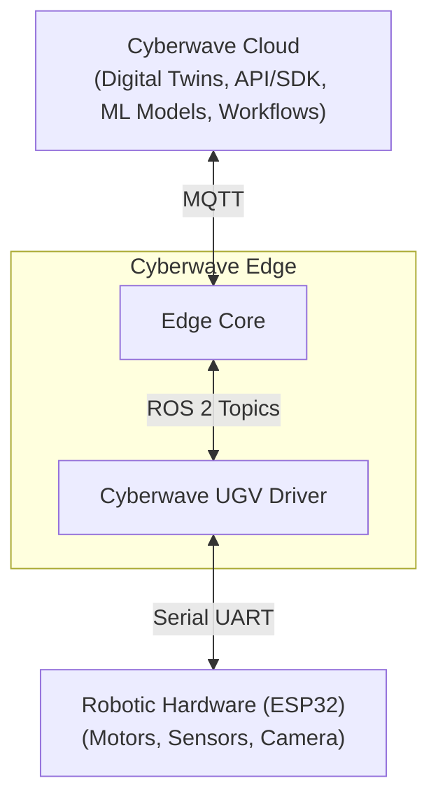

Cyberwave supports a range of robotic hardware from articulated arms to mobile rovers, quadrupeds, and standalone cameras. Each platform integrates with Cyberwave through a digital twin, giving you real-time control, telemetry streaming, dataset recording, and AI model deployment from a single interface.

---

## SO101 Robot Arms

The **SO101** is an open-source, 6-degree-of-freedom (6-DOF) robotic arm set designed for desk-based manipulation. Built from 3D-printed parts and standard servo motors, it offers a low-cost entry point into real robotic hardware.

### Physical Components

- **6-DOF articulated arm**: compact manipulator for close-range, desk-based operations
- **Servo-driven joints**: position-controlled motors for real-time joint movement
- **Gripper end-effector**: suitable for basic pick-and-place tasks
- **Leader-follower configuration (optional)**: dual-arm setup where the leader captures human motion and the follower mirrors it in real time
- **USB control**: direct connection from a laptop or SBC (Raspberry Pi) over USB/serial

### What You Can Do with Cyberwave

- Onboard from the catalog and create a digital twin automatically
- Teleoperate using a physical leader arm with joint-level mirroring
- Remote operate without a leader arm and control directly from the dashboard, SDK, or API
- Assign controller policies (keyboard, gamepad, VLA models)
- Record and export episodic datasets for training
- Train ML models and deploy them as autonomous controller policies
- Test in simulation, then deploy to the physical arm without code changes

<Card title="SO101 Setup Guide" icon="play" href="/hardware/so101/get-started">
  Connect, calibrate, and start using the SO101 with Cyberwave
</Card>

---

## UGV Beast Rover

The **UGV Beast** is an off-road tracked open-source AI robot with a dual-controller architecture: a **Raspberry Pi** for high-level tasks (planning, perception, AI) and an **ESP32** microcontroller for low-level motor control (motors, encoders, IMU, LEDs).

### Architecture

The system operates in three layers:

- **Cyberwave Cloud**: hosts the digital twin, dashboard, MQTT broker, and backend APIs for monitoring, commanding, and training
- **Cyberwave Edge (Raspberry Pi)**: runs the ROS 2 stack and MQTT bridge inside a Docker container, translating between ROS 2 topics and Cyberwave MQTT
- **Robotic Hardware (ESP32)**: handles low-level motor control, sensors, camera pan-tilt, and LEDs over serial UART

### What You Can Do with Cyberwave

- Add a UGV Beast from the catalog and start streaming telemetry immediately
- Control the rover in real time via keyboard from the dashboard
- Stream the onboard camera feed to the digital twin
- Record driving sessions (camera, IMU, controls) into episodic datasets
- Train navigation models and deploy them as autonomous policies
- Test in simulation, then deploy to the physical rover

<Card title="UGV Beast Setup Guide" icon="play" href="/hardware/ugv/get-started">
  Install the Cyberwave Docker image and launch the stack on your rover
</Card>

---

## Unitree Go2 Quadruped

The **Unitree Go2** is an intelligent quadruped robot designed for research, exploration, and real-world applications. It combines AI-driven locomotion with robust mechanical performance.

### Key Specifications

| Spec | Detail |
|------|--------|
| **Recognition System** | Ultra-wide 4D LiDAR L1 (360° x 90° FOV) |
| **Max Speed** | ~5 m/s |
| **Peak Joint Torque** | ~45 N·m |
| **Wireless** | Wi-Fi 6, Bluetooth, 4G |
| **Battery** | 8,000 mAh (standard) / 15,000 mAh (extended) |
| **Endurance** | ~2–4 hours depending on configuration |

### Core Capabilities

- **4D LiDAR perception**: hemispherical FOV with 0.05m minimum detection for all-terrain navigation
- **AI-powered locomotion**: trained via large-scale simulation for obstacle climbing, recovery, and adaptive gaits
- **3D mapping and autonomy**: point cloud mapping and path planning using built-in LiDAR
- **Intelligent side-follow (ISS 2.0)**: wireless vector positioning with obstacle avoidance
- **OTA updates**: continuous firmware improvements via the cloud

<Info>
For detailed hardware specifications and assembly instructions, refer to the [official Unitree Go2 documentation](https://www.docs.quadruped.de/projects/go2/html/index.html).
</Info>

<Card title="Go2 Setup Guide" icon="play" href="/hardware/go2/get-started">
  Connect an edge device to the Go2 and pair it with Cyberwave
</Card>

---

## Camera

A **camera twin** is a digital representation of a physical camera within your Cyberwave environment. It streams live video into the platform, enabling real-time monitoring, data recording, and AI-powered vision workflows.

### Supported Camera Types

- **USB webcams** (Logitech, generic UVC-compatible cameras)
- **Laptop built-in webcams**

Once connected, your camera feed is available across the platform in the environment viewer, for dataset recording, and as input to ML models and workflows.

<Card title="Camera Setup Guide" icon="play" href="/hardware/camera/get-started">
  Connect a webcam or laptop camera to Cyberwave
</Card>

---

## Other Hardware

Cyberwave is not limited to the platforms above. Any device that can run a [compatible driver](/edge/drivers/writing-compatible-drivers) can connect to the platform as a digital twin. If your hardware isn't listed here, follow the generic guide to connect it.

<Card title="Other Hardware Setup Guide" icon="play" href="/hardware/other-hardware/get-started">
  Connect any robotic hardware to Cyberwave
</Card>

---

## Hardware at a Glance

| Platform | Type | Connection | Use Cases |
|---|---|---|---|
| **SO101** | 6-DOF robot arm | USB/serial | Manipulation, teleoperation, imitation learning |
| **UGV Beast** | Tracked rover | Wi-Fi (MQTT) | Navigation, mapping, autonomous driving |
| **Unitree Go2** | Quadruped | Ethernet to edge device | Locomotion, patrol, inspection |
| **Camera** | Visual sensor | USB | Monitoring, vision workflows, dataset recording |
| **Other** | Any hardware | Any | Anything with a compatible driver |
