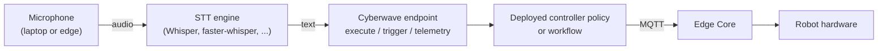
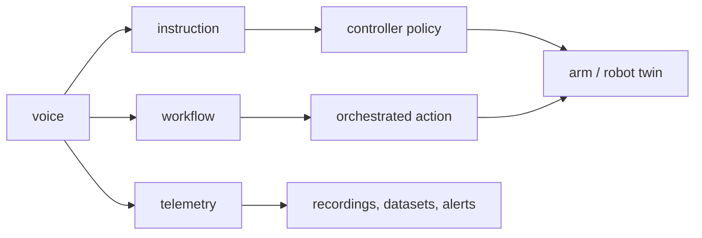

import EarlyAccess from '/snippets/early-access.mdx';

<EarlyAccess />

<Warning>
**STUB DOCUMENT:** This page is intentionally minimal and will be expanded with deeper technical details in a future update.
</Warning>

## What "voice as a sensor" means in Cyberwave

Cyberwave treats every input stream as a sensor attached to a digital twin. A microphone is no different from a camera: audio is captured, optionally transcribed, and fed into the platform in one of three consumer roles.

| Role of the transcript | What it drives | Cyberwave surface it hits |
|---|---|---|
| Instruction | A deployed ML / VLA controller policy | `POST /api/v1/controller-policies/{uuid}/execute` with `{"instruction": "..."}` |
| Trigger input | A workflow | `POST /api/v1/workflows/{uuid}/execute` |
| Telemetry / label | A recording, dataset, or alert | `cyberwave/twin/{uuid}/telemetry` MQTT topic, `twin.alerts.create(...)` |

Everything else (the wake word, the STT engine, the VAD) lives at the edge or on the client and is your choice.

<Info>
Cyberwave never needs to hear audio directly. You decide where transcription happens; the platform only cares about the resulting text.
</Info>

---

## Architecture



Cyberwave exposes three stable primitives: **controller-policy execute**, **workflow execute**, and **telemetry publish**. Any voice stack that can produce text can drive a Cyberwave robot through them.

---

## Two integration patterns

<Tabs>
  <Tab title="Pattern A: Client-side microphone">
    Best for operator-in-the-loop apps, demos, hackathons, and voice-first UIs.

    ```
    Operator -> laptop mic -> faster-whisper (local) -> REST: execute controller policy
    ```

    No changes on the edge device, no new sensor twin. Starts working in minutes.
  </Tab>
  <Tab title="Pattern B: On-robot microphone">
    Best for autonomous deployments where the mic lives on the robot, ambient listening, multi-user spaces, or voice telemetry in datasets.

    ```
    Edge mic -> edge-side STT (or upload audio) -> publish as microphone sensor
                                                ├─> REST: execute controller policy
                                                └─> MQTT telemetry (timestamped, for datasets)
    ```

    The Python SDK's `cyberwave.sensor` module abstracts microphone capture on the edge.
  </Tab>
</Tabs>

---

## Use cases

### Manipulation (arm and gripper twins: SO-101, UR5, Piper, iiwa14, openarm, ...)

| Voice command | Implementation |
|---|---|
| Pick and place: *"pick the red block and place it in the blue cup"* | `instruction` to a VLA or diffusion policy |
| Sort by attribute: *"put all the pens in the left drawer"* | VLA multi-step, or a workflow with a per-object loop |
| Handover: *"hand me the screwdriver"* | VLA plus force-sensitive gripper release primitive |
| Reset / home: *"go home"*, *"reset workspace"* | Motion controller policy with a recorded sequence |
| Pause / resume / abort: *"stop"*, *"continue"* | Workflow state control; controller-policy execute with a stop instruction, or MQTT cancel |
| Parametric tasks: *"stack three blocks"*, *"pour 20 ml"* | Parse the number and pass it via workflow input rather than as a VLA prompt |
| Inspection: *"show me the label of the bottle"* | VLA picks and rotates; camera twin captures the frame and posts to a workflow result |
| Labeling demonstrations: *"this one is a successful pickup"* | Publish to telemetry topic; the episode trim tool picks it up |
| Teach-a-pose: *"remember this as 'tray'"* | Records the current joint state under the given label for reuse in a motion controller |

### Locomotion (mobile twins: Go2, Husky-300, UR-mounted AMRs, humanoids)

| Voice command | Implementation |
|---|---|
| Go-to: *"go to the kitchen"*, *"return to dock"* | Navigation workflow with a named waypoint as input |
| Follow / come here: *"follow me"*, *"come"* | Controller policy subscribing to person-detection sensor plus instruction |
| Speed and gait: *"walk slower"*, *"trot"*, *"sit"* | Direct controller command (Go2 has built-in gaits) |
| Patrol / area scan: *"patrol the hallway for 10 minutes"* | Workflow with a duration input; VLM-driven anomaly detection on frames |
| Fetch: *"bring me that bottle"* | Locomotion policy plus handover, composed as a workflow |
| Emergency stop: *"stop"*, *"freeze"* | Dedicated low-latency wake-word pipeline that publishes an abort command over MQTT |
| Exploration narration: *"what's in the corner of the room?"* | Locomotion to position plus VLM describe-scene plus TTS response |

### Cross-cutting (applies to both)

- **Recording control**: *"start recording"*, *"label this run 'take 3'"* drive `cyberwave/twin/{uuid}/telemetry` with `telemetry_start` events.
- **Mode switching**: *"take over"* detaches the active controller policy and re-attaches Local Teleop.
- **Alert acknowledgement**: *"acknowledge all alerts"* iterates `twin.alerts.list(status="active")` and calls `alert.acknowledge()` on each.
- **Status queries**: *"what's the battery on the follower?"* triggers a workflow that reads twin state and returns TTS.
- **Voice-labeled datasets**: narration recorded while teleoperating becomes free-form natural-language labels on episodes, directly usable as VLA training prompts.

---

## Where voice slots into the Cyberwave stack



The voice layer is intentionally outside the platform: you choose client-side vs on-robot, local vs cloud STT, English vs multilingual, wake-word style, and so on. Cyberwave's side is three stable primitives: controller-policy execute, workflow execute, telemetry publish. Any voice stack that can produce text can drive a Cyberwave robot today.

---

## Where to Go Next

<CardGroup cols={3}>
  <Card title="Deploy a Controller Policy" icon="brain" href="/use-cyberwave/ml-models/deploy">
    Get a VLA or RL policy running on a twin so voice has something to drive.
  </Card>
  <Card title="Workflows" icon="diagram-project" href="/use-cyberwave/workflows">
    Route transcripts into multi-step orchestration with parameters and branching.
  </Card>
  <Card title="Perception Overview" icon="eye" href="/capabilities/perception">
    See how audio fits alongside vision in the perception stack.
  </Card>
</CardGroup>
