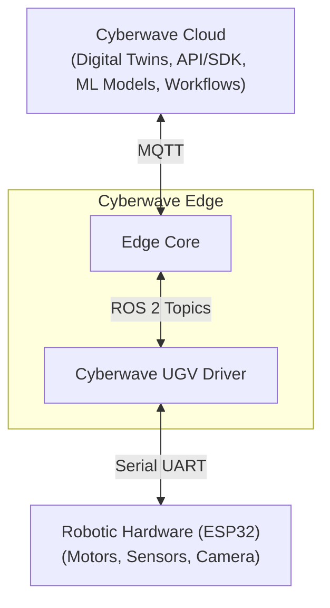

## What is the UGV Beast?

UGV Beast is an **off-road tracked open-source AI robot** featuring a **dual-controller structure**. 

The dual-controller setup is as follows: a **Raspberry Pi** for high-level tasks like planning and perception, and an **ESP32** microcontroller for low-level motor control (motors, encoders, etc.). This design allows the Pi to focus on computation-heavy processes, while the ESP32 handles fast feedback loops.

The **ESP32** microcontroller handles low-level hardware tasks like motor control, sensor readings (IMU), the OLED display, servos, and LEDs. This offloads the heavy lifting from the main computer, keeping communication fast and efficient. The main computer i.e. **Raspberry Pi 4B/5**, provides the processing power needed for AI, perception, and high-level decision-making.

---

## Architecture

The system is split into three layers: the **Cyberwave Platform**, the **Edge** (on the rover), and the **Robotic Hardware**.

### Cyberwave Platform

The Cyberwave platform hosts the digital twin, dashboard, MQTT broker, and backend APIs. It's where you monitor the rover, send commands, record datasets, train models, and deploy controller policies. All communication between the platform and the rover happens over **MQTT** (port 1883).

### Edge (Raspberry Pi + Docker Container)

On the rover, the edge consists of two layers:

1. **Raspberry Pi (Host)**: The Raspberry Pi runs the base operating system and Docker. It handles system-level tasks like networking, SSH access, and Docker container management. A custom **Cyberwave Docker image** is pulled onto the Pi, which contains the entire Cyberwave stack.

2. **Docker Container (ROS 2 + MQTT Bridge)**: All ROS 2 code runs inside the Docker container. This includes:
   - **UGV Beast ROS 2 Stack**: Hardware drivers (`ugv_driver`), sensor processing (`ugv_vision`), and the bringup launcher (`ugv_bringup`)
   - **MQTT Bridge Node**: The core translation layer between ROS 2 and Cyberwave. It subscribes to ROS 2 topics (joint states, IMU, battery, camera) and publishes them to the Cyberwave MQTT broker as telemetry. In the other direction, it receives commands from the dashboard (movement, camera servo, lights) and converts them into ROS 2 messages for the hardware.
   - **Cyberwave SDK**: Used by the MQTT bridge to authenticate with the platform and manage the connection.

### Robotic Hardware

The ESP32 microcontroller handles the low-level hardware: 4 wheel motors with encoders, the 2DOF camera pan-tilt, LEDs, IMU sensors, and the OLED display. The Raspberry Pi communicates with the ESP32 over a **serial UART link**.

### Communication Flow

**Upstream (Robot → Cyberwave):**
1. Hardware sensors publish data to ROS 2 topics at high frequency (e.g., 100 Hz for joint states)
2. The MQTT Bridge subscribes to these ROS 2 topics
3. The bridge publishes the filtered telemetry to the Cyberwave MQTT broker
4. The digital twin updates in real time on the dashboard

**Downstream (Cyberwave → Robot):**
1. You send a command from the Cyberwave dashboard via controller (e.g., "move forward")
2. The command is published to the MQTT broker
3. The MQTT Bridge on the rover receives it and routes it to the correct handler
4. The handler converts the command into a ROS 2 message and publishes it
5. The ROS 2 driver executes the command on the hardware

---

## Use Cyberwave with UGV Beast

Using Cyberwave with the UGV Beast enables the following capabilities:

- **Quick onboarding**: Add a UGV Beast from the Cyberwave catalog, automatically create its digital twin, and start streaming telemetry data in just a few steps.

- **Keyboard control**: Control the UGV Beast in real time using keyboard input directly from the Cyberwave dashboard, with commands relayed to the rover via the MQTT bridge.

- **Live camera streaming**: Stream the onboard camera feed to the Cyberwave digital twin for real-time visual monitoring, remote observation, and recording.

- **Create and export datasets**: Record driving sessions — including camera footage, IMU data, and control actions — and automatically structure them into episodic datasets for training and evaluation.

- **Train and deploy models**: Train machine learning models using collected datasets and deploy them directly as controller policies within Cyberwave to enable autonomous navigation.

- **Simulation and real-world execution**: Test trained models in a browser-based 3D simulated environment using the UGV Beast digital twin, then deploy the same models to the physical rover without changing the logic.

---

## Next Steps

<CardGroup cols={1}>
  <Card title="Get Started with UGV Beast" icon="play" href="/hardware/ugv/get-started">
    Set up the rover, install the Cyberwave Docker image, configure credentials, and launch the stack.
  </Card>
</CardGroup>
