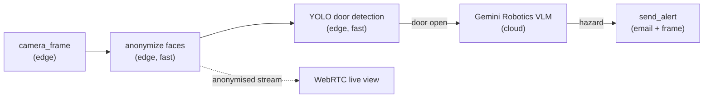

import { EdgeSetup } from "/snippets/edge-setup.mdx";

Cyberwave treats every camera the same (**USB webcams, IP cameras, depth cameras, infrared, industrial GigE**): drop a digital twin into an [environment](/use-cyberwave/architecture/key-concepts#environments), pair the hardware, and start consuming the stream from the dashboard, the [Python SDK](/tools/python-sdk), or a [Workflow](/use-cyberwave/workflows).

<iframe
  width="100%"
  height="400"
  src="https://www.youtube.com/embed/fuqn34XKEzQ"
  title="Cyberwave cameras: end-to-end"
  frameBorder="0"
  allow="accelerometer; autoplay; clipboard-write; encrypted-media; gyroscope; picture-in-picture"
  allowFullScreen
  style={{ borderRadius: "0.5rem" }}
/>

---

## Pick your camera

Cyberwave supports **every major camera** out of the box, from the classic [Logitech C270](https://cyberwave.com/logitech/c275) and the [Intel RealSense D455](https://cyberwave.com/intel/realsensed455) depth camera to industrial-grade machine-vision sensors like the [Basler ace GigE](https://cyberwave.com/basler/basler_ag_ace_gige). Browse the full lineup at [cyberwave.com/catalog/tag/camera](https://cyberwave.com/catalog/tag/camera).

Every catalog page bundles the **bill of materials**, supported drivers, and **troubleshooting** specific to that camera, so start there whenever you're unboxing new hardware.

---

## Set up a camera in 3 steps

<Steps>
  <Step title="Create an environment and add the camera">
    From the [dashboard](https://cyberwave.com/dashboard), click **New Environment**, then **Add from Catalog** and search for your camera (e.g. `C270`, `RealSense D455`, `Basler ace`). Position the twin to match where it's mounted in the real world.
  </Step>

  <Step title="Pair the hardware">
    On any device the camera is plugged into (your laptop, a Raspberry Pi or Jetson on a robot, an NVR) or on the same network as an IP camera, install the CLI and pair:

    <EdgeSetup />

    The CLI auto-detects the camera (USB, V4L2, RTSP, GigE Vision, RealSense, …), installs the right driver, and links it to the digital twin. If you are unsure how the camera you picked may connect, check out its dedicated page on the catalog: it details everything you need, plus troubleshooting and FAQs. Example: [Logitech C270](https://cyberwave.com/logitech/c275).

  </Step>

  <Step title="Stream sensors automatically">
    Cyberwave already knows what's on your camera. As soon as `sudo cyberwave pair` completes, the dashboard lights up with the **live RGB feed**, plus **depth**, **infrared**, **stereo**, or any other modality the sensor exposes, with no per-sensor configuration required.
  </Step>
</Steps>

<Check>
  The camera streams RGB (and depth / IR where available) into Cyberwave in real
  time, ready for [recording](/use-cyberwave/environment-editor/replay),
  [teleoperation](/use-cyberwave/environment-editor/teleoperation), and
  [workflows](/use-cyberwave/workflows).
</Check>

---

## Capture frames from Python

Once the twin is paired, the [Python SDK](/tools/python-sdk) gives you the same API for any camera in the catalog. Run this from your laptop or any cloud machine; Cyberwave handles the networking and orchestration end-to-end:

```python
from cyberwave import Cyberwave

cw = Cyberwave()
camera = cw.twin("logitech/c275")              # swap for any other camera slug

with cw.affect("live"):
    frame = camera.capture_frame("numpy")      # latest RGB frame
    depth = camera.capture_frame("depth")      # depth map (RealSense, ZED, …)
```

Switching to a different camera is a **one-line change**; the rest of your automation stays exactly the same.

---

## Build video workflows

[Workflows](/use-cyberwave/workflows) turn a camera stream into a video-understanding pipeline. You compose them **low-code** in the dashboard or directly in **Python**, and Cyberwave decides whether each step runs on the **edge** next to the camera, in a [cloud node](/tools/cloud-node), or as a **mix of both**; your automation and your hardware don't change.

A typical privacy-preserving security pipeline:



1. **[Anonymize](/use-cyberwave/workflows/anonymize-image) faces on the edge** so the video leaving the device is already redacted.
2. Run a **local model** like [YOLO](https://cyberwave.com/models) to detect doors in the scene (pick from hundreds of models at [cyberwave.com/models](https://cyberwave.com/models)).
3. When a door is open, call a **powerful cloud VLM** (Gemini Robotics, GPT, …) to reason about whether it's a security hazard.
4. **[Send an alert](/edge/drivers/alerts)** with the frame attached.

Full walkthroughs live in the [zone-based intrusion detection](/tutorials/intrusion-detection) and [edge-to-cloud VLM](/tutorials/edge-to-cloud-vlm) tutorials.

<Info>
  Because Cyberwave also speaks to [robotic dogs](/get-started/robotic-dogs),
  [drones](/get-started/drones), and [arms](/get-started/robotic-arms), you can
  mix and match hardware in the same workflow, for example a fixed ceiling
  camera that **triggers** a dog patrol, or a wrist camera that hands off to a
  cloud VLA model when it sees an unfamiliar object.
</Info>

---

## Record, replay, review

Cyberwave automatically handles the **recording, storage, and indexing** of every paired camera. Open any environment in **[Replay](/use-cyberwave/environment-editor/replay)** to scrub through the video timeline alongside the twin's pose, joint states, and point clouds, straight from the web app or pulled down via the SDK / [REST API](/api-reference/overview) for offline analysis, dataset curation, or model training.

---

## Where to go next

<CardGroup cols={3}>
  <Card
    title="Perception Capability"
    icon="eye"
    href="/capabilities/perception"
  >
    The full picture of what cameras and vision models can do on Cyberwave.
  </Card>
  <Card
    title="Browse the camera catalog"
    icon="camera"
    href="https://cyberwave.com/catalog/tag/camera"
  >
    Per-camera setup, BOM, and troubleshooting for every supported sensor.
  </Card>
  <Card
    title="Intrusion Detection Tutorial"
    icon="user-shield"
    href="/tutorials/intrusion-detection"
  >
    End-to-end edge-only video pipeline with YOLO, anonymize, and alerts.
  </Card>
</CardGroup>
