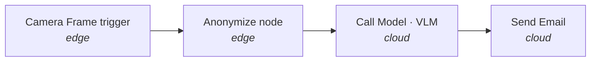

**Workflows** are Cyberwave's automation primitive. They turn a graph of nodes (triggers, models, twins, conditions, integrations) into a runnable artifact that can fire on a schedule, an MQTT message, a webhook, or every camera frame on a Raspberry Pi.

```python
from cyberwave import Cyberwave

cw = Cyberwave()

run = cw.workflows.trigger(
    "acme/workflows/pick-and-place",
    inputs={"target_position": [1.0, 2.0, 0.0], "speed": 0.5},
)
run.wait(timeout=60)
print(run.status)
```

That same workflow can be opened, edited, and visualised in the [Workflow Editor](/feature-reference/workflows): the graph and the Python are two views of one object.

---

## Three ways to build one

You never have to pick between a low-code graph and "real" code. Cyberwave keeps the two in sync.

<CardGroup cols={3}>
  <Card title="Visual editor" icon="diagram-project" href="/feature-reference/workflows#creating-a-workflow">
    Drag nodes from the palette, wire ports, configure parameters. Great for
    prototyping and for handing flows to non-engineers.
  </Card>
  <Card title="Python SDK" icon="python" href="/tools/python-sdk#workflows">
    Build, list, trigger, and monitor workflows from
    [`cw.workflows`](/tools/python-sdk#workflows). Anything you can do in the UI
    you can do in code.
  </Card>
  <Card title="With an agent" icon="sparkles" href="/tools/mcp-server">
    Describe the automation in plain English to Claude, Cursor, or any MCP
    client; Cyberwave's [MCP server](/tools/mcp-server) and
    [Claude skill](/tools/claude-skill) wire up the graph for you.
  </Card>
</CardGroup>

Every workflow round-trips between graph and Python, with no lock-in to either format. You get the power of pure code where you need it, and the simplicity of a visual graph everywhere else.

---

## Cloud, edge, or both, in one graph

A workflow can span both sides of your stack. Trigger and ML nodes that run [on the cloud](/tools/cloud-node) coordinate with the same workflow's edge half via the [edge worker runtime](/feature-reference/edge/workers/overview).

A common shape:



The video frame never leaves the device unanonymized, the VLM runs on a GPU in the cloud, and an email goes out, all from a single workflow definition. The [unified edge compiler](/feature-reference/workflows#environment-bound-workflows) decides what runs where based on the graph itself.

You don't manage model downloads, hardware compatibility, or reconnects. Cyberwave provisions the right model into the right runtime (edge YOLO for [`camera_frame`](/feature-reference/workflows#edge-workflows-camera-frame), cloud VLMs for [`call_model`](/feature-reference/workflows/overview#nodes)) and keeps it healthy when the network blinks.

---

## Same workflow, sim or real

Workflows run unchanged against [simulation](/overview/features/simulation) or live hardware. Flip the mode on your environment (or the SDK) and the same graph drives a MuJoCo twin in CI, then a real robot in your cell:

```python
cw.affect("simulation")
cw.workflows.trigger("acme/workflows/pick-and-place")

cw.affect("live")
cw.workflows.trigger("acme/workflows/pick-and-place")
```

This is the practical version of "test before you deploy"; see the [environment editor](/feature-reference/environment-editor/index#workflow-executions-in-an-environment) for replaying past runs and inspecting per-node executions.

---

## What workflows are good at

<CardGroup cols={2}>
  <Card title="Orchestrating multiple twins" icon="users-gear">
    Synchronise robots and sensors: swarm formations, multi-arm cells, or a
    fleet of cameras feeding a single inspection job. Wire any twin from the
    [catalog](https://cyberwave.com/catalog) into the same graph.
  </Card>
  <Card title="Switching between models and code" icon="shuffle">
    Hand off mid-task; e.g. an [RL policy](/feature-reference/ml-models/index)
    moves the arm to the box, then a deterministic Python
    [`code` node](/feature-reference/workflows#code-node-stub) takes over for
    the pre-canned drop sequence.
  </Card>
  <Card title="Reacting to the real world" icon="bell">
    [Camera-frame](/feature-reference/workflows#edge-workflows-camera-frame),
    MQTT, schedule, webhook, and email
    [triggers](/feature-reference/workflows#trigger-types) wake the workflow up
    without you wiring anything custom.
  </Card>
  <Card title="Calling out to anything" icon="plug">
    `http_request`, `send_email`, and `send_alert` nodes plug Cyberwave into
    the rest of your stack: PagerDuty, Slack, your warehouse system, a Notion
    page.
  </Card>
</CardGroup>

Workflows compose the whole [Cyberwave ecosystem](https://cyberwave.com): hundreds of [twins](https://cyberwave.com/catalog) and the [models hub](https://cyberwave.com/models) are one node away.

---

## Start from a template

Don't start from a blank canvas. Cyberwave ships a library of workflow templates (motion detection, pick-and-place, intrusion alerts, voice control) and you can publish your own for your team or the world.

```bash
cyberwave workflow create --template motion-detection
```

Templates are versioned, slugged like the rest of Cyberwave (`acme/workflows/my-template`), and editable after cloning: they're a starting point, not a black box.

---

## What to read next

<CardGroup cols={2}>
  <Card title="Workflow nodes" icon="shapes" href="/overview/features/workflow-nodes">
    Every node in the palette, grouped by category, with what it does and where it runs.
  </Card>
  <Card title="Workflows reference" icon="diagram-project" href="/feature-reference/workflows">
    Node taxonomy, trigger types, edge sync, and the full editor walkthrough.
  </Card>
  <Card title="Workflow API" icon="code" href="/api-reference/rest/WorkflowSchema">
    REST schemas: [`WorkflowSchema`](/api-reference/rest/WorkflowSchema),
    [`WorkflowExecuteSchema`](/api-reference/rest/WorkflowExecuteSchema),
    [`WorkflowNodeSchema`](/api-reference/rest/WorkflowNodeSchema).
  </Card>
  <Card title="Edge-to-cloud VLM tutorial" icon="bolt" href="/tutorials/edge-to-cloud-vlm">
    Build the anonymize-on-edge + VLM-on-cloud workflow end-to-end.
  </Card>
</CardGroup>
