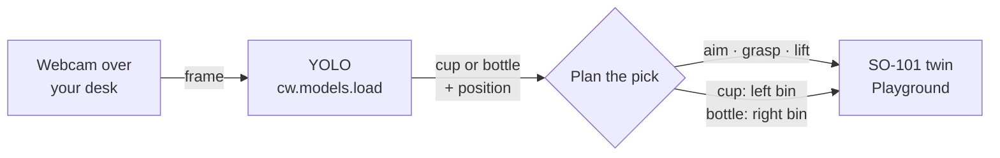

**At a glance:** 20 min · Beginner · Python 3.10+, a Cyberwave API key, a laptop webcam, a cup and a bottle. No robot, no credits.

You will build the smallest version of a real robot cell: **vision-guided pick-and-sort**. A camera looks at your desk. A perception model finds a cup or a bottle and where it is. The robot aims at it, grasps it, lifts it, and drops it in the bin for its class: cups on the left, bottles on the right.

The robot is an SO-101 arm running in the free Playground simulation, so you can build and debug the logic before you touch hardware. When you have a real SO-101, you change one line and the same script drives it.



The object's class decides **where** it goes and its position in the frame decides **where the arm aims**. A perception model decides, your script controls the arm: the same structure as a sorting station on a production line. See [Connect AI to robots](/ai/overview).

<Note>
In the Playground only the arm is simulated. Your real cup stays on the desk. After each pick, move the object out of view by hand and the loop waits for the next one. With a real arm, the gripper closes on the object for real.
</Note>

## Before you start

- A Cyberwave account and an API token. Create the token under **Profile → Access**. See [API tokens](/feature-reference/api-tokens).
- If your token covers more than one workspace, also set `CYBERWAVE_WORKSPACE_ID`. Otherwise the first request fails with `400 workspace_required`.
- A cup and a bottle. Both are in YOLO's default classes, so no training is needed.

## Build it

<Steps>
  <Step title="Install the SDK with the ML and camera extras">
    ```bash
    python -m venv .venv && source .venv/bin/activate
    pip install "cyberwave[ml,camera]"
    ```
    `ml` installs Ultralytics, which runs YOLO locally. `camera` installs OpenCV, which reads the webcam. Keep the quotes: zsh treats square brackets as a pattern.
  </Step>
  <Step title="Export your credentials">
    ```bash
    export CYBERWAVE_API_KEY="your_api_key_here"
    # Only if your token spans several workspaces:
    export CYBERWAVE_WORKSPACE_ID="your_workspace_uuid"
    ```
  </Step>
  <Step title="Write the sorting loop">
    Save this as `pick_and_sort.py`:

    ```python
    import time

    import cv2
    from cyberwave import Cyberwave

    # Example poses in degrees, good enough to watch in the Playground.
    # On a real SO-101, record your own in the twin's Saved poses panel.
    HOME   = {"shoulder_pan": 0, "shoulder_lift": 0, "elbow_flex": 0, "wrist_flex": 0, "gripper": 0}
    REACH  = {"shoulder_lift": 45, "elbow_flex": -35, "wrist_flex": 50}
    LIFT   = {"shoulder_lift": 10, "elbow_flex": -10, "wrist_flex": 20}
    OPEN   = {"gripper": 35}
    CLOSED = {"gripper": 0}
    BINS   = {"cup": -90, "bottle": 90}   # base rotation (shoulder_pan) of each bin
    AIM_RANGE = 45                        # frame edges map to ±45° of base rotation

    cw = Cyberwave()                          # reads CYBERWAVE_API_KEY
    arm = cw.twin("the-robot-studio/so101")   # creates or reuses "Quickstart Environment"
    cw.affect("playground")                   # free kinematic simulation; "live" for a real arm
    arm.policy.ensure_attached()              # the script becomes the arm's controller
    time.sleep(2)                             # give the controller a moment to come up


    def move(pose, pause=0.8):
        arm.set_joints(pose, degrees=True)
        time.sleep(pause)                     # let the arm arrive before the next move


    def pick_and_sort(label, x_center, frame_width):
        # Left edge of the frame -> -AIM_RANGE, right edge -> +AIM_RANGE.
        aim = (x_center / frame_width - 0.5) * 2 * AIM_RANGE
        print(f"{label} at x={x_center:.0f}px -> aim {aim:+.0f} deg, bin {BINS[label]:+d} deg")
        move({"shoulder_pan": aim, **OPEN})   # turn toward the object, open the gripper
        move(REACH)                           # go down to it
        move(CLOSED)                          # grasp
        move(LIFT)                            # lift clear of the table
        move({"shoulder_pan": BINS[label]})   # carry it to its bin
        move(OPEN)                            # drop
        move(HOME)                            # back to home, ready for the next one


    move(HOME)
    model = cw.models.load("yolo26n.pt")      # runs locally; weights download on first use
    camera = cv2.VideoCapture(0)              # default webcam

    waiting_for_clear = False                 # don't pick the same object twice
    try:
        while True:
            ok, frame = camera.read()         # BGR numpy array
            if not ok:
                raise RuntimeError("No frame from webcam 0. Is another app using it?")

            result = model.predict(frame, confidence=0.5, classes=list(BINS))

            if len(result) == 0:
                waiting_for_clear = False     # workspace is empty: ready for the next object
            elif not waiting_for_clear:
                target = max(result, key=lambda d: d.confidence)
                x_center = (target.bbox.x1 + target.bbox.x2) / 2
                pick_and_sort(target.label, x_center, frame.shape[1])
                waiting_for_clear = True

            time.sleep(0.3)
    except KeyboardInterrupt:
        pass
    finally:
        camera.release()
        cw.disconnect()
    ```
  </Step>
  <Step title="Run it and watch the arm">
    ```bash
    python pick_and_sort.py
    ```
    The SDK prints an environment link. Open it in your browser. Put a cup in front of the webcam: the arm aims, reaches, grasps, lifts and drops it on the left. Take the cup away, show a bottle: it goes to the right. Move the object left or right in the frame and the arm aims differently. Press `Ctrl+C` to stop.
    {/* TODO(docs): confirm whether the environment editor must be switched to Simulate for Playground joint commands from the SDK to render in the viewport. */}
  </Step>
</Steps>

## Expected output

UUIDs, URLs, pixel positions and angles will differ:

```text
[Cyberwave] No environment specified — created a new 'Quickstart Environment'.
  View it at: https://cyberwave.com/...
Twin 3f1c...: controller policy was just attached. This command may have been lost while the robot was still setting up; retry in a few seconds.
cup at x=212px -> aim -15 deg, bin -90 deg
bottle at x=470px -> aim +21 deg, bin +90 deg
```

<Check>
Each object you show is picked once and dropped in the bin for its class. You have a working camera → model → robot loop with a real decision in it.
</Check>

The "may have been lost" warning is expected on the first run: `ensure_attached()` has just attached a controller policy to the twin. On later runs the policy is already attached and the warning goes away.

## How it works

<AccordionGroup>
  <Accordion title="The model decides what and where">
    `model.predict(frame, classes=["cup", "bottle"])` returns only those two classes. Each detection has a `label`, a `confidence` and a `bbox` in pixels. The script takes the most confident one. Its **label** picks the bin; the **center of its box** picks the aim angle.
  </Accordion>
  <Accordion title="Pixels to angles: the simplest calibration">
    `aim = (x_center / frame_width - 0.5) * 2 * AIM_RANGE` maps the left edge of the image to −45° and the right edge to +45°. It is a straight-line guess that is good enough to see the idea. A real cell replaces it with [hand-eye calibration](/feature-reference/hand-eye-calibration), which turns a pixel into a position in the robot's frame.
  </Accordion>
  <Accordion title="A pick is a sequence of poses">
    Aim → reach → close → lift → turn to bin → open → home. Each step is one `arm.set_joints(pose, degrees=True)` call. Positions are in **radians** unless you pass `degrees=True`. The pause after each move lets the arm arrive; on real hardware, tune it to your speed.
  </Accordion>
  <Accordion title='cw.affect("playground") vs "live"'>
    `"playground"` is a free kinematic simulation with no cloud instance. `"simulation"` starts a MuJoCo instance with physics, which uses [credits](/billing/credits). `"live"` sends the same commands to a real arm through a paired edge device.
  </Accordion>
  <Accordion title="arm.policy.ensure_attached()">
    Exactly one controller drives a twin at a time. This call attaches a controller that accepts SDK joint commands, so your script is the one in control. You can take over from the dashboard at any moment.
  </Accordion>
</AccordionGroup>

## Make it real

<Tabs>
  <Tab title="Real SO-101">
    1. Pair the arm: [install the CLI and pair a device](/overview/tools/cli#pair-a-device).
    2. Mount the camera above the workspace, looking down, so left and right in the image match left and right for the arm. A laptop webcam facing you is mirrored: use `frame = cv2.flip(frame, 1)` or flip the sign of `aim`.
    3. Record `HOME`, `REACH`, `LIFT`, the bin angles and the gripper values in the twin's [Saved poses](/feature-reference/twin-saved-poses) panel and paste them into the script.
    4. Change one line: `cw.affect("live")`. Keep a hand on the dashboard's controller switch the first time.
  </Tab>
  <Tab title="Pick a cube (any object by name)">
    YOLO's default model knows 80 everyday classes, and "cube" isn't one of them. An open-vocabulary model detects whatever you name:

    ```python
    model = cw.models.load("yoloe-11s-seg.pt")
    result = model.predict(frame, confidence=0.3, prompt="red cube, blue cube")
    ```
    Then use `BINS = {"red cube": -90, "blue cube": 90}` and drop `classes=` from the predict call. Text prompts need the Ultralytics CLIP package; if it is missing, the SDK logs `Failed to apply YOLOE text prompt` and keeps the previous classes.
    {/* TODO(docs): confirm the recommended install command for the Ultralytics CLIP fork and that yoloe-11s-seg.pt loads through cw.models.load on a laptop. */}
  </Tab>
  <Tab title="Full physics in MuJoCo (billable)">
    In MuJoCo the camera, the object and the grasp are all simulated. Add a camera and an object to the environment in the editor, then read frames from the camera twin instead of the webcam:

    ```python
    cam = cw.twin("cyberwave/standard-cam")   # same Quickstart Environment
    cw.affect("simulation")                   # starts MuJoCo and waits until it runs
    frame = cam.get_frame("numpy")            # BGR numpy array, or None if no frame yet
    ```
    MuJoCo is a cloud instance billed at about 0.6 credits per hour. Stop it when you are done:
    `cw.environments.simulations.get_active(cw.config.environment_id).stop()`.
  </Tab>
</Tabs>

## If something goes wrong

- `ModuleNotFoundError: No module named 'cv2'`: install the `camera` extra (step 1).
- `No API key found!`, `401` or `400 workspace_required`: check the two environment variables in step 2.
- Nothing is detected: light the scene, move the object closer, or lower `confidence` to `0.35`.
- The arm aims the wrong way: your camera is mirrored. Flip the frame or the sign of `aim`.
- The script runs but the arm doesn't move: make sure `cw.affect("playground")` comes before the first command and you opened the link the SDK printed.

Full list: [Troubleshooting](/support/troubleshooting).

## Next steps

<CardGroup cols={2}>
  <Card title="Replace the rules with a learned policy" icon="robot" href="/tutorials/train-vla-cyberwave">
    Record demonstrations of the same pick, train a VLA, and let it drive the arm.
  </Card>
  <Card title="Control agent" icon="comments" href="/ai/control-agent">
    Say "put the cups on the left" and approve the plan before it runs.
  </Card>
  <Card title="Connect AI to robots" icon="map" href="/ai/overview">
    The map: AI agents, AI models, control, and how each run trains the next model.
  </Card>
  <Card title="Hand-eye calibration" icon="crosshairs" href="/feature-reference/hand-eye-calibration">
    Turn pixels into robot coordinates for accurate picks.
  </Card>
</CardGroup>
