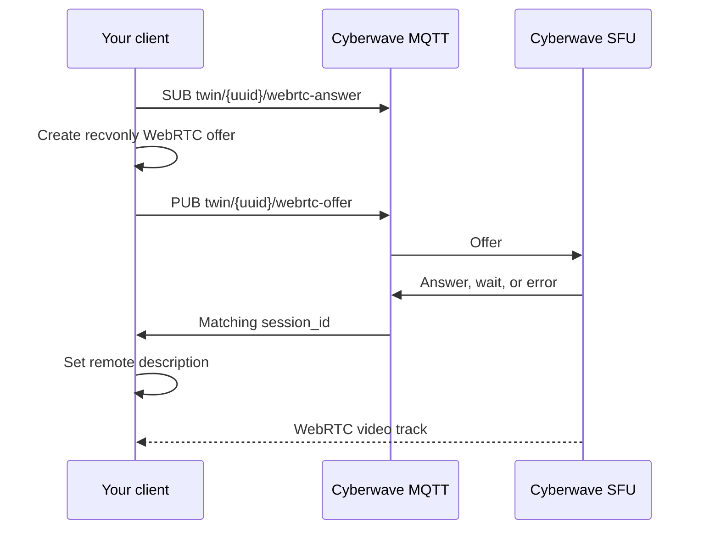

Cyberwave exposes an active camera stream as a WebRTC SFU consumer connection.
Use the Python SDK unless you need to render the stream in your own browser or
native client. There is no anonymous stream URL, HLS playlist, RTSP output, or
WHEP endpoint.

## Recommended: Python SDK

Install the camera dependencies and authenticate with a Cyberwave API token:

```bash
pip install "cyberwave[camera]"
export CYBERWAVE_API_KEY="your_api_key_here"
```

```python
from cyberwave import Cyberwave

cw = Cyberwave()
twin = cw.twin(twin_id="twin-uuid")

stream = twin.camera.get_video()
frame = stream.get_frame(format="numpy")

# Or display the ongoing stream until q/Esc is pressed.
stream.show()
stream.stop()
```

`get_video()` joins the existing SFU room as a receive-only consumer. It does
not replace the producer or interrupt other viewers. It raises
`NoOngoingVideoStreamAvailable` when the selected twin or sensor has no active
producer.

For an executable smoke test and inline viewer, open the
[`live_video.ipynb` Colab notebook](https://colab.research.google.com/github/cyberwave-os/cyberwave/blob/main/cyberwave-colab/live_video.ipynb).

## Custom browser or native client

Custom clients use MQTT for WebRTC signaling and WebRTC for media:



### Requirements

- Connect to the MQTT endpoint for the deployment. Production browser clients
  use `wss://mqtt.cyberwave.com`; native clients can use MQTT over TLS on port
  `8883`.
- For API-token authentication, use the token as the MQTT password and your own
  Cyberwave username as the MQTT username — the `username` field from
  `GET /api/v1/users/@me/status/`, not your email address. A per-user session
  credential must be paired with its corresponding username.
- The token's principal must be able to read and write the twin. Subscribing to
  the answer topic requires read access; publishing the offer currently
  requires write access.
- Use the deployment's topic prefix outside production, if one is configured.
- Supply a working STUN/TURN configuration. Contact Cyberwave for the current
  ICE configuration instead of embedding shared credentials in an application.

<Warning>
  Do not put an API token in public frontend source or ship it to untrusted
  browsers. A browser integration should authenticate each user and use that
  user's MQTT credential. Keep workspace API tokens in a trusted native or
  backend client.
</Warning>

### Signaling topics

For a production twin UUID of `abc`, use:

| Operation | Topic |
| --- | --- |
| Publish offer | `cyberwave/twin/abc/webrtc-offer` |
| Subscribe for answer | `cyberwave/twin/abc/webrtc-answer` |

Subscribe to the answer topic **before** publishing the offer. Both topics are
shared by every consumer of the twin, so generate a unique `session_id` and
ignore messages for other sessions.

The consumer offer payload is:

```json
{
  "type": "offer",
  "sdp": "v=0\r\n...",
  "target": "backend",
  "sender": "frontend",
  "frontend_type": "rgb",
  "sensor": "optional-sensor-id",
  "session_id": "unique-client-session-id",
  "timestamp": 1788253200.0
}
```

Use `sender: "frontend"` for a custom browser/native consumer. The media service
also recognizes `client_python_sdk`, which is reserved for the SDK consumer.
When selecting a simulation or another non-default stream, also include its
`stream_source` and `stream_instance_id`.

The answer topic can return:

- `type: "answer"` with an SDP answer: call `setRemoteDescription()`.
- `type: "wait"`: no matching producer is registered yet; retry with a new
  peer connection after a short delay.
- `type: "error"`: negotiation failed; surface the included `message` or
  `error` value.

### Browser outline

The following omits application-specific credential delivery, reconnect logic,
and SDP normalization, but shows the required ordering and message filtering:

```ts
import mqtt from "mqtt";

const twinUuid = "twin-uuid";
const sessionId = crypto.randomUUID();
const answerTopic = `cyberwave/twin/${twinUuid}/webrtc-answer`;
const offerTopic = `cyberwave/twin/${twinUuid}/webrtc-offer`;
const mqttCredentials = getAuthenticatedMqttCredentials();

const signaling = mqtt.connect("wss://mqtt.cyberwave.com", {
  protocolVersion: 5,
  clientId: `external-video-${crypto.randomUUID()}`,
  username: mqttCredentials.username,
  password: mqttCredentials.password,
});

const pc = new RTCPeerConnection({
  iceServers: getCyberwaveIceServersFromYourBackend(),
});

pc.addTransceiver("video", { direction: "recvonly" });
pc.ontrack = ({ streams: [stream] }) => {
  document.querySelector<HTMLVideoElement>("video")!.srcObject = stream;
};

signaling.on("message", async (topic, bytes) => {
  if (topic !== answerTopic) return;
  const reply = JSON.parse(bytes.toString());
  if (reply.session_id !== sessionId) return;

  if (reply.type === "answer") {
    await pc.setRemoteDescription({ type: "answer", sdp: reply.sdp });
  } else if (reply.type === "wait" || reply.type === "error") {
    console.error(reply.message ?? reply.error);
  }
});

// Wait for both CONNECT and SUBACK before publishing. Otherwise a fast SFU
// answer can arrive before this client is listening.
await new Promise<void>((resolve, reject) => {
  signaling.once("error", reject);
  signaling.once("connect", () => {
    signaling.subscribe(answerTopic, { qos: 0 }, (error) => {
      signaling.removeListener("error", reject);
      if (error) reject(error);
      else resolve();
    });
  });
});

const offer = await pc.createOffer();
const normalizedSdp = normalizeVideoOfferSdp(offer.sdp ?? "");
await pc.setLocalDescription({ type: "offer", sdp: normalizedSdp });

signaling.publish(
  offerTopic,
  JSON.stringify({
    type: "offer",
    sdp: pc.localDescription!.sdp,
    target: "backend",
    sender: "frontend",
    frontend_type: "rgb",
    session_id: sessionId,
    timestamp: Date.now() / 1000,
  }),
  { qos: 0 },
);
```

### Codec compatibility

Cyberwave's SFU uses pinned RTP payload types. A browser must advertise the
same payload numbers in its local offer; an SDP answer cannot safely redefine
them. This matters in particular for recent Chrome versions.

Before `setLocalDescription()`, normalize the video section to the SFU table:

| Codec | Payload type |
| --- | ---: |
| VP8 | 96 |
| VP9 profile 0 | 98 |
| H.264 `42001f`, packetization mode 1 | 103 |
| H.264 `42e01f`, packetization mode 1 | 109 |
| H.264 `4d001f`, packetization mode 1 | 117 |
| H.264 `64001f`, packetization mode 1 | 119 |

The canonical implementation is
[`normalizeVideoOfferSdp`](https://github.com/cyberwave-os/cyberwave/blob/main/cyberwave-frontend/lib/video-offer-sdp.ts).
Keep a vendored implementation in sync with that file and the media-service
router. If maintaining this protocol is undesirable, use `get_video()` from
the Python SDK instead.

## Cleanup

Close all three resources when the viewer exits:

```ts
pc.close();
signaling.unsubscribe(answerTopic);
signaling.end();
```

For production integrations, also handle MQTT reconnects, WebRTC connection
failure, stalled-frame detection, and a signaling-answer timeout.
