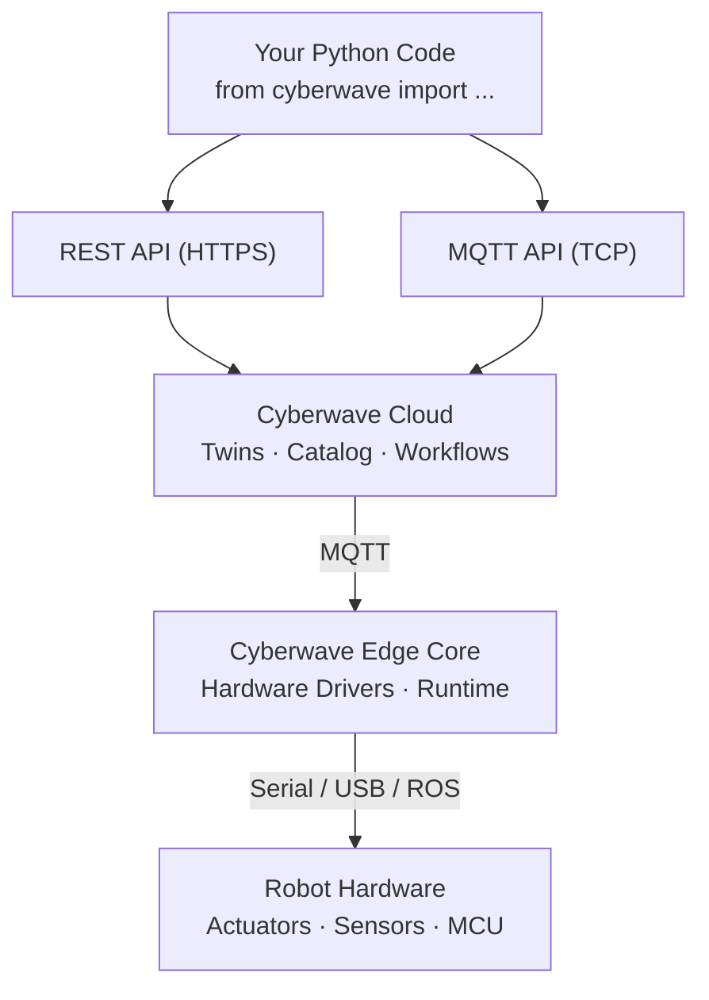

import EarlyAccess from "/snippets/early-access.mdx";

<EarlyAccess />

## Overview

The Cyberwave Python SDK (`cyberwave`) is a unified client that wraps both the Cyberwave **REST API** and **MQTT API** into a single Python interface. It handles authentication, protocol negotiation, and message serialization so you can interact with digital twins, control physical robots, stream video, manage workflows, and handle alerts, all using Python.

| Capability                       | Protocol      | Description                                                             |
| -------------------------------- | ------------- | ----------------------------------------------------------------------- |
| Digital Twin management          | REST          | Create, query, move, and configure digital twins                        |
| Joint control                    | MQTT          | Send real-time joint position commands (radians by default; optional degrees) |
| Position, rotation, scale        | MQTT          | Update a twin's 3D pose in the environment                              |
| Video streaming                  | WebRTC + MQTT | Stream camera feeds (standard + RealSense) to the cloud                 |
| Frame capture                    | WebRTC        | Grab individual frames as files, numpy arrays, PIL images, or raw bytes |
| Asset catalog                    | REST          | Search, create, and upload robot assets (including large GLB files)     |
| Workspace and project management | REST          | List workspaces, create projects and environments                       |
| GPS telemetry                    | MQTT          | Publish raw GNSS data (lat/lon/alt/satellites) for storage and replay   |
| Edge management                  | REST          | Register, update, and delete edge devices                               |
| Workflows                        | REST          | List, trigger, and monitor workflow executions                          |
| Alerts                           | REST          | Create, acknowledge, resolve, and manage twin alerts                    |
| ML Model catalog                 | REST          | List, get, and delete ML model records in your workspace                |
| ML inference                     | Local / Cloud | Load a model and run `.predict()` on images at the edge or in the cloud |

---

## Installation

```bash
pip install cyberwave
```

For camera streaming, install the optional extras:

<Tabs>
  <Tab title="Standard Cameras (OpenCV)">
    ```bash
    pip install cyberwave[camera]
    ```
  </Tab>
  <Tab title="Intel RealSense (RGB + Depth)">
    ```bash
    pip install cyberwave[realsense]
    ```

    <Info>
    On ARM64/Raspberry Pi, you'll also need the `librealsense` SDK installed on your system. On x86_64, install it via `sudo apt install librealsense2` or use pre-built wheels. On Raspberry Pi OS (ARM64), you must build librealsense from source.
    </Info>

  </Tab>
  <Tab title="Host Microphones">
    ```bash
    pip install cyberwave[microphone]
    ```

    Use this extra for direct host microphone capture helpers based on `sounddevice`, WebRTC audio (`aiortc`/`av`), and Linux hotplug monitoring via `pyudev`.

  </Tab>
</Tabs>

Video streaming also requires **FFMPEG**:

```bash
# macOS
brew install ffmpeg pkg-config

# Ubuntu
sudo apt-get install ffmpeg
```

<Note>
  **Requirements:** - Python 3.10 or higher - A Cyberwave API key (generate one
  from your [Profile page](https://cyberwave.com/profile))
</Note>

---

## Quick Start

```python
from cyberwave import Cyberwave
import math, asyncio

cw = Cyberwave(api_key="your_api_key_here")

# ──────────────────────────────────────────────
# 1. Create a digital twin from the asset catalog
# ──────────────────────────────────────────────

robot = cw.twin("the-robot-studio/so101")

# Target a specific environment (optional)
# robot = cw.twin("the-robot-studio/so101", environment_id="ENV_UUID")

# ──────────────────────────────────────────────
# 2. Position, rotate, and scale the twin
# ──────────────────────────────────────────────

robot.edit_position(x=1.0, y=0.0, z=0.5)
robot.edit_rotation(yaw=90)
robot.edit_scale(x=1.5, y=1.5, z=1.5)

# ──────────────────────────────────────────────
# 3. Control joints (radians by default)
# ──────────────────────────────────────────────

robot.joints.set("shoulder_pan", math.pi / 4)
robot.joints.set("elbow_flex", 45, degrees=True)

angle = robot.joints.get("shoulder_pan")
all_joints = robot.joints.get_all()
print(f"Joint names: {robot.joints.list()}")

# ──────────────────────────────────────────────
# 4. Capture a camera frame (no streaming setup needed)
# ──────────────────────────────────────────────

path  = robot.capture_frame()           # save temp JPEG, returns path
frame = robot.capture_frame("numpy")    # numpy BGR array
image = robot.capture_frame("pil")      # PIL.Image object

# ──────────────────────────────────────────────
# 5. Search the asset catalog
# ──────────────────────────────────────────────

for asset in cw.assets.search("unitree"):
    print(f"{asset.registry_id}: {asset.name}")

# ──────────────────────────────────────────────
# 6. Manage workspaces, projects, and environments
# ──────────────────────────────────────────────

workspaces = cw.workspaces.list()
project = cw.projects.create(name="My Project", description="Quickstart project", workspace_id=workspaces[0].uuid)
env = cw.environments.create(name="Lab Setup", description="Test environment", project_id=project.uuid)

# ──────────────────────────────────────────────
# 7. Trigger a workflow and wait for completion
# ──────────────────────────────────────────────

run = cw.workflows.trigger("workflow-uuid", inputs={"speed": 0.5})
run.wait(timeout=60)
print(f"Workflow finished: {run.status}")

# ──────────────────────────────────────────────
# 8. Create and manage alerts on a twin
# ──────────────────────────────────────────────

alert = robot.alerts.create(
    name="Calibration needed",
    description="Joint 3 drifting beyond tolerance",
    severity="warning",
    alert_type="calibration_needed",
)
alert.acknowledge()
alert.resolve()

# ──────────────────────────────────────────────
# 9. Stream live video (async)
# ──────────────────────────────────────────────

camera = cw.twin("cyberwave/standard-cam")

async def stream():
    await camera.stream_video_background()
    try:
        while True:
            await asyncio.sleep(1)
    finally:
        await camera.stop_streaming()
        cw.disconnect()

# asyncio.run(stream())

# ──────────────────────────────────────────────
# 10. Manage edge devices
# ──────────────────────────────────────────────

for edge in cw.edges.list():
    print(f"{edge.name} — {edge.uuid}")
```

---

## Authentication

The SDK authenticates using an API key. You can provide it in two ways:

**Option 1: Environment variable (recommended):**

```bash
export CYBERWAVE_API_KEY=your_api_key_here
```

```python
from cyberwave import Cyberwave

cw = Cyberwave()
```

**Option 2: Explicit API key:**

```python
from cyberwave import Cyberwave

cw = Cyberwave(api_key="your_api_key_here")
```

You can also set a default environment so `cw.twin()` always targets the same environment:

```bash
export CYBERWAVE_API_KEY="your_api_key_here"
export CYBERWAVE_ENVIRONMENT_ID="your_environment_uuid"
```

With both set, `cw.twin("the-robot-studio/so101")` will return the first SO101 twin in that environment, or create one if it doesn't exist.

<Steps>
  <Step title="Generate an API key">
    Go to the Cyberwave dashboard → **Profile** → **API Tokens** and create a
    new key.
  </Step>
  <Step title="Set the environment variable">
    Export `CYBERWAVE_API_KEY` in your shell or add it to your `.env` file.
  </Step>
  <Step title="Initialize the client">
    Call `Cyberwave()`, the SDK picks up the key and establishes connections to
    both the REST and MQTT endpoints.
  </Step>
</Steps>

---

## Affect Simulation vs Live Environment

Use `cw.affect()` to decide whether high-level robot actions should impact the simulation or the live robot.

```python
from cyberwave import Cyberwave

cw = Cyberwave()

cw.affect("simulation")
rover = cw.twin("unitree/go2")
rover.move_forward(distance=1.0)   # moves the digital twin

cw.affect("live")
rover.move_forward(distance=1.0)   # moves the physical robot
```

Accepted values are:

| Value          | Effect                                                                                              |
| -------------- | --------------------------------------------------------------------------------------------------- |
| `"simulation"` | Sends high-level actions to the simulator and updates the digital twin in the Cyberwave environment |
| `"live"`       | Sends high-level actions to the live robot through Cyberwave's live control path                    |

`"real-world"` is also accepted as an alias for `"live"`.

`affect()` is chainable, so you can also write `cw.affect("simulation").twin("unitree/go2")`.

---

## Digital Twins

### Create or Retrieve a Twin

`cw.twin()` is the primary method for working with digital twins. Pass an asset registry ID (`vendor/model`) to create or retrieve a twin:

```python
robot = cw.twin("the-robot-studio/so101")
```

This method:

1. Queries the **Asset Catalog** (REST) to resolve the asset by registry ID
2. Creates a new twin instance in your environment, or retrieves an existing one
3. Returns a **capability-specific Twin class** based on the asset's metadata

You can also target a specific environment or retrieve a twin by UUID or [unified slug](/concepts/slug-system):

```python
# By UUID
robot = cw.twin("the-robot-studio/so101", environment_id="YOUR_ENVIRONMENT_UUID")
twin = cw.twin(twin_id="YOUR_TWIN_UUID")

# By unified slug
robot = cw.twin("acme/catalog/so101", environment_id="acme/envs/production")
twin = cw.twin(twin_id="acme/twins/my-arm")
```

Slugs and UUIDs are interchangeable wherever an identifier is accepted. Access an entity's slug via the `.slug` property (e.g. `twin.slug`).

If no default environment is configured (via `CYBERWAVE_ENVIRONMENT_ID` or `environment_id` parameter), the SDK auto-creates a "Quickstart Environment" and places the twin there.

### Position, Rotation, and Scale

Update a twin's 3D pose in the environment:

```python
robot.edit_position(x=1.0, y=0.0, z=0.5)
robot.edit_position([1.0, 0.5, 0.0])

robot.edit_rotation(yaw=90)

robot.edit_scale(x=1.5, y=1.5, z=1.5)
```

Both keyword arguments and list format are supported for `edit_position`.

### Move a Twin Between Environments

```python
robot.add_to_environment("TARGET_ENVIRONMENT_UUID")
```

This operation:

- Creates a deep copy of the twin in the target environment
- Marks the original twin as deleted
- Deletes the source environment if it has no remaining twins

---

## Joint Control

Send real-time joint commands to a robot arm or any articulated twin. Positions are **radians by default**; pass `degrees=True` for degrees:

```python
import math

cw.affect("simulation")
robot = cw.twin("the-robot-studio/so101")

robot.joints.list()
robot.joints.get()
robot.joints.set("shoulder_pan", math.pi / 4)
robot.joints.set("elbow_flex", 45, degrees=True)

angle = robot.joints.get("shoulder_pan")

joint_names = robot.joints.list()

# Get all joint states as a dict {name: radians}
all_joints = robot.joints.get_all()

# Print a human-readable table of all joint states (radians + degrees)
robot.joints.print_joint_states()
```

`print_joint_states()` fetches the latest state from the server and prints a formatted table:

```
Joint states for twin <twin-uuid>:
------------------------------------------------------
Joint                       Radians       Degrees
------------------------------------------------------
elbow_flex                0.0000 rad       0.00 °
shoulder_pan              0.7854 rad      45.00 °
------------------------------------------------------
```

| Method                                  | Description                                                          |
| --------------------------------------- | -------------------------------------------------------------------- |
| `joints.list()` | Controllable joint names from schema |
| `joints.get(what_joints=..., what_data=[...])` | Read cached joint state (default: all positions in radians) |
| `joints.set(values, what_data="position", ...)` | Set one joint kind (position, velocity, acceleration) |
| `joints.get(name)`                      | Get the current position of a specific joint (radians)               |
| `joints.list()`                         | List all joint names for the twin                                    |
| `joints.get_all()`                      | Get all joint states as a `dict[name, radians]`                      |
| `joints.print_joint_states()`           | Print all joint states in a human-readable table (radians + degrees) |

---

## Frame Capture

Capture the latest camera frame from a twin without setting up a full video stream:

```python
robot = cw.twin("the-robot-studio/so101")

path = robot.capture_frame()                    # temp JPEG file path
frame = robot.capture_frame("numpy")            # numpy BGR array (requires numpy + opencv-python)
image = robot.capture_frame("pil")              # PIL.Image (requires Pillow)
raw = robot.capture_frame("bytes")              # raw JPEG bytes
```

Batch capture multiple frames:

```python
folder = robot.capture_frames(5, interval_ms=200)            # folder of JPEGs
frames = robot.capture_frames(5, format="numpy")              # list of numpy arrays
```

For multi-camera twins, specify a sensor:

```python
wrist = robot.capture_frame("numpy", sensor_id="wrist_cam")
```

There's also a `camera` namespace with convenience methods:

```python
frame = robot.camera.read()               # numpy array (default)
path  = robot.camera.snapshot()            # save JPEG to temp file
path  = robot.camera.snapshot("out.jpg")   # save to a specific path
```

---

## Video Streaming (WebRTC)

Stream live camera feeds to digital twins using WebRTC. The streaming is initiated directly from the twin object.

### Standard Camera

```python
import asyncio
from cyberwave import Cyberwave

cw = Cyberwave()
camera = cw.twin("cyberwave/standard-cam")

async def main():
    try:
        print(f"Streaming to twin {camera.uuid}...")
        await camera.stream_video_background()

        while True:
            await asyncio.sleep(1)
    except (KeyboardInterrupt, asyncio.CancelledError):
        pass
    finally:
        await camera.stop_streaming()
        cw.disconnect()

asyncio.run(main())
```

### Intel RealSense (RGB + Depth)

For depth cameras, change the twin name and the SDK handles the rest:

```python
import asyncio
from cyberwave import Cyberwave

cw = Cyberwave()
camera = cw.twin("intel/realsensed455")

async def main():
    try:
        await camera.stream_video_background()

        while True:
            await asyncio.sleep(1)
    except (KeyboardInterrupt, asyncio.CancelledError):
        pass
    finally:
        await camera.stop_streaming()
        cw.disconnect()

asyncio.run(main())
```

### Camera Discovery

Discover cameras attached to your device:

```python
from cyberwave.sensor import CV2VideoTrack, CameraConfig, Resolution

supported = CV2VideoTrack.get_supported_resolutions(camera_id=0)
info = CV2VideoTrack.get_camera_info(camera_id=0)

config = CameraConfig(resolution=Resolution.HD, fps=30, camera_id=0)
```

For RealSense devices:

```python
from cyberwave.sensor import RealSenseDiscovery, RealSenseConfig, Resolution

if RealSenseDiscovery.is_available():
    devices = RealSenseDiscovery.list_devices()
    for dev in devices:
        print(f"{dev.name} (SN: {dev.serial_number})")

    info = RealSenseDiscovery.get_device_info()
    print(f"Color resolutions: {info.get_color_resolutions()}")
    print(f"Depth resolutions: {info.get_depth_resolutions()}")
```

---

## Workspaces, Projects, and Environments

```python
cw = Cyberwave()

workspaces = cw.workspaces.list()
print(f"Found {len(workspaces)} workspaces")

project = cw.projects.create(
    name="My Robotics Project",
    description="Main robotics project",
    workspace_id=workspaces[0].uuid
)

environment = cw.environments.create(
    name="Development",
    description="Dev environment for testing",
    project_id=project.uuid
)
```

---

## Asset Catalog

Search and browse pre-built robot assets:

```python
assets = cw.assets.search("so101")

for asset in assets:
    print(f"{asset.registry_id}: {asset.name}")

robot = cw.twin(assets[0].registry_id)
```

The search returns both public assets (available at [cyberwave.com/catalog](https://cyberwave.com/catalog)) and private assets belonging to your organization.

### Upload GLB Assets

The SDK supports large GLB uploads by automatically switching to a signed URL flow when files exceed the standard upload limit:

```python
asset = cw.assets.create(
    name="Warehouse Shelf",
    description="Large GLB upload example",
)

updated_asset = cw.assets.upload_glb(asset.uuid, "/path/to/warehouse_shelf.glb")
print(updated_asset.glb_file)
```

---

## Edge Management

Manage edge devices (Raspberry Pi, Jetson, etc.) that run the Cyberwave Edge Core:

```python
cw = Cyberwave()

edges = cw.edges.list()
for edge in edges:
    print(edge.uuid, edge.name, edge.fingerprint)

edge = cw.edges.get("your-edge-uuid")

edge = cw.edges.create(
    fingerprint="linux-a1b2c3d4e5f60000",
    name="lab-rpi-001",
    workspace_id="your-workspace-uuid",
    metadata={"location": "lab-shelf-2"},
)

edge = cw.edges.update(edge.uuid, {"name": "lab-rpi-001-renamed"})

cw.edges.delete(edge.uuid)
```

The `fingerprint` is a stable hardware identifier derived from hostname, OS, architecture, and MAC address. The Edge Core generates and persists it automatically at `~/.cyberwave/fingerprint.json` on first boot.

---

## Workflows

List, trigger, and monitor workflows programmatically:

```python
cw = Cyberwave()

for wf in cw.workflows.list():
    print(f"{wf.name} ({wf.slug}) — {wf.status}")

# Trigger by UUID or unified slug
run = cw.workflows.trigger(
    "acme/workflows/pick-and-place",
    inputs={"target_position": [1.0, 2.0, 0.0], "speed": 0.5},
)

run.wait(timeout=60)
print(run.status, run.result)
```

You can also start from a Workflow object:

```python
# Get by UUID or slug
wf = cw.workflows.get("acme/workflows/pick-and-place")
run = wf.trigger(inputs={"speed": 1.0})
run.wait()

# Dedicated slug lookup
wf = cw.workflows.get_by_slug("acme/workflows/pick-and-place")
```

List and filter past runs:

```python
runs = cw.workflow_runs.list(workflow_id="workflow-uuid", status="error")
for r in runs:
    print(r.uuid, r.status, r.error)
```

Check if a workflow is currently running:

```python
wf = cw.workflows.get("workflow-uuid")
if wf.is_running():
    print("Workflow is currently executing")

# Or using the manager directly
if cw.workflows.is_running("workflow-uuid"):
    print("Workflow is currently executing")
```

`is_running()` returns `True` when any run has status `running`, `waiting`, or `requested`.

---

## Agent SDK

The SDK exposes typed agent namespaces under `cw.agents`. stub: use direct resource APIs for deterministic commands, and agent APIs when you want backend planning, previews, setup guidance, or explicit dispatch.

- `cw.agents.environment`: environment editor agent messages and agent-created environments.
- `cw.agents.workflow`: workflow planning, preview, setup-and-draft, and constrained workflow edits.
- `cw.agents.control`: control surfaces, route/action planning, route resolution, and explicit dispatch.
- `cw.agents.embodiment`: server-built embodiment context for an environment or twin.

`cw.control` is a convenience alias for `cw.agents.control`.

Use `cw.agents.control.surfaces(...)` to inspect metadata-derived twin controls, then `cw.agents.control.plan(...)` or `cw.agents.control.resolve_route(...)` to get a plan. Dispatch one selected action with `cw.control.dispatch(..., confirmed=True)` and monitor it with `cw.actions.get_status(...)` or `cw.actions.wait(...)`.

Relative movement is available through the same navigation surface: `twin.navigation.relative_move([-1, 0, 0], frame="body", metadata={"source": "control_agent"})` moves backward one meter in the robot body frame.

```python
surfaces = cw.agents.control.surfaces("environment-uuid")
print(surfaces[0]["controls"])

plan = cw.agents.control.plan(
    "environment-uuid",
    "Move the Go2 to Waypoint A",
    twin_uuid="twin-uuid",
    mode="simulation",
)

action = cw.control.dispatch("environment-uuid", plan["dispatchable_actions"][0], confirmed=True)

cw.actions.wait(action["action_id"], twin_uuid="twin-uuid", timeout=60)
```

```python
draft = cw.agents.workflow.plan(
    "environment-uuid",
    "inspect every pallet and alert if damage is detected",
)

preview = cw.agents.workflow.preview(
    "environment-uuid",
    "inspect every pallet and alert if damage is detected",
)

context = cw.agents.embodiment.context(
    "environment-uuid",
    twin_uuid="twin-uuid",
)
```

---

## Alerts

Create, manage, and respond to alerts on a twin. Alerts notify operators that action is needed (e.g., a robot needs calibration or a sensor reading is out of range).

```python
twin = cw.twin(twin_id="your_twin_uuid")

alert = twin.alerts.create(
    name="Calibration needed",
    description="Joint 3 is drifting beyond tolerance",
    severity="warning",
    alert_type="calibration_needed",
)
```

| Severity   | Description             |
| ---------- | ----------------------- |
| `info`     | Informational notice    |
| `warning`  | Requires attention      |
| `error`    | Something is wrong      |
| `critical` | Immediate action needed |

Manage alert lifecycle:

```python
for a in twin.alerts.list(status="active"):
    print(a.name, a.severity, a.status)

alert.acknowledge()
alert.resolve()
alert.silence()
alert.update(severity="critical")
alert.delete()
```

To bypass backend deduplication and always create a new alert:

```python
alert = twin.alerts.create(
    name="Calibration needed",
    alert_type="calibration_needed",
    force=True,
)
```

---

## Environment Previews

Render a static PNG snapshot of an environment:

```python
preview = cw.environments.create_preview("ENVIRONMENT_UUID")
print(preview.file_url)
```

This calls `POST /api/v1/environments/{uuid}/preview` and returns attachment metadata including the rendered image URL.

---

## Datasets

Import, manage, and export robotics datasets.

```python
# Import from HuggingFace.
# Idempotent by default: if the same repo was already imported it is reused.
# Pass reuse_existing=False to force a fresh import.
ds = cw.datasets.add("lerobot/pusht", name="pusht")

# Import with specific revision / subset
ds = cw.datasets.add(
    "lerobot/aloha_sim_insertion_human",
    name="aloha-insertion",
    hf_revision="main",
    hf_subset="default",
)

# Upload a local dataset (directory or zip)
ds = cw.datasets.add("./my_lerobot_dataset", name="my-dataset")

# List, get, delete
datasets = cw.datasets.list(limit=20, processing_status="completed")
ds = cw.datasets.get("dataset-uuid")
cw.datasets.delete("dataset-uuid")

# Get the frontend URL (does not print — caller decides what to do with it)
url = cw.datasets.visualize(ds)
print(url)  # → https://cyberwave.com/acme/datasets/pusht

# Wait until the async HuggingFace import completes.
# Default on_poll prints one status line per poll; pass on_poll=None to silence.
ds = cw.datasets.wait_until_ready(ds)
# With custom callback:
ds = cw.datasets.wait_until_ready(
    ds,
    poll_interval=5.0,
    timeout=1800,
    on_poll=lambda d: print(f"{d.processing_status} {d.processed_episodes}/{d.total_episodes}"),
)
# Fully silent (for libraries / production):
ds = cw.datasets.wait_until_ready(ds, on_poll=None)
```

### Export / download a converted format

Both calls are idempotent: if a conversion artifact already exists it is returned immediately; otherwise conversion is kicked off automatically.

```python
# Block until backend conversion is done; returns the signed download URL.
# Default on_poll prints one status line per poll; pass on_poll=None to silence.
url = cw.datasets.convert(ds, "rlds")
print(url)   # signed URL valid for 24 h

# Convert AND stream the zip to disk in one call.
path = cw.datasets.download(ds, "rlds", dest="./data")
print(path)  # absolute path to saved file

# Silence progress output:
url  = cw.datasets.convert(ds, "rlds", on_poll=None)
path = cw.datasets.download(ds, "rlds", dest="./data", on_poll=None)
```

| `format`    | Description                                             |
| ----------- | ------------------------------------------------------- |
| `parquet`   | Cyberwave joined-parquet zip (native)                   |
| `lerobot3`  | LeRobot v3 (recommended for LeRobot training pipelines)  |
| `lerobot21` | LeRobot v2.1                                            |
| `rlds`      | RLDS / TF-Record (Open-X-Embodiment)                    |
| `openvla`   | Cyberwave OpenVLA TFDS bundle                           |
| `robodm`    | Berkeley `.vla` format                                  |

See [Dataset Export & Format Conversion](/datasets/format-conversion) for the full format matrix and coming-soon targets.

---

## ML Models

`cw.models` is the unified entry point for both the model catalog and runtime inference.

### Browse the catalog

```python
# All models visible in your workspace
for m in cw.models.list():
    print(f"{m.slug:55s}  {m.deployment}  sdk_load_id={m.sdk_load_id}")

# Filter by deployment target (server-side)
edge_models  = cw.models.list(deployment="edge")
cloud_models = cw.models.list(deployment="cloud")

# Client-side shorthands (ANDed): e.g. edge + image-capable rows
edge_vision = cw.models.list(filters=["edge", "image"])

public_models = cw.models.list_public()

# Get a single record
m = cw.models.get("acme/models/yolov8-nano")
m = cw.models.get_by_uuid("3f2a1b4c-…")
```

### Load and predict

```python
from PIL import Image

# Pass a catalog entry directly — SDK resolves the right load key
entry = cw.models.list(deployment="edge")[0]
model = cw.models.load(entry)

# Or pass a string (filename, slug, or UUID)
model = cw.models.load("yolo26n.pt")
pred  = model.predict(Image.open("frame.jpg").convert("RGB"), confidence=0.25)

print(pred.describe())

for d in pred:
    print(d.label, d.confidence, d.bbox)
```

### Delete a catalog record

```python
cw.models.delete("model-uuid-here")
```

For the full reference (catalog methods, runtime API, and the catalog-to-runtime workflow), see [ML Models SDK](/tools/models/overview).

---

## SDK Architecture

The SDK operates across two communication layers:



| Layer              | Protocol           | Operations                                                             |
| ------------------ | ------------------ | ---------------------------------------------------------------------- |
| SDK → Cloud (REST) | HTTPS              | CRUD for twins, assets, models, environments, edges, workflows, alerts |
| SDK → Cloud (MQTT) | TCP/MQTT           | Joint updates, position/rotation/scale, WebRTC signaling, health pings |
| Cloud → Edge       | MQTT               | Command forwarding when live robot control is active                   |
| Edge → Hardware    | Serial / USB / ROS | Physical actuation and sensor reading                                  |

---

## Related Resources

<CardGroup cols={3}>
  <Card title="API Key" icon="key" href="https://cyberwave.com/profile">
    Generate your API key
  </Card>
  <Card title="PyPI" icon="download" href="https://pypi.org/project/cyberwave/">
    View the package on PyPI
  </Card>
  <Card
    title="GitHub"
    icon="github"
    href="https://github.com/cyberwave-os/cyberwave-python"
  >
    Source code and examples
  </Card>
</CardGroup>

<CardGroup cols={3}>
  <Card title="REST API Reference" icon="code" href="/api-reference/overview">
    Full REST endpoint documentation
  </Card>
  <Card title="MQTT API Reference" icon="bolt" href="/api-reference/mqtt/main">
    Real-time messaging specification
  </Card>
  <Card
    title="Edge VLM Tutorial"
    icon="video"
    href="/tutorials/edge-to-cloud-vlm"
  >
    Build an edge-to-cloud vision pipeline
  </Card>
</CardGroup>

<Card
  title="Live Teleoperation"
  icon="gamepad"
  href="/use-cyberwave/teleoperation"
>
  Control physical robots in real time via the SDK
</Card>
