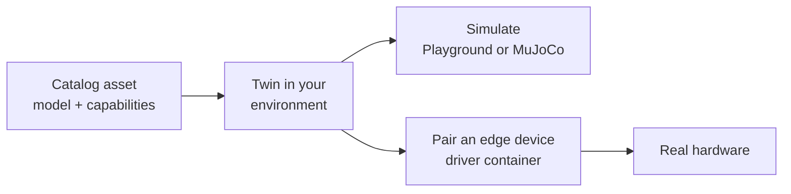

Cyberwave doesn't have one API per robot. Every device, whether an arm, a quadruped, a rover, a drone or a camera, becomes a **digital twin**. What a twin can do comes from its **capabilities**, declared once in the catalog, not from its brand. Two arms from different vendors take the same calls. A quadruped with a camera gets both the locomotion and the camera methods.

## Capabilities, not brands

When you call `cw.twin("<vendor>/<model>")`, the SDK reads the asset's capabilities and returns a twin with the matching methods:

| Capability | Typical form factors | What your code can do |
| --- | --- | --- |
| **Joints** | Arms, humanoids, legged robots | `twin.joints.set(...)`, `twin.joints.get()` |
| **Gripper** | Arm end effectors, mobile manipulators | `twin.grip()`, `twin.release()` |
| **Locomotion** | Rovers, quadrupeds, AMRs | `twin.move_forward()`, `twin.turn_left()`, `twin.locomotion.stop()` |
| **Flight** | Drones | `twin.takeoff()`, `twin.land()`, `twin.hover()` |
| **Sensors** | Cameras, depth cameras, robots with cameras | `twin.get_frame()`, video streaming |

Capabilities combine. Everything above the hardware works the same whatever the form factor: environments, simulation, controllers, workflows, recording and AI models.

## From twin to hardware, one path

You can build and test against the twin before the hardware arrives. When it does, `cyberwave pair` on the edge device starts the robot's driver, and the same twin now mirrors the real machine. Your code switches with `cw.affect("live")`.

## How well is a device supported?

Support is measured in levels, from "you can see it" to "you can train a policy on it":

| Level | You can |
| --- | --- |
| L0 Model | Place and view it; move it in the browser Playground |
| L1 Sim | Simulate it with physics in MuJoCo |
| L2 Telemetry | See the real robot's state live on its twin |
| L3 Control | Drive it from the dashboard, code, workflows and agents |
| L4 Learn | Record data, train a policy and deploy it on the robot |

The [compatibility table](/overview/supported-hardware) lists every supported device. How a robot moves up the levels: [Add your robot](/robots/add-your-robot).
{/* TODO(docs): show each device's level in the compatibility table (generated from the catalog). */}

## Featured hardware

<CardGroup cols={2}>
  <Card title="Robotic arms" icon="robot" href="/overview/robotic-arms">
    SO-101, Universal Robots, AgileX Piper, OpenArm and more.
  </Card>
  <Card title="Quadrupeds and rovers" icon="dog" href="/overview/robotic-dogs">
    Unitree Go2, Boston Dynamics Spot and other mobile robots.
  </Card>
  <Card title="Drones" icon="plane" href="/overview/drones">
    DJI Mini 3 Pro, DJI Mini 4 Pro, PX4 Vision.
  </Card>
  <Card title="Cameras and sensors" icon="camera" href="/overview/cameras">
    USB, RTSP and GigE Vision cameras, RealSense depth cameras.
  </Card>
</CardGroup>

## Next steps

<CardGroup cols={2}>
  <Card title="Is my robot supported?" icon="list-check" href="/overview/supported-hardware">
    Every supported device, by form factor.
  </Card>
  <Card title="Add your robot" icon="screwdriver-wrench" href="/robots/add-your-robot">
    From a URDF and a ROS 2 driver to a fully supported robot.
  </Card>
</CardGroup>
