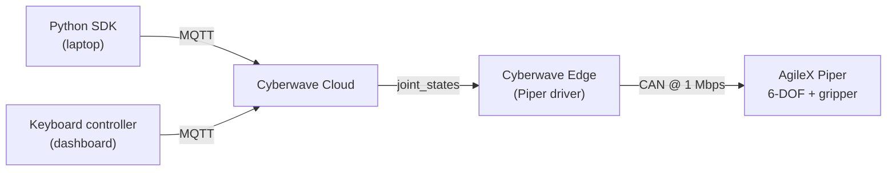

import { EdgeSetup } from "/snippets/edge-setup.mdx";

This tutorial takes a [6-DOF AgileX Piper](https://cyberwave.com/agilex/piper) from a powered-but-disconnected arm to one you can drive from the dashboard and from code. By the end you will have:

- The Piper mirrored as a digital twin in a Cyberwave environment
- The physical arm paired to that twin through the Cyberwave Edge over its CAN bus
- The **Keyboard** controller jogging joints live from the dashboard
- A Python SDK script setting joints on the same arm, switchable between simulation and live

It is the standard four-step arm pattern ([create twin, pair, calibrate, control](/overview/robotic-arms)), with the Piper-specific detail being the CAN transport.

## Architecture at a glance



<Info>
  **Who provides what.** Cyberwave provides: the digital twin, the Piper edge
  driver, MQTT transport, Live Mode, the Keyboard controller, and the Python
  SDK. You provide: the arm, the USB-to-CAN adapter, and a host (laptop, Pi, or
  Jetson) to run the edge on.
</Info>

---

## Prerequisites

- **Hardware**: AgileX Piper 6-DOF arm, its power supply, and the USB-to-CAN adapter. The Piper speaks **CAN at 1 Mbps**, not USB serial, so the adapter is mandatory.
- **Edge host**: a laptop, Raspberry Pi, or Jetson physically connected to the CAN adapter.
- **Credentials**: a Cyberwave account ([request access](https://cyberwave.com/request-early-access)) and, for Step 7, an API key.
- **SDK baseline**: Python 3.10+ and the [Python SDK](/overview/tools/python-sdk).
- **Hardware reference**: [AgileX Piper documentation](https://global.agilex.ai/products/piper) and the [Piper catalog page](https://cyberwave.com/agilex/piper) (bill of materials, drivers, troubleshooting).

---

## Step 1: Bring up the Piper hardware

Prove the arm is alive over CAN before involving Cyberwave. The canonical procedure is in the [AgileX Piper documentation](https://global.agilex.ai/products/piper); the steps that matter for this guide:

1. **Mount and power.** Bolt the Piper to a stable surface so it cannot tip on a full-reach move, connect the supplied power adapter, and switch it on.
2. **Wire the CAN link.** Connect the Piper CAN cable to the USB-to-CAN adapter, then plug the adapter into the edge host.
3. **Bring up the CAN interface (Linux edge hosts).** Enable the interface at the Piper's 1 Mbps bitrate:
   ```bash
   sudo ip link set can0 type can bitrate 1000000
   sudo ip link set can0 up
   ip -details link show can0   # confirm state UP and bitrate 1000000
   ```
   On macOS you can skip this; the Cyberwave Edge handles the adapter passthrough during pairing in Step 3.
4. **Sanity-check actuation.** Run AgileX's own bring-up / enable utility and confirm all six joints report and the arm holds position under power.

<Check>
  `ip -details link show can0` reports the interface **UP** at **1000000**
  bitrate, and AgileX's test tool reads back all six joint states. The CAN path
  is healthy.
</Check>

---

## Step 2: Create the environment and twin

1. Open the [Cyberwave dashboard](https://cyberwave.com/dashboard) and click **New Environment**. Name it `Piper Quickstart`.
2. In the left panel, click **Add from Catalog**, search for `Piper`, and add the **AgileX Piper** twin.
3. Position the twin to roughly match the real arm's placement on your desk. Exact pose does not matter for control; it only affects how the scene renders.

The catalog twin ships with the Piper's joint schema and capability metadata, so the Keyboard controller and the SDK both already know the joint names and per-joint limits.

An [environment](/feature-reference/architecture/key-concepts#environments) is the 3D space that holds twins, sensors, and controllers.

---

## Step 3: Pair the arm through the edge

Pairing installs the Piper driver on the edge host and binds the physical arm to the twin from Step 2.

Open a terminal on the host wired to the CAN adapter. If it is a remote box, SSH in first:

```bash
ssh <your-user>@<edge-device-ip>
```

Install the CLI and pair:

<EdgeSetup />

The `pair` command:

- Logs the edge host into Cyberwave
- Prompts for the target environment (pick `Piper Quickstart`)
- Detects the USB-to-CAN adapter and installs the Piper edge driver
- Handles USB/CAN passthrough on macOS automatically
- Binds the physical arm to the Piper twin you select

Follow the prompts and select the Piper twin when asked.

<Check>
  The Piper shows **online** in the dashboard with a green presence indicator,
  and the Piper driver is listed as active under the twin. If not, re-run the
  pair command; it is idempotent and safe to run repeatedly.
</Check>

---

## Step 4: Provide Cyberwave credentials

Pairing authenticated the edge host. To drive the arm from the SDK in Step 7, the machine running your Python also needs an API key and a target environment.

1. In the dashboard, go to **Profile → API Tokens** and create a key. Copy it; it is shown once.
2. Grab the **environment UUID** from the environment's URL or settings panel.
3. Export both in the shell that will run your script:

```bash
export CYBERWAVE_API_KEY="your_api_key_here"
export CYBERWAVE_ENVIRONMENT_ID="your_environment_uuid"
```

With both set, `Cyberwave()` reads them automatically and `cw.twin("agilex/piper")` resolves to the Piper twin in that environment without any IDs hard-coded in your script. See [Authentication](/overview/tools/python-sdk#authentication) for the full precedence rules.

---

## Step 5: Select the environment and enter Live Mode

1. Open the `Piper Quickstart` environment.
2. Switch the toolbar toggle from **Edit Mode** to **Live Mode**. Live Mode is what connects the on-screen twin to the physical arm through the edge driver. In Edit Mode you are only arranging a scene.
3. Select the **Piper** twin in the scene list. Since the arm is paired and online, the twin reflects its current joint state.

<Check>
  You are in **Live Mode**, the Piper twin is selected, and the rendered arm
  matches the physical arm's pose. This confirms the cloud-to-edge path before
  you send any command.
</Check>

---

## Step 6: Assign the Keyboard controller

A **controller** is whatever is authorized to send commands to the twin: the keyboard, a teleop rig, an AI policy, or your SDK session. Proving the Keyboard controller end-to-end rules out pairing, MQTT, and the edge driver before you write any code.

With the Piper twin selected in Live Mode:

1. Click **Assign Controller**.
2. Pick **Keyboard** from the list.
3. Use the on-screen key bindings to jog each joint and open/close the gripper. If the physical arm tracks the keys, the entire control path is healthy.

<Warning>
  Assigning a non-teleop controller (Keyboard, AI policy) first drives the arm
  to a **zero pose** before it accepts commands, and **collision detection runs
  by default**. Clear the workspace and stand back before assigning, the arm
  moves on its own to reach that pose.
</Warning>

<Tip>
  **Why the keyboard step matters.** Once the keyboard moves the physical arm,
  every later failure is in *your* code, not in the CAN link, pairing, MQTT, or
  the edge driver. It isolates four moving parts in under two minutes.
</Tip>

<Check>
  Jogging a joint in the dashboard moves the physical Piper, and the twin
  tracks both. Keyboard control is verified end to end.
</Check>

---

## Step 7: Control the Piper from the SDK

The [Python SDK](/overview/tools/python-sdk) exposes the same joint API for every arm in the catalog. Joint commands publish over MQTT on `cyberwave/twin/{uuid}/joint_states`; the Piper edge driver is subscribed and drives the joints over CAN.

Install the SDK:

```bash
pip install cyberwave
```

Connect, inspect the joint schema, and command a few joints:

```python
from cyberwave import Cyberwave
import math

# Reads CYBERWAVE_API_KEY and CYBERWAVE_ENVIRONMENT_ID from the environment
cw = Cyberwave()

# Resolve the Piper twin (vendor/model registry ID)
arm = cw.twin("agilex/piper")

# Never assume joint names. List them from the schema first.
print(f"Joints: {arm.joints.list()}")

# Positions are radians by default; pass degrees=True for degrees.
with cw.affect("live"):
    arm.joints.set("joint1", 30, degrees=True)   # base rotation
    arm.joints.set("joint2", math.pi / 6)         # radians
    arm.joints.set("gripper", 0, degrees=True)    # close the gripper

# Read state back
print(arm.joints.get_all())          # {name: radians}
arm.joints.print_joint_states()      # formatted radians + degrees table
```

When the SDK session connects as a controller, the platform automatically swaps out the Keyboard controller from Step 6, so there is nothing to unassign by hand.

`cw.affect()` selects the target. The same code drives the digital twin or the physical arm:

```python
cw.affect("simulation")               # updates the twin only
arm.joints.set("joint1", math.pi / 4)

cw.affect("live")                     # drives the physical Piper
arm.joints.set("joint1", math.pi / 4)
```

Validate a motion in `"simulation"` first, then flip to `"live"` once it looks right. `"real-world"` is an accepted alias for `"live"`.

<Warning>
  Always call `arm.joints.list()` and use the names it returns rather than
  assuming `joint1`...`joint6`. Send small deltas on a clear workspace first;
  the driver executes exactly what you publish, clamped only by the twin's
  per-joint limits.
</Warning>

<Check>
  The script prints the Piper's joint names, moves the physical arm under
  `cw.affect("live")`, and reads the resulting state back. You are now driving
  the Piper from code.
</Check>

---

## Reference

- **SDK calls used**: `Cyberwave()`, `cw.twin()`, `cw.affect()`, `arm.joints.list()`, `arm.joints.set()`, `arm.joints.get_all()`, `arm.joints.print_joint_states()`. See [Python SDK](/overview/tools/python-sdk).
- **MQTT topic**: `cyberwave/twin/{uuid}/joint_states`. See [MQTT API](/api-reference/mqtt/main).
- **CAN transport**: Piper bus runs at 1 Mbps; bring `can0` up before pairing on Linux hosts.
- **Cross-links**: [Robotic Arms overview](/overview/robotic-arms), [Piper catalog page](https://cyberwave.com/agilex/piper), [SO-101 Quickstart](/tutorials/so101-teleop-dataset) (record + train loop), [Key Concepts](/feature-reference/architecture/key-concepts), [Teleoperation](/feature-reference/environment-editor/teleoperation).

---

## Where to go next

<CardGroup cols={3}>
  <Card title="Robotic Arms Overview" icon="hand" href="/overview/robotic-arms">
    The 4-step pattern for any arm in the catalog.
  </Card>
  <Card title="Python SDK" icon="python" href="/overview/tools/python-sdk">
    Joints, frame capture, workflows, and the full API.
  </Card>
  <Card title="SO-101 Quickstart" icon="microchip" href="/tutorials/so101-teleop-dataset">
    Record demonstrations and train a model on an arm.
  </Card>
</CardGroup>
