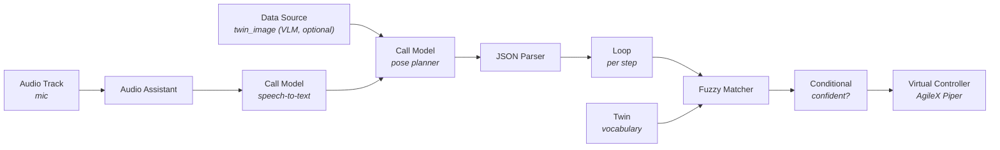

<Warning>
  **Early tutorial (stub).** The flow and node configuration below are complete
  enough to build and test end-to-end. Screenshots and a shareable template link
  will be added as the template is published.
</Warning>

By the end of this tutorial you'll have an AgileX Piper arm that listens to a
spoken command, has a model turn it into a short **sequence of poses**, and
executes it — built entirely in the visual Workflow editor, **no code, no
training.**

New to the Piper? Set it up first:
[Get started with the AgileX Piper arm](/tutorials/agilex-piper-quickstart).
This template is the arm twin of the
[UGV voice agent](/tutorials/ugv-beast-workflows) and shares its structure
with the [SO-101 voice agent](/tutorials/so101-voice-agent-workflows).

## The idea

Pre-teach the Piper a small set of named **saved poses** for a fixed workspace,
and let a model **sequence** them. No dataset, no VLA — the fixed pose set is your
deterministic contract.



## Prerequisites

- An **AgileX Piper** twin, paired over CAN and jogging under a teleop/pose
  controller (see the [Piper quickstart](/tutorials/agilex-piper-quickstart) —
  including `can0` up at 1 Mbps).
- A **microphone** twin that streams audio.
- Saved poses defined for your workspace: `home`, `over_object`, `grasp`, `lift`,
  `over_target`, `release`, plus gripper `open_gripper` / `close_gripper` (see
  [Twin saved poses](/feature-reference/twin-joint-home-positions)).

---

## Step 1: Create the workflow

Create a workflow (*Piper Voice Agent*) and add the **microphone** and **AgileX
Piper** twins. Wire nodes left to right; set inputs on the `#` (fixed) or `</>`
(expression) tabs using `{node-name.output}`.

---

## Step 2: Capture the voice — Audio Track → Audio Assistant

| Node | Field | Value |
|------|-------|-------|
| Audio Track | Twin | your microphone twin |
| Audio Track | Buffer preset | `speech-to-text` |
| Audio Assistant | `audio` | `{audio-track.audio}` |
| Audio Assistant | Modality | `voice_assistant` |

---

## Step 3: Transcribe — Call Model (speech-to-text)

| Field | Mode | Value |
|-------|------|-------|
| `audio` | `</>` | `{audio-assistant.audio}` |
| Model | — | a speech-to-text model |

Output: `result` = the transcript.

---

## Step 4 (optional): See the workspace — Data Source

For a VLM planner, add a **Data Source** node: `data_type: twin_image`, sensor =
the Piper's camera. Output `image_url`. Skip for a plain LLM on a fixed workspace.

---

## Step 5: Plan the poses — Call Model (planner)

Add a second **Call Model** (LLM or VLM). Set **Prompt** to `</>` and paste the
Piper pose planner; the last line inlines the transcript.

<Accordion title="Piper pose planner prompt">

```
You are the motion planner for an AgileX Piper — a 6-DOF robot arm with a gripper,
doing pick-and-place on a fixed workspace. Turn the operator's request (and the
workspace image, if given) into a JSON plan. No chat, no markdown, no code fences.

# You may ONLY use these named steps
- "open_gripper" / "close_gripper"
- "home"        — safe home pose
- "over_object" — hover above the object to pick
- "grasp"       — lower onto the object
- "lift"        — raise the grasped object
- "over_target" — hover above the drop location
- "release"     — lower to the drop location

You do NOT set joint angles, coordinates, speeds, or forces. You only choose the
ORDER of the named steps. Each is a pre-taught pose the arm reaches safely. If the
request is impossible or the object isn't visible, return {"action":"home"} and
say why in "say".

# Output — exactly one JSON object
{ "say": "<one short sentence>", "steps": [ {"action":"open_gripper"} ] }

# Rules
- 1 to 12 steps. A normal pick-and-place is:
  open_gripper -> over_object -> grasp -> close_gripper -> lift ->
  over_target -> release -> open_gripper -> home
- Always open the gripper before grasping and end at "home".
- NEVER invent step names. NEVER output prose outside the JSON.

# Example
Request: "put the block in the cup"
{"say":"Picking the block into the cup.","steps":[{"action":"open_gripper"},{"action":"over_object"},{"action":"grasp"},{"action":"close_gripper"},{"action":"lift"},{"action":"over_target"},{"action":"release"},{"action":"open_gripper"},{"action":"home"}]}

# The operator's request
"{call-model.result}"
```

</Accordion>

If using a VLM, wire `image_url` ← `{data-source.image_url}`. Output: `result` =
the JSON plan.

---

## Step 6: Read the plan — JSON Parser

| Field | Mode | Value |
|-------|------|-------|
| `json_data` | `</>` | `{call-model-2.result}` |
| LLM fix enabled | — | on |

---

## Step 7: The arm's vocabulary — Twin

Add a **Twin** node pointing at the **AgileX Piper** twin → it reports the valid
step names for matching. Output: `control_actuations`.

---

## Step 8: Run each step — Loop

| Field | Mode | Value |
|-------|------|-------|
| `array_data` | `</>` | `{json-parser.json_data.steps}` |

<Warning>
  Point `array_data` at the **`steps` list**, not the whole object.
</Warning>

---

## Step 9: Guardrail — Fuzzy Matcher

Wire **Loop → Fuzzy Matcher**.

| Field | Mode | Value |
|-------|------|-------|
| Uncertain String | `</>` | `{loop.item.action}` |
| Source of Truth | `</>` | `{twin.control_actuations}` |
| Advanced → Score Threshold | `#` | `80` |

<Note>
  Your saved-pose names must match the eight step names in the prompt. If they
  differ, rename them (in the prompt or the poses) so the matcher resolves them.
</Note>

---

## Step 10: Confidence gate — Conditional

| Field | Mode | Value |
|-------|------|-------|
| `left_value` | `</>` | `{fuzzy-matcher.match}` |
| operator | — | `equal` |
| `right_value` | `#` | `true` |

Wire the **true** port → the dispatch node.

---

## Step 11: Move the arm — Virtual Controller

Wire **Conditional (true) → Virtual Controller** (dynamic command per step).

| Field | Value |
|-------|-------|
| Twin | AgileX Piper |
| Command source | Source Node → `{fuzzy-matcher.matched}` |
| Controller Policy | your teleop/pose controller |

---

## Step 12: Test in simulation

Switch to **SIMULATE** (voice real, arm simulated):

1. Confirm the arm is at zero pose (and the camera streams, if using a VLM).
2. Say *"put the block in the cup."*
3. Walk **Executions**: STT → JSON pose plan → Loop per step → matcher resolves
   each pose → Virtual Controller fires per step → the twin executes.

Then test an impossible request → plan degrades to `home`.

<Warning>
  **Step completion / pacing.** Confirm each pose finishes before the next fires;
  if the Piper's controller doesn't queue/complete commands in order, add a `wait`
  step between moves. Non-teleop controllers also go to zero pose (collision
  detection on) on attach and queue commands during that transition — clear the
  workspace.
</Warning>

---

## Step 13: Go live

Once simulation is clean, switch to **LIVE**. The graph is unchanged. Keep the
workspace clear and be ready to stop.

## The one idea to take away

The model never sets joint angles and never commands the arm directly — it only
sequences **pre-taught poses**, each validated against the arm's real vocabulary.
**The model reasons; a fixed contract acts.**

## Next steps

<CardGroup cols={2}>
  <Card title="Piper quickstart" icon="robot" href="/tutorials/agilex-piper-quickstart">
    Set up and calibrate the Piper before adding voice.
  </Card>
  <Card title="SO-101 voice agent" icon="diagram-project" href="/tutorials/so101-voice-agent-workflows">
    The same template on the SO-101 arm.
  </Card>
  <Card title="UGV voice agent" icon="car-side" href="/tutorials/ugv-beast-workflows">
    The same template on a mobile rover.
  </Card>
  <Card title="Workflow nodes" icon="shapes" href="/overview/features/workflow-nodes">
    Every node used here, with inputs and outputs.
  </Card>
</CardGroup>
