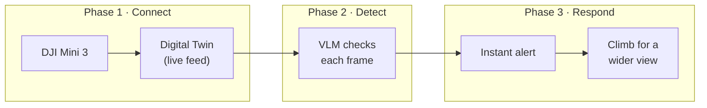

<Info>
**Stack:** DJI Mini 3, Cyberwave Edge for DJI, VLM, Workflows
</Info>

## Overview

In this tutorial you will turn a stock **DJI Mini 3** into an autonomous **site sweep**. The drone hovers or patrols over a yard, and a Vision Language Model (VLM) checks every frame for **equipment left out in the open**, a pallet, a toolbox, a cable reel, a ladder, anything that should have been put away. The moment it spots something, it alerts you and climbs for a wider view of where the item sits across the site.

By the end of this guide you will be able to:

- **Connect:** Pair a DJI Mini 3 with Cyberwave through the Cyberwave Edge for DJI app
- **Stream:** Bring the drone's live camera feed into a Digital Twin
- **Analyze:** Run a VLM over the feed to spot left-out equipment
- **Respond:** Alert instantly, then gain altitude for a wider view

End-of-shift walkarounds are the kind of job a drone is good at and a person forgets: slow, repetitive, and easy to skip. The useful move when you spot a stray item is to get higher and see where it is relative to the rest of the yard. That is the behavior we will automate.

Here's the shape of what you'll build across the three phases:



<Warning>
Fly only where you are permitted to and keep the aircraft in visual line of sight. The VLM is an assistant, not a replacement for a responsible pilot. Keep the DJI RC in hand so you can take manual control at any time.
</Warning>

---

## Technical Overview

Cyberwave decouples the aircraft from the application logic and the intelligence on top of it.

<CardGroup cols={3}>
  <Card title="Ingest" icon="download">
    Pair the DJI Mini 3 through the **Cyberwave Edge for DJI** app. The drone's video and telemetry stream into a Digital Twin over Cyberwave's WebRTC and MQTT infrastructure.
  </Card>

  <Card title="Orchestrate" icon="diagram-project">
    Build a Cyberwave **Workflow** that fetches the latest frame from the drone's camera and passes it to a model.
  </Card>

  <Card title="Analyze" icon="brain">
    A **VLM** reads each frame for left-out equipment and drives an automated response with no manual monitoring.
  </Card>
</CardGroup>

### Components

- **[DJI Mini 3](https://cyberwave.com/dji/DJI-Mini-3):** The physical aircraft. It captures video from its gimbal camera and streams it to Cyberwave through the Cyberwave Edge for DJI app running on the phone tethered to your DJI RC.
- **[Digital Twin](/concepts/digital-twins):** The virtual replica of the drone in the Cyberwave dashboard. Once paired, the twin shows the live video feed, gimbal attitude, and GPS / pose, with no per-sensor configuration.
- **[Workflow](/concepts/workflows):** An event-driven flow that chains: Fetch Frame → VLM Inference → Instant Alert → Climb for a wider view.

---

## Prerequisites

<Tabs>
  <Tab title="Hardware">
    - DJI Mini 3
    - DJI RC (or DJI RC-N1 with a phone attached)
    - An Android phone tethered to the RC
  </Tab>

  <Tab title="Software">
    - The **Cyberwave Edge for DJI** Android app
    - DJI Fly set up and the aircraft activated
  </Tab>

  <Tab title="Credentials">
    - A Cyberwave Account ([Request Early Access](https://cyberwave.com/request-early-access))
  </Tab>
</Tabs>

---

## Phase 1: Connect the DJI Mini 3

<Note>
**Goal:** Create a DJI Mini 3 twin, pair it with the real drone from a QR code, and confirm you can fly it and see its live video in Cyberwave.
</Note>

### Step 1.1: Create the digital twin

1. Open the [Cyberwave dashboard](https://cyberwave.com/dashboard) and create a **New Project** and **Environment**.
2. Click **Add from Catalog**, search for `DJI Mini 3`, and add it to the environment. This creates the **DJI Mini 3** digital twin, which you'll see in the scene list on the left.

### Step 1.2: Open the pairing QR in Live mode

1. Select the **DJI Mini 3** twin.
2. In the toolbar above the viewport, switch from **Edit** to **Live**.
3. In the twin panel on the right, open **Pair with the real robot**. A **QR code** appears, along with a pairing link.

{/* TODO: add screenshot of the "Pair with the real robot" QR panel in Live mode → /images/dji-mini-3-pair-qr.png */}

### Step 1.3: Scan from the phone on your RC

Scan the QR code with the **Android phone tethered to your DJI RC**. This must be the **same phone connected to your RC controller**.

- The **Cyberwave Edge for DJI** app opens and pairs automatically.
- If the app isn't installed yet, the link sends you to the install page first.

<Warning>
Anyone with the pairing link can stream as you to this twin. Treat the QR code and link as a secret, don't share screenshots of them.
</Warning>

### Step 1.4: Fly and stream

Once the twin pairs on your phone, Cyberwave assigns the **DJI Mini 3 Controller**, a keyboard-based teleoperation controller (WASD drive), as the twin's primary controller. From here you can:

- **Fly the drone** from the platform using the keyboard controller.
- **Stream live video** from the drone's camera straight into the twin.

<Check>
The twin shows **Live**, the drone responds to keyboard control, and real video from the drone is streaming into the twin's feed.
</Check>

<Info>
The DJI Mini 3 has a **pitch-only mechanical gimbal**. Tilt the camera down before you launch so the ground fills the frame. See [Drones](/overview/drones) for the full command set and the [Python SDK](/tools/python-sdk) if you'd rather drive it from code.
</Info>

---

## Phase 2: Build the site-sweep workflow

<Note>
**Goal:** Fetch the drone's latest frame on a schedule, run a VLM that looks for left-out equipment, and continue only when it sees something.
</Note>

We will build a **Fetch → Analyze → Act** loop. No backend code required.

### Step 2.1: Initialize the workflow

1. Go to the **Workflows** tab and click **Create Workflow**. Name it `DJI-Site-Sweep`.
2. **Trigger:** add a **Schedule Trigger** and set it to run every **1 minute**. (Tighten the interval once you've confirmed the loop behaves.)

### Step 2.2: Fetch the frame

From the **Node Library → Actions**, add a **Data Source** node.

**Function:** pulls the latest image from the drone's gimbal camera.

**Configuration:**
- **Connection:** wire the **Schedule** node into this node.
- **Data Source Type:** Twin Image
- **Select Digital Twin:** the `DJI Mini 3` twin from Phase 1
- **Output Used:** the `Image URL` output feeds the next node.

### Step 2.3: Spot left-out equipment with the VLM

From the **Node Library → Actions**, add a **Call Models** node.

**Function:** passes the frame to a VLM and returns a machine-readable verdict.

**Configuration:**
- **Connection:** wire the **Data Source** node into this node.
- **Select Model:** a vision-capable model such as **Claude Sonnet 4.5**. The task is open-ended scene understanding ("does anything look left out?"), so reach for a VLM rather than a fixed-class detector like YOLO.
- **Image URL [Reference Node]:** map the `Image URL` output from the **Data Source** node.
- **Prompt [Fixed Value]:** paste this strict, boolean-only prompt and edit the item list for your site:

```
You are an aerial site-sweep observer reviewing a single frame from a drone camera. Analyze the frame objectively and output a machine-readable boolean.

Detection target: portable equipment left out in the open on the ground.
- Counts as left-out equipment: pallets, toolboxes, hand tools, ladders, cable reels, cones, drums, loose materials.
- Do NOT count: parked vehicles, fixed structures, buildings, fences, permanent fixtures, or people.

Logic:
- If left-out equipment IS visible: Result = true.
- If none is visible: Result = false.

Output format:
- Do not provide explanations, descriptions, or reasoning.
- Output ONLY a single lowercase string: "true" or "false".
```

- **Output Used:** the `Result` string feeds the conditional node.

<Tip>
The "do NOT count" line matters. Parked vehicles and fixed fixtures are the usual false positives for a site sweep. Tune both lists for what actually belongs on your site.
</Tip>

### Step 2.4: Branch on a detection

From the **Node Library → Actions**, add a **Conditionals** node.

**Function:** continues the workflow only when the VLM spots something.

**Configuration:**
- **Connection:** wire the **Call Models** node into this node.
- **Comparison Operator:** Equal
- **Left Side Value [Reference Node]:** the `Result` output of the **Call Models** node
- **Right Side Value [Fixed Value]:** `true`
- **Save** the configuration.

**Logic:** everything downstream runs only when `Result == true`.

---

## Phase 3: Alert now, then climb for a wider view

<Note>
**Goal:** Alert the instant the VLM spots something, then have the drone climb for a wider view.
</Note>

The order matters. You want to know **immediately** that something was spotted, before the drone does anything else. Then the drone repositions, the same thing a person does when they notice a stray item: step back and see where it sits relative to the rest of the yard. So this phase is a **sequential chain**: instant alert first, then the climb.

### Step 3.1: Send the instant alert

Add a **Send Alert** node wired directly from the **Conditional** in Phase 2. This fires the moment the VLM returns `true`, before the drone moves.

- **Name:** `Equipment spotted`
- **Severity:** `warning`
- **Body / message:** `The drone spotted equipment left out in the open. Climbing for a wider view.`

### Step 3.2: Gain height for a wider view

Add a **drone action** node (the node that drives a command back to the twin through the edge) wired from the **instant alert** node, so it runs right after. Set it to **ascend** by a few meters, for example `ascend` with a target of 3 to 5 m, so the camera takes in more of the site. Once it has climbed, the wider view is live in the twin's feed for whoever responds to the alert.

<Warning>
**Continuous moves are opt-in on DJI aircraft.** `ascend` (and the other stick verbs) only run when the twin has `metadata.drivers.default.virtual_stick = true`. Without it, the driver refuses the command and raises an alert instead of moving. The physical RC always wins: stick input reclaims control immediately, and targets decay to zero after 500 ms of silence. See [Drones](/overview/drones) for the full safety story. Keep the RC in hand and only enable autonomous moves with clear airspace overhead.
</Warning>

### Step 3.3: Activate

Click **Activate**. Cyberwave validates the workflow and flags any configuration errors before deploying. The full loop runs in order: fetch a frame → run the VLM → alert instantly on a hit → climb for a wider view.

<Info>
The exact name of the drone-command node and the available verbs depend on your dashboard build. If you don't see an ascend action, ship the instant-alert version and climb manually from the RC when it lands.
</Info>

---

## Phase 4: Validate

With the drone paired and the workflow active:

- ✅ The DJI Mini 3 is paired and you can see live video in the twin.
- ✅ The workflow is **Active** in the dashboard.

**No false alarms:** with a clear, tidy scene, wait through several triggers and confirm **no alert** fires. If a parked vehicle or a fixed fixture trips it, tighten the "do NOT count" list in the prompt.

**Real detection:** place an obvious stand-in item (a box or a cone) in the camera's view. Confirm the instant `warning` alert lands, then the drone climbs a few meters and the wider view appears in the twin's feed. Test the climb on the bench with `virtual_stick` enabled before you trust it in the field.

---

## Conclusion

You connected a consumer drone, streamed its camera into Cyberwave, and put a VLM on top of the feed to watch for left-out equipment, all without writing computer vision code. The payoff is the sequence: an instant heads-up the moment something is spotted, then the drone repositions to give you the wider context. Keeping the hardware (Phase 1) separate from the intelligence (Phases 2 and 3) means you can retarget the sweep by editing one prompt.

---

## Troubleshooting

<AccordionGroup>
  <Accordion title="Drone won't pair">
    - Confirm the aircraft is activated in DJI Fly and the RC sees it.
    - Make sure you're scanning from the **same phone that's tethered to your RC**, not a second device.
    - Switch the twin to **Live** and re-open **Pair with the real robot** to refresh the QR, then rescan.
    - If the link opens a browser instead of the app, install **Cyberwave Edge for DJI** from the page it sends you to, then scan again.
  </Accordion>

  <Accordion title="No video stream in the twin">
    - Confirm the drone's camera is live in DJI Fly first.
    - Check the phone has a stable connection (the RC video link plus a network path to Cyberwave).
    - Make sure the twin is in **Live** mode, not Edit or Simulate.
  </Accordion>

  <Accordion title="Too many false alarms">
    - Expand the "do NOT count" list in the VLM prompt with the things that belong on your site.
    - Tilt the gimbal straight down so the ground, not the horizon, fills the frame.
    - Raise the schedule interval so you alert less often on the same item.
  </Accordion>

  <Accordion title="Drone won't climb on detection">
    - Confirm `metadata.drivers.default.virtual_stick = true` on the twin.
    - Check the alerts panel: a refused command says why (opt-in missing, RC has authority, restricted zone).
    - Make sure the RC sticks are centered so they aren't overriding the command.
  </Accordion>

  <Accordion title="Workflow not triggering">
    - Ensure the workflow is **Activated**, not just saved.
    - Check the Schedule trigger interval.
    - Trigger the workflow manually to test.
  </Accordion>
</AccordionGroup>

---

## Related

<CardGroup cols={3}>
  <Card title="Drones" icon="drone" href="/overview/drones">
    Pairing, telemetry, and the full drone command set.
  </Card>
  <Card title="Visual Safety Monitoring" icon="code" href="/tutorials/edge-to-cloud-vlm">
    The same Fetch → VLM → Alert loop on a fixed camera.
  </Card>
  <Card title="Workflows" icon="diagram-project" href="/use-cyberwave/workflows">
    Automate operations with visual workflows.
  </Card>
</CardGroup>
