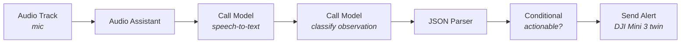

<Warning>
  **Early tutorial (stub).** The flow and node configuration are complete enough
  to build and test end-to-end. Screenshots and a shareable template link will be
  added as the template is published.
</Warning>

<Note>
  **This workflow never flies the drone.** The pilot flies manually on the RC; the
  workflow only listens and raises alerts. We deliberately keep voice out of the
  flight-control loop — a spoken command should never move an aircraft.
</Note>

By the end of this tutorial you'll have a DJI Mini 3 whose pilot can call out what
they see — *"pallet left by the north gate,"* *"person near the fence"* — and have
each observation logged as a **structured alert** on the drone twin, hands-free,
while both hands stay on the sticks. Built entirely in the visual Workflow editor,
**no code.**

This is the **voice-reporting sibling** of the
[autonomous site sweep](/tutorials/dji-mini-3-site-sweep) (a VLM watches the feed
and alerts on its own). Here a human watches and narrates; the workflow just
captures it.

## The idea

Speech is a fast, hands-free way to file an incident while flying. The workflow
transcribes what the pilot says, a model decides whether it's actionable and
classifies it, and only real observations become alerts — idle chatter is ignored.



No loop, no controller, no drone command — the aircraft is never touched.

## Prerequisites

- A **DJI Mini 3** twin, paired and streaming (see
  [DJI Mini 3 Site Sweep · Phase 1](/tutorials/dji-mini-3-site-sweep)). The pilot
  flies it manually on the RC as normal.
- A **microphone** twin that streams audio (a headset mic on the pilot is ideal).

---

## Step 1: Create the workflow

Create a workflow (*DJI Voice Alerts*) and add the **microphone** and **DJI Mini 3**
twins. Wire nodes left to right; set inputs on the `#` (fixed) or `</>` (expression)
tabs using `{node-name.output}`.

---

## Step 2: Capture the voice — Audio Track → Audio Assistant

| Node | Field | Value |
|------|-------|-------|
| Audio Track | Twin | your microphone twin |
| Audio Track | Buffer preset | `speech-to-text` |
| Audio Assistant | `audio` | `{audio-track.audio}` |
| Audio Assistant | Modality | `voice_assistant` |

<Check>
  Speak and open **Executions** — a run fires and Audio Assistant shows
  `is_speaking: true` with a captured speech segment.
</Check>

---

## Step 3: Transcribe — Call Model (speech-to-text)

| Field | Mode | Value |
|-------|------|-------|
| `audio` | `</>` | `{audio-assistant.audio}` |
| Model | — | a speech-to-text model (e.g. Faster Whisper Small EN) |

Output: `result` = the transcript.

---

## Step 4: Classify the observation — Call Model (LLM)

Add a second **Call Model** node (an LLM). Set **Prompt** to `</>` and paste the
classifier below; the last line inlines the transcript. It decides whether the
utterance is a real observation worth alerting on, and structures it.

<Accordion title="Observation classifier prompt">

```
You are an incident classifier for a drone site inspection. The pilot narrates
what they see while flying. Turn a single spoken utterance into a JSON verdict.
No chat, no markdown, no code fences.

# Decide
- should_alert: true only if the utterance describes a real, actionable
  observation (equipment left out, a hazard, an intrusion, damage, a person where
  they shouldn't be). false for idle chatter, self-talk, or flight banter
  ("okay", "battery's fine", "nice view").
- title: a short label (max ~6 words), e.g. "Pallet left by north gate".
- severity: one of "info", "warning", "critical".
- summary: one plain sentence describing the observation.

# Output — exactly one JSON object, nothing else
{ "should_alert": true, "title": "Pallet by north gate", "severity": "warning", "summary": "A pallet was left out near the north gate." }

# Rules
- If should_alert is false, still return valid JSON with empty title/summary and
  severity "info".
- NEVER output prose outside the JSON object.

# Examples
Utterance: "there's a ladder leaning on the fence by bay three"
{"should_alert":true,"title":"Ladder on fence, bay 3","severity":"warning","summary":"A ladder is leaning on the fence near bay three."}
Utterance: "okay looking good over here"
{"should_alert":false,"title":"","severity":"info","summary":""}

# The pilot's observation
"{call-model.result}"
```

</Accordion>

Output: `result` = the JSON verdict.

---

## Step 5: Read the verdict — JSON Parser

| Field | Mode | Value |
|-------|------|-------|
| `json_data` | `</>` | `{call-model-2.result}` |
| LLM fix enabled | — | on |

---

## Step 6: Alert only on real observations — Conditional

| Field | Mode | Value |
|-------|------|-------|
| `left_value` | `</>` | `{json-parser.json_data.should_alert}` |
| operator | — | `equal` |
| `right_value` | `#` | `true` |

Wire the **true** port → Send Alert, so idle chatter never raises an alert.

---

## Step 7: Raise the alert — Send Alert

Wire **Conditional (true) → Send Alert** on the DJI Mini 3 twin, mapping the
classifier's fields.

| Field | Mode | Value |
|-------|------|-------|
| Twin | picker | DJI Mini 3 |
| Name | `</>` | `{json-parser.json_data.title}` |
| Severity | `</>` | `{json-parser.json_data.severity}` |
| Body | `</>` | `{json-parser.json_data.summary}` |
| Category | `#` | `business` |

The alert lands in the twin's **Alerts** panel with the pilot's observation, tied
to the moment and the aircraft.

---

## Step 8: Test

You can test this fully **without flying** — it's just voice in, alerts out.

1. Activate the workflow (Simulate or Live; the drone is never commanded either way).
2. Speak a real observation: *"there's a toolbox left out by the loading dock."*
3. Check **Executions** and the **Alerts** panel:

| Node | Expect |
|------|--------|
| Call Model (STT) | `result` = your words |
| Call Model (classifier) | `should_alert: true` with a title, severity, summary |
| Conditional | `condition_met: true` |
| Send Alert | a `warning` alert appears on the twin |

4. Speak idle chatter: *"okay, battery looks fine."* → `should_alert: false`, the
   Conditional blocks it, **no alert** fires.

<Tip>
  Tune the classifier's `should_alert` rules for your site so routine flight
  banter never trips an alert, and genuine hazards always do.
</Tip>

## Why voice stays out of flight

The pilot's job is to fly and watch; the workflow's job is to remember and report.
Keeping voice on the **reporting** side means a misheard word can, at worst, create
a spurious alert — never move the aircraft. The RC remains the only thing that
flies the drone.

## Next steps

<CardGroup cols={2}>
  <Card title="Autonomous site sweep" icon="drone" href="/tutorials/dji-mini-3-site-sweep">
    Let a VLM watch the feed and alert on its own — no pilot narration.
  </Card>
  <Card title="Send an email on alert" icon="envelope" href="/tutorials/edge-to-cloud-vlm">
    Chain an alert trigger to email or another integration.
  </Card>
  <Card title="Drones" icon="drone" href="/overview/drones">
    Pairing, telemetry, and the full command set.
  </Card>
  <Card title="Workflow nodes" icon="shapes" href="/overview/features/workflow-nodes">
    Every node used here, with inputs and outputs.
  </Card>
</CardGroup>
