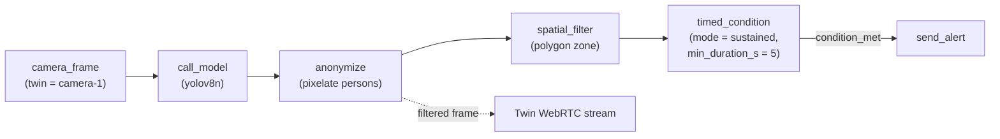

End-to-end recipe for a zone-based intrusion detection pipeline that
runs entirely on the edge: raw video stays on-device, anonymised
frames feed the WebRTC stream, and the cloud only ever sees alert
events.

<Info>
**Stack:** Workflows, YOLO, Spatial Filter, Timed Condition, Edge
Workers
</Info>

## Pipeline



The `anonymize` node publishes the pixelated frame to the camera
driver's [filtered frame channel](/edge/drivers/frame-filters) so the
WebRTC stream the operator sees is privacy-preserving by construction
— no raw video ever leaves the edge.

## Prerequisites

- A twin bound to a camera with a [Cyberwave camera driver](/feature-reference/edge/drivers/overview) and
  `CYBERWAVE_METADATA_FRAME_FILTER_ENABLED=true`.
- Edge Core running with at least one healthy edge runtime.
- The `yolov8n` model in the workspace catalog (auto-downloaded on
  first reference).

## Authoring the workflow

1. **Create a workflow** scoped to the camera's environment, with
   `Run on edge` enabled.
2. **Add the trigger**: drag a `Camera Frame` node from the
   **Triggers** group, set `twin_uuid` to the camera twin.
3. **Add detection**: drag a `Call Model` node, pick `yolov8n`, set
   `target_classes` to `["person"]`. Wire `camera_frame → call_model`.
4. **Add privacy**: drag an `Anonymize` node, set `mode` to
   `pixelate`. In the inspector's **Target Classes** chip editor, leave
   it empty to default to `person`, or add chips (e.g. `face`, `vehicle`)
   if your model emits other class labels you want obscured. Wire
   `call_model → anonymize`. The downstream WebRTC stream now shows
   pixelated people automatically.
5. **Add the zone**: drag a `Spatial Filter` node from the
   **Decision & Control** group. In the inspector, click
   **Capture frame** to fetch a still from the camera and trace
   the zone polygon over it. Set `point_mode` to
   `bbox_bottom_center` for floor-anchored subjects. Wire
   `anonymize → spatial_filter`.
6. **Add the dwell gate**: drag a `Timed Condition` node. Mode
   stays on the default `sustained`. Set `min_duration_s` to the
   loitering threshold you care about (5s for a tight intrusion
   alert, 30s for a "left unattended" scenario). Set `cooldown_s`
   to your alert review cadence (30–120s is typical). Wire
   `spatial_filter → timed_condition`.
7. **Add the alert**: drag a `Send Alert` node downstream of
   `timed_condition`. Set `name` (e.g. `Intrusion`), `alert_type`
   (e.g. `intrusion`), `severity` (`warning`), and leave `category`
   on `business`. The edge worker compiles this into a
   `cw.publish_alert(...)` call wired to the dwell-fired frame.
8. **Activate** the workflow. The edge runtime will pull the
   generated worker (`wf_<uuid8>.py`) on its next sync, and the
   polygon will appear as a read-only overlay on the twin's WebRTC
   stream so operators can see which zones are armed.

### Optional: email on alert

The edge worker writes alerts via `cw.publish_alert(...)` and they
land in the Alerts panel. To also receive an email, add a **second
workflow** with an alert trigger:

```
alert_trigger(twin = camera-1, alert_type = intrusion)
  → send_email(to_email = …, subject = …, body = …)
```

This cloud-side workflow wakes on every edge-emitted intrusion alert
(no per-frame cost) and uses Django's email backend to deliver the
message. See [`timed_condition`](/use-cyberwave/workflows/timed-condition#end-to-end-alert-pipeline)
for the full two-workflow shape.

## Operator experience

- **Frontend overlay**: the twin's video panel shows the zone
  polygon outlined in blue. Multiple zones (e.g. authorised vs
  forbidden) appear as separate polygons.
- **Alerts**: when the dwell threshold is crossed, a
  [`send_alert`](/api-reference/rest/AlertSchema)-created alert
  appears in the Alerts panel with the polygon and dwell duration
  embedded in `metadata`.

## Privacy boundary

The Zenoh→MQTT bridge does **not** forward raw frames. Only the
alert payload (with optional anonymised snapshot) crosses the WAN.
See the [Security Pipeline](/edge/drivers/security-pipeline) page
for the deeper privacy contract.

<Warning>
`pixelate` is reversible by public depixelation models. Combine
with `redact` or rely on the event-only contract (no frames in the
alert payload) for legal de-identification.
</Warning>

## See also

- [`spatial_filter`](/use-cyberwave/workflows/spatial-filter) — the
  polygon zone primitive.
- [`timed_condition`](/use-cyberwave/workflows/timed-condition) — the
  dwell-then-cooldown gate.
- [`anonymize`](/use-cyberwave/workflows/anonymize-image) — the
  pixelation node and its mode reference.
- [Security Pipeline](/edge/drivers/security-pipeline) — multi-camera
  privacy-preserving WebRTC playbook.
