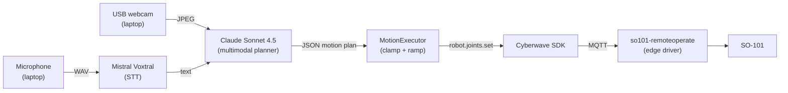

By the end of this tutorial you will have an SO-101 that listens to a spoken English command, looks at its workspace through a USB webcam, and executes a short motion plan written on-the-fly by Claude. No dataset, no VLA, no training. The policy is a system prompt.

## Architecture at a glance



<Info>
**Who provides what.** Cyberwave provides: digital twin, Python SDK, MQTT transport, edge driver, Live Mode. You provide: the laptop, the USB webcam, API keys for Anthropic Claude and Mistral Voxtral.
</Info>

---

## Goals and scope

**What you'll build.** A laptop-side REPL that takes a voice command (hold SPACE to talk), grabs a webcam frame, sends both to Claude as one multimodal request, parses the JSON motion plan it returns, validates it, and runs it on the SO-101 with smooth ramped motion.

**In scope**

- Single SO-101 follower in a fixed workspace.
- Push-to-talk voice + a Mac-side USB webcam looking at the workspace.
- Expressive, gesture-style motions (wave, bow, point, look-toward).
- Visual Q&A grounded in the camera frame ("what do you see?", "is there a red cup?").

**Out of scope (follow-up tutorials)**

- Manipulation / grasping driven by vision (use a VLA: see [SO-101 Voice Pick-and-Place](/tutorials/so101-voice-pick-and-place)).
- Camera-to-arm calibration for millimetre-accurate pointing.
- Always-on wake word, multi-turn dialogue, or memory across turns.

**Success criteria.** End-to-end latency under 5 seconds per turn. The arm completes the commanded gesture or correctly describes the scene on at least 9 of 10 attempts across your 6 demo prompts.

---

## Prerequisites

- **Hardware**: SO-101 follower on a Raspberry Pi, one USB webcam plugged into your laptop, microphone (built-in is fine).
- **Credentials**: Cyberwave API key + twin/environment UUIDs, Anthropic API key, Mistral API key.
- **Base setup**: [SO-101 Get Started](/hardware/so101/get-started) for the environment, edge install, and `so101-remoteoperate` running on the Pi.
- **SDK baseline**: [Python SDK](/sdks/python-sdk).
- **Conceptual grounding**: [Key Concepts](/get-started/key-concepts), [Voice as a Sensor](/hardware/microphone/get-started).

---

## Project layout

The reference example lives at `cyberwave-sdks/cyberwave-python/examples/nl_arm_controller`:

```
nl_arm_controller/
├── nl_arm_controller.py   # orchestrator: agent loop, config, CLI flags
├── motion.py              # MotionPlan dataclass, validation, ramped executor
├── planner.py             # Claude text + vision planner, JSON parser
├── vision.py              # cv2 webcam wrapper, base64 JPEG encoder
├── voice.py               # spacebar push-to-talk, Voxtral STT
├── requirements.txt
├── .env.example
└── smoke_tests/           # one self-contained script per dependency (01–08)
```

Each module is independent; that's why each one has its own smoke test. If a piece breaks, you isolate it in seconds.

---

## Step 1: Set up the Cyberwave environment

Before you build the agent, you need a working SO-101 twin and a Cyberwave environment with the edge driver running. The full reference is in [SO-101 Get Started](/hardware/so101/get-started). The short version:

1. Create a new environment in the [Cyberwave dashboard](https://cyberwave.com/dashboard) and add an **SO101** twin from the catalog. Position it to roughly match your physical setup.
2. Install Cyberwave Edge on the Raspberry Pi paired to the follower:
   ```bash
   ssh your_user@raspberry_pi_ip
   curl -fsSL https://cyberwave.com/install.sh | bash
   sudo cyberwave edge install
   ```
3. Pair the SO101 twin and calibrate the follower (dashboard or CLI). See [Calibrate the arms](/hardware/so101/get-started#step-3-calibrate-the-arms).
4. Note the **environment UUID** and **twin UUID** from the dashboard. You'll paste them into `.env` in [Step 3](#step-3-develop-your-agent).

<Check>
The twin appears in the dashboard, calibration is green, and `so101-remoteoperate` is running on the Pi (visible as an active driver under the twin).
</Check>

---

## Step 2: Set up remote operation

The agent needs to send joint commands from your laptop to the follower without a physical leader arm. That means assigning a controller to the twin in the dashboard and verifying the cloud-to-edge path with the keyboard *before* you wire any LLM.

1. Open your environment and switch to **Live Mode**.
2. Select the SO101 twin and click **Assign Controller**.
3. Pick **Keyboard** from the controller list. The follower arm is now driven by your browser.
4. Use the on-screen key bindings to nudge each joint. If the physical arm responds, the cloud, MQTT, and edge driver are all healthy.

<Tip>
**Why bother with the keyboard step?** Once the keyboard works, every later failure is in *your* code, not in calibration, pairing, MQTT, or the edge driver. It rules out four moving parts in two minutes.
</Tip>

For background on how remote operation differs from leader/follower teleoperation, see [SO-101 Get Started: Set Up Remote Operation](/hardware/so101/get-started#set-up-remote-operation) and [Teleoperation](/use-cyberwave/teleoperation).

<Check>
You're done with Step 2 when keyboard input in the dashboard moves the physical arm, and a one-liner Python script using `cw.twin(...).joints.set("1", 10, degrees=True)` also moves it. The platform automatically swaps the keyboard controller for the SDK session when your script connects, so you don't need to manually unassign anything.
</Check>

---

## Step 3: Develop your agent

The agent is five small modules on your laptop, each owning one transform. Build and smoke-test them one at a time, then orchestrate.

| Module | Input | Output | External service |
|---|---|---|---|
| `voice.py` | Mic audio (while SPACE held) | Transcribed text | Mistral Voxtral |
| `vision.py` | Webcam | Base64 JPEG | n/a (local OpenCV) |
| `planner.py` | Text + base64 JPEG | Validated `MotionPlan` | Anthropic Claude |
| `motion.py` | `MotionPlan` | Ramped joint commands | Cyberwave SDK |
| `nl_arm_controller.py` | CLI flags | Agent loop wiring it all together | n/a |

**Install and configure** (do this once, then build each modality on top):

```bash
cd cyberwave-sdks/cyberwave-python/examples/nl_arm_controller
python -m venv .venv && source .venv/bin/activate
pip install -e ../..                 # the Cyberwave SDK
pip install -r requirements.txt      # anthropic, httpx, sounddevice, pynput, opencv-python-headless
cp .env.example .env                 # fill in API keys + twin/env UUIDs from Step 1
```

Set `CW_CAMERA_INDEX` if your USB webcam isn't device 0.

### 3.1 Voice as an input modality

`voice.py` is a push-to-talk mic recorder plus a Mistral Voxtral STT call. Hold SPACE to record, release to transcribe. Output is plain text.

- **Recording**: `sounddevice` captures 16-bit PCM at 16 kHz; `pynput` listens for the spacebar press/release. The recorder writes a temporary WAV to disk.
- **Transcription**: the WAV is POSTed to the Voxtral endpoint. Voxtral is OpenAI-Whisper-compatible at the API level, so swapping providers later is one URL change.
- **Failure mode**: silent recording or permission errors return an empty string. The orchestrator treats empty input as "skip this turn".

<Tip>
**Voice does not reach Claude directly.** The path is: audio, then Voxtral, then text, then Claude. Claude is a text+image model, so the speech-to-text step is mandatory.
</Tip>

Smoke-test it:

```bash
python smoke_tests/02_voice.py    # hold SPACE, say something, see the transcript
```

### 3.2 Vision as an input modality

`vision.py` wraps `cv2.VideoCapture` and exposes `grab_frame_b64()`, which returns a base64-encoded JPEG ready to drop into a Claude `image` content block. No model runs locally; OpenCV is just for capture and JPEG encoding.

- **Resolution**: defaults to whatever the webcam reports; downscaled to 1024 px on the long edge before encoding to keep token usage reasonable.
- **Lifecycle**: the orchestrator opens the camera once at startup and reuses the handle. A failed grab returns `None`, and the orchestrator falls back to text-only Claude calls for that turn.

Smoke-test it:

```bash
python smoke_tests/07_camera_data.py      # writes /tmp/nl_arm_camera_smoke.jpg
python smoke_tests/08_vision_planner.py   # Claude describes the saved frame
```

Open the saved JPEG before iterating. Bad framing or lighting at this stage will hurt every subsequent turn.

### 3.3 VLM as the planner

`planner.py` calls Anthropic Claude Sonnet 4.5 with a system prompt, the user transcript, and (optionally) a base64 JPEG. It returns a validated `MotionPlan` or a structured error.

The whole tutorial hinges on Claude returning a *strict, machine-parseable* motion plan, not prose. We do this in three layers, before any code parses anything.

**1. Pin the schema in the system prompt.** `planner.SYSTEM_PROMPT` documents the 6 joints with directional semantics (`joint "1" positive = turn RIGHT`), four allowed action types (`set_joint`, `set_pose`, `wait`, `home`), and three few-shot examples covering single-joint, multi-joint, and "stop" semantics. It also forbids markdown, code fences, and any prose outside the JSON object.

**2. Use a low temperature.** We call Claude with `temperature=0.2`: deterministic enough for consistent JSON, not so cold that the model loops.

**3. Cap `max_tokens`.** A typical plan is ~120 output tokens. We allow 400 (text-only) or 500 (vision). This caps cost, latency, and worst-case output length all at once.

Example plan Claude returns for *"wave at the audience"*:

```json
{
  "say": "Waving from my base.",
  "actions": [
    {"type": "set_joint", "joint": "1", "angle": 30, "duration": 0.7},
    {"type": "set_joint", "joint": "1", "angle": -30, "duration": 1.0},
    {"type": "set_joint", "joint": "1", "angle": 30, "duration": 1.0},
    {"type": "set_joint", "joint": "1", "angle": 0, "duration": 0.7}
  ]
}
```

The vision-aware prompt (`VISION_SYSTEM_PROMPT`) adds **decision rules**: "describe only: empty actions", "motion only: narrate briefly", "visually-grounded motion: describe + aim with joint 1", plus a rule for honest *"no, I don't see that"* answers with empty actions.

**Treat the LLM as untrusted input.** The LLM is the brain; safety is your code. Five layers, defense-in-depth:

1. **Prompt constraints**: shape the output before it's generated (above).
2. **Defensive parser**: `parse_plan_json` strips markdown fences, recovers from leading/trailing prose, and returns `(None, error)` on any failure. Never raises.
3. **Schema validation**: `validate_plan` rejects unknown action types, unknown joints, negative or excessive durations, and plans with more than 8 actions. **All-or-nothing**: any single error means the entire plan is rejected and the arm doesn't move.
4. **Per-joint clamping**: every commanded angle is squeezed into `DEFAULT_JOINT_LIMITS` *right before* the SDK call. If Claude emits `angle: 9999`, the arm receives `90`. The arm is physically incapable of executing an out-of-range request.
5. **Try/except containment**: any executor exception triggers a `home(duration=1.0)` and the loop continues. `Ctrl+C` always reaches the `finally` block that homes the arm and disconnects cleanly.

<Warning>
Joint limits in `motion.DEFAULT_JOINT_LIMITS` are *conservative*: ±90° on the base, ±60° on every other joint. Wide enough to look expressive on a public-demo arm; narrow enough that worst-case the arm can't bash itself, the table, or you. Loosen at your own risk.
</Warning>

### 3.4 Orchestrate it together

`motion.py` and `nl_arm_controller.py` close the loop. The executor turns plans into smooth motion; the orchestrator owns the agent loop.

**Smooth motion with ramping.** The motion executor never commands a target pose in one step. Each action is split into `duration × 20` linear-interpolation steps at 20 Hz, with `time.sleep(50ms)` between them. Multi-joint moves share the same `t ∈ [0, 1]` parameter so all joints arrive at the target simultaneously.

Why this matters:

- **Visual quality**: the arm sweeps through every intermediate angle instead of snapping to the target at servo top speed.
- **Hardware kindness**: gradual joint changes are easier on the gearbox.
- **Predictable timing**: `duration=1.5` means the move takes 1.5 seconds and ends at the target, not earlier.

A 4-action wave plan with 1-second actions becomes ~500 SDK calls; the SDK batches them as MQTT messages on `cyberwave/twin/{uuid}/joint_states`. The Pi's `so101-remoteoperate` is subscribed to that topic and drives the servos via `/dev/ttyACM0`.

**The agent loop** (in `nl_arm_controller.py`):

1. Wait for input. With `--voice`, hold SPACE to record. Without, type at the REPL.
2. If `--vision`, grab a webcam frame.
3. Send transcript + (optional) frame to Claude.
4. Parse, validate, and clamp the returned plan.
5. Hand it to the executor; the executor sends ramped commands through the SDK.
6. Print latency for each step. Loop.

*Expansion point: trapezoidal or S-curve velocity profiles for even smoother starts and stops. Not wired in yet; linear at 20 Hz is plenty for a demo.*

---

## Step 4: Run it live

<Steps>
  <Step title="Pre-flight (5 min)">
    ```bash
    python nl_arm_controller.py --check          # secrets + imports
    python smoke_tests/01_sdk_and_arm.py         # SDK + arm
    python smoke_tests/05_executor.py            # hand-crafted plan
    python smoke_tests/07_camera_data.py         # webcam (open /tmp/nl_arm_camera_smoke.jpg)
    python smoke_tests/08_vision_planner.py      # Claude Vision describes your workspace
    ```
    Each smoke test isolates one layer. Fix any failures here, not during the demo.
  </Step>
  <Step title="Aim the webcam">
    Point the USB webcam at the SO-101 workspace. Use the JPEG saved by smoke test 07 to confirm framing and lighting.
  </Step>
  <Step title="Launch the agent">
    ```bash
    python nl_arm_controller.py --voice --vision
    ```
    Wait for `✓ camera ready: ...` and `📷 ready` banners.
  </Step>
  <Step title="Speak a command">
    Hold SPACE, say *"wave at the audience"*, release. Watch the terminal print the transcript, the planner latency, and the JSON plan, then watch the arm execute it.
  </Step>
  <Step title="Try vision-grounded prompts">
    *"what do you see in front of you?"*: expect a description, **no motion**. *"is there a red cup?"*: expect a yes/no grounded in the actual frame. *"look at the red cup"*: expect a small base rotation toward whatever Claude identifies.
  </Step>
  <Step title="Exit cleanly">
    Say or type `bye`, or press `Ctrl+C`. The `finally` block always homes the arm before disconnecting.
  </Step>
</Steps>

**Six prompts that exercise every code path**: `home the arm`, `wave at the audience`, `do a small bow`, `what do you see?`, `is there a red cup?`, `look at the [object]`.

---

## Next Steps

Each is a follow-up tutorial's worth of work. Pick one after you hit the success criteria from [Goals and scope](#goals-and-scope).

- **Pick-and-place with a VLA**: when you need learned manipulation, see [SO-101 Voice Pick-and-Place](/tutorials/so101-voice-pick-and-place).
- **Camera-to-arm calibration**: replace approximate "point at" with metric pointing using a checkerboard or AprilTag.
- **Multi-turn memory**: remember "do that again" by keeping plan history in a small in-process store.
- **On-robot microphone (Pattern B)**: mic and STT on the edge, transcript recorded as telemetry. See [Voice as a Sensor](/hardware/microphone/get-started).
- **Swap the planner**: GPT-4o, Gemini 2.5, or a fine-tuned local model. The planner module is one HTTP call, easy to replace.
- **Workflow integration**: trigger Cyberwave Workflows from natural language. See [Workflows](/use-cyberwave/workflows).

---

## Reference

- **Example folder**: `cyberwave-sdks/cyberwave-python/examples/nl_arm_controller`
- **SDK calls used**: `Cyberwave()`, `cw.affect()`, `cw.twin()`, `robot.joints.set()`. See [Python SDK](/sdks/python-sdk).
- **MQTT topics published by the SDK**: `cyberwave/twin/{uuid}/joint_states` (source_type `tele`). See [MQTT API](/api-reference/mqtt/main).
- **External services**: [Anthropic Claude Sonnet 4.5](https://docs.anthropic.com), [Mistral Voxtral](https://docs.mistral.ai).
- **Cross-links**: [SO-101 Get Started](/hardware/so101/get-started), [SO-101 Voice Pick-and-Place](/tutorials/so101-voice-pick-and-place), [Voice as a Sensor](/hardware/microphone/get-started), [Key Concepts](/get-started/key-concepts), [Teleoperation](/use-cyberwave/teleoperation).
