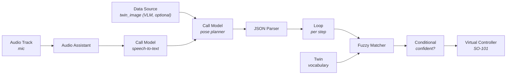

<Warning>
  **Early tutorial (stub).** The flow and node configuration below are complete
  enough to build and test end-to-end. Screenshots and a shareable template link
  will be added as the template is published.
</Warning>

By the end of this tutorial you'll have an SO-101 arm that listens to a spoken
command, has a model turn it into a short **sequence of poses**, and executes that
sequence — built entirely in the visual Workflow editor, **no scripts and no VLA
training.**

Prefer to build it in Python? See the SDK version:
[Control an SO-101 arm with your voice](/tutorials/so101-natural-language-agent).
Want a learned policy instead of a pose vocabulary? See the VLA version:
[Voice-controlled pick and place](/tutorials/so101-voice-pick-and-place).

## The idea

A trained VLA generalises, but needs a dataset. This template takes the opposite
trade: you **pre-teach the arm a small set of named poses** for a fixed workspace,
and a model just **sequences** them. No training, no dataset — the fixed pose set
is your deterministic contract.



## Prerequisites

- An **SO-101 follower** twin, paired and calibrated (see
  [Get started with the SO-101](/tutorials/so101-teleop-dataset)).
- A **teleop/pose controller** on the arm that can reach your **saved poses** and
  open/close the gripper (see [Twin saved poses](/feature-reference/twin-joint-home-positions)).
- A **microphone** twin that streams audio.
- The saved poses below defined for your workspace: `home`, `over_object`,
  `grasp`, `lift`, `over_target`, `release`, plus gripper `open_gripper` /
  `close_gripper`.

---

## Step 1: Create the workflow

Create a workflow (*SO-101 Voice Agent*) and add both twins: the **microphone**
and the **SO-101**. You'll wire nine nodes left to right; inputs are set in the
inspector — fixed values on the `#` tab, references to another node with the `</>`
expression tab using `{node-name.output}` syntax.

---

## Step 2: Capture the voice — Audio Track → Audio Assistant

**Audio Track** (trigger) listens to the mic; **Audio Assistant** trims it to
actual speech.

| Node | Field | Value |
|------|-------|-------|
| Audio Track | Twin | your microphone twin |
| Audio Track | Buffer preset | `speech-to-text` |
| Audio Assistant | `audio` | `{audio-track.audio}` |
| Audio Assistant | Modality | `voice_assistant` |

<Check>
  Speak and open **Executions** — a run fires, and Audio Assistant shows
  `is_speaking: true` with a captured speech segment.
</Check>

---

## Step 3: Transcribe — Call Model (speech-to-text)

Add a **Call Model** node, pick a speech-to-text model (e.g. Faster Whisper Small EN).

| Field | Mode | Value |
|-------|------|-------|
| `audio` | `</>` | `{audio-assistant.audio}` |
| Model | — | a speech-to-text model |

Output: `result` = the transcript.

---

## Step 4 (optional): See the workspace — Data Source

If you use a VLM planner, give it eyes: add a **Data Source** node.

| Field | Value |
|-------|-------|
| Data Source Type | `twin_image` |
| Sensor | the arm's wrist or top-down camera |

Output: `image_url`. Skip this node for a plain LLM on a fixed workspace.

---

## Step 5: Plan the poses — Call Model (planner)

Add a second **Call Model** and pick an LLM or VLM. Set the **Prompt** to `</>`
(expression) and paste the pose planner below; the last line inlines the transcript.

<Accordion title="Pose planner prompt">

```
You are the motion planner for an SO-101 robot arm doing pick-and-place on a
fixed workspace. Turn the operator's request (and the workspace image, if given)
into a JSON plan. No chat, no markdown, no code fences.

# You may ONLY use these named steps
- "open_gripper" / "close_gripper"
- "home"        — safe home pose
- "over_object" — hover above the object to pick
- "grasp"       — lower onto the object
- "lift"        — raise the grasped object
- "over_target" — hover above the drop location
- "release"     — lower to the drop location

You do NOT set joint angles, coordinates, or speed. You only sequence the named
steps. If the request is impossible with these steps or the object isn't visible,
return a single {"action":"home"} step and say why in "say".

# Output — exactly one JSON object
{ "say": "<one short sentence>", "steps": [ {"action":"open_gripper"} ] }

# Rules
- 1 to 12 steps. A normal pick-and-place is:
  open_gripper -> over_object -> grasp -> close_gripper -> lift ->
  over_target -> release -> open_gripper -> home
- Always open the gripper before grasping and end at "home".
- NEVER invent step names. NEVER output prose outside the JSON.

# Example
Request: "put the block in the cup"
{"say":"Picking the block into the cup.","steps":[{"action":"open_gripper"},{"action":"over_object"},{"action":"grasp"},{"action":"close_gripper"},{"action":"lift"},{"action":"over_target"},{"action":"release"},{"action":"open_gripper"},{"action":"home"}]}

# The operator's request
"{call-model.result}"
```

</Accordion>

If using a VLM, also wire `image_url` ← `{data-source.image_url}`. Leave
`image_url` empty for a plain LLM. Output: `result` = the JSON plan.

---

## Step 6: Read the plan — JSON Parser

| Field | Mode | Value |
|-------|------|-------|
| `json_data` | `</>` | `{call-model-2.result}` |
| LLM fix enabled | — | on |

---

## Step 7: The arm's vocabulary — Twin

Add a **Twin** node pointing at the SO-101 → it reports the valid step names for
matching.

| Field | Value |
|-------|-------|
| Twin | SO-101 |

Output: `control_actuations`.

---

## Step 8: Run each step — Loop

| Field | Mode | Value |
|-------|------|-------|
| `array_data` | `</>` | `{json-parser.json_data.steps}` |

<Warning>
  Point `array_data` at the **`steps` list**, not the whole object. A loop needs
  an array to iterate.
</Warning>

Exposes `{loop.item}` (the current step) and `{loop.index}`.

---

## Step 9: Guardrail — Fuzzy Matcher

Wire **Loop → Fuzzy Matcher**. It snaps each planned step to a real pose name and
returns empty if nothing matches.

| Field | Mode | Value |
|-------|------|-------|
| Uncertain String | `</>` | `{loop.item.action}` |
| Source of Truth | `</>` | `{twin.control_actuations}` |
| Advanced → Score Threshold | `#` | `80` |

Outputs: `matched`, `match`, `score`.

---

## Step 10: Confidence gate — Conditional

| Field | Mode | Value |
|-------|------|-------|
| `left_value` | `</>` | `{fuzzy-matcher.match}` |
| operator | — | `equal` |
| `right_value` | `#` | `true` |

Wire the **true** port → the dispatch node so an unrecognised step never reaches
the arm.

---

## Step 11: Move the arm — Virtual Controller

Wire **Conditional (true) → Virtual Controller**. Use Virtual Controller (not Send
Controller Command) because the command changes every step.

| Field | Value |
|-------|-------|
| Twin | SO-101 |
| Command source | Source Node → `{fuzzy-matcher.matched}` |
| Controller Policy | your teleop/pose controller |

---

## Step 12: Test in simulation

Switch to **SIMULATE** — voice is real, the arm runs as a 3D twin.

1. Confirm the arm is at **zero pose** and (if using a VLM) the camera streams.
2. Say *"put the block in the cup."*
3. Walk **Executions**:

| Node | Expect |
|------|--------|
| Call Model (STT) | `result` = your words |
| Call Model (planner) | valid JSON pose plan |
| Loop | ran once per step |
| Fuzzy Matcher | `matched` = a real pose, `match: true` |
| Virtual Controller | `Sent: true` per step |

Then test an impossible request (*"make me a coffee"*) → the plan degrades to
`home`, the arm does nothing unsafe.

<Warning>
  **Step completion / pacing.** Poses take real time. Confirm each
  `virtual_controller` command finishes before the next fires — otherwise `grasp`
  could be sent mid-move. If your controller doesn't queue/complete commands in
  order, add a short `wait` step between moves. Simulation is where you catch this.
</Warning>

<Note>
  **Zero-pose on attach.** When a non-teleop controller attaches, the arm first
  moves to zero pose with collision detection on, and queues commands during that
  transition. Expect a brief pause before the first move.
</Note>

---

## Step 13: Go live

Once simulation is clean, switch to **LIVE** to drive the physical arm. The graph
is unchanged — only the target flips. Keep an eye on it and be ready to stop.

## The one idea to take away

The model never sets joint angles and never commands the arm directly. It only
sequences **pre-taught poses**, and every step is validated against the arm's real
vocabulary before it moves. **The model reasons; a fixed contract acts.**

## Next steps

<CardGroup cols={2}>
  <Card title="The SDK version" icon="python" href="/tutorials/so101-natural-language-agent">
    Build the same agent in Python with the Cyberwave SDK.
  </Card>
  <Card title="The VLA version" icon="brain" href="/tutorials/so101-voice-pick-and-place">
    Train a policy instead of pre-teaching poses.
  </Card>
  <Card title="Workflow nodes" icon="shapes" href="/overview/features/workflow-nodes">
    Every node used here, with inputs, outputs, and where it runs.
  </Card>
  <Card title="UGV voice agent" icon="car-side" href="/tutorials/ugv-beast-workflows">
    The same template on a mobile rover.
  </Card>
</CardGroup>
