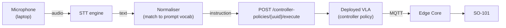
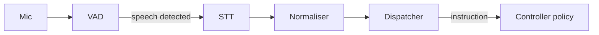

<Warning>
**Early tutorial.** The flow, decisions, and cross-links below are complete enough to follow end-to-end. Specific code blocks, screenshots, and sample datasets will be filled in as we run more experiments.
</Warning>

By the end of this tutorial you will have an SO-101 that picks up a known object and places it in a known target location in response to a spoken command, driven by a Vision-Language-Action (VLA) policy you trained yourself.

## Architecture at a glance

<Info>
**Who provides what.** Cyberwave provides: environment, digital twin, dataset recording, training, controller-policy deployment, MQTT command path. You provide: the mic, the STT engine, and the transcript normaliser.
</Info>

---

## Goals and scope

**What you'll build.** A laptop-side voice agent that listens for a short command, turns it into text, sends that text as an `instruction` to a deployed VLA, and watches the SO-101 execute a pick-and-place on your workspace.

**In scope**

- A single SO-101 follower with wrist and top-down cameras.
- A fixed tabletop workspace with 2-3 known object and target pairs.
- A bounded vocabulary of ~5-10 phrasings trained into the VLA.
- Client-side microphone (Pattern A).

**Out of scope (follow-up tutorials)**

- Bimanual / multi-arm coordination.
- 6-DOF pose targets or free-form grasping.
- On-robot microphone (Pattern B), always-on wake-word, and dialog.
- Outdoor / unconstrained workspaces.

**Success criteria.** The arm completes the task on 8 of 10 attempts across 3 positions for each object and target pair. Pick a number that matches your use case before you start; evaluating against a fixed bar is what tells you when to stop iterating.

{/* TODO: once we run this end-to-end, replace the 8/10 placeholder with the actual rate we achieve with the reference setup */}

---

## Prerequisites

This tutorial starts from a working SO-101 teleoperation setup. Do not skip the base setup; everything below assumes it is in place.

- **Hardware**: SO-101 leader + follower, wrist camera, top-down camera, workspace rectangle marked on the table.
- **Credentials**: Cyberwave API key, workspace with VLA training enabled.
- **Base setup**: [SO-101 Get Started](/hardware/so101/get-started) (environment, edge install, calibration, teleop).
- **SDK baseline**: [Python SDK](/sdks/python-sdk).
- **Conceptual grounding**: [Key Concepts](/get-started/key-concepts), [Voice as a Sensor](/hardware/microphone/get-started).

<Check>
You're ready for this tutorial when you can teleoperate the SO-101 follower from the leader and record an episode in Live Mode.
</Check>

---

## Design the task

Spend 20 minutes here before touching any robot. Decisions you lock in now become training constraints for the rest of the tutorial.

Fill in this worksheet:

| Decision | Your answer |
|---|---|
| Object and target pairs (2-3) | e.g. red block → blue cup, pen → left drawer |
| Prompt vocabulary per pair (3-5 phrasings) | e.g. *"pick the red block and place it in the blue cup"*, *"put the red block in the blue cup"* |
| Camera pose (wrist + top-down) | Lock, mark mount positions, photograph |
| Lighting | One fixed lamp, shades closed, time-of-day independent |
| Workspace extent | Taped rectangle on the table, dimensions written down |
| Episode length target | e.g. 8-12 seconds |
| Episodes per pair | e.g. 30-50 to start |

<Tip>
**"Train-like, infer-like."** A VLA only reliably executes phrasings and scenes it saw during data collection. If you move the top-down camera 5cm after training, expect performance to drop. Lock physical and linguistic conditions before recording a single episode.
</Tip>

{/* TODO: publish a downloadable worksheet PDF / fillable table snippet */}

---

## Collect the dataset (teleop only)

Voice is **not** in the loop yet. This phase is pure teleoperation plus recording.

1. Put the follower at zero pose and confirm both camera streams are live in the environment viewer.
2. Open Live Mode and start recording.
3. Using the leader, perform the task once per episode. One object-and-target pair, clean trajectory, no resets mid-episode.
4. Label the episode with the exact prompt phrasing you plan to use at inference time. Pick one phrasing per episode from the vocabulary you locked in [Design the task](#design-the-task).
5. Stop recording; trim dead time at start and end; discard any episode where the gripper slipped, the object moved unexpectedly, or you intervened.
6. Repeat across all object-and-target pairs and all phrasings. Aim for balanced counts per pair.

**Dataset hygiene**

- Consistent episode length, consistent starting pose.
- Same phrasing label for all episodes of the same pair and intent.
- Reject failures at recording time, not at training time.

**When to stop.** Once you have 30-50 clean episodes per object-and-target pair. You can always add more after a first training pass reveals weak spots.

*Expansion point: voice narration during teleop will later auto-label episodes with the phrasing you spoke. Not wired in yet.*

{/* TODO: screenshot of a well-trimmed episode timeline and the labelling UI */}

---

## Train and deploy the VLA

1. In the dashboard, open **AI → Train Model** and point it at the dataset you recorded in [Collect the dataset](#collect-the-dataset-teleop-only).
2. Pick a base model. Start with a smaller VLA (SmolVLA-class) for faster iteration; graduate to Pi0 or OpenVLA only if the small model caps out.
3. Start training. Watch validation loss. A healthy curve drops for the first few epochs and then flattens; if it never flattens, you likely need more data or more consistent labels, not more training time.
4. When training completes, click **Deploy as controller policy**. Save the returned `controller_policy_uuid`.
5. Attach the policy to the SO-101 follower twin. This can be done from the twin's settings in the dashboard, or by setting `controller_policy_uuid` on the twin via the API (see [`TwinSchema`](/api-reference/rest/TwinSchema)).
6. **Verify before voice.** From the dashboard, type one of your trained phrasings into the policy's execute panel and run it in simulation. Then run it live. If this does not work, voice won't either; fix it here before moving on.

<Warning>
On attach of any non-Local-Teleop controller, the follower first goes to zero pose and enables collision detection. Commands sent during this transition are queued; the arm won't react until the zero-pose move completes.
</Warning>

{/* TODO: screenshots of the training settings screen, validation loss, deployment screen, and twin attach UI */}

---

## Introduce voice as a sensor

The dashboard prompt from [Train and deploy the VLA](#train-and-deploy-the-vla) already proved the policy works. Now we replace the dashboard prompt with a transcript from a microphone. Everything downstream (policy, twin, MQTT, hardware) is unchanged.

Read the framing in [Voice as a Sensor](/hardware/microphone/get-started) for the generic pattern. This tutorial uses **Pattern A (client-side microphone)** because it is the fastest way to get a working operator flow with no changes on the edge device or new sensor twins.

**Operator experience.** Operator speaks → 1-2 second pause → arm executes. No push-to-talk required if you put a VAD in front of the STT. No cloud round-trip if your STT runs locally.

---

## Wire the voice agent

You are assembling four components on your laptop:

1. **Mic capture** — any audio input library that gives you a 16 kHz mono float array.
2. **VAD** (optional but recommended) — gate the STT so it only transcribes when speech is detected. Avoids hallucinated transcripts on silence.
3. **STT engine** — local recommended. `base.en` Whisper is fine for a headset in a quiet room; move to `small.en` for a noisy lab.
4. **Normaliser** — a tiny function that maps arbitrary heard text to the closest phrasing from your locked vocabulary. Start with keyword matching; graduate to a one-shot LLM classify if phrasings diverge.
5. **Dispatcher** — POSTs the normalised text as an `instruction` to `/api/v1/controller-policies/{uuid}/execute` with your `twin_uuid`. See [`ControllerPolicyExecuteSchema`](/api-reference/rest/ControllerPolicyExecuteSchema) for the payload shape.

**Happy path**

**Why normalisation matters.** The STT will hear "put the *red* block in the *blue* cup" and also "uhm, can you put red block blue cup". The VLA only reliably handles phrasings it saw in training. The normaliser collapses the second into the first.

*Expansion point: a dedicated low-latency wake-word pipeline for "stop" that publishes an abort over MQTT directly, bypassing the main STT. Not wired in yet.*

{/* TODO: final agent code block (mic capture -> VAD -> STT -> normaliser -> dispatcher) once the Python SDK surface for execute is verified */}

---

## Run the demo

Print this checklist. Re-read it every demo day.

<Steps>
  <Step title="Pre-flight">
    - Workspace cleared, objects at the starting positions you locked in [Design the task](#design-the-task).
    - Both cameras streaming in the environment viewer.
    - Controller policy attached to the follower; last successful dashboard-prompt run was within the hour.
    - Arm at zero pose. No alerts active on the twin.
  </Step>
  <Step title="Start the voice agent">
    Launch the Python process you built in [Wire the voice agent](#wire-the-voice-agent). Confirm the normaliser mapping table prints at startup.
  </Step>
  <Step title="Speak the command">
    One phrasing from your trained vocabulary. Speak it once, then pause.
  </Step>
  <Step title="Observe execution">
    Watch the Live View twin move first; the physical arm follows over MQTT. Do not stand inside the workspace rectangle.
  </Step>
  <Step title="Reset between attempts">
    Manually return the object to a marked starting position. Press zero-pose on the arm.
  </Step>
</Steps>

**What success looks like.** Arm moves within ~1-2 seconds of your pause ending. Gripper closes cleanly on the object, lifts, translates, and releases above the target.

**What failure looks like, and where to look first.**

- No arm motion at all → dispatcher or policy attach (see [Debugging playbook](#debugging-playbook)).
- Arm reaches the wrong object → VLA dataset coverage (see [Evaluate and iterate](#evaluate-and-iterate)).
- Arm hesitates then drifts → workspace or camera pose moved since training.

{/* TODO: short video / gif of a successful run */}

---

## Safety and operational notes

- **Controller-attach behaviour.** Zero-pose and collision detection are enabled on attach. Queue-up of commands during this transition is expected.
- **Physical E-stop.** Keep it reachable. Software-only stops are for convenience, not safety.
- **Simulation-first discipline.** After any change to the voice agent, dataset, or policy, run the new flow against the digital twin before the physical arm. See [Simulation](/capabilities/simulation).
- **When alerts fire on the twin**, pause the voice agent, resolve or acknowledge the alert, re-verify at zero pose, then resume.
- **What invalidates your setup**: camera moved, table moved, new lamp position, recalibration, major lighting change. Any one of these requires a re-verification pass against the baseline you locked in [Design the task](#design-the-task).

---

## Debugging playbook

Scan top to bottom. Most failures land in the top three rows.

| Symptom | Likely layer | What to check |
|---|---|---|
| Nothing heard / empty transcript | Voice | Correct mic selected, VAD threshold, STT model loaded |
| Wrong words in transcript | Voice | STT model size, ambient noise, mic placement |
| Ambiguous phrasing accepted | Normaliser | Vocabulary drift, missing synonym rule, confidence threshold |
| Arm reaches but misses | VLA | Dataset coverage, camera pose matches training, object appearance |
| Arm hesitates or ignores object | VLA | Lighting changed, workspace shifted, object out of distribution |
| 403 / 400 on execute | Platform | API key, policy attached to twin, payload shape |
| Controller not attached | Platform | Twin has a `controller_policy_uuid` set and policy is deployed |
| Camera not live | Platform / Hardware | Camera twin, edge driver, USB bandwidth |
| Motor hot, servo jitter, gripper slip | Hardware | Duty cycle, calibration, gripper wear |

{/* TODO: grow this table with real observations as issues are encountered during dev */}

---

## Evaluate and iterate

Do not iterate on feel. Measure.

- **Baseline run**: 10 attempts × 3 starting positions × each object-and-target pair. Log success / failure per attempt.
- **Diagnose**: bucket failures by likely layer using the [Debugging playbook](#debugging-playbook) table. A pattern of *"arm reaches wrong object"* says re-record; a pattern of *"wrong words"* says the STT or normaliser is the problem, not the VLA.
- **Enrich vs adjust vs retrain**:
  - Enrich the dataset when you see consistent VLA-layer failures on a specific pair or position.
  - Adjust the prompt vocabulary / normaliser when the failure is in the text layer.
  - Retrain only after enrichment, never as a first response.
- **Capture failures automatically.** Publish the heard transcript, the normalised instruction, and the `action_id` on telemetry every run (success or failure). See [MQTT API](/api-reference/mqtt/main) for the `cyberwave/twin/{uuid}/telemetry` topic. Failed-run telemetry becomes your next dataset expansion list.

---

## Where to go next

Each of these is a follow-up tutorial's worth of work. Pick one after you hit the success criteria you set in [Goals and scope](#goals-and-scope).

- **Multi-step tasks**: chaining pick-and-place actions in a single utterance.
- **Dialog-style voice**: asking the robot to confirm, clarify, or report status.
- **On-robot microphone (Pattern B)**: mic on the robot, STT on the edge, telemetry-recorded transcripts.
- **Wake-word gating**: always-on with a sub-200ms "stop" channel on MQTT.
- **Human handover as a primitive**: "hand me the screwdriver".
- **Dataset aggregation across operators**: merging multi-operator datasets into one VLA.
- **Swapping the VLA**: moving SmolVLA → Pi0 → OpenVLA without changing the voice layer.

{/* TODO: each bullet becomes its own page under Examples */}

---

## Reference

- **Endpoints**: [`ControllerPolicyExecuteSchema`](/api-reference/rest/ControllerPolicyExecuteSchema), [`TwinSchema`](/api-reference/rest/TwinSchema), [`WorkflowExecuteSchema`](/api-reference/rest/WorkflowExecuteSchema).
- **MQTT topics**: `cyberwave/twin/{uuid}/telemetry`, `cyberwave/twin/{uuid}/command`. See [MQTT API](/api-reference/mqtt/main).
- **SDK**: `cw.twin`, `robot.capture_frame`, `robot.joints`, `twin.alerts`. See [Python SDK](/sdks/python-sdk).
- **Cross-links**: [SO-101 Get Started](/hardware/so101/get-started), [Voice as a Sensor](/hardware/microphone/get-started), [Teleoperation](/use-cyberwave/teleoperation), [Simulation](/capabilities/simulation), [Key Concepts](/get-started/key-concepts).

{/*
Writer notes (do not render):
- Imperative, task-oriented, like the existing SO-101 get-started page.
- Minimal new concepts; lean on cross-links to Python SDK, Key Concepts, and Voice as a Sensor instead of re-explaining.
- Every code block should be runnable on its own once dependencies are installed.
- Screenshots for dashboard steps, code for SDK/CLI steps, diagrams for conceptual steps.
- One callout max per section (<Tip> or <Warning>), otherwise it gets noisy.
- Fill the remaining TODOs only after a successful end-to-end run; do not write code that hasn't been executed against a real SO-101.
*/}
