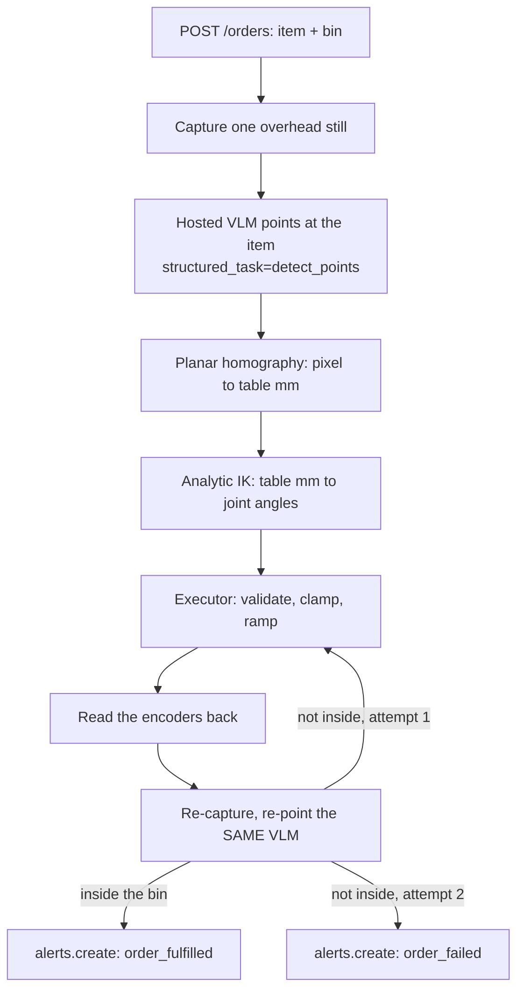

This tutorial builds a picking cell where the item name is the only configuration. An order
arrives as JSON, something like `{"order_id": "SO-1042", "item": "red marker", "bin": "A"}`. The
SO-101 finds that item with an open-vocabulary vision-language model, picks it, drops it in the
named bin, then looks again to confirm it landed. Success raises an `order_fulfilled` alert,
failure retries once and then raises an error alert.

No dataset, no fine-tune, no class list. A new item is a new string.

That second look is what makes this an agent, not a recorded trajectory. Fulfillment is gated on
visual evidence, not on the motion plan finishing.

<Info>
  **Community tutorial.** Contributed by **Devan Sedmak** through the Cyberwave Builders Program
  (Cohort 2). Full source lives in
  [devansedmak/so101-zeroshot-picking-cell](https://github.com/devansedmak/so101-zeroshot-picking-cell).

  **What is verified where.** Perception, camera calibration, joint limits, and sign conventions
  were measured on a physical SO-101. The order loop runs against the **simulated** twin, and live
  hardware was driven read-only plus a few scripted poses. Where a number is assumed, this page
  says so.
</Info>

## What you build



Everything left of the executor is plain Python, testable offline. The same code targets the
simulated twin or the real arm by switching one call.

## Before you start

- An SO-101 paired to Cyberwave, guided calibration already run on the follower.
- A USB camera fixed rigidly overhead, not on the wrist. A planar homography needs a camera that
  does not move relative to the table.
- Low-profile, nameable objects (markers, erasers, glue sticks) on a light mat, plus labeled bins.
- Python 3.10+, `pip install "cyberwave[camera]" numpy`, and `CYBERWAVE_API_KEY` exported.

<Warning>
  Develop in `cw.affect("simulation")` until every number below is calibrated. Switch to
  `cw.affect("live")` only with a clear workspace and a hand on the power switch. Leader and
  follower use different power supplies, 5 V and 12 V. Do not swap them.
</Warning>

<Steps>

<Step title="Connect, then set the real joint names and limits">

Some SO-101 twins expose their joints as `_1`..`_6` rather than `1`..`6`. Sending a command to a
name the twin does not have is a silent no-op. The arm never moves and nothing logs it. Keep
canonical keys (`"1"`..`"6"`, the servo IDs) in your own code, and translate to the twin's real
names only at the SDK boundary:

```python
from cyberwave import Cyberwave
from cyberwave.twin.capabilities import controllable_joint_names

cw = Cyberwave()
cw.affect("simulation")
robot = cw.twin(twin_id="<YOUR_TWIN_UUID>")

CANONICAL = ("1", "2", "3", "4", "5", "6")
actual = controllable_joint_names(robot)     # e.g. ['_1', '_2', '_3', '_4', '_5', '_6']
name_map = dict(zip(CANONICAL, actual)) if len(actual) == len(CANONICAL) else {}

def send(joint: str, angle_deg: float) -> None:
    robot.joints.set(name_map.get(joint, joint), angle_deg, degrees=True)
```

<Note>
  `joints.set(...)` takes radians by default. Pass `degrees=True` or a 30 in your plan becomes 30
  radians on the wire.
</Note>

You will also clamp every commanded angle later, so clamp to numbers the arm actually has, not a
guess. The guided calibration already run is stored on the twin:

```python
cal = robot.joints.calibration.get(robot_type="follower")
print(cal.to_dict())   # per-joint range_min / range_max / homing_offset / drive_mode
```

These ranges come back in radians. Convert to degrees, keep a small margin inside the mechanical
stop, and use that as your limit table. A hand-picked guess of plus or minus 60 degrees once
clamped a mid-workspace elbow solution of -83 degrees down to -60, landing short with no error
anywhere. The real range there was plus or minus 96.6 degrees.

The gripper needs its own check, not an assumed sign. On this arm 0 degrees is fully shut and
higher is more open, the opposite of the other joints' signed range. Before any live run, command
the gripper alone, nothing in the jaws, and watch which way it moves.

</Step>

<Step title="A command acknowledgement is not motion">

This is the most expensive lesson on this page. Publishing a pose returns success whether or not
anything is listening: the twin looks online, MQTT is connected, and the arm does not move. The
edge driver's container mounts `/dev` as a snapshot taken at container creation, so an arm plugged
in afterward stays invisible. Plug the hardware in first, then restart the edge service:

```bash
sudo systemctl restart cyberwave-edge-core
```

The general defense: stop treating a command as proof, and read the joints back.

```python
import math

def verify_pose(robot, expected, *, name_map=None, tolerance_deg=5.0) -> dict[str, float]:
    inverse = {sdk: canon for canon, sdk in (name_map or {}).items()}
    try:
        raw = robot.joints.get()          # {sdk_name: radians}
    except Exception:
        raw = {}
    measured = {inverse.get(n, n): math.degrees(v) for n, v in raw.items()}
    missing = [j for j in expected if j not in measured]
    if not measured or missing:
        raise RuntimeError(f"no telemetry for {missing or list(expected)}, cannot confirm the move")
    return {j: measured[j] - want for j, want in expected.items()
            if abs(measured[j] - want) > tolerance_deg}
```

<Warning>
  Telemetry comes back in **radians** while plans are in degrees. A commanded
  `(11.89, 59.24, -62.00, -87.25)` degrees reads back as `(0.20, 1.04, -1.05, -1.52)`, the same
  pose within half a degree, off by 57x if compared raw.
</Warning>

Cannot tell must never be reported as fine, so a missing telemetry read raises instead of
returning an empty, all-good drift dict. That honesty lives in code: a dashboard stage only turns
green on a `verify_pose` result with no drift, and stays commanded, unverified otherwise.

</Step>

<Step title="Capture one still frame">

Everything downstream starts from one frame, so make that the most reliable call in the system. A
one-shot grab beats a live stream and is easy to retry. Exclude the laptop's own camera by sysfs
name, and never hardcode a `/dev/videoN` number, since it reshuffles on replug.

```python
import cv2

CAPTURE_SIZE = (1920, 1080)

def capture_still(device, out_path):
    cap = cv2.VideoCapture(device, cv2.CAP_V4L2)
    cap.set(cv2.CAP_PROP_FOURCC, cv2.VideoWriter_fourcc(*"MJPG"))
    cap.set(cv2.CAP_PROP_FRAME_WIDTH, CAPTURE_SIZE[0])
    cap.set(cv2.CAP_PROP_FRAME_HEIGHT, CAPTURE_SIZE[1])
    for _ in range(6):                # let auto-exposure settle
        ok, frame = cap.read()
    cap.release()
    if (frame.shape[1], frame.shape[0]) != CAPTURE_SIZE:
        print(f"got {frame.shape[1]}x{frame.shape[0]}, expected {CAPTURE_SIZE}")
    cv2.imwrite(str(out_path), frame)
    return out_path
```

<Warning>
  Set the pixel format before the resolution, and check the frame size you got back. This camera
  offers 1920x1080 over MJPEG only, and asking for the size alone quietly gave 640x480 for weeks.
  A wrong-sized frame still looks fine, but it invalidates every saved pixel coordinate, since the
  homography and bin rectangles are stored in pixels.
</Warning>

Two more things mattered as much as any code: mount the camera straight down, off the arm's own
table, and focus the lens by hand.

</Step>

<Step title="Ask the VLM to point at the ordered item">

This is the zero-shot part: the order's item string is the prompt, nothing is pre-registered.
`mlmodels` is a property on the client instance, not a module-level function.

```python
result = cw.mlmodels.run(
    model="gemini-robotics-er",
    image="frame.jpg",
    prompt="red marker",             # the order's item name, verbatim
    structured_task="detect_points",
)
print(result.output)
# [{"point": [420, 520], "label": "red marker"}]
```

<Warning>
  `detect_points` returns `[{"point": [y, x], "label": ...}]`, in **y, x order, on a 0 to 1000
  grid**, independent of your image size. Get it backward and every pick mirrors about the
  diagonal: plausible numbers, wrong object, no error message anywhere.
</Warning>

Decode this in exactly one function so nothing downstream re-derives the convention:

```python
def parse_points(output, img_w, img_h):
    dets = []
    for item in output or []:
        if not isinstance(item, dict) or "point" not in item:
            continue
        y_raw, x_raw = item["point"][:2]          # y, x, not x, y
        nx, ny = min(max(x_raw / 1000.0, 0), 1), min(max(y_raw / 1000.0, 0), 1)
        dets.append((item.get("label", ""), nx * img_w, ny * img_h))
    return dets
```

Splitting the network call from the parsing pays off, since the parser is where the bug lives and
both the pick and the verification step share the fix.

</Step>

<Step title="Solve IK, then clamp and ramp every command">

A top-down pick does not need a general six-axis solver. Pan the base at the target, solve a
planar two-link reach, and hold the gripper vertical:

```python
import math

L1, L2, L3 = 116.0, 135.0, 159.8   # link lengths, mm
BASE_H = 116.6                     # table to shoulder pivot, mm

def solve_ik(x, y, z=0.0):
    q1 = math.atan2(y, x)
    r = math.hypot(x, y)
    dz = (z + L3) - BASE_H
    reach, lo, hi = math.hypot(r, dz), abs(L1 - L2), L1 + L2
    assert lo <= reach <= hi, f"({x:.0f}, {y:.0f}) unreachable: {reach:.0f} not in [{lo:.0f}, {hi:.0f}]"
    c3 = max(-1.0, min(1.0, (r**2 + dz**2 - L1**2 - L2**2) / (2 * L1 * L2)))
    q3 = -math.acos(c3)                      # elbow-up
    q2 = math.atan2(dz, r) - math.atan2(L2 * math.sin(q3), L1 + L2 * math.cos(q3))
    q4 = (q2 + q3) + math.pi / 2             # tool heading, see below
    return {"1": math.degrees(q1), "2": math.degrees(q2), "3": math.degrees(q3),
            "4": math.degrees(q4), "5": 0.0}
```

<Warning>
  The tool heading is `q2 + q3 - q4`, not `q2 + q3 + q4`. `wrist_flex` is inverted relative to
  `shoulder_lift` and `elbow_flex`. Get the sign wrong and the arm still tracks the commanded
  angles to within half a degree, while the gripper points straight up into a mechanical stop. A
  round trip test will not catch this either, since flipping the sign in both FK and IK still
  passes. Pin the convention with its own assertion, like `assert q2 + q3 - q4 == -90` for a
  top-down pick.
</Warning>

Take `L1`, `L2`, `L3`, and `BASE_H` from the official SO-101 URDF, not a ruler. Ruler estimates on
one build had `L3` sixty millimeters short, enough to drive the gripper into the table on the
first live pick, and the round-trip test still passed since it only proves the algebra agrees
with itself.

Between the solver and the SDK, assume the plan is wrong. Validate the whole plan first, clamp
immediately before each SDK call rather than at plan time, and step toward the target in small
ramped increments instead of jumping. Let the solver return its true answer, not a pre-clamped
one, so a bad result logs loudly. Then call `verify_pose` from step 2: clamping protects the
hardware, only the encoders say where the arm went.

</Step>

<Step title="Close the loop: verify, alert, and serve it over HTTP">

After placing, re-capture and ask the same VLM the same question, then check geometrically
whether the answer lands inside the bin. Bins do not move, so their pixel rectangles are
calibration data, not perception: survey two opposite corners per bin once and store them beside
the homography.

Wire that check into the order loop with one retry, then report through a twin alert:

```python
for attempt in range(1, 3):
    ramp_to(solve_ik(*target_mm))
    ramp_to({**current_pose, "6": GRIPPER_SHUT}, 0.6)
    ramp_to(PLACE_POSES[order.bin])
    ramp_to({**current_pose, "6": GRIPPER_OPEN}, 0.6)
    frame = capture_still(select_device(), "verify.jpg")
    dets = parse_points(cw.mlmodels.run("gemini-robotics-er", image=frame,
                         prompt=order.item, structured_task="detect_points").output, W, H)
    hit = next((d for d in dets if order.item.lower() in d[0].lower()), None)
    ok = hit is not None and region.contains(hit[1], hit[2])
    if ok:
        break

robot.alerts.create(
    name=f"Order {'fulfilled' if ok else 'FAILED'}: {order.item} -> bin {order.bin}",
    description=f"{order.item} {'landed in' if ok else 'not found in'} bin {order.bin} "
                f"after attempt {attempt}.",
    alert_type="order_fulfilled" if ok else "order_failed",
    severity="info" if ok else "error",
    category="business",
    source_type="simulation",
)
```

<Warning>
  `alerts.create(...)` has no `message` keyword, and that guess raises a `TypeError` at the end
  of a good run. Details go in `description`. The item name shows up in the alert's `name`, shown
  in the Alerts list, not in the email Cyberwave sends, which has a static body.
</Warning>

A verifier that raises should degrade the run, not crash it: a camera hiccup should read as "not
verified", never as a lost order.

The last piece is a receiver that turns an HTTP order into a run of this loop. Serialize
fulfillment behind a lock, since one arm cannot run two orders at once. Return `200` for
fulfilled, `409` for well-formed but unfulfilled, `422` for a bad payload, `500` for a runner that
raised.

</Step>

</Steps>

Every warning above shares one shape: no error message, just a plausible-looking wrong result. On
a physical system the expensive failures are silent, and the only defense is to measure the
result instead of trusting the call.

## What this does not cover

- **No depth sensing.** A tall object breaks the planar assumption, since the VLM points at its
  top face and the homography maps that pixel as if it were on the table.
- **No force or tactile feedback.** There is no force, load, or current signal on this hardware.
  The grasp closes to one fixed angle. Verification catches the outcome, not the cause.
- **No collision-aware planning.** The IK is a reach solver, and knows nothing about the bins, the
  mat, or the arm's own body.
- **No multi-object disambiguation.** "The red marker" picks the first matching detection.
- **Bins are taught, not perceived.** Only the item side is zero-shot.
- **The jaw-to-arm angular offset is assumed, not measured.** A wrong constant biases every grasp
  the same way, with no scatter to reveal it. Measure it, don't tune until picks work.

## Next steps

- Swap the fixed approach pose for `predict_grasps` or `plan_steps` and compare against the solver.
- Put a Workflow in front of the receiver so orders arrive from your WMS, not `curl`.
- Log every verification frame beside its verdict, the fastest evidence you can debug a bad pick
  from.
