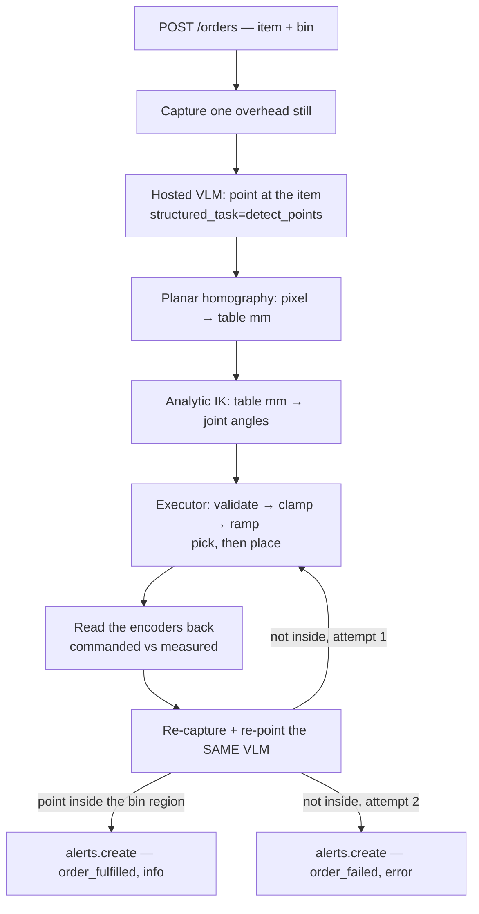

This tutorial builds a picking cell where **the item name is the only configuration**. An order
arrives — `{"order_id": "SO-1042", "item": "red marker", "bin": "A"}` — and an SO-101 locates that
item with an open-vocabulary vision-language model, picks it, drops it in the named bin, then
**looks again** to confirm it actually landed there. Success raises an `order_fulfilled` alert;
failure retries once and then raises an error alert.

No dataset, no fine-tune, no class list. Adding a new SKU is a new string in an order payload.

The last step is what makes it an agent rather than a recorded trajectory: fulfilment is gated on
visual evidence, not on "the motion plan completed".

<Info>
  **Community tutorial.** Contributed by **Devan Sedmak** through the Cyberwave Builders Program
  (Cohort 2). Full source for every module and test referenced below lives in
  [devansedmak/so101-zeroshot-picking-cell](https://github.com/devansedmak/so101-zeroshot-picking-cell).

  **What is verified where.** The perception stack, the camera and homography calibration, the
  joint limits, the unit conventions and the kinematic sign conventions were all measured on a
  physical SO-101 and its encoders — every hardware claim below carries the reading that produced
  it. The end-to-end order loop is exercised against the **simulated** twin; live hardware was
  driven read-only plus single scripted poses. Where a number is an assumption rather than a
  measurement, this page says so.
</Info>

## What you build



Everything left of the executor is plain Python you can unit-test offline with a fake client. The
same code targets the simulated twin or the real arm by switching one call.

## Before you start

- An SO-101 paired to Cyberwave, with **guided calibration already run** on the follower.
- A USB camera **fixed rigidly overhead**, looking at the whole workspace. Not on the wrist — a
  planar homography needs a camera that does not move relative to the table.
- Low-profile, nameable objects (markers, erasers, glue sticks) on a light mat, plus two labelled
  bins.
- Python 3.10+, `pip install "cyberwave[camera]" numpy`, and `CYBERWAVE_API_KEY` exported.

<Warning>
  Develop in `cw.affect("simulation")` until every number below is calibrated. Switch to
  `cw.affect("live")` only with a clear workspace and a hand on the power switch. On the SO-101
  the leader and follower use different PSUs (5 V and 12 V) — do not swap them.
</Warning>

<Steps>

<Step title="Connect and discover the real joint names">

The first thing that bites here fails *silently*.

**Joint names are not always what you expect.** Some SO-101 assets expose their joints as
`_1`..`_6` rather than `1`..`6`. Sending a command to a name the twin does not have is a no-op,
not an error — the arm simply never moves and nothing is logged. Ask the twin:

```python
import time
from cyberwave import Cyberwave
from cyberwave.twin.capabilities import controllable_joint_names

cw = Cyberwave()
cw.affect("simulation")                      # pin the runtime before touching anything
robot = cw.twin(twin_id="<YOUR_TWIN_UUID>")

print(controllable_joint_names(robot))       # e.g. ['_1', '_2', '_3', '_4', '_5', '_6']
```

Keep **canonical keys** (`"1"`..`"6"`, the servo IDs) everywhere in your own code — validation,
limits, IK, tests — and translate to the twin's names only at the SDK boundary:

```python
CANONICAL = ("1", "2", "3", "4", "5", "6")   # shoulder_pan, shoulder_lift, elbow_flex,
                                             # wrist_flex, wrist_roll, gripper
actual = controllable_joint_names(robot)
name_map = dict(zip(CANONICAL, actual)) if len(actual) == len(CANONICAL) else {}

def send(joint: str, angle_deg: float) -> None:
    robot.joints.set(name_map.get(joint, joint), angle_deg, degrees=True)
```

That one-line boundary is also what lets the same controller drive a different arm later: swap the
map, keep the logic.

<Note>
  `joints.set(...)` takes **radians by default**. Pass `degrees=True` explicitly, or a 30 in your
  plan becomes 30 rad in the request. The unit boundary cuts both ways — see the next step.
</Note>

**The first command after connecting is dropped.** Connecting attaches the controller lazily, and
the command that triggers the attach can be lost. In simulation, send a throwaway pose and let it
settle before your real plan:

```python
for j in CANONICAL:                          # throwaway: absorbs the attach
    send(j, 0.0)
time.sleep(3.0)                              # ~3 s settle, then plan normally
```

<Warning>
  Do **not** copy that warm-up onto real hardware. All-zeros is a large, unannounced full-body move
  from wherever the arm is currently resting. On the live path, warm the controller by
  re-commanding the arm's *current* pose (a no-op move), or simply wait out the settle.
</Warning>

</Step>

<Step title="A command acknowledgement is not motion — read the encoders back">

This is the most expensive lesson on this page, so it comes before the geometry.

Publishing a pose returns success **whether or not anything is listening**. The executor prints
"plan complete", the twin looks online, MQTT is connected — and the arm does not move. There is no
error at the command layer because the failure happened at startup: the edge driver runs perfectly
well as an MQTT subscriber with zero serial connections, and silently drops every motion it
receives. It cost me over an hour of debugging geometry that was never the problem.

The root cause is worth knowing because no amount of config editing fixes it on its own: the edge
driver's container `/dev` is a **tmpfs populated once at container creation**. An arm plugged in
after the container started is invisible to it forever — the container had `ttyS*` and no
`ttyACM*` at all. The remedy is to plug the hardware in **first** and then restart the edge
service so the device tree is re-snapshotted:

```bash
sudo systemctl restart cyberwave-edge-core   # recreates the driver container → /dev re-populated
```

The general defence is to stop treating a published command as evidence. Read the joints back and
compare:

```python
import math

def read_joints(robot) -> dict[str, float]:
    """Best-effort read of the twin's current joint state. Moves nothing."""
    joints = getattr(robot, "joints", None)
    for method in ("get", "state", "positions", "read", "all"):
        fn = getattr(joints, method, None)
        if not callable(fn):
            continue
        try:
            value = fn()
        except Exception:                      # try the next accessor
            continue
        if isinstance(value, dict) and value:
            return {str(k): float(v) for k, v in value.items()}
    return {}

def canonical_joints(state, name_map) -> dict[str, float]:
    """SDK names → canonical keys, and RADIANS → DEGREES."""
    inverse = {sdk: canon for canon, sdk in name_map.items()}
    return {inverse.get(n, n): math.degrees(v) for n, v in state.items()}

def verify_pose(robot, expected, *, name_map=None, tolerance_deg=5.0) -> dict[str, float]:
    """Return {joint: error_deg} for joints outside tolerance. Empty dict = everything landed."""
    measured = canonical_joints(read_joints(robot), name_map or {})
    if not measured:
        raise RuntimeError("no joint telemetry — cannot confirm the arm actually moved")
    return {j: measured[j] - want
            for j, want in expected.items()
            if j in measured and abs(measured[j] - want) > tolerance_deg}
```

<Warning>
  **Driver telemetry comes back in RADIANS**, while joint commands in most example code (and in
  every plan you will write) are in degrees. Measured on this arm: a commanded
  `(11.89, 59.24, -62.00, -87.25)°` read back as `(0.20, 1.04, -1.05, -1.52)` — the same pose to
  within half a degree, and off by a factor of 57 if you compare the numbers naively. Convert at
  the one boundary where the units change, exactly like the joint-name map.
</Warning>

Two design rules fall out of this, and both are load-bearing:

- **"Cannot tell" must never be reported as "fine".** A missing telemetry read raises; it does not
  return an empty (i.e. "all good") drift dict.
- **Enforce the honesty in code, not in your report.** In my run dashboard, a motion stage can only
  be painted green by a `verify_pose` result with no drift; a stage without telemetry stays
  "commanded, unverified" forever. An optimistic producer cannot paint a bad move green.

The same read is worth doing at session start for a different reason: an executor that tracks
`current_pose` in memory starts it at all zeros, so a fresh session believes the arm is home no
matter where it physically is, and the first "ramp" becomes a step command. Seed it from the real
angles and the arm eases instead of snapping.

</Step>

<Step title="Take joint limits from the twin's own calibration, not from constants you guessed">

You will clamp every commanded angle (step 6). Clamp to numbers the arm actually has, or the
clamp quietly becomes the bug.

The guided calibration you already ran is stored on the twin. Read it back:

```python
cal = robot.joints.calibration.get(robot_type="follower")
print(cal.to_dict())     # per-joint range_min / range_max / homing_offset / drive_mode
```

On our SO-101 those ranges come back in radians. Convert to degrees, keep a small margin (~5°)
inside the measured mechanical stop — the calibrated value is where the servo was found to *stop* —
and use *that* as your limit table:

```python
JOINT_LIMITS = {           # degrees; from this arm's calibration, minus a 5° margin
    "1": (-113, 113),      # shoulder_pan   — measured ±118.9°
    "2": (-97, 97),        # shoulder_lift  — measured ±102.8°
    "3": (-91, 91),        # elbow_flex     — measured ±96.6°
    "4": (-96, 96),        # wrist_flex     — measured ±101.6°
    "5": (-90, 90),        # wrist_roll     — measured ±179.5°, narrowed on purpose
    "6": (0, 124),         # gripper        — measured 0 → 128.9°; 0 = SHUT, high = OPEN
}
```

<Warning>
  Guessed limits cost a full session on this build. With a hand-picked ±60° everywhere, a pick in
  the middle of the workspace solved to `elbow = -83°`, was silently clamped to `-60°`, and the tip
  would have landed short of the object — with no error anywhere. The arm reaches ±96.6° there;
  only the guess said otherwise. Numbers from the twin, not from a comment.
</Warning>

Two joints deserve their own judgement rather than the calibrated span:

- **wrist_roll** is worth narrowing deliberately if its zero sits near the encoder wrap seam. A
  top-down pick never needs roll, so the range you give up is free — and if you later use roll to
  align the jaws with an object's long axis, half a turn is enough, since a parallel-jaw gripper is
  symmetric under a 180° roll.
- **the gripper** does not necessarily share the sign convention you assume. On this arm **0° is
  fully shut and higher is more open** (jaws just touching read 6.1°), which is the opposite of the
  signed ±range the other joints use. Before any live run, command the gripper alone (nothing in
  the jaws) at two or three angles and watch which way it moves. Guessing wrong here commands a
  *close* when you mean *open*.

</Step>

<Step title="Capture one still frame — do not build on the live stream">

Everything downstream starts from a single frame, so make that the most reliable call in the
system. A one-shot grab is far steadier than a continuous stream, and it is trivially retryable.

Locally, enumerate V4L2 nodes from sysfs and **exclude the laptop's built-in camera by name** — a
lid camera cannot be fixed relative to the table, and `/dev/videoN` numbers reshuffle on replug, so
never hardcode the node. Discard a few frames before keeping one, or auto-exposure hands you a
black image:

```python
from pathlib import Path
import cv2

BUILTIN_HINTS = ("integrated rgb", "integrated camera", "sunplusit", "ir camera")
CAPTURE_SIZE = (1920, 1080)          # calibration-critical — see the warning below

def select_device(sys_dir="/sys/class/video4linux"):
    """First V4L2 node whose sysfs name is not the built-in laptop camera."""
    for entry in sorted(Path(sys_dir).glob("video*")):
        human = (entry / "name").read_text().strip().lower()
        if not any(h in human for h in BUILTIN_HINTS):
            return f"/dev/{entry.name}"
    raise RuntimeError("no external camera found")

def capture_still(device, out_path, warmup_frames=5):
    cap = cv2.VideoCapture(device, cv2.CAP_V4L2)
    try:
        # MJPEG *before* the size: raw YUYV at 1080p exceeds USB 2.0 bandwidth, so the
        # driver silently falls back to 640x480 if the size is requested on its own.
        cap.set(cv2.CAP_PROP_FOURCC, cv2.VideoWriter_fourcc(*"MJPG"))
        cap.set(cv2.CAP_PROP_FRAME_WIDTH, CAPTURE_SIZE[0])
        cap.set(cv2.CAP_PROP_FRAME_HEIGHT, CAPTURE_SIZE[1])
        frame = None
        for _ in range(warmup_frames + 1):          # auto-exposure needs a moment
            ok, buf = cap.read()
            if ok and buf is not None:
                frame = buf
        if frame is None:
            raise RuntimeError(f"opened {device} but read no frame")
        if (frame.shape[1], frame.shape[0]) != CAPTURE_SIZE:
            print(f"⚠ got {frame.shape[1]}x{frame.shape[0]}, expected {CAPTURE_SIZE} — "
                  "pixel coordinates will NOT match your calibration")
        cv2.imwrite(str(out_path), frame)
    finally:
        cap.release()
    return out_path
```

<Warning>
  **Set the pixel format before the resolution, and check the frame you got back.** My kit camera
  offers 1920×1080 over MJPEG only; asking for the size alone made the driver quietly hand back
  640×480 for weeks. A wrong-sized frame still looks like a perfectly good photo — and invalidates
  every pixel coordinate you have saved, because the homography and the bin rectangles are stored
  in pixels. This is why the size check above prints rather than trusting the request.
</Warning>

If OpenCV cannot open the node, `ffmpeg` is a solid fallback with no Python dependency — but it
must be given the same two settings, in the same order, *before* the input:

```bash
ffmpeg -f v4l2 -input_format mjpeg -video_size 1920x1080 -i /dev/videoN -frames:v 1 out.jpg
```

A backend switch that changes the frame size is a silent recalibration. And if the camera is
registered as a twin, the platform path is a good third one — one REST call, same one-shot shape:

```python
cam = cw.twin(twin_id="<YOUR_CAMERA_TWIN_UUID>")
path = cam.get_frame("path", source="cloud")     # JPEG on disk
```

<Note>
  In `cw.affect("simulation")`, `get_frame` only accepts `source="cloud"`.
</Note>

Two more things that mattered more than any code: mount the camera **straight down**, decoupled
from the table the arm sits on (mine was 55–60° oblique on a stack of books — object-height
parallax alone blew the error budget), and **focus the lens by hand**. Variance-of-Laplacian went
from 17.5 to 330 on my rig and the printed calibration marks went from sub-pixel-invisible to
clearly clickable.

</Step>

<Step title="Ask the VLM to point at the ordered item">

This is the zero-shot part: the order's item string *is* the prompt. Nothing is pre-registered.

`mlmodels` is a property on the **client instance** — `Cyberwave().mlmodels` — not a module-level
attribute:

```python
result = cw.mlmodels.run(
    model="gemini-robotics-er",              # slug, UUID, or an MLModelSummary
    image="frame.jpg",                       # path, bytes, file-like, or a PIL image
    prompt="red marker",                     # the order's item name, verbatim
    structured_task="detect_points",
)
print(result.output)
# [{"point": [420, 520], "label": "red marker"}]
```

<Warning>
  **Read the coordinate convention twice.** `detect_points` returns
  `[{"point": [y, x], "label": ...}]` — **`[y, x]` order, on a 0–1000 grid**, independent of your
  image size. Not `[x, y]`, not pixels. Get it backwards and every pick mirrors about the diagonal:
  plausible-looking numbers, wrong object, no error message anywhere. `detect_boxes` follows the
  same family: `box_2d = [ymin, xmin, ymax, xmax]`, also 0–1000.
</Warning>

Decode it in **exactly one function**, so nothing downstream ever re-derives the convention:

```python
VLM_SCALE = 1000.0

def parse_points(output, img_w, img_h, default_label=""):
    """VLM output → [(label, x_px, y_px)]. Pure: no network, no SDK — unit-test this."""
    items = output if isinstance(output, list) else []
    dets = []
    for item in items:
        if not isinstance(item, dict) or "point" not in item:
            continue
        try:
            y_raw, x_raw = item["point"][:2]          # ← [y, x], not [x, y]
            nx = min(max(float(x_raw) / VLM_SCALE, 0.0), 1.0)
            ny = min(max(float(y_raw) / VLM_SCALE, 0.0), 1.0)
        except (TypeError, ValueError, IndexError):
            continue                                   # skip malformed entries, keep the rest
        dets.append((str(item.get("label") or default_label), nx * img_w, ny * img_h))
    return dets
```

Splitting the network call from the parsing is worth doing on day one: the parser is where the
expensive bug lives, and every consumer of it (pick *and* verification) inherits the fix. Type your
client as "anything with a `mlmodels.run`" and a fake replaying canned output tests the whole
pipeline with no credits, no camera, and no network.

Two more practical notes: `result.is_queued()` tells you the run went to an async cloud node (poll
`result.poll_url`; a synchronous model will not do this), and validating your prompts in the model
Playground is cheaper than iterating from a script.

</Step>

<Step title="Turn the pixel into a table coordinate (planar homography)">

The scene is flat and the camera is fixed, so a 3×3 homography is all the geometry you need — no
depth sensor, no camera intrinsics.

Tape a sheet of known size on the mat with its **origin corner at the arm base**, long edge
pointing away from the arm. Then the homography's world frame *is* the robot base frame and there
is no offset to apply later. Read the four corner pixels off the calibration frame and fit:

```python
import numpy as np

def _norm(pts):
    """Hartley normalization — centroid at origin, mean distance √2; keeps the DLT stable."""
    c = pts.mean(axis=0)
    s = np.sqrt(2.0) / float(np.sqrt(((pts - c) ** 2).sum(axis=1)).mean())
    return np.array([[s, 0, -s * c[0]], [0, s, -s * c[1]], [0, 0, 1.0]])

def fit_homography(pixel_pts, world_pts):
    """≥4 (pixel → world) correspondences → 3×3 H. World units are yours; use mm."""
    src, dst = np.asarray(pixel_pts, float), np.asarray(world_pts, float)
    t_src, t_dst = _norm(src), _norm(dst)
    src_n = (t_src @ np.column_stack([src, np.ones(len(src))]).T).T
    dst_n = (t_dst @ np.column_stack([dst, np.ones(len(dst))]).T).T
    rows = []
    for (u, v, _), (X, Y, _) in zip(src_n, dst_n):
        rows.append([u, v, 1, 0, 0, 0, -X * u, -X * v, -X])
        rows.append([0, 0, 0, u, v, 1, -Y * u, -Y * v, -Y])
    _, _, vh = np.linalg.svd(np.asarray(rows, float))
    H = np.linalg.inv(t_dst) @ vh[-1].reshape(3, 3) @ t_src
    return H / H[2, 2]

def project(H, xy):
    """One pixel (x, y) → table (X, Y) mm."""
    v = H @ np.array([float(xy[0]), float(xy[1]), 1.0])
    return float(v[0] / v[2]), float(v[1] / v[2])

# Score the fit before trusting it — and refuse to save a bad one.
err = np.linalg.norm(np.array([project(H, p) for p in pixel_pts]) - np.asarray(world_pts, float),
                     axis=1)
assert err.max() <= 20.0, f"reprojection error {err.max():.1f} mm > 20 mm — re-click the corners"
```

A max reprojection error under ~20 mm is a reasonable bar for a chunky-object pick; a ceiling mount
at ~60 cm with a focused lens gave me ~0.9 mm/px and an RMS of 0.4 mm, so the bar is not hard to
clear once the camera is right. When the fit fails, the cause is almost always a mistyped
millimetre value, corners clicked out of order, or the sheet moving between clicking and measuring.
Save `H` to JSON beside your other calibration data, and re-run this whenever the camera is bumped
— or whenever the frame size changes.

</Step>

<Step title="Solve IK, then clamp and ramp every command">

For a top-down pick you do not need a general 6-DOF solver. Pan the base at the target, solve a
planar 2-link reach, and hold the gripper vertical:

```python
import math

L1, L2 = 116.0, 135.0      # shoulder→elbow, elbow→wrist (mm)
L3 = 159.8                 # wrist_flex pivot → gripper frame (TCP)
BASE_H = 116.6             # table surface → shoulder_lift pivot
GRIPPER_OPEN = 105.0       # degrees; 0 = shut on this arm — verify yours (step 3)

class Unreachable(ValueError):
    pass

def solve_ik(x, y, z=0.0):
    """Table (X, Y, Z) mm in the base frame → joint targets in degrees, keyed "1".."6"."""
    q1 = math.atan2(y, x)
    r = math.hypot(x, y)
    dz = (z + L3) - BASE_H                        # gripper vertical ⇒ tip is L3 below the wrist
    reach, lo, hi = math.hypot(r, dz), abs(L1 - L2), L1 + L2
    if not (lo <= reach <= hi):
        raise Unreachable(f"({x:.0f}, {y:.0f}) → reach {reach:.0f} mm outside [{lo:.0f}, {hi:.0f}]")
    c3 = max(-1.0, min(1.0, (r**2 + dz**2 - L1**2 - L2**2) / (2 * L1 * L2)))
    q3 = -math.acos(c3)                           # elbow-up branch
    q2 = math.atan2(dz, r) - math.atan2(L2 * math.sin(q3), L1 + L2 * math.cos(q3))
    q4 = (q2 + q3) + math.pi / 2                  # tool heading straight down — see the warning
    return {"1": math.degrees(q1), "2": math.degrees(q2), "3": math.degrees(q3),
            "4": math.degrees(q4), "5": 0.0, "6": GRIPPER_OPEN}
```

<Warning>
  **The tool heading is `q2 + q3 - q4`, not `q2 + q3 + q4`.** `wrist_flex`'s positive direction is
  **inverted** relative to `shoulder_lift` and `elbow_flex` on the SO-101, so the wrist term enters
  the chain with a minus. Measured on the physical arm: commanding
  `(q1, q2, q3, q4) = (11.89, 59.24, -62.00, -87.25)°` read back on the encoders as
  `(11.5, 59.6, -60.2, -87.1)°` — the arm tracked the command to within half a degree — and the
  gripper pointed straight **UP**, with the wrist straining against a mechanical end stop.

  - "obvious" convention: `59.6 - 60.2 - 87.1 = -87.7°` ⇒ down — contradicted by the arm.
  - actual convention: `59.6 - 60.2 + 87.1 = +86.5°` ⇒ up — what was observed.

  Note that a forward-kinematics round-trip cannot catch this. Flip the sign in FK and IK together
  and `forward_kinematics(solve_ik(p)) ≈ p` still passes under either convention. Pin the
  convention with its own assertion — `assert q2 + q3 - q4 == -90` for a top-down pick — or a tidy
  refactor will quietly point your gripper at the ceiling again.
</Warning>

Take `L1`, `L2`, `L3` and `BASE_H` from the official SO-101 URDF
([TheRobotStudio/SO-ARM100](https://github.com/TheRobotStudio/SO-ARM100), chaining the joint
origins) rather than a ruler. On my arm the ruler estimates had `L3` **60 mm short**, which would
have driven the gripper into the table on the first live pick. The solver is self-consistent with
any numbers you give it, so the round-trip test stays green while the arm reaches short: it proves
the algebra, not the geometry.

Between the solver and the SDK, put a layer that assumes the planner is wrong:

```python
current_pose = {j: 0.0 for j in CANONICAL}   # last COMMANDED pose, interpolated from

def clamp(joint, angle):
    lo, hi = JOINT_LIMITS.get(joint, (-60.0, 60.0))
    return max(lo, min(hi, float(angle)))

def ramp_to(target_pose, duration=1.5, hz=20):
    """Interpolate from the last commanded pose; clamp immediately before each send."""
    steps = max(2, int(duration * hz))
    start = dict(current_pose)
    for s in range(1, steps + 1):
        t = s / steps
        for j, goal in target_pose.items():
            angle = clamp(j, start.get(j, 0.0) + (goal - start.get(j, 0.0)) * t)
            send(j, angle)                        # name_map translation happens in send()
            current_pose[j] = angle
        time.sleep(duration / steps)
```

Four rules that are cheap to follow and expensive to skip: validate the whole plan before executing
any of it (all-or-nothing — a rejected step must never leave the arm mid-order); clamp *immediately
before* the SDK call, not at plan time; never step to a target, ramp to it; and have the solver
return the **truthful** solution rather than a pre-clamped one, then log loudly when it falls
outside your limits. That log line is what turns the failure in step 3 from a mystery into a fix.

Then follow the ramp with `verify_pose(robot, target, name_map=name_map)` from step 2. Clamping
protects the hardware; only the encoders tell you where it went.

</Step>

<Step title="Close the loop: look again before you claim success">

This is the step that separates an agent from a replay. After placing, re-capture and ask the
*same* VLM the *same* question — then test geometrically whether the answer is inside the bin.

Bins do not move in a fixed overhead view, so their pixel rectangles are **calibration data**, not
perception. Survey them once (two opposite corners per bin, just inside the rim) and store them
alongside the homography.

```python
from dataclasses import dataclass

@dataclass(frozen=True)
class BinRegion:
    label: str
    x0: float; y0: float; x1: float; y1: float

    def contains(self, px, py):
        return self.x0 <= px <= self.x1 and self.y0 <= py <= self.y1

def evaluate_placement(detections, item, region):
    """Pure verdict, three outcomes, never raises: not seen / outside / inside."""
    target = next((d for d in detections if item.lower() in d[0].lower()), None) \
        or (detections[0] if detections else None)
    if target is None:
        return False, f"{item!r} not detected after placing (dropped, occluded, or still gripped)"
    _, x, y = target
    if not region.contains(x, y):
        return False, f"{item!r} at px=({x:.0f}, {y:.0f}), outside bin {region.label}"
    return True, f"{item!r} verified inside bin {region.label} at px=({x:.0f}, {y:.0f})"
```

Wire it into the order loop with one retry:

```python
MAX_ATTEMPTS = 2

for attempt in range(1, MAX_ATTEMPTS + 1):
    ramp_to(solve_ik(*target_mm))                        # approach, gripper open
    ramp_to({**current_pose, "6": GRIPPER_SHUT}, 0.6)    # grasp
    ramp_to(PLACE_POSES[order.bin])                      # carry to the bin (a taught pose)
    ramp_to({**current_pose, "6": GRIPPER_OPEN}, 0.6)    # release
    frame = capture_still(select_device(), "verify.jpg")
    dets = parse_points(cw.mlmodels.run("gemini-robotics-er", image=frame, prompt=order.item,
                                        structured_task="detect_points").output, W, H)
    ok, reason = evaluate_placement(dets, order.item, region)
    print(("verified: " if ok else "NOT verified: ") + reason)
    if ok:
        break
```

Three design choices worth copying:

- **Reuse the pick's detector.** No new task type, no second model to validate — and picking and
  verification agree by construction on which blob "is" the item.
- **A verifier that raises is a failed verification, not a crashed run.** Wrap the call; a camera
  hiccup should downgrade to "not verified", not lose the order.
- **Inject the verifier.** Keep it a plain `(order) -> result-with-.ok` callable. With `verify=None`
  the loop degrades cleanly to the open-loop version, which keeps your offline tests honest.

Missing calibration should degrade the same way: if the bin regions have not been surveyed yet,
print a warning and run unverified rather than aborting a demo.

</Step>

<Step title="Report the outcome as a twin alert">

The verdict belongs on the platform, not only in your terminal:

```python
def build_alert(order, ok, reason):
    if ok:
        return {"name": f"Order fulfilled: {order.item} → bin {order.bin}",
                "description": f"Picked {order.item} and placed it in bin {order.bin}.",
                "alert_type": "order_fulfilled", "severity": "info", "category": "business"}
    return {"name": f"Order FAILED: {order.item} → bin {order.bin}",
            "description": f"Could not verify {order.item} in bin {order.bin} "
                           f"after {MAX_ATTEMPTS} attempts. {reason}",
            "alert_type": "order_failed", "severity": "error", "category": "business"}

robot.alerts.create(**build_alert(order, ok, reason), source_type="simulation")
```

<Warning>
  `alerts.create(...)` has **no `message` keyword** — the natural guess raises a `TypeError` at the
  end of an otherwise successful run. Details go in `description`. The keywords it does take are
  `name`, `description`, `alert_type`, `severity`, `source_type` and `category`, with
  `severity ∈ {info, warning, error, critical}`,
  `source_type ∈ {edge, simulation, cloud, workflow}` and `category ∈ {technical, business}`.
  Fulfilment events are `business`; flip `source_type` to `"edge"` on your first real-hardware run.
</Warning>

Keep the payload builder pure and the send thin — then the payload is unit-testable with no twin,
and a dry-run mode is one `if` away. That dry-run is not just for tests: it is how you iterate on
alert wording without filling the platform's alerts view with noise.

</Step>

<Step title="Drive it from an order">

The last piece is a receiver that turns an HTTP order into a run of the loop. Inject the runner so
the transport is testable with a fake, and **serialize fulfilment behind a lock** — there is one
physical arm, and two concurrent orders would interleave joint commands and wreck both:

```python
import threading

run_lock = threading.Lock()

def handle_order(payload, runner):
    order = Order.from_dict(payload)     # raise → 422; there is no partial order
    with run_lock:                       # one arm ⇒ one order at a time
        return runner(order)
```

Useful status codes for a cell: `200` fulfilled, `409` well-formed but unfulfilled (the caller can
tell success from failure without parsing the body), `422` malformed payload, `500` for a runner
that raised. A stdlib `http.server` is enough to start; a Workflow with an `http_request` node can
POST to it once the loop is stable.

</Step>

</Steps>

## The conventions that cost the most time

| Symptom | Cause | Fix |
|---|---|---|
| Every command "succeeds", arm never moves, joint state reads zeros | Edge driver has no serial binding; container `/dev` is a snapshot taken at container creation | Plug in first, `systemctl restart cyberwave-edge-core`, and gate success on `verify_pose` |
| Joint errors ~57× too large | Driver telemetry is in **radians**, plans are in degrees | Convert at the same boundary as the joint-name map |
| Gripper points at the ceiling and strains an end stop | Tool heading is `q2 + q3 - q4` — `wrist_flex` is inverted | Assert the convention directly; an FK∘IK round-trip passes under either sign |
| Every pick mirrored about the diagonal | `detect_points` returns `[y, x]` on a 0–1000 grid | Decode in one function; unit-test it against canned output |
| Saved pixel coordinates suddenly wrong, photos look fine | Camera fell back to 640×480 because MJPEG was requested after the size | Set `FOURCC` first, then the size, then verify the frame you got |
| `mlmodels` "does not exist" | It is a property on the `Cyberwave` **instance** | `cw = Cyberwave(); cw.mlmodels.run(...)` |
| `TypeError` at the very end of a good run | `alerts.create` has no `message` kwarg | Put details in `description` |
| Arm never moves, no error at all | Twin exposes `_1`..`_6`, you sent `1`..`6` | `controllable_joint_names(twin)` + a boundary name map |
| First plan silently ignored | Controller attaches on the first command | Throwaway command + ~3 s settle (never all-zeros on live hardware) |
| Tip lands short of a correctly detected object | Guessed joint limits clamping real reach | Read `joints.calibration.get(...)` and derive limits from it |

Five of these ten produce **no error message at all**. That is the through-line of this build: on a
physical system the expensive failures are the silent ones, and the only durable defence is to
measure the result rather than trust the call.

## What this does not cover

- **No depth sensing.** Everything rests on the planar assumption. Tall objects break it: the VLM
  points at the top face, the homography maps that pixel as if it were on the table, and the pick
  lands off by roughly the object's height times the viewing obliquity. Keep objects low-profile.
- **No force or tactile feedback.** The grasp is open-loop — the gripper closes to a fixed angle and
  never learns whether anything is between the jaws. Verification catches the *outcome*, not the
  *cause*.
- **No collision-aware planning.** The IK is a reach solver: it knows nothing about the bins, the
  mat, or the arm's own body. Keep the workspace clear and the poses tame.
- **No multi-object disambiguation.** "The red marker" picks the first matching detection.
- **Bins are taught, not perceived.** Only the *item* side is zero-shot; adding a bin means teaching
  a place pose.
- **The jaw-to-arm angular offset is assumed, not measured.** If you roll the wrist to align the
  jaws with an object's long axis, a wrong constant biases *every* grasp by the same amount — a
  systematic error with no scatter to make it visible, and indistinguishable from a bias in the
  perception side. Measure it independently rather than tuning it until picks work.

## Next steps

- Swap the pick's fixed approach for the model's `predict_grasps` or `plan_steps` structured tasks
  and compare against the analytic solver.
- Put a Workflow in front of the receiver so orders arrive from your WMS instead of `curl`.
- Log every verification frame alongside its verdict — a failed pick with its evidence attached is
  the fastest debugging artifact you will have.
