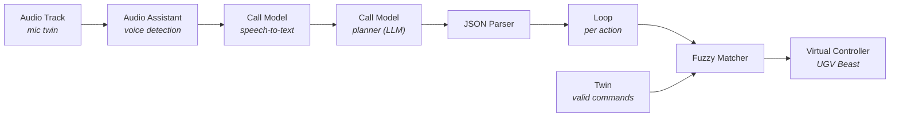

<Warning>
  **Early tutorial (stub).** The flow and node configuration below are complete
  enough to build and test end-to-end. Screenshots and the shareable template
  link will be added as the template is published.
</Warning>

By the end of this tutorial you'll have a Waveshare UGV Beast that listens to a
spoken command, has a model turn it into a short driving plan, and executes that
plan — built **entirely in the visual Workflow editor**, no scripts.

Prefer to build it in Python instead? See the SDK version:
[Control a UGV rover with your voice](/tutorials/ugv-voice-controlled). Same idea,
different surface.

## Architecture at a glance



**The idea:** voice → text → a JSON *plan* → each step is checked against the
commands the rover actually understands → the rover executes it. The model
reasons; a fixed contract controls the motion.

Cyberwave runs the **listening** nodes (Audio Track, Audio Assistant) on the
device and the **thinking** nodes in the cloud — you don't wire that split
yourself.

## Prerequisites

- A **UGV Beast** twin with its **UGV Beast Controller** (teleop) policy assigned.
  See the [UGV Beast get-started](https://cyberwave.com/waveshare/ugv-beast).
- A **microphone** twin that streams audio (this is your voice input).
- Familiarity with the [Workflow editor](/feature-reference/workflows) and the
  [node catalog](/overview/features/workflow-nodes).

---

## Step 1: Create the workflow

Create a new workflow (name it *UGV Rover Voice Agent*) and add both twins to it:
the **microphone** twin (audio in) and the **UGV Beast** twin (the rover to drive).

You'll wire nine nodes left to right. Each node's inputs are set in the inspector —
some are fixed values (`#` tab), some reference another node's output using the
`</>` **expression** tab with `{node-name.output}` syntax.

---

## Step 2: Capture the voice — Audio Track → Audio Assistant

**Audio Track** (the trigger) listens to the microphone and emits short audio clips.

| Field | Value |
|-------|-------|
| Twin | your microphone twin |
| Buffer preset | `speech-to-text` |

**Audio Assistant** trims that stream down to *actual speech* (voice-activity
detection), so the transcriber isn't fed silence.

| Field | Value |
|-------|-------|
| `audio` | `{audio-track.audio}` |
| Modality | `voice_assistant` |

<Check>
  Speak into the mic and open **Executions** — a run should fire, and Audio
  Assistant should show `is_speaking: true` with a captured speech segment.
</Check>

---

## Step 3: Transcribe — Call Model (speech-to-text)

Add a **Call Model** node and pick a speech-to-text model (e.g. *Faster Whisper
Small EN* for English).

| Field | Value |
|-------|-------|
| `audio` | `{audio-assistant.audio}` |
| Model | a speech-to-text model |

Output: `result` = the transcript, e.g. `"back up a little, then turn left"`.

---

## Step 4: Plan — Call Model (planner)

Add a second **Call Model** node and pick a capable cloud LLM or VLM (e.g.
GPT-5.4, Gemini 3 Pro, or Claude). This node turns the sentence into a strict
JSON driving plan.

Set the **Prompt** to **expression** mode (`</>`) and paste the planner prompt
below. The last line pulls in the live transcript with `{call-model.result}`.

<Accordion title="Planner prompt (copy into the Prompt expression field)">

```
You are the drive planner for a Waveshare UGV Beast — a small tracked ground
rover. Turn the operator's spoken request into a JSON drive plan. No chat, no
markdown, no code fences.

# Six actions only
- "forward"    — drive straight ahead for `duration` seconds
- "backward"   — drive straight back for `duration` seconds
- "turn_left"  — rotate left in place for `duration` seconds
- "turn_right" — rotate right in place for `duration` seconds
- "wait"       — sit still for `duration` seconds
- "stop"       — stop immediately (no duration)

# You do NOT control speed — only direction and duration
Speed is fixed and safe. There is no speed/velocity/distance/angle field.
Express "fast" or "far" as a LONGER duration; "a little" as ~1 second.
A ~90 degree turn is about 1.5s; a ~180 degree turn about 3s.

# Output — exactly one JSON object, nothing else
{
  "say": "<one short sentence>",
  "actions": [ { "type": "forward", "duration": 5.0 }, { "type": "stop" } ]
}

# Rules
- 1 to 8 actions; each duration between 0.1 and 10.0 seconds.
- "stop" has no duration.
- If the request is unsafe, ambiguous, or unrelated to driving, still return a
  valid plan — a small conservative move or a single "stop" — and explain in
  "say". NEVER refuse and NEVER return prose.

# Examples
Request: "move forward for 5 seconds"
{"say":"Driving forward for 5 seconds.","actions":[{"type":"forward","duration":5.0}]}
Request: "back up a little, then turn left"
{"say":"Backing up, then turning left.","actions":[{"type":"backward","duration":1.5},{"type":"turn_left","duration":1.5}]}
Request: "stop"
{"say":"Stopping now.","actions":[{"type":"stop"}]}

# The operator's request
"{call-model.result}"
```

</Accordion>

<Note>
  Leave **Image URL** empty. It's for pictures, not text — the transcript belongs
  in the prompt. (Wire Image URL to a camera frame only if you want a vision
  variant.)
</Note>

Output: `result` = the JSON plan as text.

---

## Step 5: Read the plan — JSON Parser

Add a **JSON Parser** to turn the plan text into structured data.

| Field | Value |
|-------|-------|
| `json_data` | `{call-model-2.result}` |
| LLM fix enabled | on |

*LLM fix* repairs the occasional chatty wrapper (`"Sure, here's..."`) around the
JSON so parsing doesn't fail.

---

## Step 6: Know the rover's vocabulary — Twin

Add a **Twin** node pointing at the UGV Beast. It reports the exact commands the
rover accepts — the safe vocabulary you'll match against.

| Field | Value |
|-------|-------|
| Twin | UGV Beast |

Output used later: `control_actuations` (e.g. `move_forward`, `move_backward`,
`turn_left`, `turn_right`, `stop`).

---

## Step 7: Run each step — Loop

Add a **Loop** so the plan's steps execute one at a time.

| Field | Value |
|-------|-------|
| `array_data` | `{json-parser.json_data.actions}` |

<Warning>
  Point `array_data` at the **`actions` list**, not the whole `json_data` object.
  A loop needs an array `[ … ]` to iterate.
</Warning>

The loop exposes `{loop.item}` (the current step) and `{loop.index}` each pass.

---

## Step 8: Guardrail — Fuzzy Matcher

Wire **Loop → Fuzzy Matcher**. This snaps the model's word (`"backward"`) to the
rover's real command (`"move_backward"`), and returns empty if nothing is close —
so a bad transcription can't drive the rover.

| Field | Value |
|-------|-------|
| Uncertain String | `{loop.item.type}` |
| Source of Truth | `{twin.control_actuations}` |
| Advanced → Score Threshold | `80` |

Outputs: `matched` (the real command), `match` (true/false), `score`.

---

## Step 9: Drive — Virtual Controller

Wire **Fuzzy Matcher → Virtual Controller**. This publishes the matched command to
the rover. Use **Virtual Controller** (not Send Controller Command) because it
accepts a *dynamic* command that changes every step.

| Field | Value |
|-------|-------|
| Twin | UGV Beast |
| Command source | **Source Node** → `{fuzzy-matcher.matched}` |
| Controller Policy | UGV Beast Controller |
| High Level Instruction | *(empty)* |

<Note>
  **Motion duration.** Virtual Controller has no duration field, so how long each
  command drives is governed by the UGV Beast Controller policy. Test a single
  `forward` in simulation (Step 10) and confirm the rover moves briefly and
  stops. If it keeps going, add an explicit `stop` step between moves.
</Note>

---

## Step 10: Test in simulation

Switch the toolbar to **SIMULATE** — your voice is real, but the rover drives as a
3D twin in the viewer, so nothing physical can go wrong.

1. Confirm the mic twin is streaming and the Beast is visible in the viewer.
2. Say a single command: *"move forward for three seconds."*
3. Open **Executions → latest run** and walk the nodes:

| Node | Expect |
|------|--------|
| Audio Assistant | `is_speaking: true`, a speech segment |
| Call Model (STT) | `result` = your words |
| Call Model (planner) | valid JSON plan; its input shows the real sentence |
| JSON Parser | parsed `json_data`, no error |
| Loop | ran once (N times for N actions) |
| Fuzzy Matcher | `matched` = a real command, `match: true` |
| Virtual Controller | `Sent: true`, `Matched: true` |

Then work through progressively harder commands:

| Say | Expect |
|-----|--------|
| "turn left" | rotates in place |
| "back up a little, then turn left" | loop runs twice |
| "stop" | halts |
| "what's the weather like?" | plan degrades to `stop` — no random motion |

<Check>
  For *"back up a little, then turn left"* the Loop runs twice, Fuzzy Matcher
  returns `move_backward` then `turn_left`, and the twin reverses then turns in
  the viewer.
</Check>

### Troubleshooting

| Symptom | Likely cause |
|---------|--------------|
| Nothing fires | Mic twin not streaming; workflow not active |
| Stops at Audio Assistant | Only silence captured / VAD threshold too high |
| Transcript wrong or empty | Poor audio, or non-English into an English-only model |
| Planner output isn't JSON | Transcript not injected — check the planner's input; keep JSON Parser's *LLM fix* on |
| Loop runs 0 times | `array_data` not pointing at `…json_data.actions` |
| `matched` empty | `control_actuations` empty, or threshold too high (try 75) |
| Command sent but no motion | Controller policy not assigned, or command isn't a real actuation |

---

## Step 11: Go live

Once simulation is clean, switch the toolbar to **LIVE** to drive the physical
Beast. The graph is unchanged — only the target flips.

---

## The one idea to take away

The model never controls speed, and never sends a command directly to the rover.
It only chooses a **direction** and a **duration**, and every command is validated
against the rover's real vocabulary before it moves. That's what makes an
LLM safe to put in a robot's control loop: **the model reasons, a fixed contract
acts.**

## Next steps

<CardGroup cols={2}>
  <Card title="The SDK version" icon="python" href="/tutorials/ugv-voice-controlled">
    Build the same agent in Python with the Cyberwave SDK.
  </Card>
  <Card title="Workflow nodes" icon="shapes" href="/overview/features/workflow-nodes">
    Every node used here, with inputs, outputs, and where it runs.
  </Card>
  <Card title="Workflows reference" icon="diagram-project" href="/feature-reference/workflows">
    Triggers, the editor, and running in sim or live.
  </Card>
  <Card title="Add a camera (vision)" icon="camera" href="/overview/features/workflow-nodes#perception">
    Wire a camera frame into the planner for obstacle-aware driving.
  </Card>
</CardGroup>
