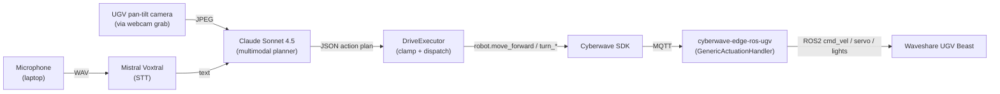

<Warning>
  **Early tutorial.** The flow, decisions, and cross-links below are complete
  enough to follow end-to-end and design against. The reference example folder
  (`nl_ugv_controller`), code blocks, smoke tests, and screenshots will be
  filled in as we build out the implementation. Treat this as the architecture
  contract; the code will land underneath it.
</Warning>

By the end of this tutorial you will have a Waveshare UGV Beast that listens to a spoken English command, looks at its workspace through its pan-tilt camera, and executes a short driving plan written on-the-fly by Claude. No dataset, no VLA training, no per-task scripting. The policy is a system prompt; the safety is your validator.

<Info>
  **Reference implementation.** The full source will live in
  [`nl_ugv_controller`](https://github.com/cyberwave-os/cyberwave-python/tree/main/examples/nl_ugv_controller),
  side by side with the existing
  [`nl_arm_controller`](https://github.com/cyberwave-os/cyberwave-python/tree/main/examples/nl_arm_controller)
  example. The structure mirrors the arm controller deliberately: same five
  modules, same smoke-test layout, same `--check / --voice / --vision / --dry-run`
  CLI surface.
</Info>

## Architecture at a glance



<Info>
  **Who provides what.** Cyberwave provides: digital twin, Python SDK, MQTT
  transport, edge ROS2 driver, Live Mode, the unified `actuation` command
  surface. You provide: the laptop, a microphone, API keys for Anthropic Claude
  and Mistral Voxtral, and a UGV Beast already paired to your environment.
</Info>

---

## Goals and scope

**What you'll build.** A laptop-side REPL that takes a voice command (hold SPACE to talk), grabs a frame from the UGV's pan-tilt camera, sends both to Claude as one multimodal request, parses the JSON action plan it returns, validates and clamps it, and runs it on the UGV through the same MQTT control plane the **UGV Beast Controller** already uses today.

**In scope**

- A single Waveshare UGV Beast in a known indoor space (open floor or a marked lane).
- Push-to-talk voice from your laptop and the UGV's onboard pan-tilt camera as the vision source.
- A bounded vocabulary of discrete driving actions: short forward/backward translations, in-place turns, camera pan and tilt, lights, and stop.
- Visual Q&A grounded in the live frame ("what do you see?", "is the door open?"), with optional visually-grounded short drives ("drive toward the box").

**Out of scope (follow-up tutorials)**

- Metric-accurate navigation, SLAM, or waypoint following. This agent reasons in seconds-of-motion, not metres-on-a-map.
- Continuous control via a learned VLA. That's a separate tutorial that records UGV teleoperation demonstrations and finetunes a Vision-Language-Action model on them; see [Next steps](#next-steps).
- Always-on wake word, multi-turn dialogue, dialog memory, or on-robot STT (the Pi-side variant is a follow-up).
- Outdoor / unstructured / GPS-denied terrain.

**Success criteria.** End-to-end latency under 5 seconds per turn. The UGV completes the commanded short drive, camera move, or scene description on at least 9 of 10 attempts across your six demo prompts, with zero collisions across a 20-prompt run.

---

## Prerequisites

This tutorial starts from a UGV Beast that you can already drive with the **UGV Beast Controller** (the bespoke keyboard policy bundled with the rover, *not* the generic Keyboard controller). Do not skip that base setup; everything below assumes it is in place.

- **Hardware**: Waveshare UGV Beast (Jetson Orin or Pi variant), microphone on the laptop (built-in is fine), and the UGV's stock pan-tilt USB camera.
- **Credentials**: Cyberwave API key, twin and environment UUIDs, Anthropic API key, Mistral API key.
- **Base setup**: [UGV Beast hardware get-started](/hardware/ugv/get-started) (pair the twin, install Cyberwave Edge, verify control with the **UGV Beast Controller**).
- **SDK baseline**: [Python SDK](/overview/tools/python-sdk).
- **Conceptual grounding**: [Key Concepts](/feature-reference/architecture/key-concepts), [Voice as a Sensor](/hardware/microphone/get-started). The arm-side sibling tutorial [SO-101 NL Voice + Vision Agent](/tutorials/so101-natural-language-agent) covers the same five-module pattern on a manipulator if you want a working reference to read alongside this one.

<Check>
  You're ready for this tutorial when the **UGV Beast Controller** drives your
  physical UGV forward / backward / turn in place from W / A / S / D, the
  pan-tilt camera responds to I / J / K / L, and the camera's video stream is
  live in the environment viewer.
</Check>

---

## Project layout

The reference example will live at `cyberwave-os/cyberwave-python/examples/nl_ugv_controller`, alongside the existing arm controller. Same five-module shape, same smoke-test discipline:

```
nl_ugv_controller/
├── nl_ugv_controller.py   # orchestrator: agent loop, config, CLI flags
├── drive.py               # ActionPlan dataclass, validation, DriveExecutor
├── planner.py             # Claude text + vision planner, JSON parser
├── vision.py              # frame grab from the UGV pan-tilt camera, base64 JPEG
├── voice.py               # spacebar push-to-talk, Voxtral STT
├── requirements.txt
├── .env.example
└── smoke_tests/           # one self-contained script per dependency (01–08)
```

Each module is independent. That's why each one gets its own smoke test: if a piece breaks, you isolate it in seconds instead of debugging the whole pipeline.

---

## Step 1: Set up the Cyberwave environment

Before you build the agent, you need a working UGV Beast twin and a Cyberwave environment with the edge driver running. The full reference is in the [UGV Beast hardware get-started](/hardware/ugv/get-started). The short version:

1. Create a new environment in the [Cyberwave dashboard](https://cyberwave.com/dashboard) and **Add from Catalog → UGV Beast** to create the twin with the right capabilities pre-configured.
2. SSH into the rover's compute board, disable Waveshare's stock orchestration, install Cyberwave Edge, and pair the twin.
3. Confirm the pan-tilt camera streams in the environment viewer and the UGV Beast Controller drives the wheels.
4. Note the **environment UUID** and **twin UUID** from the dashboard. You'll paste them into `.env` in [Step 3](#step-3-develop-your-agent).

<Check>
  The twin appears in the dashboard, the pan-tilt camera is streaming, the
  battery telemetry is updating, and the UGV Beast Controller in Live Mode
  moves the physical rover.
</Check>

---

## Step 2: Verify the UGV Beast Controller path

The agent will speak exactly the same vocabulary the UGV Beast Controller speaks today. Proving that controller end-to-end before you wire in any LLM rules out four moving parts (calibration, pairing, MQTT, edge driver) in two minutes, and it validates the precise set of `actuation` strings the planner will emit.

1. Open your environment and switch to **Live Mode**.
2. Select the UGV Beast twin and click **Assign Controller**.
3. Pick the **UGV Beast Controller** from the controller list (not the generic "Keyboard" controller; the UGV one is the rover-specific policy with the right key bindings and widgets pre-wired). The rover is now driven from your browser.
4. Drive each binding once: **W / A / S / D** for forward / left / back / right, **I / J / K / L** for camera tilt up / pan left / tilt down / pan right, **U** to recentre the camera, **F** and **R** to toggle the chassis and camera lights, **E** to take a photo, **B** to refresh the battery widget. If the physical rover responds on every key, the entire cloud-to-edge path is healthy and the full action vocabulary works.

<Tip>
  **Why this specific controller, not the generic Keyboard one?** The UGV Beast
  Controller (catalog key `controller:ugv-beast:v1`) is purpose-built for this
  rover. Each of its keys is bound to an `actuation` string (`move_forward`,
  `turn_left`, `camera_up`, `chassis_light_toggle`, `take_photo`, `battery_check`,
  and so on) that the edge
  [`GenericActuationHandler`](https://github.com/cyberwave-os/cyberwave-edge-nodes/blob/main/cyberwave-edge-ros-ugv/mqtt_bridge/plugins/ugv_beast_command_handler.py)
  consumes directly. **The agent in this tutorial emits the exact same
  strings.** So once W / A / S / D / I / J / K / L / F / R / E / B all work
  through the UGV Beast Controller, you've already proved every action verb
  the planner is allowed to produce.
</Tip>

<Check>
  You're done with Step 2 when every binding on the UGV Beast Controller moves
  the physical rover or updates a widget, and a one-liner Python script using
  `cw.twin("waveshare/ugv-beast", ...).move_forward(distance=0.3)` also moves
  it. The platform automatically swaps the UGV Beast Controller for the SDK
  session when your script connects, so you don't need to manually unassign
  anything.
</Check>

---

## Step 3: Develop your agent

The agent is five small modules on your laptop, each owning one transform. Build and smoke-test them one at a time, then orchestrate.

| Module                  | Input                        | Output                            | External service   |
| ----------------------- | ---------------------------- | --------------------------------- | ------------------ |
| `voice.py`              | Mic audio (while SPACE held) | Transcribed text                  | Mistral Voxtral    |
| `vision.py`             | UGV pan-tilt camera          | Base64 JPEG                       | n/a (local OpenCV) |
| `planner.py`            | Text + base64 JPEG           | Validated `ActionPlan`            | Anthropic Claude   |
| `drive.py`              | `ActionPlan`                 | Clamped SDK calls / MQTT actions  | Cyberwave SDK      |
| `nl_ugv_controller.py`  | CLI flags                    | Agent loop wiring it all together | n/a                |

### 3.1 Voice as an input modality

`voice.py` is a push-to-talk mic recorder plus a Mistral Voxtral STT call. Hold SPACE to record, release to transcribe. Output is plain text.

- **Recording**: `sounddevice` captures 16-bit PCM at 16 kHz; `pynput` listens for the spacebar press and release. The recorder writes a temporary WAV to disk and shows a live RMS meter so you can see whether the mic is hot.
- **Transcription**: the WAV is POSTed to the Voxtral endpoint. Voxtral is OpenAI-Whisper-compatible at the API level, so swapping providers later is one URL change.
- **Failure modes**: too-short recordings, silent recordings, and STT errors all return an empty string. The orchestrator treats empty input as "skip this turn" rather than crashing.

<Tip>
  **Voice does not reach Claude directly.** The path is audio, then Voxtral,
  then text, then Claude. Claude is a text-and-image model; the speech-to-text
  step is mandatory.
</Tip>

### 3.2 Vision as an input modality

`vision.py` grabs a frame from the UGV's pan-tilt camera and returns a base64-encoded JPEG ready to drop into a Claude `image` content block. No model runs locally; OpenCV is just for capture and JPEG encoding.

There are two viable capture paths and the example will pick one based on whether you're running the agent on your laptop or on the rover's compute board:

- **Laptop-side agent**: open the UGV camera over the network from the existing video stream that Cyberwave's edge driver already exposes (the same stream the dashboard renders).
- **On-rover agent**: open `/dev/video0` directly with `cv2.VideoCapture`, mirroring the arm tutorial.

Whichever path is used, the public API of `vision.py` is the same single call: `grab_frame_b64()` returns a base64 JPEG or `None`. A failed grab falls back to text-only Claude calls for that turn so the agent stays usable when the camera is down.

### 3.3 VLM as the planner

`planner.py` calls Anthropic Claude Sonnet 4.5 with a system prompt, the user transcript, and (optionally) a base64 JPEG. It returns a validated `ActionPlan` or a structured error.

The action vocabulary is intentionally small and one-to-one with the verbs the edge `GenericActuationHandler` already accepts. Every action the planner can emit is a command the rover already knows how to execute:

| Category | Allowed actions | Argument |
| -------- | --------------- | -------- |
| Locomotion | `move_forward`, `move_backward` | `distance` (metres, capped) |
| Locomotion | `turn_left`, `turn_right` | `angle` (radians, capped) |
| Locomotion | `stop`, `wait` | `duration` (seconds, capped); `stop` takes none |
| Camera servo | `camera_up`, `camera_down`, `camera_left`, `camera_right`, `camera_default` | none (one step per call) |
| Lights | `chassis_light_toggle`, `camera_light_toggle` | none |
| Utilities | `take_photo`, `battery_check` | none |

The whole tutorial hinges on Claude returning a strict, machine-parseable plan, not prose. Three layers do this before any code parses anything:

1. **Pin the schema in the system prompt.** The system prompt documents every action verb, its argument shape, and its allowed range; lists three to five few-shot examples covering pure description, pure motion, and visually-grounded motion; and forbids markdown, code fences, or any prose outside the JSON object.
2. **Use a low temperature.** Call Claude with `temperature=0.2`: deterministic enough for consistent JSON, not so cold that the model loops on a phrasing it doesn't like.
3. **Cap `max_tokens`.** A typical plan is well under 200 output tokens; capping at 400 (text-only) or 500 (vision) bounds cost, latency, and worst-case output length all at once.

The vision-aware prompt adds **decision rules**: questions about the scene get an empty `actions` array; explicit motion commands get motion; visually-grounded motion ("drive toward the red box") gets a short, conservative drive plus a stop, with the rationale spoken in the plan's `say` field; references to things the camera doesn't see get an honest "no, I don't see that" and an empty `actions` array.

**Treat the LLM as untrusted input.** The LLM is the brain; safety is your code. Five layers, defense-in-depth:

1. **Prompt constraints** shape the output before it's generated (above).
2. **Defensive parser** strips markdown fences, recovers from leading or trailing prose, and returns `(None, error)` on any failure. Never raises.
3. **Schema validation** rejects unknown action verbs, missing arguments, negative or excessive distances and angles, and plans with more than the configured maximum number of actions. All-or-nothing: any single error means the entire plan is rejected and the rover doesn't move.
4. **Per-action clamping** squeezes every distance and angle into a conservative envelope right before the SDK call. If Claude emits `distance: 99`, the rover receives the configured per-action ceiling (for example, 1.0 m). The rover is physically incapable of executing an out-of-range request.
5. **Try/except containment**: any executor exception triggers an immediate `stop` and the loop continues. `Ctrl+C` always reaches a `finally` block that issues a `stop` and disconnects cleanly.

<Warning>
  Distance and angle ceilings in `drive.DEFAULT_LIMITS` will be set
  *conservatively* by default: for example, ≤ 1.0 m per forward and backward
  step, ≤ π rad per in-place turn, and a maximum of eight actions per plan.
  Wide enough to look intentional on a public-demo rover; narrow enough that
  a worst-case hallucinated value can't drive the rover into anything before
  the next planning turn. Loosen at your own risk and only after you've added
  obstacle-avoidance gating.
</Warning>

### 3.4 Orchestrate it together

`drive.py` and `nl_ugv_controller.py` close the loop. The executor turns validated plans into SDK calls; the orchestrator owns the agent loop.

**One verb, one SDK call (mostly).** The locomotion verbs map one-to-one onto the existing Twin SDK helpers:

- `move_forward` → `robot.move_forward(distance=...)`
- `move_backward` → `robot.move_backward(distance=...)`
- `turn_left` → `robot.turn_left(angle=...)`
- `turn_right` → `robot.turn_right(angle=...)`
- `stop` → a zero-velocity `move_forward(distance=0.0)`

These helpers already publish to `cyberwave/twin/{uuid}/command` with `source_type` set correctly for simulation or real-world via `cw.affect()`. The camera-servo, lights, and utility verbs don't have one-liner SDK helpers; the executor publishes the same MQTT payload shape the UGV Beast Controller emits today, which the edge `GenericActuationHandler` already consumes. Either way, **the agent never invents a new control surface**. It speaks the protocol the rover already speaks.

**The agent loop** (in `nl_ugv_controller.py`):

1. Wait for input. With `--voice`, hold SPACE to record. Without, type at the REPL.
2. If `--vision`, grab a UGV camera frame.
3. Send transcript and (optional) frame to Claude.
4. Parse, validate, and clamp the returned plan.
5. Hand it to the executor; the executor dispatches the clamped actions through the SDK and MQTT.
6. Print latency for each step. Loop.

_Expansion point: a kill-switch keyword (`"stop"`, `"halt"`, `"freeze"`) detected before the planner call, dispatching a direct `stop` over MQTT without waiting for Claude. Not wired in yet, but the orchestrator's input hook is the right place for it._

---

## Step 4: Run it live

<Steps>
  <Step title="Pre-flight">
    Run the environment self-check, then the smoke tests in order:
    SDK + UGV (drive forward 0.3 m and stop), Claude planner, Voxtral STT,
    spacebar capture, the executor against a hand-written plan, the camera
    frame grab (open the saved JPEG to confirm framing and lighting), and
    finally the vision-grounded planner against your workspace. Each smoke
    test isolates one layer. Fix any failures here, not during a demo.
  </Step>
  <Step title="Clear the lane">
    Move the rover to the start of a marked lane on the floor. No people,
    pets, or cables within the rover's reachable workspace for the next
    planning turn (about 1 m and one in-place turn at default ceilings).
  </Step>
  <Step title="Launch the agent">
    Start the orchestrator with `--voice --vision`. Wait for the banners
    confirming the SDK is connected, the camera is ready, and the planner
    has been initialised.
  </Step>
  <Step title="Speak a command">
    Hold SPACE, say *"drive forward a little, then turn right"*, release.
    Watch the terminal print the transcript, the planner latency, and the
    JSON plan, then watch the rover execute it and stop.
  </Step>
  <Step title="Try vision-grounded prompts">
    *"What do you see in front of you?"*: expect a description, **no
    motion**. *"Is there a box ahead?"*: expect a yes/no grounded in the
    actual frame. *"Drive toward the box."*: expect a short forward plus a
    final `stop`, with the rationale spoken in the plan's `say` field.
  </Step>
  <Step title="Exit cleanly">
    Say or type `bye`, or press `Ctrl+C`. The `finally` block always issues
    a `stop` before disconnecting.
  </Step>
</Steps>

**Six prompts that exercise every code path**: `stop`, `drive forward a little`, `turn right`, `look up`, `what do you see?`, `drive toward the box`.

---

## Safety and operational notes

- **Default to dry-run while iterating.** The `--dry-run` flag runs the entire pipeline (voice, vision, planning, validation) and prints the clamped plan without ever publishing to MQTT. Use it whenever you're changing the prompt or the executor.
- **Physical E-stop.** Keep one reachable. Software-only stops are for convenience, not safety.
- **Simulation first after any change.** After any change to the prompt, the planner, or the executor, run the new flow against the digital twin in `cw.affect("simulation")` before the physical rover. The same code drives both.
- **Lane discipline.** Per-action distance and angle ceilings only protect against worst-case single actions. A plan with eight maximal forward steps will still travel up to 8 m. Run in a marked, cleared lane until you trust your prompt.
- **What invalidates your setup**: the pan-tilt camera moved, lighting changed dramatically since you last took a reference frame, or the rover was repaired or recalibrated. Re-run smoke tests 01 and 07 before resuming.

---

## Next steps

Each of these is a follow-up tutorial's worth of work. Pick one after you hit the success criteria from [Goals and scope](#goals-and-scope).

- **Train a VLA on UGV teleop demos.** When you need learned, continuous-control behaviour instead of discrete verbs (smoother trajectories, better grounded navigation), record teleoperated episodes with Cyberwave's data-recording infrastructure and finetune a Vision-Language-Action model on them. The arm side of this lives at [SO-101 Voice Pick-and-Place](/tutorials/so101-voice-pick-and-place); the UGV equivalent will land as its own page.
- **Autonomous navigation primitives.** Replace per-action `distance` and `angle` with goal-oriented verbs like `navigate_to(waypoint)` once you have a map. Pairs naturally with [Rover AI Inspection](/tutorials/rover-ai-mission).
- **On-rover microphone (Pattern B).** Mic on the rover, STT on the edge, transcripts recorded as telemetry. See [Voice as a Sensor](/hardware/microphone/get-started).
- **Local STT and local VLM.** Swap Voxtral for the SDK's bundled Whisper runtimes and Claude for a local VLM via Ollama for a fully on-device agent.
- **Wake-word gating** with a sub-200 ms `"stop"` channel published directly on MQTT, bypassing the main planner.
- **Workflow integration.** Trigger Cyberwave Workflows from natural language. See [Workflows](/feature-reference/workflows).

---

## Reference

- **Example folder** (forthcoming): `cyberwave-os/cyberwave-python/examples/nl_ugv_controller`.
- **Edge action surface**: [`GenericActuationHandler`](https://github.com/cyberwave-os/cyberwave-edge-nodes/blob/main/cyberwave-edge-ros-ugv/mqtt_bridge/plugins/ugv_beast_command_handler.py): the canonical list of UGV verbs the agent is allowed to emit.
- **SDK calls used**: `Cyberwave()`, `cw.affect()`, `cw.twin("waveshare/ugv-beast", ...)`, `robot.move_forward()`, `robot.move_backward()`, `robot.turn_left()`, `robot.turn_right()`. See [Python SDK](/overview/tools/python-sdk).
- **MQTT topics published by the SDK**: `cyberwave/twin/{uuid}/command` with `source_type` set to `tele` (real-world) or `sim_tele` (simulation). See [MQTT API](/api-reference/mqtt/main).
- **External services**: [Anthropic Claude Sonnet 4.5](https://docs.anthropic.com), [Mistral Voxtral](https://docs.mistral.ai).
- **Sibling tutorial**: [SO-101 NL Voice + Vision Agent](/tutorials/so101-natural-language-agent): same five-module pattern on a manipulator. The first place to look while you wait for the reference code under this tutorial to land.
- **Cross-links**: [UGV Beast hardware get-started](/hardware/ugv/get-started), [Voice as a Sensor](/hardware/microphone/get-started), [Key Concepts](/feature-reference/architecture/key-concepts), [Teleoperation](/feature-reference/environment-editor/teleoperation), [Simulation](/overview/features/simulation).
