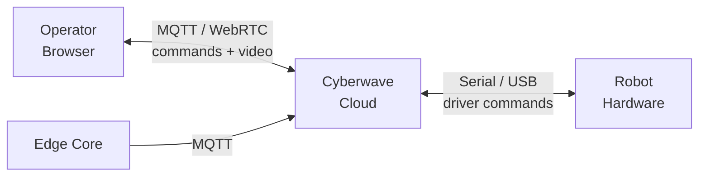

## What is Live Teleoperation?

Live Teleoperation lets you control a physical robot in real time through its [digital twin](/use-cyberwave/digital-twins) in the Cyberwave dashboard. Operator inputs — keyboard, gamepad, or SDK commands — are sent to the robot via Cyberwave's low-latency MQTT and WebRTC infrastructure, while live video and telemetry stream back to the browser.

<Info>
Teleoperation requires a physical robot connected through [Cyberwave Edge](/edge/overview). The Edge Core bridges your hardware to the cloud in real time.
</Info>

---

## How It Works

<CardGroup cols={3}>
  <Card title="1. Operator Input" icon="keyboard">
    Send commands from the dashboard UI, a keyboard/gamepad controller, or the [Python SDK](/sdks/python-sdk) using `cw.affect("live")`.
  </Card>

  <Card title="2. Cloud Relay" icon="cloud">
    Cyberwave routes commands through MQTT to the Edge Core running on the robot's host machine.
  </Card>

  <Card title="3. Robot Execution" icon="robot">
    The Edge Core translates commands into hardware-level actions and streams sensor data back.
  </Card>
</CardGroup>



---

## Supported Control Methods

| Method | Description |
|---|---|
| **Keyboard controller** | Assign a keyboard controller to a twin in the dashboard — move joints or navigate with key bindings |
| **Gamepad** | Use a USB or Bluetooth gamepad for more intuitive control of mobile robots and arms |
| **Leader arm** | Teleoperate a follower arm using a physical leader arm (e.g. SO101 leader/follower setup) |
| **Python SDK** | Send commands programmatically with `cw.affect("live")` — see the [SDK docs](/sdks/python-sdk#affect-simulation-vs-live-environment) |

---

## Switching Between Simulation and Live

The same [environment](/use-cyberwave/environment-editor) supports both modes. In **Simulation** mode, your actions affect the digital twin only. Switch to **Live** mode to drive the physical robot.

**From the dashboard:** use the mode toggle in the environment header.

**From the SDK:**

```python
from cyberwave import Cyberwave

cw = Cyberwave()

cw.affect("simulation")
robot = cw.twin("the-robot-studio/so101")
robot.joints.set("shoulder_pan", 45, degrees=True)  # moves the digital twin

cw.affect("live")
robot.joints.set("shoulder_pan", 45, degrees=True)  # moves the physical robot
```

---

## Live Video Streaming

During teleoperation, live camera feeds from the robot are streamed via WebRTC directly into the dashboard. You can view one or multiple camera feeds alongside the 3D digital twin view.

Supported camera types:
- **Standard cameras** (USB/CSI via OpenCV)
- **Intel RealSense** (RGB + depth)

See the [Python SDK video streaming docs](/sdks/python-sdk#video-streaming-webrtc) for details on setting up camera streams from edge devices.

---

## Prerequisites

<Steps>
  <Step title="Digital Twin configured">
    Create a [digital twin](/use-cyberwave/digital-twins) for your robot in an [environment](/use-cyberwave/environment-editor).
  </Step>
  <Step title="Edge Core installed">
    Install and configure [Cyberwave Edge](/edge/overview) on the machine connected to the robot hardware.
  </Step>
  <Step title="Hardware paired">
    Pair the physical robot with the digital twin via the CLI — see the [Quick Start](/get-started/quickstart#part-2-connect-real-hardware).
  </Step>
</Steps>

---

## Latency

A small delay between operator input and robot response is expected in any teleoperation system. See [Live Teleoperation Latency](/use-cyberwave/teleoperation-latency) for details on what to expect and why.

---

## Video Walkthroughs

<CardGroup cols={2}>
  <Card
    title="Go2 Digital to Physical"
    icon="dog"
    href="/tutorials/go2-digital-to-physical"
  >
    End-to-end: catalog to physical robot deployment with a Unitree Go2
  </Card>
  <Card
    title="Rover AI Inspection"
    icon="robot"
    href="/tutorials/rover-ai-mission"
  >
    Autonomous rover mission with AI-driven analysis in simulation
  </Card>
</CardGroup>

---

## Next Steps

<CardGroup cols={3}>
  <Card
    title="Python SDK"
    icon="code"
    href="/sdks/python-sdk"
  >
    Full SDK reference for live robot control
  </Card>
  <Card
    title="Digital Twins"
    icon="clone"
    href="/use-cyberwave/digital-twins"
  >
    Configure twin capabilities and sensors
  </Card>
  <Card
    title="Workflows"
    icon="diagram-project"
    href="/use-cyberwave/workflows"
  >
    Automate operations with visual workflows
  </Card>
</CardGroup>
