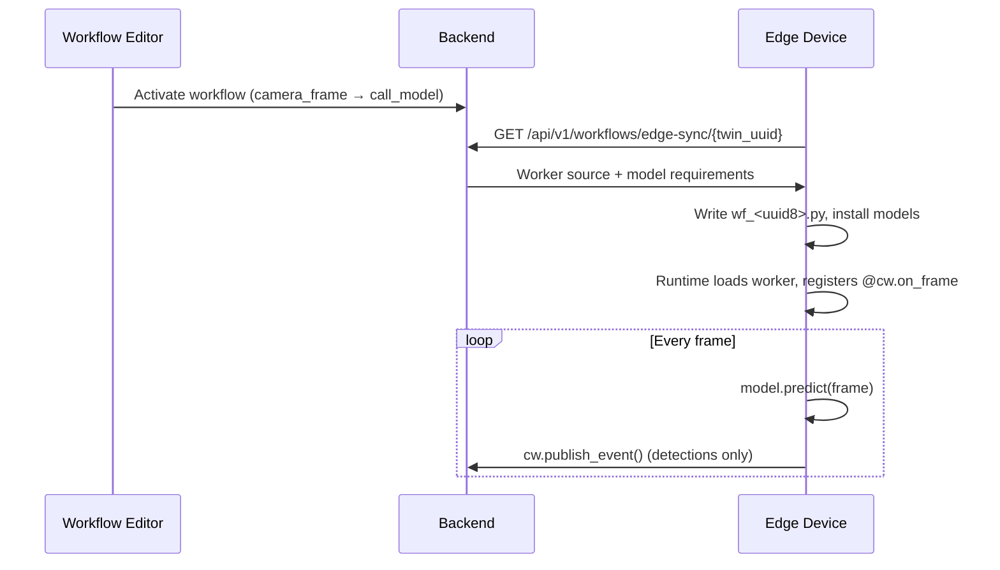
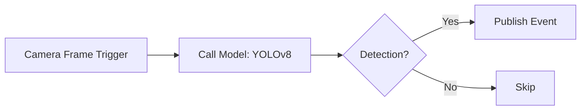

## What are Workflows?

Workflows in Cyberwave let you create automated sequences of robot operations. Connect nodes visually to build complex behaviors without writing procedural code.

Workflows can run **on the cloud** (Celery tasks) or **on the edge device** depending on the trigger type. Cloud triggers handle schedule, webhook, event, and manual execution. The `camera_frame` trigger runs ML inference directly on the edge — no video leaves the device.

---

## Workflow Components

### Nodes

Nodes are the building blocks of workflows. Each node performs a specific action:

<CardGroup cols={2}>
  <Card title="Trigger Nodes" icon="bolt">
    Start the workflow: manual, schedule, webhook, event, MQTT, email, or camera_frame (edge)
  </Card>
  <Card title="Call Model Nodes" icon="brain">
    Run ML inference — cloud VLM/LLM or edge-local object detection
  </Card>
  <Card title="Twin Nodes" icon="robot">
    Control digital twin position, rotation, and state
  </Card>
  <Card title="Joint Nodes" icon="gear">
    Set individual joint positions or run trajectories
  </Card>
  <Card title="Condition Nodes" icon="code-branch">
    Branch based on sensor data, twin state, or model results
  </Card>
  <Card title="Delay Nodes" icon="clock">
    Add timing between operations
  </Card>
</CardGroup>

### Connections

Connections define the execution flow between nodes:
- **Sequential**: Execute nodes one after another
- **Parallel**: Execute multiple nodes simultaneously
- **Conditional**: Branch based on conditions

<Info>
Connection validation prevents invalid graphs: trigger nodes cannot accept incoming connections, cycles are blocked, and `camera_frame` triggers can only connect to `call_model` nodes.
</Info>

---

## Trigger Types

| Trigger | Where it runs | How it fires |
|---------|--------------|-------------|
| **Manual** | Cloud (Celery) | User clicks "Run" in the UI or triggers via SDK/API |
| **Schedule** | Cloud (Celery) | Cron or interval timer |
| **Webhook** | Cloud (Celery) | HTTP POST to a webhook URL |
| **Event** | Cloud (Celery) | Business event matching conditions |
| **MQTT** | Cloud (Celery) | MQTT message on a topic |
| **Email** | Cloud (Celery) | Incoming email |
| **Camera Frame** | **Edge device** | Every camera frame, locally — never sends video to the cloud |

---

## Creating a Workflow

<Tabs>
  <Tab title="Dashboard">
    <Steps>
      <Step title="Open Workflows">
        Navigate to **Workflows** in the dashboard.
      </Step>
      <Step title="Create">
        Click **Create Workflow**. Give it a name, optional slug (unique within the workspace), and visibility.
      </Step>
      <Step title="Build">
        Drag nodes from the palette to the canvas. Connect nodes by dragging from output to input ports.
      </Step>
      <Step title="Configure">
        Configure each node's parameters (twin UUID, model, confidence threshold, emit_event settings, etc.).
      </Step>
      <Step title="Activate">
        Click **Activate**. For edge workflows, sync to the device with the CLI or wait for the next automatic sync.
      </Step>
    </Steps>
  </Tab>
  <Tab title="CLI">
    ```bash
    # List workflows
    cyberwave workflow list
    cyberwave workflow list --json

    # Create from template
    cyberwave workflow create --template motion-detection

    # Create with custom name
    cyberwave workflow create -n "My Workflow"

    # Show workflow details (interactive selection if UUID omitted)
    cyberwave workflow show
    cyberwave workflow show <uuid>

    # Activate / deactivate
    cyberwave workflow activate
    cyberwave workflow deactivate

    # Sync workflow to edge node(s)
    cyberwave workflow sync
    cyberwave workflow sync <uuid> --base-url http://192.168.10.101:8000

    # Delete
    cyberwave workflow delete --yes
    ```

    All subcommands accept `--base-url` / `-u` to override the API URL. When a UUID argument is omitted, an interactive arrow-key selector is shown.
  </Tab>
  <Tab title="Python SDK">
    ```python
    from cyberwave import Cyberwave

    cw = Cyberwave(api_key="your_api_key")

    workflows = cw.workflows.list()

    run = cw.workflows.trigger("workflow-uuid", inputs={"speed": 0.5})
    run.wait(timeout=60)
    print(f"Workflow finished: {run.status}")
    ```
  </Tab>
</Tabs>

---

## Edge Workflows (Camera Frame)

The `camera_frame` trigger is designed for on-device ML inference. The backend generates a Python worker file that runs directly on the edge — raw video frames never leave the device.

### How it works



### emit_event configuration

The `call_model` node's `emit_event` parameter controls when detection events are published back to the cloud. All settings are baked into the generated worker at codegen time.

| Field | Type | Default | Description |
|-------|------|---------|-------------|
| `enabled` | bool | `true` | Set to `false` to run inference without publishing events |
| `event_type` | string | `"detection"` | Business event type published to the cloud |
| `severity` | string | `"INFO"` | Event severity (`INFO`, `WARNING`, `CRITICAL`) |
| `emit_mode` | string | `"always"` | Controls when events fire (see below) |
| `cooldown_seconds` | float | `5.0` | Minimum seconds between consecutive events |

**emit_mode values:**

- **`always`** — publishes for every detection, subject to cooldown. Skips frames with no results.
- **`on_enter`** — publishes only when new object classes appear that were not in the previous frame. Useful for "person entered the zone" alerts.
- **`on_change`** — publishes only when the detection count changes. Useful for occupancy tracking.

### Syncing to the edge

After activating a workflow in the UI, push it to edge devices:

```bash
# Interactive: picks the workflow, discovers target twins, sends sync via MQTT
cyberwave workflow sync

# Explicit
cyberwave workflow sync <workflow-uuid>

# Or sync a specific twin directly
cyberwave edge sync-workflows --twin-uuid <twin-uuid>
```

The CLI sends a `sync_workflows` command via MQTT. Edge core receives it and immediately pulls the latest worker files from the backend — no need to wait for the periodic cycle.

The edge device also syncs automatically on boot and periodically (default ~5 min, configurable via `CYBERWAVE_WORKER_SYNC_INTERVAL_LOOPS`).

---

## Execution Modes

Workflows can be triggered by:

| Trigger | Description |
|---|---|
| **Manual** | Run on demand from the dashboard or SDK |
| **Schedule** | Run at specific times (cron) |
| **Events** | Run when sensor data matches conditions |
| **API** | Trigger from external systems via REST or MCP |
| **Camera Frame** | Run on every camera frame at the edge device |

---

## Monitoring Executions

Track workflow execution status and results:

```python
runs = cw.workflow_runs.list(workflow_uuid="workflow-uuid")

for run in runs:
    print(f"Status: {run.status}, Started: {run.started_at}")
```

Each execution tracks status at both the workflow level and individual node level, including `started_at`, `finished_at`, and `error_message` fields.

### Check if a Workflow is Running

Use `is_running()` to quickly check if a workflow has any active execution without manually querying runs:

```python
wf = cw.workflows.get("workflow-uuid")
if wf.is_running():
    print("Workflow is currently executing")
```

This returns `True` when any run has status `running`, `waiting`, or `requested`.

In the dashboard, a **Running** indicator appears next to the Active badge in the workflow editor header whenever the workflow has an active execution. It refreshes automatically every 2 seconds.

---

## Example: Edge Detection Workflow

A camera_frame workflow that runs YOLO on the edge and emits alerts:



---

## Best Practices

- **Keep workflows focused** — create separate workflows for distinct operations rather than one large workflow. This makes debugging and maintenance easier.
- **Add error handling** — include condition nodes to handle failure cases gracefully. Consider what should happen if a joint can't reach its target.
- **Use meaningful names** — name nodes and workflows descriptively. "Alert on person in zone A" is better than "Node 1".
- **Use `on_enter` emit mode for alerts** — avoids flooding with repeated events while the same object stays in frame.
- **Set appropriate cooldowns** — balance between responsiveness and event volume. 5s is a safe default; lower for time-critical use cases.
- **Eject before customising** — never edit `wf_*.py` files directly. Copy them to a custom name and deactivate the originating workflow.
