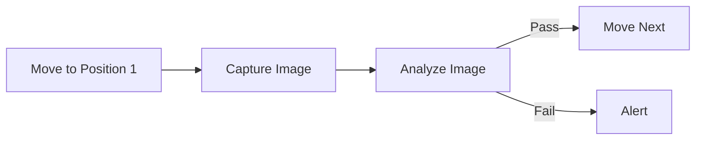

## What are Workflows?

Workflows in Cyberwave let you create automated sequences of robot operations. Connect nodes visually to build complex behaviors without writing procedural code.

<Info>
Workflows run on Cyberwave's cloud infrastructure, ensuring reliable execution even when your local machine is offline.
</Info>

---

## Workflow Components

### Nodes

Nodes are the building blocks of workflows. Each node performs a specific action:

<CardGroup cols={2}>
  <Card title="Twin Nodes" icon="robot">
    Control digital twin position, rotation, and state
  </Card>
  <Card title="Joint Nodes" icon="gear">
    Set individual joint positions or run trajectories
  </Card>
  <Card title="Condition Nodes" icon="code-branch">
    Branch based on sensor data or twin state
  </Card>
  <Card title="Delay Nodes" icon="clock">
    Add timing between operations
  </Card>
</CardGroup>

### Connections

Connections define the execution flow between nodes:
- **Sequential**: Execute nodes one after another
- **Parallel**: Execute multiple nodes simultaneously
- **Conditional**: Branch based on conditions

---

## Creating a Workflow

<Tabs>
  <Tab title="Dashboard">
    <Steps>
      <Step title="Open Workflows">
        Navigate to **Workflows** in the dashboard.
      </Step>
      <Step title="Create">
        Click **Create Workflow**.
      </Step>
      <Step title="Build">
        Drag nodes from the palette to the canvas. Connect nodes by dragging from output to input ports.
      </Step>
      <Step title="Configure">
        Configure each node's parameters (twin UUID, joint values, conditions, etc.).
      </Step>
      <Step title="Run">
        Click **Save** and **Run**.
      </Step>
    </Steps>
  </Tab>
  <Tab title="Python SDK">
    ```python
    from cyberwave import Cyberwave

    cw = Cyberwave(api_key="your_api_key")

    workflows = cw.workflows.list()

    run = cw.workflows.trigger("workflow-uuid", inputs={"speed": 0.5})
    run.wait(timeout=60)
    print(f"Workflow finished: {run.status}")
    ```
  </Tab>
</Tabs>

---

## Execution Modes

Workflows can be triggered by:

| Trigger | Description |
|---|---|
| **Manual** | Run on demand from the dashboard or SDK |
| **Schedule** | Run at specific times (cron) |
| **Events** | Run when sensor data matches conditions |
| **API** | Trigger from external systems via REST or MCP |

---

## Monitoring Executions

Track workflow execution status and results:

```python
runs = cw.workflow_runs.list(workflow_uuid="workflow-uuid")

for run in runs:
    print(f"Status: {run.status}, Started: {run.started_at}")
```

Each execution tracks status at both the workflow level and individual node level, including `started_at`, `finished_at`, and `error_message` fields.

---

## Example: Inspection Workflow

A typical inspection workflow that captures an image, runs detection, and branches based on results:



---

## Best Practices

- **Keep workflows focused** — create separate workflows for distinct operations rather than one large workflow. This makes debugging and maintenance easier.
- **Add error handling** — include condition nodes to handle failure cases gracefully. Consider what should happen if a joint can't reach its target.
- **Use meaningful names** — name nodes and workflows descriptively. "Move to inspection position" is better than "Node 1".
