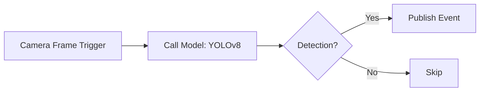

## What are Workflows?

Workflows in Cyberwave let you create automated sequences of robot operations. Connect nodes visually to build complex behaviors without writing procedural code.

Workflows run either **on the cloud** (Celery tasks — for manual, schedule, webhook, event, MQTT, and email triggers) or **on the edge device** (for `camera_frame` triggers that run ML inference locally without sending video to the cloud).

---

## Workflow Components

### Nodes

Nodes are the building blocks of workflows. Each node performs a specific action:

<CardGroup cols={2}>
  <Card title="Trigger Nodes" icon="bolt">
    Start the workflow: manual, schedule, webhook, event, MQTT, email, or camera_frame (edge-local)
  </Card>
  <Card title="Call Model Nodes" icon="brain">
    Run ML inference — cloud VLM/LLM or edge-local object detection (YOLO, etc.)
  </Card>
  <Card title="Twin Nodes" icon="robot">
    Control digital twin position, rotation, and state
  </Card>
  <Card title="Joint Nodes" icon="gear">
    Set individual joint positions or run trajectories
  </Card>
  <Card title="Condition Nodes" icon="code-branch">
    Branch based on sensor data, twin state, or model output
  </Card>
  <Card title="Delay Nodes" icon="clock">
    Add timing between operations
  </Card>
</CardGroup>

### Connections

Connections define the execution flow between nodes:
- **Sequential**: Execute nodes one after another
- **Parallel**: Execute multiple nodes simultaneously
- **Conditional**: Branch based on conditions

Connection validation prevents invalid graphs: self-connections, cycles, and invalid pairings (e.g. `camera_frame` triggers can only connect to `call_model` nodes) are blocked.

---

## Creating a Workflow

> stub: Workflows now have an editable `slug` that is unique within a workspace. You can keep the generated slug or customize it for stable SDK and automation references. Workflows can also be marked `public` from the workflow creation and editing UI.

### Using the Dashboard

1. Navigate to **Workflows** in the dashboard
2. Click **Create Workflow** — set a name, optional slug, and visibility
3. Drag nodes from the palette to the canvas
4. Connect nodes by dragging from output to input ports
5. Configure each node's parameters
6. Click **Activate**

### Using the CLI

```bash
cyberwave workflow list                  # list workflows
cyberwave workflow create -n "Name"      # create a workflow
cyberwave workflow create --template motion-detection
cyberwave workflow show                  # show details (interactive)
cyberwave workflow sync                  # sync to edge device(s)
cyberwave workflow activate              # activate (interactive)
cyberwave workflow deactivate            # deactivate (interactive)
cyberwave workflow delete --yes
```

All subcommands accept `--base-url` / `-u` to override the API URL. When a UUID argument is omitted, an interactive arrow-key selector is shown.

### Using the SDK

```python
from cyberwave import Cyberwave

cw = Cyberwave(api_key="your_api_key")

workflows = cw.workflows.list()

run = cw.workflows.trigger("workflow-uuid", inputs={"speed": 0.5})
run.wait(timeout=60)
print(f"Workflow finished: {run.status}")
```

---

## Executing Workflows

### Manual Execution

```python
run = cw.workflows.trigger("workflow-uuid")
print(f"Run ID: {run.uuid}, Status: {run.status}")
```

### Triggered Execution

Workflows can be triggered by:
- **Schedule**: Run at specific times (cron)
- **Events**: Run when sensor data matches conditions
- **API**: Trigger from external systems via REST or MCP
- **Camera Frame**: Run on every camera frame at the edge device

---

## Edge Workflows (Camera Frame)

The `camera_frame` trigger generates a Python worker (`wf_<uuid8>.py`) that runs ML inference directly on the edge device. The `call_model` node's `emit_event` parameter controls event emission:

- **emit_mode**: `always`, `on_enter` (new classes only), `on_change` (count changes)
- **cooldown_seconds**: minimum delay between events (default 5s)

Sync to the edge with `cyberwave workflow sync` or wait for the automatic periodic sync.

See [Edge Workers](/edge/workers/overview) for the full generated worker lifecycle and format.

---

## Monitoring Executions

Track workflow execution status and results:

```python
runs = cw.workflow_runs.list(workflow_uuid="workflow-uuid")

for run in runs:
    print(f"Status: {run.status}, Started: {run.started_at}")
```

Each execution tracks status at both the workflow level and individual node level, including `started_at`, `finished_at`, and `error_message` fields.

---

## Example: Edge Detection Workflow

A `camera_frame` workflow that runs YOLO on the edge and emits alerts:



---

## Best Practices

<AccordionGroup>
  <Accordion title="Keep workflows focused">
    Create separate workflows for distinct operations rather than one large workflow. This makes debugging and maintenance easier.
  </Accordion>
  
  <Accordion title="Add error handling">
    Include condition nodes to handle failure cases gracefully. Consider what should happen if a joint can't reach its target.
  </Accordion>
  
  <Accordion title="Use meaningful names">
    Name nodes and workflows descriptively. "Alert on person in zone A" is better than "Node 1".
  </Accordion>

  <Accordion title="Use emit modes for edge workflows">
    Use `on_enter` for alert-style use cases (person entering a zone) and
    `on_change` for occupancy tracking. Set `cooldown_seconds` to avoid event floods.
  </Accordion>
</AccordionGroup>

---

## Next Steps

<CardGroup cols={2}>
  <Card
    title="API Reference"
    icon="code"
    href="/api-reference/rest/WorkflowSchema"
  >
    Full workflow API documentation
  </Card>
  <Card
    title="Edge Workers"
    icon="microchip-ai"
    href="/edge/workers/overview"
  >
    Generated workers, eject pattern, and custom workers
  </Card>
</CardGroup>
