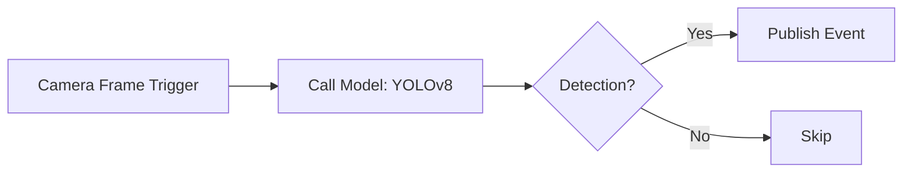

## What are Workflows?

Workflows in Cyberwave let you create automated sequences of robot operations. Connect nodes visually to build complex behaviors without writing procedural code.

Workflows run either **on the cloud** (Celery tasks — for manual, schedule, webhook, event, MQTT, and email triggers) or **on the edge device** (for `camera_frame` triggers that run ML inference locally without sending video to the cloud).

---

## Workflow Components

### Nodes

Nodes are the building blocks of workflows. Each node performs a specific action.

> stub: Nodes are organised into a hybrid robotics + automation taxonomy. The same nine categories show up in the editor palette and on `GET /api/v1/workflows/config` (`node_categories`) — backend, API, and UI all read from the same `WorkflowNodeCategory` enum (`cyberwave-backend/src/lib/node_categories.py`). Categories with no nodes today (Perception) are reserved and only show up once we ship nodes for them.

<CardGroup cols={2}>
  <Card title="Sources & Triggers" icon="bolt">
    Bring events and raw data into the workflow: manual, schedule, webhook, event, MQTT, email, camera_frame, alert, plus sensor `data_source` nodes
  </Card>
  <Card title="Perception" icon="eye">
    Convert raw signals into reliable observations — reserved for object trackers, sensor fusion, IMU filtering, ASR (no nodes ship today)
  </Card>
  <Card title="Transform & Routing" icon="shuffle">
    Reshape, convert, route, multiplex, or fan out data: `json_parser`, `annotate`, `anonymize`
  </Card>
  <Card title="State & Memory" icon="database">
    Store and retrieve memory over time: `create_asset`, `edit_asset`, `update_attachment`, `video_tagger`
  </Card>
  <Card title="Intelligence" icon="brain">
    Use models for interpretation, reasoning, or prediction: `call_model` (cloud VLM/LLM and edge ML)
  </Card>
  <Card title="Decision & Control Flow" icon="code-branch">
    Choose what happens next: `conditional`, `loop`; FSM / Behavior Tree / Rule Engine on the roadmap
  </Card>
  <Card title="Actuation" icon="robot">
    Execute physical or twin-side actions: `twin_control` (Move Twin); future joint / gripper / navigation primitives
  </Card>
  <Card title="Integration" icon="plug">
    Talk to external systems and run user-supplied logic: `http_request`, `send_email`, `code` (edge-only)
  </Card>
  <Card title="Observability & Safety" icon="shield-halved">
    Guard, validate, observe, and alert: `send_alert`; validators, watchdogs, e-stop guards, and anomaly detectors are on the roadmap
  </Card>
</CardGroup>

### Connections

Connections define the execution flow between nodes:
- **Sequential**: Execute nodes one after another
- **Parallel**: Execute multiple nodes simultaneously
- **Conditional**: Branch based on conditions

Connection validation prevents invalid graphs: self-connections, cycles, and invalid pairings (e.g. `camera_frame` triggers can only connect to `call_model` nodes) are blocked.

---

## Creating a Workflow

> stub: Workflows now have an editable `slug` that is unique within a workspace. You can keep the generated slug or customize it for stable SDK and automation references. Workflows can also be marked `public` from the workflow creation and editing UI.

### Using the Dashboard

1. Navigate to **Workflows** in the dashboard
2. Click **Create Workflow** — set a name, optional slug, and visibility
3. Drag nodes from the palette to the canvas
4. Connect nodes by dragging from output to input ports
5. Configure each node's parameters
6. Click **Activate**

> stub: The bottom-right toolbar of the workflow canvas now includes a multi-select tool. Toggle it on, drag a marquee across the canvas (or shift-click individual nodes) to pick a group, then drag any selected node to shift the whole group, or press **Delete** / use the floating **Delete** button to remove them in bulk. Press **Esc** to leave multi-select mode.

> stub: The workflow editor supports undo (**Ctrl/Cmd + Z**) and redo (**Ctrl/Cmd + Shift + Z**, or **Ctrl + Y**), with up to 50 steps per session. It covers node creation, deletion (single & bulk), node moves (single & group), connection wiring, node renames / notes, and workflow-level changes (name, description, slug, visibility, activation). Toolbar buttons next to the **Hide/Show Nodes** button mirror the same actions.

> stub: Workflows created from the dedicated **Workflows** page are `general` workflows. From an environment, Cyberwave can also create `mission` workflows that stay bound to that environment and reuse the same workflow editor/runtime with a mission-specific profile layered on top.

> stub: Mission workflows now expose a **Move Twin** node that targets an environment waypoint. The node waits for navigation completion before continuing and can optionally dwell at the waypoint for a configured number of seconds.

### Using the CLI

```bash
cyberwave workflow list                  # list workflows
cyberwave workflow create -n "Name"      # create a workflow
cyberwave workflow create --template motion-detection
cyberwave workflow show                  # show details (interactive)
cyberwave workflow sync                  # sync to edge device(s)
cyberwave workflow sync --edge-active    # filter selector to active edge workflows
cyberwave workflow activate              # activate (interactive)
cyberwave workflow deactivate            # deactivate (interactive)
cyberwave workflow delete --yes
```

All subcommands accept `--base-url` / `-u` to override the API URL. When a UUID argument is omitted, an interactive arrow-key selector is shown.

### Using the SDK

```python
from cyberwave import Cyberwave

cw = Cyberwave(api_key="your_api_key")

workflows = cw.workflows.list()

run = cw.workflows.trigger("workflow-uuid", inputs={"speed": 0.5})
run.wait(timeout=60)
print(f"Workflow finished: {run.status}")
```

---

## Executing Workflows

### Manual Execution

```python
run = cw.workflows.trigger("workflow-uuid")
print(f"Run ID: {run.uuid}, Status: {run.status}")
```

### Triggered Execution

Workflows can be triggered by:
- **Schedule**: Run at specific times (cron)
- **Events**: Run when sensor data matches conditions
- **API**: Trigger from external systems via REST or MCP
- **Camera Frame**: Run on every camera frame at the edge device

---

## Edge Workflows (Camera Frame)

The `camera_frame` trigger generates a Python worker (`wf_<uuid8>.py`) that runs ML inference directly on the edge device. The `call_model` node's `emit_event` parameter controls event emission:

- **emit_mode**: `always`, `on_enter` (new classes only), `on_change` (count changes)
- **cooldown_seconds**: minimum delay between events (default 5s)

Sync to the edge with `cyberwave workflow sync` or wait for the automatic periodic sync.

> stub: When a `call_model` node sits downstream of a `camera_frame` trigger, the model picker greys out models whose output isn't compatible with the edge perception chain. The gate rejects (in priority order): cloud-only deployments; models that don't accept image input; models tagged `classification` (single-label classifiers can't drive bbox / mask filters); and models whose `output_family` is `text` / `action` / `mesh` / `image`. Models with `output_family = json` or unset are accepted — most edge YOLO seeds resolve to `json` today and are the canonical use case. Greyed cards stay visible with a tooltip explaining why; toggle **Allow incompatible models** in the dialog header to override.

> stub: The same gate runs at compile time. `cyberwave workflow sync` (and any other path that triggers worker codegen) fails fast with a named error if a `call_model` references an incompatible model — no more silently-dropped chains in the generated worker. The override toggle in the picker only relaxes the UI affordance; persisting an incompatible selection (or importing a workflow that already has one) is still rejected at compile time.

See [Edge Workers](/edge/workers/overview) for the full generated worker lifecycle and format.

---

## Monitoring Executions

Track workflow execution status and results:

```python
runs = cw.workflow_runs.list(workflow_uuid="workflow-uuid")

for run in runs:
    print(f"Status: {run.status}, Started: {run.started_at}")
```

Each execution tracks status at both the workflow level and individual node level, including `started_at`, `finished_at`, and `error_message` fields.

---

## Example: Edge Detection Workflow

A `camera_frame` workflow that runs YOLO on the edge and emits alerts:



---

## Best Practices

<AccordionGroup>
  <Accordion title="Keep workflows focused">
    Create separate workflows for distinct operations rather than one large workflow. This makes debugging and maintenance easier.
  </Accordion>
  
  <Accordion title="Add error handling">
    Include condition nodes to handle failure cases gracefully. Consider what should happen if a joint can't reach its target.
  </Accordion>
  
  <Accordion title="Use meaningful names">
    Name nodes and workflows descriptively. "Alert on person in zone A" is better than "Node 1".
  </Accordion>

  <Accordion title="Use emit modes for edge workflows">
    Use `on_enter` for alert-style use cases (person entering a zone) and
    `on_change` for occupancy tracking. Set `cooldown_seconds` to avoid event floods.
  </Accordion>
</AccordionGroup>

---

## Next Steps

<CardGroup cols={2}>
  <Card
    title="API Reference"
    icon="code"
    href="/api-reference/rest/WorkflowSchema"
  >
    Full workflow API documentation
  </Card>
  <Card
    title="Edge Workers"
    icon="microchip-ai"
    href="/edge/workers/overview"
  >
    Generated workers, eject pattern, and custom workers
  </Card>
</CardGroup>
